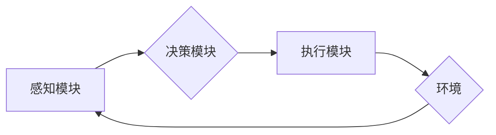

> AI Agent, 性能评估, 指标体系, 算法模型, 应用场景, 评估方法

## 1. 背景介绍

人工智能 (AI) 领域近年来取得了飞速发展，AI Agent作为智能体的一种形式，在各个领域展现出强大的应用潜力。从自动驾驶汽车到智能客服机器人，AI Agent正在改变着我们的生活方式。然而，随着AI Agent应用的日益广泛，如何有效地评估其性能成为了一个至关重要的课题。

传统的软件评估方法难以直接应用于AI Agent，因为AI Agent具有学习、适应和决策等复杂行为特征。因此，需要建立一套专门针对AI Agent性能的评估体系，以全面、客观地衡量其能力和效率。

## 2. 核心概念与联系

**2.1 AI Agent**

AI Agent是指能够感知环境、做出决策并执行行动的智能体。它通常由以下几个核心组件组成：

* **感知模块:** 收集环境信息，例如传感器数据、文本、图像等。
* **决策模块:** 基于感知信息和自身知识，做出最佳行动选择。
* **执行模块:** 将决策转化为实际行动，例如控制机器人的运动、生成文本等。

**2.2 性能评估**

AI Agent性能评估是指通过一系列指标和方法，客观地衡量AI Agent在特定任务或环境下的表现。

**2.3 评估指标体系**

评估指标体系是衡量AI Agent性能的关键要素。指标体系应涵盖AI Agent的各个方面，例如准确率、效率、鲁棒性、安全性等。

**2.4 评估方法**

评估方法是指用于计算和分析评估指标的具体技术手段。常见的评估方法包括：

* **基准测试:** 使用标准化的测试数据集和任务，比较不同AI Agent的性能。
* **模拟环境:** 创建虚拟环境，模拟真实世界场景，评估AI Agent在不同情境下的表现。
* **用户反馈:** 收集用户对AI Agent体验的评价，了解其实际应用效果。

**Mermaid 流程图**



## 3. 核心算法原理 & 具体操作步骤

**3.1 算法原理概述**

深度强化学习 (Deep Reinforcement Learning, DRL) 是一种用于训练AI Agent的机器学习算法。DRL算法通过强化信号，引导AI Agent在环境中学习最优策略。

**3.2 算法步骤详解**

1. **环境建模:** 建立一个模拟真实世界的环境模型，包括状态空间、动作空间和奖励函数。
2. **代理设计:** 设计一个AI Agent，它可以感知环境状态、选择动作并执行动作。
3. **策略学习:** 使用强化学习算法，例如Q-learning或Policy Gradient，训练AI Agent学习最优策略。
4. **策略评估:** 使用基准测试或模拟环境，评估训练好的AI Agent在特定任务上的性能。

**3.3 算法优缺点**

**优点:**

* 可以学习复杂的任务，例如游戏、机器人控制等。
* 可以适应动态变化的环境。

**缺点:**

* 训练时间长，计算资源消耗大。
* 容易陷入局部最优解。

**3.4 算法应用领域**

* 游戏AI
* 机器人控制
* 自动驾驶
* 金融交易
* 医疗诊断

## 4. 数学模型和公式 & 详细讲解 & 举例说明

**4.1 数学模型构建**

DRL算法的核心是强化学习模型，它可以表示为一个马尔可夫决策过程 (Markov Decision Process, MDP)。

MDP由以下几个要素组成:

* **状态空间 (S):** 环境可能存在的各种状态。
* **动作空间 (A):** AI Agent可以执行的动作。
* **转移概率 (P):** 从一个状态到另一个状态的概率。
* **奖励函数 (R):** AI Agent在某个状态执行某个动作后获得的奖励。
* **策略 (π):** AI Agent在每个状态选择动作的策略。

**4.2 公式推导过程**

DRL算法的目标是找到最优策略 π*，使得AI Agent在长期的奖励总和最大化。

最优策略的定义为:

π* = argmax ∑t=0∞ γ^t R(s_t, a_t)

其中:

* γ 是折扣因子，控制未来奖励的权重。
* R(s_t, a_t) 是在状态 s_t 执行动作 a_t 后获得的奖励。

**4.3 案例分析与讲解**

例如，在玩游戏时，AI Agent的目标是获得尽可能高的分数。

* 状态空间: 游戏中的场景、玩家位置、敌人位置等。
* 动作空间: 玩家可以执行的动作，例如移动、攻击、使用道具等。
* 转移概率: 游戏规则决定了玩家执行动作后状态的变化概率。
* 奖励函数: 获得分数、击杀敌人、收集道具等行为会获得奖励。

DRL算法通过学习游戏环境的转移概率和奖励函数，找到最优策略，使AI Agent能够在游戏中取得胜利。

## 5. 项目实践：代码实例和详细解释说明

**5.1 开发环境搭建**

* Python 3.x
* TensorFlow 或 PyTorch
* OpenAI Gym

**5.2 源代码详细实现**

```python
import gym
import tensorflow as tf

# 定义神经网络模型
model = tf.keras.Sequential([
    tf.keras.layers.Dense(64, activation='relu'),
    tf.keras.layers.Dense(64, activation='relu'),
    tf.keras.layers.Dense(env.action_space.n, activation='softmax')
])

# 定义损失函数和优化器
optimizer = tf.keras.optimizers.Adam()
loss_fn = tf.keras.losses.CategoricalCrossentropy()

# 训练循环
for episode in range(num_episodes):
    state = env.reset()
    done = False
    total_reward = 0

    while not done:
        # 选择动作
        action = tf.argmax(model(tf.expand_dims(state, 0))).numpy()[0]

        # 执行动作
        next_state, reward, done, _ = env.step(action)

        # 更新状态
        state = next_state

        # 计算损失
        with tf.GradientTape() as tape:
            predictions = model(tf.expand_dims(state, 0))
            loss = loss_fn(tf.one_hot(action, depth=env.action_space.n), predictions)

        # 反向传播
        gradients = tape.gradient(loss, model.trainable_variables)
        optimizer.apply_gradients(zip(gradients, model.trainable_variables))

        # 更新总奖励
        total_reward += reward

    print(f"Episode {episode+1}, Total Reward: {total_reward}")

# 保存模型
model.save('trained_model.h5')
```

**5.3 代码解读与分析**

* 代码首先定义了神经网络模型，用于学习AI Agent的策略。
* 然后定义了损失函数和优化器，用于训练神经网络模型。
* 训练循环中，AI Agent与环境交互，执行动作，获得奖励，并根据奖励更新策略。
* 最后，保存训练好的模型。

**5.4 运行结果展示**

训练完成后，可以将训练好的模型应用于实际环境中，评估AI Agent的性能。

## 6. 实际应用场景

**6.1 游戏AI**

DRL算法可以训练AI Agent在游戏中学习策略，例如玩游戏、打败对手等。

**6.2 机器人控制**

DRL算法可以训练AI Agent控制机器人执行任务，例如导航、抓取物体等。

**6.3 自动驾驶**

DRL算法可以训练AI Agent控制自动驾驶汽车，例如避开障碍物、保持车道等。

**6.4 金融交易**

DRL算法可以训练AI Agent进行金融交易，例如股票投资、风险管理等。

**6.5 医疗诊断**

DRL算法可以训练AI Agent辅助医生进行医疗诊断，例如识别疾病、预测患者病情等。

**6.6 未来应用展望**

随着AI技术的不断发展，DRL算法将在更多领域得到应用，例如个性化教育、智能家居、工业自动化等。

## 7. 工具和资源推荐

**7.1 学习资源推荐**

* **书籍:**
    * Reinforcement Learning: An Introduction by Richard S. Sutton and Andrew G. Barto
    * Deep Reinforcement Learning Hands-On by Maxim Lapan
* **在线课程:**
    * Deep Reinforcement Learning Specialization by DeepLearning.AI
    * Reinforcement Learning by David Silver (University of DeepMind)

**7.2 开发工具推荐**

* **TensorFlow:** https://www.tensorflow.org/
* **PyTorch:** https://pytorch.org/
* **OpenAI Gym:** https://gym.openai.com/

**7.3 相关论文推荐**

* Deep Q-Network (DQN)
* Policy Gradient
* Proximal Policy Optimization (PPO)

## 8. 总结：未来发展趋势与挑战

**8.1 研究成果总结**

近年来，DRL算法取得了显著的进展，在许多领域取得了突破性成果。

**8.2 未来发展趋势**

* **模型效率:** 提高DRL算法的训练效率和推理效率。
* **样本效率:** 降低DRL算法对训练数据的依赖。
* **可解释性:** 提高DRL算法的可解释性和透明度。
* **安全性和鲁棒性:** 增强DRL算法的安全性和鲁棒性。

**8.3 面临的挑战**

* **复杂环境:** 许多现实世界环境非常复杂，难以建模和训练。
* **数据稀缺:** 许多领域缺乏足够的训练数据。
* **安全问题:** DRL算法在某些应用场景中可能存在安全风险。

**8.4 研究展望**

未来，DRL算法将继续朝着更智能、更安全、更可靠的方向发展，并在更多领域发挥重要作用。

## 9. 附录：常见问题与解答

**9.1 如何选择合适的DRL算法？**

选择合适的DRL算法取决于具体的应用场景和任务需求。

**9.2 如何评估DRL算法的性能？**

可以使用基准测试、模拟环境和用户反馈等方法评估DRL算法的性能。

**9.3 如何解决DRL算法的训练困难？**

可以使用一些技巧来解决DRL算法的训练困难，例如经验回放、目标网络、异步更新等。


作者：禅与计算机程序设计艺术 / Zen and the Art of Computer Programming 
<end_of_turn>