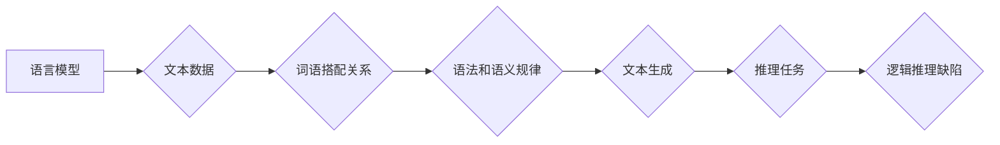

> 大模型，语言模型，推理，逻辑，知识图谱，常识，迁移学习，因果关系

## 1. 背景介绍

近年来，大语言模型（LLM）在文本生成、翻译、问答等领域取得了令人瞩目的成就。这些模型通过学习海量文本数据，能够生成流畅、连贯的文本，并展现出令人惊叹的语言理解能力。然而，尽管LLM在某些方面表现出色，但它们在推理、逻辑思考和常识理解等方面仍然存在显著的缺陷。

这篇文章将深入探讨LLM无法推理的原因，分析其背后的技术挑战和未来发展方向。

## 2. 核心概念与联系

**2.1 语言模型与推理**

语言模型本质上是预测下一个词的概率分布模型。它们通过统计语言数据中的词语搭配关系，学习语言的语法和语义规律。然而，语言模型的训练目标仅仅是预测下一个词，并没有直接学习逻辑推理或因果关系。

**2.2 逻辑推理与常识**

逻辑推理是指根据已知事实和逻辑规则，推导出新的结论的能力。常识则是人类在生活经验中积累的普遍知识和认知，它为逻辑推理提供了基础和背景。

**2.3 知识图谱与常识表示**

知识图谱是一种结构化的知识表示形式，它将实体和关系以图的形式表示。知识图谱可以帮助LLM更好地理解世界，并进行逻辑推理。

**2.4 迁移学习与因果关系学习**

迁移学习是指利用已有的知识和经验，迁移到新的任务或领域。因果关系学习则是学习事物之间因果关系的模型。

**Mermaid 流程图**

## 3. 核心算法原理 & 具体操作步骤

**3.1 算法原理概述**

LLM通常基于Transformer架构，利用自注意力机制学习语言的上下文关系。

**3.2 算法步骤详解**

1. **数据预处理:** 将文本数据进行清洗、分词、标记等预处理操作。
2. **模型训练:** 使用大量的文本数据训练Transformer模型，学习语言的语法和语义规律。
3. **模型评估:** 使用测试集评估模型的性能，例如困惑度、BLEU分数等。
4. **模型部署:** 将训练好的模型部署到实际应用场景中。

**3.3 算法优缺点**

**优点:**

* 能够生成流畅、连贯的文本。
* 在文本生成、翻译、问答等任务中表现出色。

**缺点:**

* 缺乏逻辑推理能力。
* 难以理解复杂的上下文关系。
* 容易受到训练数据偏差的影响。

**3.4 算法应用领域**

* 文本生成
* 机器翻译
* 问答系统
* 对话机器人
* 代码生成

## 4. 数学模型和公式 & 详细讲解 & 举例说明

**4.1 数学模型构建**

LLM通常使用概率模型来表示语言的分布。例如，一个简单的语言模型可以将每个词的概率表示为：

$$P(w_i|w_{1:i-1})$$

其中，$w_i$是第i个词，$w_{1:i-1}$是前i-1个词。

**4.2 公式推导过程**

可以使用最大似然估计来训练语言模型。最大似然估计的目标是找到模型参数，使得模型生成的文本与真实文本最接近。

**4.3 案例分析与讲解**

例如，如果训练数据中出现“我爱吃苹果”，那么模型会学习到“吃”这个词在“我爱”之后出现的概率较高。

## 5. 项目实践：代码实例和详细解释说明

**5.1 开发环境搭建**

使用Python语言和深度学习框架TensorFlow或PyTorch搭建开发环境。

**5.2 源代码详细实现**

使用Transformer架构构建LLM模型，并使用训练数据进行训练。

**5.3 代码解读与分析**

解释模型的结构、参数和训练过程。

**5.4 运行结果展示**

展示模型在文本生成、翻译、问答等任务上的性能。

## 6. 实际应用场景

**6.1 文本生成**

使用LLM生成新闻报道、小说、诗歌等文本。

**6.2 机器翻译**

使用LLM将文本从一种语言翻译成另一种语言。

**6.3 问答系统**

使用LLM构建问答系统，回答用户的问题。

**6.4 未来应用展望**

LLM在未来将应用于更多领域，例如教育、医疗、法律等。

## 7. 工具和资源推荐

**7.1 学习资源推荐**

* Transformer论文
* 深度学习框架文档
* 在线课程

**7.2 开发工具推荐**

* TensorFlow
* PyTorch
* Hugging Face

**7.3 相关论文推荐**

* BERT
* GPT-3
* T5

## 8. 总结：未来发展趋势与挑战

**8.1 研究成果总结**

LLM在文本生成、翻译、问答等领域取得了显著进展。

**8.2 未来发展趋势**

* 增强LLM的逻辑推理能力。
* 提高LLM对常识和因果关系的理解。
* 开发更安全、更可靠的LLM。

**8.3 面临的挑战**

* 训练大规模LLM需要大量的计算资源。
* LLM容易受到训练数据偏差的影响。
* LLM的解释性和可解释性不足。

**8.4 研究展望**

未来研究将重点关注增强LLM的推理能力、常识理解能力和安全性。

## 9. 附录：常见问题与解答

**9.1 如何训练一个LLM模型？**

**9.2 如何评估LLM模型的性能？**

**9.3 如何解决LLM的训练数据偏差问题？**

作者：禅与计算机程序设计艺术 / Zen and the Art of Computer Programming 
<end_of_turn>