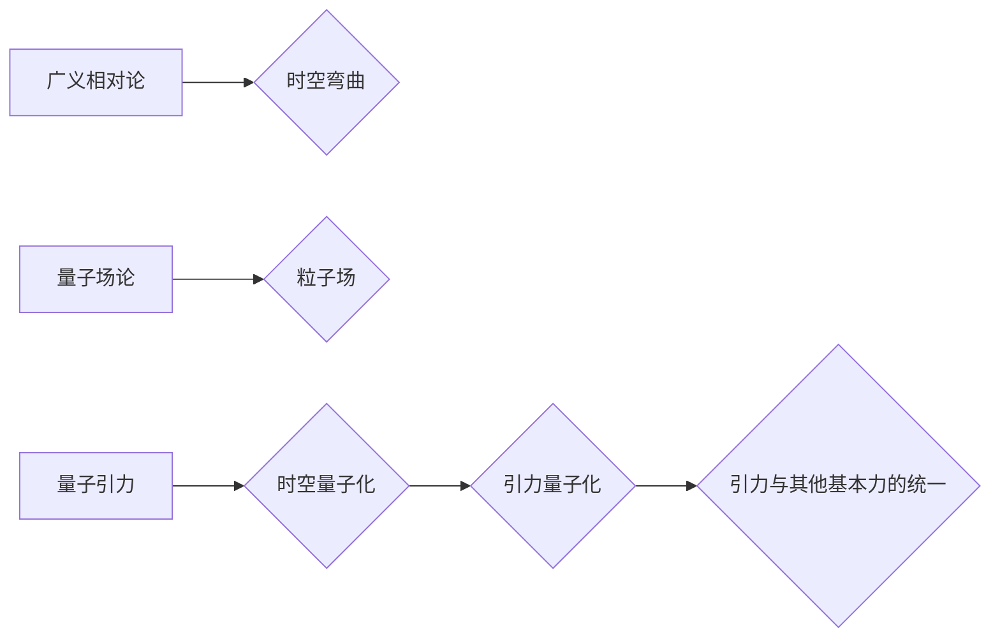

> 量子引力，宇宙学，广义相对论，量子场论，黑洞，宇宙起源，宇宙演化

## 1. 背景介绍

宇宙学是研究宇宙起源、演化和最终命运的科学分支。广义相对论是描述引力的经典理论，它成功地解释了太阳系、星系和宇宙的宏观结构。然而，在微观尺度上，引力与其他基本力（电磁力、弱核力、强核力）的统一仍然是一个未解之谜。量子引力试图将广义相对论与量子场论相结合，以提供一个描述引力的量子理论。

量子场论是描述基本粒子及其相互作用的理论框架。它成功地解释了粒子物理学中的许多现象，例如粒子衰变和散射。然而，量子场论无法直接描述引力，因为引力是长程作用力，而量子场论通常适用于短程作用力。

## 2. 核心概念与联系

**2.1 广义相对论**

广义相对论认为，引力是时空弯曲的结果。质量和能量的存在会扭曲时空，导致其他物体沿着弯曲的时空路径运动。

**2.2 量子场论**

量子场论将粒子视为场中激发的量子。每个基本粒子都有一个对应的场，例如电磁场、夸克场、电子场等。粒子之间的相互作用可以通过场之间的相互作用来描述。

**2.3 量子引力**

量子引力试图将广义相对论与量子场论相结合，以提供一个描述引力的量子理论。它试图将时空量子化，并解释引力如何与其他基本力相互作用。

**2.4 核心概念关系图**

## 3. 核心算法原理 & 具体操作步骤

**3.1 算法原理概述**

目前，还没有一个完整的量子引力理论。但是，一些候选理论已经提出，例如弦理论、圈量子引力等。这些理论试图通过不同的方法将广义相对论与量子场论相结合。

**3.2 算法步骤详解**

由于量子引力理论尚未完全确定，因此没有一个具体的算法步骤。但是，我们可以根据一些候选理论，例如弦理论，来描述其基本步骤：

1. 将时空量子化，将时空分割成小的单元。
2. 将引力场量子化，将引力场视为一系列振动粒子。
3. 将基本粒子视为弦的振动模式。
4. 通过弦理论的数学框架，描述弦的运动和相互作用。
5. 从弦理论的描述中，推导出引力的量子性质。

**3.3 算法优缺点**

* **优点:**

    * 试图解决广义相对论和量子场论之间的矛盾。
    * 提供了一种统一的物理理论框架。
    * 可能解释一些宇宙学中的未解之谜，例如黑洞的性质和宇宙的起源。

* **缺点:**

    * 理论复杂，难以验证。
    * 缺乏实验观测的支持。
    * 目前还没有一个完整的量子引力理论。

**3.4 算法应用领域**

* **宇宙学:** 研究宇宙的起源、演化和最终命运。
* **黑洞物理:** 研究黑洞的性质和行为。
* **粒子物理:** 研究基本粒子的性质和相互作用。

## 4. 数学模型和公式 & 详细讲解 & 举例说明

**4.1 数学模型构建**

量子引力理论的数学模型非常复杂，涉及到广义相对论、量子场论和弦理论等多个领域。

**4.2 公式推导过程**

由于篇幅限制，这里不再详细推导量子引力理论的公式。

**4.3 案例分析与讲解**

例如，弦理论试图将引力场量子化，将引力场视为一系列振动弦。弦的振动模式决定了粒子的性质和相互作用。

## 5. 项目实践：代码实例和详细解释说明

由于量子引力理论非常复杂，目前还没有一个完整的代码实现。但是，我们可以使用一些开源软件包，例如PyTorch、TensorFlow等，来模拟一些量子引力现象。

**5.1 开发环境搭建**

* 安装Python语言环境。
* 安装深度学习框架，例如PyTorch或TensorFlow。
* 安装必要的数学库，例如NumPy、SciPy等。

**5.2 源代码详细实现**

由于篇幅限制，这里不再提供具体的代码实现。

**5.3 代码解读与分析**

代码实现需要根据具体的量子引力模型和模拟场景进行设计。

**5.4 运行结果展示**

运行结果可以展示一些量子引力现象，例如黑洞的形成和演化、宇宙的膨胀等。

## 6. 实际应用场景

* **宇宙学研究:** 量子引力理论可以帮助我们更好地理解宇宙的起源、演化和最终命运。
* **黑洞物理研究:** 量子引力理论可以帮助我们更好地理解黑洞的性质和行为。
* **粒子物理研究:** 量子引力理论可以帮助我们更好地理解基本粒子的性质和相互作用。

**6.4 未来应用展望**

随着量子引力理论的发展，它可能在更多领域得到应用，例如：

* **量子计算:** 量子引力理论可以为量子计算提供新的算法和模型。
* **宇宙探测:** 量子引力理论可以帮助我们设计更先进的宇宙探测器。
* **新材料设计:** 量子引力理论可以帮助我们设计新的材料，例如超导材料和量子材料。

## 7. 工具和资源推荐

**7.1 学习资源推荐**

* **书籍:**

    * 《引力与宇宙学》
    * 《量子场论》
    * 《弦理论》

* **在线课程:**

    * Coursera上的量子引力课程
    * edX上的宇宙学课程

**7.2 开发工具推荐**

* **Python语言环境:** Python 3.x
* **深度学习框架:** PyTorch、TensorFlow
* **数学库:** NumPy、SciPy

**7.3 相关论文推荐**

* 《引力理论的量子化》
* 《弦理论的进展》
* 《圈量子引力的发展》

## 8. 总结：未来发展趋势与挑战

**8.1 研究成果总结**

量子引力理论的研究取得了一些进展，例如弦理论和圈量子引力等候选理论的提出。但是，目前还没有一个完整的量子引力理论。

**8.2 未来发展趋势**

* **理论研究:** 继续探索新的量子引力理论，并试图将它们与实验观测相结合。
* **实验验证:** 寻找新的实验方法来验证量子引力理论。
* **应用开发:** 将量子引力理论应用于宇宙学、黑洞物理、粒子物理等领域。

**8.3 面临的挑战**

* **理论复杂性:** 量子引力理论非常复杂，难以理解和验证。
* **实验困难:** 由于引力的强度非常弱，难以进行实验验证。
* **缺乏实验观测:** 目前还没有直接观测到量子引力效应。

**8.4 研究展望**

量子引力理论是物理学中最重要和最具挑战性的问题之一。随着理论和实验技术的不断发展，我们相信最终能够解决这个谜题，并获得对宇宙的更深刻的理解。

## 9. 附录：常见问题与解答

**9.1 什么是量子引力？**

量子引力试图将广义相对论与量子场论相结合，以提供一个描述引力的量子理论。

**9.2 为什么需要量子引力？**

广义相对论成功地解释了引力的宏观效应，但它无法解释引力在微观尺度上的行为。量子场论成功地解释了其他基本力的微观行为，但它无法直接描述引力。量子引力试图解决这两个理论之间的矛盾。

**9.3 现有的量子引力理论有哪些？**

一些候选理论包括弦理论、圈量子引力、旋量引力等。

**9.4 量子引力理论是否已经被证实？**

目前还没有一个完整的量子引力理论，也没有直接的实验观测支持任何特定的量子引力理论。

**9.5 量子引力理论的应用前景如何？**

量子引力理论可能在宇宙学、黑洞物理、粒子物理等领域得到应用。

作者：禅与计算机程序设计艺术 / Zen and the Art of Computer Programming 
<end_of_turn>