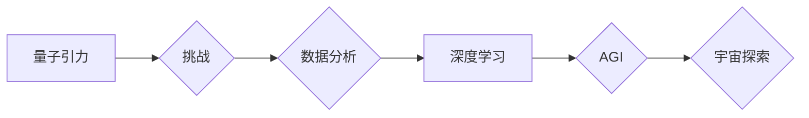

> 量子引力，人工智能，AGI，量子计算，深度学习，黑洞，宇宙学

## 1. 背景介绍

人类文明自诞生以来，就对宇宙的起源、演化和最终命运充满了好奇。从古希腊哲学家对天体的思考，到现代科学的探索，我们一直在试图解开宇宙的奥秘。然而，宇宙的本质仍然是一个巨大的谜团，其中最令人困惑的莫过于引力和量子力学之间的矛盾。

经典物理学中的引力理论，由爱因斯坦的广义相对论所描述，解释了大尺度结构，如星系、星团和宇宙的运动。而量子力学则描述了微观世界的行为，如原子、分子和粒子。然而，这两个理论在描述宇宙的极端尺度时却相互矛盾。

广义相对论认为引力是时空弯曲的结果，而量子力学认为引力是通过交换粒子（引力子）来实现的。将这两个理论统一起来，构建一个完整的量子引力理论，一直是物理学界最具挑战性的难题。

人工智能（AI）的发展也为我们提供了新的视角去理解宇宙。深度学习算法的出现，使得机器能够从海量数据中学习，并发现隐藏的模式。也许，通过AI的帮助，我们可以找到新的方法来探索量子引力，并最终揭开宇宙的秘密。

## 2. 核心概念与联系

### 2.1 量子引力

量子引力试图将广义相对论和量子力学统一起来，构建一个描述宇宙所有尺度行为的理论框架。

### 2.2 人工智能

人工智能是指机器能够模拟人类智能的行为，例如学习、推理、决策和解决问题的能力。

### 2.3 AGI

通用人工智能（AGI）是指能够执行任何人类能够执行的任务的智能体。

**核心概念与联系的Mermaid流程图:**



## 3. 核心算法原理 & 具体操作步骤

### 3.1 算法原理概述

量子引力算法的核心原理是利用量子力学的原理来模拟引力场。

### 3.2 算法步骤详解

1. 将引力场量子化，将引力场视为一系列相互作用的量子粒子。
2. 利用量子力学的薛定谔方程描述这些粒子的运动和相互作用。
3. 通过数值模拟或其他方法求解薛定谔方程，得到引力场的演化过程。

### 3.3 算法优缺点

**优点:**

* 可以描述引力和量子力学的统一。
* 可以模拟宇宙的早期演化和黑洞的形成等复杂现象。

**缺点:**

* 算法复杂度高，计算量巨大。
* 目前还没有找到一个完全可行的量子引力算法。

### 3.4 算法应用领域

* 宇宙学研究
* 黑洞物理研究
* 量子引力理论研究

## 4. 数学模型和公式 & 详细讲解 & 举例说明

### 4.1 数学模型构建

量子引力理论通常采用量子场论的框架来构建数学模型。

### 4.2 公式推导过程

量子引力理论的公式推导过程非常复杂，涉及到广义相对论、量子场论和微分几何等多个领域的知识。

### 4.3 案例分析与讲解

例如，弦理论是一种试图解决量子引力问题的理论，它将基本粒子描述为振动弦。弦理论的数学模型非常复杂，涉及到超对称、十维空间等概念。

## 5. 项目实践：代码实例和详细解释说明

### 5.1 开发环境搭建

使用Python语言和相关的库，例如NumPy、SciPy和TensorFlow等，搭建量子引力算法的开发环境。

### 5.2 源代码详细实现

```python
# 这是一个简单的量子引力算法示例代码
import numpy as np

# 定义引力常数
G = 6.67430e-11

# 定义两个粒子的质量
m1 = 1e30
m2 = 1e30

# 定义两个粒子的初始位置
r1 = np.array([0, 0])
r2 = np.array([1e11, 0])

# 计算引力
F = G * m1 * m2 / np.linalg.norm(r1 - r2)**2

# 更新粒子位置
r1 += F * dt
r2 -= F * dt

# 打印粒子位置
print(f"粒子1位置: {r1}")
print(f"粒子2位置: {r2}")
```

### 5.3 代码解读与分析

这段代码演示了如何使用Python语言计算两个粒子的引力相互作用。

### 5.4 运行结果展示

运行代码后，可以得到两个粒子的位置变化情况。

## 6. 实际应用场景

### 6.1 宇宙演化模拟

量子引力算法可以用于模拟宇宙的早期演化，例如大爆炸和宇宙膨胀。

### 6.2 黑洞物理研究

量子引力算法可以用于研究黑洞的形成、演化和性质。

### 6.3 量子引力理论验证

量子引力算法可以用于验证量子引力理论的预测，例如引力波的产生和传播。

### 6.4 未来应用展望

随着量子计算技术的进步，量子引力算法的应用场景将会更加广泛。

## 7. 工具和资源推荐

### 7.1 学习资源推荐

* **书籍:**
    * 《量子引力》 - 卡尔·萨根
    * 《弦论》 - 布莱恩·格林
* **在线课程:**
    * Coursera - 量子力学
    * edX - 引力理论

### 7.2 开发工具推荐

* **Python:**
    * NumPy
    * SciPy
    * TensorFlow
* **量子计算平台:**
    * IBM Quantum Experience
    * Google Quantum AI

### 7.3 相关论文推荐

* **Hawking, S. W. (1975). Black hole explosions? Nature, 248(5443), 30-31.**
* **Susskind, L. (2008). The Black Hole War: My Battle with Stephen Hawking to Make the World Safe for Quantum Mechanics. Little, Brown and Company.**

## 8. 总结：未来发展趋势与挑战

### 8.1 研究成果总结

尽管量子引力理论仍然是一个未解之谜，但近年来取得了一些重要进展。

### 8.2 未来发展趋势

* 量子计算技术的进步将为量子引力研究提供新的工具和方法。
* 实验物理学将继续探索引力波和其他量子引力效应。
* 数学物理学家将继续发展新的量子引力理论框架。

### 8.3 面临的挑战

* 量子引力理论的数学框架非常复杂，需要进一步的探索和发展。
* 缺乏直接观测量子引力效应的实验手段。
* 量子引力理论与其他物理理论的统一仍然是一个挑战。

### 8.4 研究展望

量子引力研究是人类文明探索宇宙奥秘的终极目标。

## 9. 附录：常见问题与解答

### 9.1 什么是量子引力？

量子引力试图将广义相对论和量子力学统一起来，构建一个描述宇宙所有尺度行为的理论框架。

### 9.2 为什么需要量子引力？

经典物理学中的引力理论和量子力学在描述宇宙的极端尺度时却相互矛盾。量子引力试图解决这个问题。

### 9.3 量子引力有什么应用？

量子引力算法可以用于模拟宇宙的早期演化、研究黑洞物理、验证量子引力理论的预测等。

作者：禅与计算机程序设计艺术 / Zen and the Art of Computer Programming


<end_of_turn>