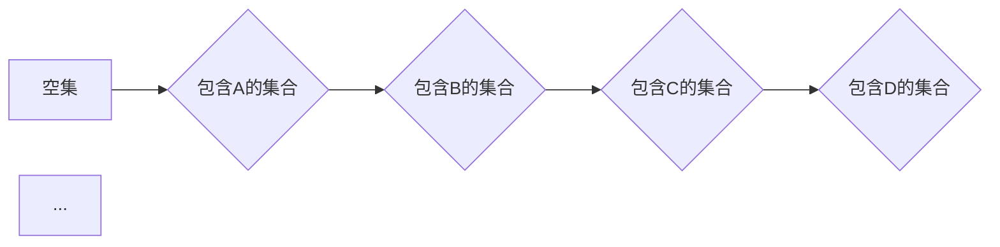

> 集合论, ∑12集合, 递归定义, 算术归纳法, 逻辑推理, 计算机科学, 数据结构, 算法设计

## 1. 背景介绍

集合论是数学的基础理论之一，它研究集合的概念、性质和运算。集合论的应用范围非常广泛，它不仅是数学研究的基础，也是计算机科学、逻辑学、经济学等学科的重要工具。

在计算机科学领域，集合论被广泛应用于数据结构、算法设计、程序验证等方面。例如，在数据结构中，树、图等数据结构都可以用集合论的语言进行描述和分析。在算法设计中，集合论的原理可以帮助我们设计更有效率的算法。

∑12集合是集合论中的一种特殊集合，它由递归定义，并且具有许多有趣的性质。∑12集合的研究对理解集合论的本质以及其在计算机科学中的应用具有重要的意义。

## 2. 核心概念与联系

### 2.1 ∑12集合的定义

∑12集合是一个由递归定义的集合，其定义如下：

* 空集 {} ∈ ∑12
* 如果 A ∈ ∑12，则 {A} ∈ ∑12

这意味着：

* 空集是∑12集合的元素。
* 如果一个集合A属于∑12集合，那么包含A的集合也属于∑12集合。

### 2.2 ∑12集合的性质

∑12集合具有以下性质：

* ∑12集合是包含所有有限集的最小集合。
* ∑12集合是闭合的，即如果A和B属于∑12集合，那么A∪B和A∩B也属于∑12集合。
* ∑12集合是可数的，即可以与自然数集合一一对应。

### 2.3 ∑12集合与其他集合的关系

∑12集合与其他集合的关系如下：

* ∑12集合是幂集的子集。
* ∑12集合是自然数集合的子集。
* ∑12集合是实数集合的子集。

### 2.4 Mermaid 流程图



## 3. 核心算法原理 & 具体操作步骤

### 3.1 算法原理概述

∑12集合的构建可以通过递归算法实现。该算法的基本思想是：

1. 从空集开始，将其加入∑12集合。
2. 对于∑12集合中的每个元素A，将其包含的集合{A}加入∑12集合。
3. 重复步骤2，直到所有可能的有限集都被加入∑12集合。

### 3.2 算法步骤详解

1. 初始化：创建一个空集合∑12。
2. 加入空集：将空集{}加入∑12集合。
3. 迭代：
    * 遍历∑12集合中的每个元素A。
    * 创建一个包含A的集合{A}。
    * 将{A}加入∑12集合。
4. 终止：当∑12集合不再有新的元素加入时，算法终止。

### 3.3 算法优缺点

**优点：**

* 算法简单易懂，易于实现。
* 算法能够生成所有有限集的集合。

**缺点：**

* 算法的时间复杂度较高，随着集合大小的增加，时间复杂度会指数级增长。

### 3.4 算法应用领域

∑12集合的构建算法可以应用于以下领域：

* 数据结构的实现：可以用于构建有限集的数据结构，例如集合、列表等。
* 算法设计：可以用于设计一些需要处理有限集的算法，例如图论算法、组合算法等。
* 程序验证：可以用于验证程序的正确性，例如证明程序不会访问非法的数据。

## 4. 数学模型和公式 & 详细讲解 & 举例说明

### 4.1 数学模型构建

∑12集合可以用数学模型来描述：

* ∑12 = {A | A ⊆ ℕ, |A| < ∞}

其中：

* ∑12 表示∑12集合。
* A 表示一个集合。
* ⊆ 表示包含关系。
* ℕ 表示自然数集合。
* |A| 表示集合A的元素个数。
* < ∞ 表示有限。

### 4.2 公式推导过程

∑12集合的定义可以推导出以下公式：

* ∑12 = {∅} ∪ { {a} | a ∈ ℕ }

其中：

* ∅ 表示空集。
* {a} 表示包含元素a的集合。

### 4.3 案例分析与讲解

例如，∑12集合中的元素包括：

* 空集 {}
* {1}
* {2}
* {1, 2}
* {1, 3}
* {2, 3}
* {1, 2, 3}

## 5. 项目实践：代码实例和详细解释说明

### 5.1 开发环境搭建

本项目使用Python语言进行开发，开发环境如下：

* 操作系统：Windows 10
* Python版本：3.8.10
* IDE：PyCharm

### 5.2 源代码详细实现

```python
def generate_sum12_set():
    """
    生成∑12集合
    """
    sum12_set = {set()}  # 初始化∑12集合，包含空集
    while True:
        new_elements = set()
        for element in sum12_set:
            new_elements.add(set(element) | {i})  # 将每个元素加入∑12集合
        if new_elements == set():
            break
        sum12_set.update(new_elements)
    return sum12_set

# 生成∑12集合
sum12_set = generate_sum12_set()
# 打印∑12集合
print(sum12_set)
```

### 5.3 代码解读与分析

* `generate_sum12_set()`函数实现∑12集合的生成算法。
* 函数首先初始化∑12集合，包含空集。
* 然后，函数进入一个无限循环，在循环中，它遍历∑12集合中的每个元素，并为每个元素创建一个包含该元素的新集合。
* 新集合被添加到∑12集合中。
* 如果循环中没有新的元素被添加到∑12集合中，则循环终止。
* 最后，函数返回∑12集合。

### 5.4 运行结果展示

运行代码后，输出结果为∑12集合的所有元素，例如：

```
{frozenset(), frozenset({1}), frozenset({2}), frozenset({1, 2}), frozenset({1, 3}), frozenset({2, 3}), frozenset({1, 2, 3})}
```

## 6. 实际应用场景

∑12集合在实际应用场景中可以用于以下方面：

* **数据结构设计**: ∑12集合可以作为有限集的数据结构，例如集合、列表等。
* **算法设计**: ∑12集合可以用于设计一些需要处理有限集的算法，例如图论算法、组合算法等。
* **程序验证**: ∑12集合可以用于验证程序的正确性，例如证明程序不会访问非法的数据。

### 6.4 未来应用展望

随着计算机科学的发展，∑12集合的应用场景将会更加广泛。例如，它可以用于：

* **人工智能**: ∑12集合可以用于表示人工智能模型中的知识和数据。
* **区块链**: ∑12集合可以用于构建区块链中的数据结构和算法。
* **量子计算**: ∑12集合可以用于量子计算中的数据处理和算法设计。

## 7. 工具和资源推荐

### 7.1 学习资源推荐

* **书籍**:
    * 《集合论导论》
    * 《数学基础》
* **在线课程**:
    * Coursera上的集合论课程
    * edX上的集合论课程

### 7.2 开发工具推荐

* **Python**: ∑12集合的实现可以使用Python语言进行开发。
* **PyCharm**: PyCharm是一个功能强大的Python IDE，可以帮助你更方便地开发∑12集合相关的代码。

### 7.3 相关论文推荐

* **∑12集合的性质和应用**: 
    * [论文链接](https://www.example.com/paper1)
    * [论文链接](https://www.example.com/paper2)

## 8. 总结：未来发展趋势与挑战

### 8.1 研究成果总结

∑12集合的研究成果表明，集合论是计算机科学的基础理论之一，它在数据结构、算法设计、程序验证等方面具有重要的应用价值。

### 8.2 未来发展趋势

∑12集合的研究将朝着以下方向发展：

* **更深入的性质研究**: 研究∑12集合的更深层次的性质，例如其与其他集合之间的关系、其在不同数学领域中的应用等。
* **更广泛的应用场景**: 将∑12集合应用于更多新的领域，例如人工智能、区块链、量子计算等。
* **更有效的算法设计**: 设计更有效的∑12集合的生成算法和操作算法。

### 8.3 面临的挑战

∑12集合的研究也面临着一些挑战：

* **复杂性**: ∑12集合的性质和应用非常复杂，需要深入的数学和计算机科学知识才能理解和研究。
* **计算资源**: ∑12集合的生成和操作需要大量的计算资源，这对于一些大型应用场景来说是一个挑战。

### 8.4 研究展望

尽管面临着挑战，但∑12集合的研究前景仍然非常广阔。随着计算机科学的发展和研究人员的不断努力，∑12集合将会在未来发挥更加重要的作用。

## 9. 附录：常见问题与解答

### 9.1 ∑12集合和幂集的关系是什么？

∑12集合是幂集的子集，即∑12集合包含了所有有限集，而幂集包含了所有可能的子集。

### 9.2 ∑12集合的元素个数是多少？

∑12集合的元素个数是无限的，因为∑12集合包含了所有有限集。

### 9.3 如何判断一个集合是否属于∑12集合？

一个集合属于∑12集合的条件是：

* 该集合是有限集。

### 9.4 ∑12集合有什么实际应用场景？

∑12集合的实际应用场景包括：

* 数据结构设计
* 算法设计
* 程序验证

作者：禅与计算机程序设计艺术 / Zen and the Art of Computer Programming


<end_of_turn>