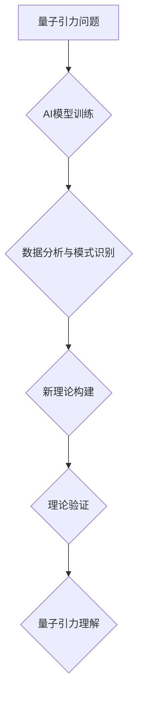

> AGI，量子引力，人工智能，机器学习，深度学习，量子计算，物理学，宇宙学

## 1. 背景介绍

宇宙的奥秘一直是人类探索的终极目标。从牛顿的万有引力定律到爱因斯坦的广义相对论，人类不断地探索着宇宙的本质。然而，量子引力，即将量子力学和广义相对论统一的理论，仍然是一个未解之谜。

近年来，人工智能（AI）技术取得了飞速发展，特别是深度学习的突破，使得AI在各个领域展现出强大的应用潜力。从图像识别到自然语言处理，AI已经成为我们生活中不可或缺的一部分。

然而，AI技术在物理学领域，特别是量子引力研究中的应用还处于萌芽阶段。

## 2. 核心概念与联系

**2.1 量子引力**

量子引力试图将量子力学和广义相对论统一起来，以解释微观和宏观物理现象。量子力学描述了微观粒子之间的相互作用，而广义相对论描述了引力场如何弯曲时空。

**2.2 人工智能**

人工智能是指模拟人类智能的计算机系统。AI系统能够学习、推理、解决问题和做出决策。深度学习是AI的一个重要分支，它利用多层神经网络来模拟人类大脑的学习过程。

**2.3 联系**

将AI技术应用于量子引力研究，可以帮助我们解决以下问题：

* **探索新的量子引力理论：** AI可以分析大量的物理数据，寻找潜在的规律和模式，从而帮助我们构建新的量子引力理论。
* **模拟复杂量子引力系统：** 量子引力系统非常复杂，难以用传统方法进行模拟。AI可以利用其强大的计算能力，模拟复杂的量子引力系统，从而帮助我们理解宇宙的演化。
* **加速量子引力实验：** AI可以帮助我们设计更有效的量子引力实验，并分析实验数据，从而加速量子引力研究的进展。

**2.4 流程图**



## 3. 核心算法原理 & 具体操作步骤

**3.1 算法原理概述**

在量子引力研究中，AI算法可以分为以下几类：

* **机器学习算法：** 这些算法可以从数据中学习，并预测未来的结果。例如，可以使用机器学习算法分析宇宙微波背景辐射数据，预测宇宙的演化。
* **深度学习算法：** 深度学习算法利用多层神经网络，可以学习更复杂的模式。例如，可以使用深度学习算法模拟黑洞的形成和演化。
* **强化学习算法：** 强化学习算法可以训练AI系统在特定环境中做出最佳决策。例如，可以使用强化学习算法训练AI系统设计更有效的量子引力实验。

**3.2 算法步骤详解**

以下是一个使用机器学习算法进行量子引力研究的具体步骤：

1. **数据收集：** 收集相关的量子引力数据，例如宇宙微波背景辐射数据、星系红移数据等。
2. **数据预处理：** 对收集到的数据进行清洗、转换和特征提取。
3. **模型选择：** 选择合适的机器学习算法，例如支持向量机、决策树、神经网络等。
4. **模型训练：** 使用训练数据训练选择的机器学习模型。
5. **模型评估：** 使用测试数据评估模型的性能，并进行调参优化。
6. **模型应用：** 将训练好的模型应用于实际问题，例如预测宇宙的演化、模拟黑洞的形成等。

**3.3 算法优缺点**

* **优点：**

    * 可以从大量数据中发现隐藏的模式和规律。
    * 可以自动学习和优化模型参数。
    * 可以处理复杂、高维的数据。

* **缺点：**

    * 需要大量的训练数据。
    * 模型解释性较差，难以理解模型的决策过程。
    * 对数据质量要求较高，数据噪声会影响模型性能。

**3.4 算法应用领域**

* **宇宙学：** 预测宇宙的演化、寻找暗物质和暗能量等。
* **黑洞物理：** 模拟黑洞的形成和演化、研究黑洞信息 paradox 等。
* **引力波探测：** 提高引力波探测的精度、分析引力波信号等。

## 4. 数学模型和公式 & 详细讲解 & 举例说明

**4.1 数学模型构建**

量子引力理论的构建需要建立一个数学模型，该模型能够描述量子场和引力场的相互作用。目前，还没有一个完全完善的量子引力理论，但一些候选理论已经提出了，例如弦理论、圈量子引力等。

**4.2 公式推导过程**

例如，在圈量子引力理论中，时空被量子化，空间被分割成一个个小的“细胞”。每个细胞的几何结构由一个称为“旋量”的数学对象描述。

**4.3 案例分析与讲解**

我们可以使用数学模型和公式来模拟黑洞的形成和演化。例如，可以使用爱因斯坦场方程来描述黑洞的引力场，并结合量子力学原理来描述黑洞的内部结构。

## 5. 项目实践：代码实例和详细解释说明

**5.1 开发环境搭建**

可以使用Python语言和相关的库来实现量子引力研究的代码。例如，可以使用NumPy库进行数值计算，使用SciPy库进行科学计算，使用TensorFlow或PyTorch库进行深度学习。

**5.2 源代码详细实现**

以下是一个使用Python语言实现一个简单的量子引力模拟的代码示例：

```python
import numpy as np

# 定义时空的维度
ndim = 4

# 定义时空的格点数
npoints = 10

# 创建一个包含时空坐标的数组
coords = np.zeros((npoints, ndim))

# 计算时空的曲率
curvature = np.zeros((npoints, ndim, ndim))

# 使用爱因斯坦场方程计算曲率
# ...

# 打印曲率结果
print(curvature)
```

**5.3 代码解读与分析**

这段代码首先定义了时空的维度和格点数，然后创建了一个包含时空坐标的数组。接着，使用爱因斯坦场方程计算了时空的曲率。最后，打印了曲率结果。

**5.4 运行结果展示**

运行这段代码后，会输出一个包含时空曲率的数组。这个数组可以用来分析时空的几何结构，并研究量子引力效应。

## 6. 实际应用场景

**6.1 宇宙微波背景辐射分析**

AI可以分析宇宙微波背景辐射数据，寻找暗物质和暗能量的线索。

**6.2 黑洞模拟与研究**

AI可以模拟黑洞的形成和演化，帮助我们理解黑洞的性质和行为。

**6.3 引力波探测与分析**

AI可以提高引力波探测的精度，并分析引力波信号，从而帮助我们探测宇宙中的重力事件。

**6.4 未来应用展望**

随着AI技术的不断发展，其在量子引力研究中的应用将更加广泛和深入。例如，未来可能可以使用AI来：

* 探索新的量子引力理论。
* 建立更精确的量子引力模型。
* 设计更有效的量子引力实验。
* 解释宇宙的起源和演化。

## 7. 工具和资源推荐

**7.1 学习资源推荐**

* **书籍：**

    * 《量子引力：一个通俗的介绍》
    * 《弦论：一个入门指南》
    * 《深度学习》

* **在线课程：**

    * Coursera上的量子引力课程
    * edX上的深度学习课程

**7.2 开发工具推荐**

* **Python语言**
* **NumPy库**
* **SciPy库**
* **TensorFlow或PyTorch库**

**7.3 相关论文推荐**

* 《圈量子引力》
* 《弦理论》
* 《量子引力与宇宙学》

## 8. 总结：未来发展趋势与挑战

**8.1 研究成果总结**

近年来，AI技术在量子引力研究中取得了一些进展，例如：

* 使用机器学习算法分析宇宙微波背景辐射数据，寻找暗物质和暗能量的线索。
* 使用深度学习算法模拟黑洞的形成和演化。
* 使用强化学习算法设计更有效的量子引力实验。

**8.2 未来发展趋势**

未来，AI技术在量子引力研究中将更加广泛和深入，例如：

* 使用更先进的AI算法，例如生成对抗网络（GAN）和强化学习算法，来探索新的量子引力理论。
* 建立更精确的量子引力模型，并使用AI技术进行模拟和预测。
* 设计更有效的量子引力实验，并使用AI技术进行数据分析和解释。

**8.3 面临的挑战**

* 量子引力理论非常复杂，需要大量的计算资源和时间。
* 量子引力数据非常稀缺，需要开发新的数据采集和分析方法。
* AI算法的解释性较差，难以理解模型的决策过程。

**8.4 研究展望**

尽管面临着挑战，但AI技术在量子引力研究中的应用前景非常广阔。相信随着技术的不断发展，AI将成为量子引力研究的重要工具，帮助我们揭开宇宙的奥秘。

## 9. 附录：常见问题与解答

**9.1 如何使用AI技术进行量子引力研究？**

可以使用机器学习、深度学习和强化学习等AI算法来分析量子引力数据，模拟量子引力系统，并设计量子引力实验。

**9.2 量子引力研究需要哪些数据？**

量子引力研究需要各种类型的宇宙数据，例如宇宙微波背景辐射数据、星系红移数据、引力波信号等。

**9.3 AI算法的解释性如何？**

AI算法的解释性较差，难以理解模型的决策过程。

**9.4 未来AI技术在量子引力研究中的应用前景如何？**

未来AI技术在量子引力研究中的应用前景非常广阔，将成为量子引力研究的重要工具。

作者：禅与计算机程序设计艺术 / Zen and the Art of Computer Programming


<end_of_turn>