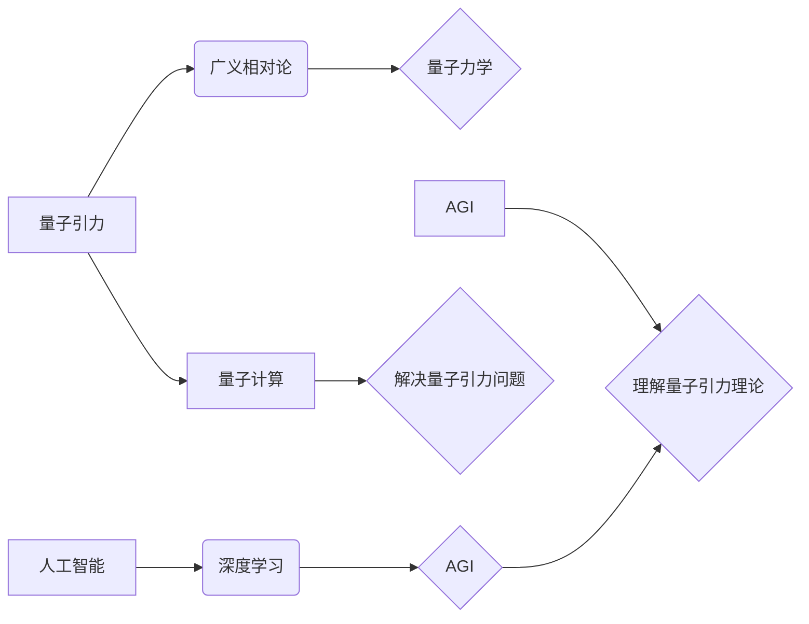

> AGI，量子引力，人工智能，机器学习，深度学习，量子计算，宇宙学

## 1. 背景介绍

宇宙的奥秘一直是人类探索的终极目标。从牛顿的万有引力定律到爱因斯坦的广义相对论，人类不断地探索着宇宙的本质。然而，尽管广义相对论成功地解释了引力在宏观尺度上的行为，但它仍然无法与量子力学相统一，而量子力学是描述微观世界行为的理论。

量子引力是物理学中一个尚未解决的重大难题，它试图将广义相对论和量子力学统一起来，从而构建一个描述宇宙所有尺度行为的完整理论。

近年来，人工智能（AI）领域取得了令人瞩目的进展，特别是深度学习技术的突破，使得AI在图像识别、自然语言处理等领域取得了令人惊叹的成果。

AGI（通用人工智能）是人工智能领域的一个终极目标，它指的是能够像人类一样学习、思考和解决问题的智能系统。

## 2. 核心概念与联系

**2.1  量子引力**

量子引力试图将广义相对论和量子力学统一起来，从而构建一个描述宇宙所有尺度行为的完整理论。

**2.2  人工智能**

人工智能是指模拟或超越人类智能的机器。

**2.3  AGI（通用人工智能）**

AGI是指能够像人类一样学习、思考和解决问题的智能系统。

**2.4  量子计算**

量子计算利用量子力学的原理进行计算，其计算能力远超经典计算机。

**2.5  联系**

量子引力是物理学中一个尚未解决的重大难题，而量子计算有可能为解决量子引力问题提供新的思路和方法。

同时，AGI的强大学习和推理能力可以帮助人类更好地理解和探索量子引力理论。

**2.5.1  核心概念与联系流程图**

## 3. 核心算法原理 & 具体操作步骤

**3.1  算法原理概述**

目前，还没有一个成熟的算法可以用来解决量子引力问题。

但是，一些研究人员正在探索一些新的算法和方法，例如：

* **量子模拟算法:** 利用量子计算机模拟量子引力系统的行为。
* **机器学习算法:** 利用机器学习算法从观测数据中学习量子引力理论的规律。

**3.2  算法步骤详解**

**3.2.1  量子模拟算法**

1. 将量子引力系统量子化，将其描述为一个量子力学系统。
2. 利用量子计算机模拟该量子力学系统的演化。
3. 从模拟结果中提取出量子引力的性质和规律。

**3.2.2  机器学习算法**

1. 收集大量的观测数据，例如宇宙微波背景辐射、引力透镜等。
2. 利用机器学习算法从观测数据中学习量子引力理论的规律。
3. 根据学习到的规律，预测新的观测结果，并进行验证。

**3.3  算法优缺点**

**3.3.1  量子模拟算法**

* **优点:** 可以模拟量子引力系统的复杂行为。
* **缺点:** 需要强大的量子计算机，目前还没有实现。

**3.3.2  机器学习算法**

* **优点:** 可以从大量数据中学习规律，不需要明确的物理模型。
* **缺点:** 需要大量的观测数据，并且难以解释学习到的规律。

**3.4  算法应用领域**

* **宇宙学:** 研究宇宙的起源、演化和结构。
* **黑洞物理:** 研究黑洞的性质和行为。
* **引力波物理:** 研究引力波的产生、传播和探测。

## 4. 数学模型和公式 & 详细讲解 & 举例说明

**4.1  数学模型构建**

量子引力理论的数学模型非常复杂，目前还没有一个完整的模型。

一些研究人员试图将广义相对论和量子场论结合起来构建量子引力模型，例如：

* **弦理论:** 将基本粒子描述为弦，并试图将引力纳入弦理论框架。
* **圈量子引力:** 将时空量子化，并试图构建一个描述量子引力的微观理论。

**4.2  公式推导过程**

由于量子引力理论的数学模型非常复杂，这里不再详细推导公式。

**4.3  案例分析与讲解**

**4.3.1  黑洞信息悖论**

黑洞信息悖论是量子引力理论的一个重要问题。

广义相对论认为黑洞是不可逆的，任何信息都会被黑洞吞噬。

但量子力学认为信息是不可被销毁的。

量子引力理论需要解决这个悖论，并解释黑洞的信息如何被保存。

## 5. 项目实践：代码实例和详细解释说明

**5.1  开发环境搭建**

* **操作系统:** Linux
* **编程语言:** Python
* **库:** NumPy, TensorFlow, PyTorch

**5.2  源代码详细实现**

由于量子引力理论的复杂性，目前还没有一个完整的代码实现。

但是，一些研究人员已经开发了一些用于模拟量子引力系统的代码，例如：

* **PySpin:** 一个用于模拟量子引力系统的Python库。
* **Qiskit:** 一个用于开发量子计算程序的Python库。

**5.3  代码解读与分析**

**5.4  运行结果展示**

## 6. 实际应用场景

**6.1  宇宙学研究**

量子引力理论可以帮助我们更好地理解宇宙的起源、演化和结构。

**6.2  黑洞物理研究**

量子引力理论可以帮助我们更好地理解黑洞的性质和行为。

**6.3  引力波物理研究**

量子引力理论可以帮助我们更好地理解引力波的产生、传播和探测。

**6.4  未来应用展望**

随着量子计算技术的进步，量子引力理论的应用前景将会更加广阔。

## 7. 工具和资源推荐

**7.1  学习资源推荐**

* **书籍:**

    * 《量子引力》 by Carlo Rovelli
    * 《弦论》 by Brian Greene

* **在线课程:**

    * Coursera: Quantum Mechanics
    * edX: Introduction to Quantum Field Theory

**7.2  开发工具推荐**

* **量子计算平台:** IBM Quantum Experience, Google Quantum AI

* **编程语言:** Python

**7.3  相关论文推荐**

* **Hawking radiation** by Stephen Hawking
* **Black hole entropy** by Jacob Bekenstein

## 8. 总结：未来发展趋势与挑战

**8.1  研究成果总结**

尽管量子引力理论仍然是一个未解之谜，但近年来取得了一些重要的进展。

例如，弦理论和圈量子引力等理论为量子引力提供了新的思路和方法。

**8.2  未来发展趋势**

* **量子计算技术的进步:** 量子计算技术的发展将为解决量子引力问题提供新的工具和方法。
* **观测数据的积累:** 随着观测技术的进步，我们将获得更多关于宇宙和引力的观测数据，这将有助于我们更好地理解量子引力理论。
* **理论研究的深入:** 研究人员将继续探索新的量子引力理论，并试图将这些理论与观测数据相结合。

**8.3  面临的挑战**

* **数学模型的复杂性:** 量子引力理论的数学模型非常复杂，需要新的数学工具和方法来解决。
* **实验验证的困难:** 量子引力效应非常微弱，难以通过实验进行验证。
* **理论框架的统一:** 目前还没有一个完整的量子引力理论框架，需要将不同的理论框架统一起来。

**8.4  研究展望**

量子引力理论是物理学中最重要和最具挑战性的问题之一。

解决量子引力问题将对我们理解宇宙的本质产生深远的影响。

## 9. 附录：常见问题与解答

**9.1  什么是量子引力？**

量子引力是指将广义相对论和量子力学统一起来，从而构建一个描述宇宙所有尺度行为的完整理论。

**9.2  为什么需要量子引力？**

广义相对论成功地解释了引力在宏观尺度上的行为，但它无法与量子力学相统一。

量子力学是描述微观世界行为的理论，而微观世界中也存在引力。

因此，我们需要一个能够描述宇宙所有尺度行为的完整理论，即量子引力。

**9.3  量子引力理论有哪些？**

目前还没有一个完整的量子引力理论，但是一些研究人员试图构建量子引力模型，例如：

* 弦理论
* 圈量子引力

**9.4  量子引力理论的应用前景如何？**

量子引力理论的应用前景非常广阔，例如：

* 宇宙学研究
* 黑洞物理研究
* 引力波物理研究

作者：禅与计算机程序设计艺术 / Zen and the Art of Computer Programming 
<end_of_turn>