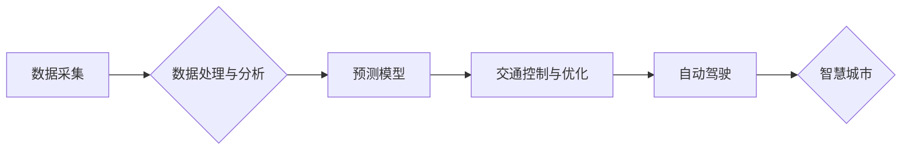

> 智能交通, AI 2.0, 深度学习, 预测模型, 交通优化, 自动驾驶, 智慧城市

## 1. 背景介绍

交通运输是现代社会不可或缺的一部分，它直接关系到经济发展、社会进步和人民生活质量。然而，随着人口增长和城市化进程的加速，交通拥堵、交通事故和环境污染等问题日益突出，给城市发展和人民生活带来了巨大压力。

传统的交通管理模式难以有效应对这些挑战。随着人工智能（AI）技术的快速发展，特别是深度学习技术的突破，AI 2.0 时代为智能交通带来了新的机遇。智能交通系统利用 AI 技术，通过对交通数据进行分析和预测，实现交通流量优化、交通安全提升、出行效率提高等目标，从而构建更加高效、安全、可持续的交通体系。

## 2. 核心概念与联系

智能交通的核心概念包括：

* **数据驱动:** 智能交通系统依赖于海量交通数据，包括车辆位置、速度、流量、路况、天气等信息。
* **机器学习:** 利用机器学习算法对交通数据进行分析和预测，例如预测交通流量、交通拥堵情况、事故发生概率等。
* **自动驾驶:** 自动驾驶技术使车辆能够自动行驶，减少人为因素导致的交通事故，提高交通效率。
* **智慧城市:** 智能交通系统是智慧城市的重要组成部分，与其他城市基础设施和服务系统相互连接，实现城市整体智能化管理。

**核心概念架构图:**



## 3. 核心算法原理 & 具体操作步骤

### 3.1  算法原理概述

智能交通系统中常用的算法包括：

* **预测模型:** 用于预测交通流量、拥堵情况、事故发生概率等。常见的预测模型包括线性回归、支持向量机、神经网络等。
* **路径规划算法:** 用于规划车辆行驶路径，例如 Dijkstra 算法、A* 算法等。
* **交通信号控制算法:** 用于优化交通信号灯的控制策略，例如最短路径算法、动态信号控制算法等。

### 3.2  算法步骤详解

以交通流量预测为例，其算法步骤如下：

1. **数据采集:** 收集历史交通流量数据、天气数据、时间数据等。
2. **数据预处理:** 对数据进行清洗、转换、特征提取等操作。
3. **模型训练:** 利用机器学习算法对预处理后的数据进行训练，建立交通流量预测模型。
4. **模型评估:** 使用测试数据对模型进行评估，并根据评估结果进行模型调优。
5. **预测:** 将实时交通数据输入到训练好的模型中，预测未来交通流量。

### 3.3  算法优缺点

不同的算法具有不同的优缺点，需要根据实际应用场景选择合适的算法。例如，线性回归算法简单易实现，但预测精度较低；神经网络算法预测精度高，但训练时间长，计算资源需求大。

### 3.4  算法应用领域

智能交通算法广泛应用于以下领域：

* **交通流量预测:** 预判交通拥堵情况，优化交通信号控制策略。
* **路径规划:** 为车辆规划最优行驶路径，避免拥堵路段。
* **自动驾驶:** 帮助车辆感知周围环境，做出决策，实现自动驾驶。
* **交通安全:** 预警交通事故风险，提高交通安全。

## 4. 数学模型和公式 & 详细讲解 & 举例说明

### 4.1  数学模型构建

交通流量预测模型通常采用时间序列模型，例如 ARIMA 模型、SARIMA 模型等。

**ARIMA 模型:**

ARIMA 模型是一种用于时间序列预测的统计模型，其全称是 Autoregressive Integrated Moving Average 模型。ARIMA 模型包含三个参数：

* **p:** Autoregressive (AR) 阶数，表示模型中自回归项的个数。
* **d:** Integrated (I) 阶数，表示时间序列需要进行的差分次数。
* **q:** Moving Average (MA) 阶数，表示模型中移动平均项的个数。

**SARIMA 模型:**

SARIMA 模型是 ARIMA 模型的扩展，它引入了季节性因素。SARIMA 模型包含四个参数：

* **p:** Autoregressive (AR) 阶数。
* **d:** Integrated (I) 阶数。
* **q:** Moving Average (MA) 阶数。
* **P:** Seasonal Autoregressive (SAR) 阶数。
* **D:** Seasonal Integrated (SI) 阶数。
* **Q:** Seasonal Moving Average (SMA) 阶数。

### 4.2  公式推导过程

ARIMA 模型和 SARIMA 模型的公式推导过程比较复杂，这里不再赘述。

### 4.3  案例分析与讲解

假设我们想要预测某条道路的交通流量，我们可以使用 SARIMA 模型进行预测。首先，我们需要收集该道路的历史交通流量数据，并进行数据预处理。然后，我们可以使用软件包进行模型训练和评估。

例如，我们可以使用 Python 的 statsmodels 库进行 SARIMA 模型的训练和评估。

```python
import pandas as pd
from statsmodels.tsa.statespace.sarimax import SARIMAX

# 加载数据
data = pd.read_csv('traffic_data.csv', index_col='Date')

# 训练模型
model = SARIMAX(data['Traffic'], order=(5, 1, 0), seasonal_order=(1, 1, 0, 7))
model_fit = model.fit()

# 预测未来一周的交通流量
forecast = model_fit.predict(start=len(data), end=len(data) + 6)

# 打印预测结果
print(forecast)
```

## 5. 项目实践：代码实例和详细解释说明

### 5.1  开发环境搭建

智能交通系统开发环境通常包括：

* **操作系统:** Linux、Windows 等。
* **编程语言:** Python、C++ 等。
* **机器学习库:** TensorFlow、PyTorch 等。
* **数据库:** MySQL、PostgreSQL 等。

### 5.2  源代码详细实现

以下是一个简单的交通流量预测代码示例，使用 Python 和 scikit-learn 库：

```python
import pandas as pd
from sklearn.linear_model import LinearRegression
from sklearn.model_selection import train_test_split

# 加载数据
data = pd.read_csv('traffic_data.csv', index_col='Date')

# 提取特征和目标变量
X = data[['Hour', 'Weekday', 'Weather']]
y = data['Traffic']

# 将数据划分为训练集和测试集
X_train, X_test, y_train, y_test = train_test_split(X, y, test_size=0.2)

# 创建线性回归模型
model = LinearRegression()

# 训练模型
model.fit(X_train, y_train)

# 预测测试集数据
y_pred = model.predict(X_test)

# 评估模型性能
from sklearn.metrics import mean_squared_error
mse = mean_squared_error(y_test, y_pred)
print(f'Mean Squared Error: {mse}')
```

### 5.3  代码解读与分析

这段代码首先加载交通数据，然后提取特征和目标变量。接着，将数据划分为训练集和测试集。然后，创建线性回归模型并训练模型。最后，使用训练好的模型预测测试集数据，并评估模型性能。

### 5.4  运行结果展示

运行结果会显示测试集数据和预测数据的均方误差 (MSE) 值。MSE 值越小，模型预测精度越高。

## 6. 实际应用场景

智能交通系统已在许多城市得到应用，例如：

* **交通信号控制优化:** 利用 AI 技术优化交通信号灯的控制策略，减少交通拥堵，提高交通效率。
* **自动驾驶:** 自动驾驶技术正在逐步应用于汽车、公共交通等领域，提高交通安全，降低交通事故发生率。
* **智能停车:** 利用传感器和 AI 技术，实现智能停车场管理，提高停车位利用率，减少车辆寻找停车位的浪费时间。
* **交通出行规划:** 利用 AI 技术，为用户提供个性化的出行规划方案，帮助用户选择最优的出行路线和交通方式。

### 6.4  未来应用展望

未来，智能交通系统将更加智能化、个性化和融合化。例如：

* **更精准的预测:** 利用更先进的机器学习算法和传感器数据，实现更精准的交通流量预测、拥堵情况预测和事故发生概率预测。
* **更个性化的服务:** 根据用户的出行需求和偏好，提供个性化的出行规划方案、交通信息推送和服务提醒。
* **更广泛的应用场景:** 智能交通技术将应用于更多领域，例如物流运输、公共安全、环境保护等。

## 7. 工具和资源推荐

### 7.1  学习资源推荐

* **书籍:**
    * 《深度学习》
    * 《机器学习实战》
    * 《智能交通系统》
* **在线课程:**
    * Coursera: 深度学习
    * edX: 机器学习
    * Udacity: 自动驾驶

### 7.2  开发工具推荐

* **编程语言:** Python
* **机器学习库:** TensorFlow, PyTorch
* **数据库:** MySQL, PostgreSQL
* **云平台:** AWS, Azure, GCP

### 7.3  相关论文推荐

* **交通流量预测:**
    * "A Deep Learning Approach for Traffic Flow Prediction"
    * "Traffic Flow Prediction Using Recurrent Neural Networks"
* **自动驾驶:**
    * "End to End Learning for Self-Driving Cars"
    * "Deep Reinforcement Learning for Autonomous Driving"

## 8. 总结：未来发展趋势与挑战

### 8.1  研究成果总结

AI 2.0 时代为智能交通带来了新的机遇，智能交通系统已取得了显著的成果，例如交通流量预测精度提高、交通拥堵情况缓解、交通安全水平提升等。

### 8.2  未来发展趋势

未来，智能交通系统将朝着更加智能化、个性化和融合化的方向发展，例如：

* **更精准的预测:** 利用更先进的机器学习算法和传感器数据，实现更精准的交通流量预测、拥堵情况预测和事故发生概率预测。
* **更个性化的服务:** 根据用户的出行需求和偏好，提供个性化的出行规划方案、交通信息推送和服务提醒。
* **更广泛的应用场景:** 智能交通技术将应用于更多领域，例如物流运输、公共安全、环境保护等。

### 8.3  面临的挑战

智能交通系统的发展也面临着一些挑战，例如：

* **数据安全:** 智能交通系统依赖于海量交通数据，数据安全问题需要得到重视。
* **算法可靠性:** 智能交通系统中的算法需要能够在复杂的环境下保持可靠性，避免出现错误决策。
* **伦理问题:** 自动驾驶等技术涉及到伦理问题，需要进行深入探讨和解决。

### 8.4  研究展望

未来，需要加强对智能交通系统的研究，解决上述挑战，推动智能交通技术的健康发展。

## 9. 附录：常见问题与解答

**常见问题:**

* **智能交通系统如何保证数据安全？**

**解答:** 智能交通系统需要采用多种安全措施来保证数据安全，例如数据加密、访问控制、数据备份等。

* **智能交通系统如何应对复杂的环境变化？**

**解答:** 智能交通系统需要采用鲁棒的算法和模型，能够适应复杂的环境变化。

* **智能交通系统如何解决伦理问题？**

**解答:** 需要进行深入的伦理探讨和研究，制定相应的规范和政策，引导智能交通技术的健康发展。


作者：禅与计算机程序设计艺术 / Zen and the Art of Computer Programming 
<end_of_turn>