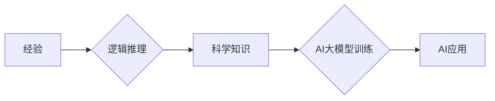

> AI大模型，卡尔纳普，逻辑学，哲学，科学方法论，符号逻辑，语义学

## 1. 背景介绍

在人工智能（AI）蓬勃发展的今天，我们常常谈论大型语言模型（LLM）的强大能力，例如生成文本、翻译语言、编写代码等。然而，这些模型的背后，蕴藏着深厚的哲学和逻辑学基础。卡尔纳普，这位20世纪著名的逻辑学家和哲学家，为我们理解AI大模型提供了重要的理论框架。

卡尔纳普出生于奥匈帝国，后成为美国哲学家和逻辑学家。他一生致力于逻辑学、哲学和科学方法论的研究，对符号逻辑、语义学和科学理论的建构做出了重要贡献。他的思想对现代人工智能的发展产生了深远的影响。

## 2. 核心概念与联系

卡尔纳普的核心思想之一是“逻辑实证主义”。他认为，科学知识的真伪应该通过经验验证来判断，而逻辑推理是验证经验的工具。他将语言视为符号系统，并试图用逻辑规则来描述语言的结构和含义。

**Mermaid 流程图：卡尔纳普思想与AI大模型的关系**



从这个流程图可以看出，卡尔纳普的逻辑实证主义为AI大模型的训练和应用提供了理论基础。AI大模型的训练依赖于大量的经验数据，而逻辑推理则帮助我们从这些数据中提取知识，构建模型。最终，训练好的AI模型可以应用于各种领域，为人类社会带来新的价值。

## 3. 核心算法原理 & 具体操作步骤

卡尔纳普的思想对AI大模型的训练算法也产生了重要影响。例如，深度学习算法的训练过程可以看作是一种逻辑推理的过程，它通过不断调整模型参数，寻找最符合经验数据的逻辑关系。

### 3.1  算法原理概述

深度学习算法的核心是多层神经网络。每个神经元都接收来自其他神经元的输入，并通过激活函数进行处理，输出到下一层神经元。通过多层神经网络的叠加，可以实现对复杂数据的抽象和学习。

### 3.2  算法步骤详解

1. **数据预处理:** 将原始数据转换为深度学习算法可以理解的格式，例如数值化文本、图像处理等。
2. **网络结构设计:** 根据任务需求设计神经网络的层数、神经元数量等结构参数。
3. **参数初始化:** 为神经网络中的每个参数赋予初始值。
4. **前向传播:** 将输入数据通过神经网络进行一次传播，得到输出结果。
5. **损失函数计算:** 计算输出结果与真实值的差异，即损失函数的值。
6. **反向传播:** 根据损失函数的梯度，调整神经网络的参数，使损失函数值最小化。
7. **迭代训练:** 重复步骤4-6，直到模型达到预期的性能。

### 3.3  算法优缺点

**优点:**

* 能够学习复杂的数据模式。
* 泛化能力强，可以应用于多种任务。

**缺点:**

* 训练数据量大，计算资源消耗高。
* 模型解释性差，难以理解模型的决策过程。

### 3.4  算法应用领域

深度学习算法广泛应用于图像识别、自然语言处理、语音识别、机器翻译等领域。

## 4. 数学模型和公式 & 详细讲解 & 举例说明

深度学习算法的训练过程可以看作是一个优化问题，目标是找到最优的参数，使模型的预测结果与真实值之间的差异最小化。

### 4.1  数学模型构建

假设我们有一个深度学习模型，其参数为θ，输入数据为x，输出结果为y。我们使用损失函数L(y,y')来衡量预测结果y与真实值y'之间的差异，其中y'是真实值。

### 4.2  公式推导过程

我们的目标是找到最优的参数θ，使损失函数L(y,y')最小化。可以使用梯度下降算法来实现这个目标。梯度下降算法的基本思想是：沿着损失函数的梯度方向迭代更新参数，直到找到损失函数的最小值。

梯度下降算法的更新公式为：

```latex
\theta = \theta - \alpha \nabla L(y,y')
```

其中：

* θ 是模型参数
* α 是学习率，控制着参数更新的步长
* ∇L(y,y') 是损失函数L(y,y')的梯度

### 4.3  案例分析与讲解

例如，在训练一个图像分类模型时，我们可以使用交叉熵损失函数来衡量预测结果与真实标签之间的差异。交叉熵损失函数的公式为：

```latex
L(y,y') = - \sum_{i=1}^{C} y_i \log(p_i)
```

其中：

* y 是真实标签
* p 是模型预测的概率分布

通过梯度下降算法，我们可以不断调整模型参数，使交叉熵损失函数的值最小化，从而提高模型的分类准确率。

## 5. 项目实践：代码实例和详细解释说明

以下是一个使用Python和TensorFlow框架训练一个简单的图像分类模型的代码实例：

### 5.1  开发环境搭建

需要安装Python、TensorFlow和必要的库，例如NumPy、Matplotlib等。

### 5.2  源代码详细实现

```python
import tensorflow as tf

# 定义模型结构
model = tf.keras.models.Sequential([
    tf.keras.layers.Conv2D(32, (3, 3), activation='relu', input_shape=(28, 28, 1)),
    tf.keras.layers.MaxPooling2D((2, 2)),
    tf.keras.layers.Conv2D(64, (3, 3), activation='relu'),
    tf.keras.layers.MaxPooling2D((2, 2)),
    tf.keras.layers.Flatten(),
    tf.keras.layers.Dense(10, activation='softmax')
])

# 定义损失函数和优化器
model.compile(loss='sparse_categorical_crossentropy',
              optimizer='adam',
              metrics=['accuracy'])

# 加载数据
(x_train, y_train), (x_test, y_test) = tf.keras.datasets.mnist.load_data()

# 数据预处理
x_train = x_train.astype('float32') / 255.0
x_test = x_test.astype('float32') / 255.0
x_train = x_train.reshape((x_train.shape[0], 28, 28, 1))
x_test = x_test.reshape((x_test.shape[0], 28, 28, 1))

# 训练模型
model.fit(x_train, y_train, epochs=5)

# 评估模型
loss, accuracy = model.evaluate(x_test, y_test)
print('Test loss:', loss)
print('Test accuracy:', accuracy)
```

### 5.3  代码解读与分析

这段代码定义了一个简单的卷积神经网络模型，并使用MNIST数据集进行训练。

* 模型结构：模型包含两层卷积层、两层最大池化层、一层全连接层和一层输出层。
* 损失函数和优化器：使用交叉熵损失函数和Adam优化器。
* 数据预处理：将图像数据转换为浮点数格式，并进行归一化处理。
* 训练过程：使用`model.fit()`方法训练模型，指定训练轮数（epochs）。
* 模型评估：使用`model.evaluate()`方法评估模型在测试集上的性能。

### 5.4  运行结果展示

运行这段代码后，会输出模型在测试集上的损失值和准确率。

## 6. 实际应用场景

深度学习算法在各个领域都有广泛的应用，例如：

### 6.1  图像识别

* **人脸识别:** 用于解锁手机、身份验证等。
* **物体检测:** 用于自动驾驶、安防监控等。
* **图像分类:** 用于医学影像诊断、产品识别等。

### 6.2  自然语言处理

* **机器翻译:** 将文本从一种语言翻译成另一种语言。
* **文本摘要:** 自动生成文本的简短摘要。
* **情感分析:** 分析文本的情感倾向，例如正面、负面、中性。

### 6.3  语音识别

* **语音助手:** 例如Siri、Alexa等。
* **语音搜索:** 通过语音进行搜索。
* **语音转文本:** 将语音转换为文本。

### 6.4  未来应用展望

随着人工智能技术的不断发展，深度学习算法将在更多领域得到应用，例如：

* **个性化推荐:** 根据用户的喜好推荐产品、服务等。
* **医疗诊断:** 辅助医生进行疾病诊断。
* **药物研发:** 预测药物的有效性。

## 7. 工具和资源推荐

### 7.1  学习资源推荐

* **书籍:**
    * 深度学习 (Deep Learning) - Ian Goodfellow, Yoshua Bengio, Aaron Courville
    * 
    * 
* **在线课程:**
    * Coursera: 深度学习 Specialization
    * Udacity: 深度学习 Nanodegree
* **博客和网站:**
    * TensorFlow Blog: https://blog.tensorflow.org/
    * PyTorch Blog: https://pytorch.org/blog/

### 7.2  开发工具推荐

* **TensorFlow:** https://www.tensorflow.org/
* **PyTorch:** https://pytorch.org/
* **Keras:** https://keras.io/

### 7.3  相关论文推荐

* **ImageNet Classification with Deep Convolutional Neural Networks** - Alex Krizhevsky, Ilya Sutskever, Geoffrey E. Hinton
* **Sequence to Sequence Learning with Neural Networks** - Ilya Sutskever, Oriol Vinyals, Quoc V. Le

## 8. 总结：未来发展趋势与挑战

深度学习算法在人工智能领域取得了巨大进展，但也面临着一些挑战，例如：

### 8.1  研究成果总结

* 深度学习算法在图像识别、自然语言处理等领域取得了突破性进展。
* 算法模型越来越复杂，参数规模越来越大。
* 训练数据量越来越大，计算资源需求越来越高。

### 8.2  未来发展趋势

* **模型效率提升:** 研究更轻量级、更高效的深度学习算法。
* **数据安全与隐私保护:** 研究如何保护训练数据和模型的隐私安全。
* **可解释性增强:** 研究如何提高深度学习模型的解释性，使其决策过程更加透明。

### 8.3  面临的挑战

* **数据获取和标注:** 训练深度学习模型需要大量的标注数据，获取和标注数据成本高。
* **计算资源限制:** 训练大型深度学习模型需要大量的计算资源，成本高昂。
* **模型泛化能力:** 深度学习模型在训练数据之外的数据集上表现不佳。

### 8.4  研究展望

未来，深度学习算法将继续朝着更智能、更安全、更可解释的方向发展，为人类社会带来更多价值。

## 9. 附录：常见问题与解答

### 9.1  深度学习算法与传统机器学习算法的区别是什么？

深度学习算法是一种基于多层神经网络的机器学习算法，而传统机器学习算法通常使用线性模型或简单非线性模型。深度学习算法能够学习更复杂的特征表示，因此在某些任务上表现更优异。

### 9.2  如何选择合适的深度学习算法？

选择合适的深度学习算法取决于具体的任务和数据特点