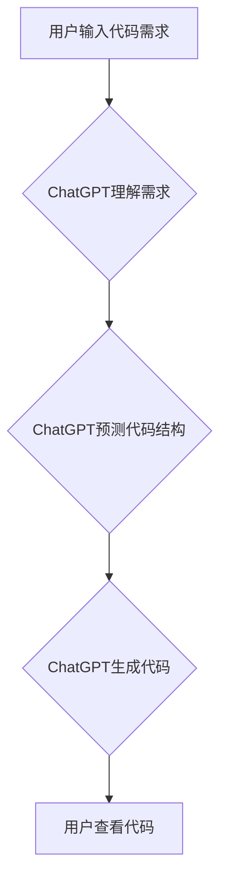

> AIGC, ChatGPT, 代码生成, 编程效率, 自然语言处理, 机器学习, 深度学习

## 1. 背景介绍

人工智能（AI）技术近年来发展迅速，特别是生成式人工智能（AIGC）的兴起，为软件开发领域带来了革命性的变革。AIGC能够利用深度学习模型，从文本、代码等数据中学习，并生成新的文本、代码等内容。其中，ChatGPT作为一款强大的开源语言模型，凭借其强大的文本生成能力和理解能力，在代码生成领域展现出巨大的潜力。

传统的软件开发流程通常需要程序员进行大量的代码编写、调试和测试工作，这不仅耗时耗力，而且容易出现错误。而利用AIGC技术，可以大大提高编程效率，降低开发成本。程序员可以利用ChatGPT等工具，通过自然语言描述需求，直接生成相应的代码，从而节省大量的时间和精力。

## 2. 核心概念与联系

**2.1  AIGC概述**

AIGC是指利用人工智能技术，生成新的文本、图像、音频、视频等内容的系统。它基于深度学习模型，能够从海量数据中学习模式和规律，并根据输入的提示或指令，生成符合特定要求的新内容。

**2.2  ChatGPT介绍**

ChatGPT是一款由OpenAI开发的开源语言模型，基于Transformer架构，拥有强大的文本生成能力和理解能力。它可以理解自然语言，并生成流畅、自然的文本内容。

**2.3  代码生成原理**

ChatGPT的代码生成原理基于其强大的语言模型能力。它通过训练大量的代码数据，学习了代码的语法结构、编程风格和逻辑关系。当用户输入代码需求时，ChatGPT会根据输入的文本信息，预测并生成符合语法规则和逻辑关系的代码。

**2.4  Mermaid 流程图**



## 3. 核心算法原理 & 具体操作步骤

**3.1  算法原理概述**

ChatGPT的代码生成算法基于Transformer架构，主要包括以下几个关键模块：

* **编码器:** 将用户输入的代码需求转换为数字表示，并提取关键信息。
* **解码器:** 根据编码器的输出，预测并生成代码。
* **注意力机制:** 帮助模型关注代码需求中的重要信息，提高代码生成质量。

**3.2  算法步骤详解**

1. **预处理:** 将用户输入的代码需求进行预处理，例如去除空格、标点符号等，并转换为数字表示。
2. **编码:** 使用编码器将预处理后的代码需求转换为数字向量，并提取关键信息。
3. **解码:** 使用解码器根据编码器的输出，预测并生成代码。
4. **生成:** 将生成的代码转换为可执行的代码格式。
5. **后处理:** 对生成的代码进行语法检查和格式化。

**3.3  算法优缺点**

**优点:**

* 代码生成速度快，效率高。
* 可以生成多种编程语言的代码。
* 可以根据用户需求生成定制化的代码。

**缺点:**

* 生成的代码可能存在逻辑错误或安全漏洞。
* 需要大量的训练数据才能达到较高的生成质量。
* 难以生成复杂、逻辑复杂的代码。

**3.4  算法应用领域**

* 自动化代码生成
* 代码补全
* 代码翻译
* 代码注释生成
* 代码测试用例生成

## 4. 数学模型和公式 & 详细讲解 & 举例说明

**4.1  数学模型构建**

ChatGPT的数学模型基于Transformer架构，主要包括以下几个关键模块：

* **多头注意力机制:** 用于捕捉代码中的长距离依赖关系。
* **前馈神经网络:** 用于处理每个词的上下文信息。
* **位置编码:** 用于表示每个词在句子中的位置信息。

**4.2  公式推导过程**

由于篇幅限制，此处不再详细推导Transformer架构的数学公式。

**4.3  案例分析与讲解**

假设用户输入代码需求：“编写一个Python函数，计算两个整数的和”。

ChatGPT会首先将这段文字转换为数字向量，然后利用多头注意力机制捕捉关键信息，例如“Python函数”、“两个整数”、“和”。

接着，利用前馈神经网络处理每个词的上下文信息，并结合位置编码，预测下一个代码字符。

最终，ChatGPT会生成以下Python代码：

```python
def sum(a, b):
  return a + b
```

## 5. 项目实践：代码实例和详细解释说明

**5.1  开发环境搭建**

* 安装Python3.x
* 安装必要的库，例如transformers、torch等。

**5.2  源代码详细实现**

```python
from transformers import AutoModelForCausalLM, AutoTokenizer

# 加载预训练模型和词典
model_name = "gpt2"
tokenizer = AutoTokenizer.from_pretrained(model_name)
model = AutoModelForCausalLM.from_pretrained(model_name)

# 用户输入代码需求
code_prompt = "编写一个Python函数，计算两个整数的和"

# 将代码需求转换为输入格式
input_ids = tokenizer.encode(code_prompt, return_tensors="pt")

# 使用模型生成代码
output = model.generate(input_ids, max_length=100)

# 将生成的代码转换为文本格式
generated_code = tokenizer.decode(output[0], skip_special_tokens=True)

# 打印生成的代码
print(generated_code)
```

**5.3  代码解读与分析**

* 该代码首先加载预训练的GPT-2模型和词典。
* 然后，将用户输入的代码需求转换为模型可识别的输入格式。
* 使用模型生成代码，并设置最大生成长度为100。
* 最后，将生成的代码转换为文本格式，并打印输出。

**5.4  运行结果展示**

```python
def sum(a, b):
  return a + b
```

## 6. 实际应用场景

**6.1  代码自动化生成**

AIGC可以自动生成常见的代码模板，例如函数定义、类声明、循环语句等，提高开发效率。

**6.2  代码补全**

AIGC可以根据上下文信息，自动补全代码，减少代码编写时间。

**6.3  代码翻译**

AIGC可以将代码从一种编程语言翻译成另一种编程语言，方便代码复用和跨平台开发。

**6.4  未来应用展望**

随着AIGC技术的不断发展，未来将有更多新的应用场景出现，例如：

* 自动生成代码测试用例
* 自动修复代码错误
* 自动生成代码文档

## 7. 工具和资源推荐

**7.1  学习资源推荐**

* **OpenAI官方文档:** https://openai.com/api/
* **HuggingFace Transformers库文档:** https://huggingface.co/docs/transformers/index

**7.2  开发工具推荐**

* **VS Code:** https://code.visualstudio.com/
* **PyCharm:** https://www.jetbrains.com/pycharm/

**7.3  相关论文推荐**

* **Attention Is All You Need:** https://arxiv.org/abs/1706.03762
* **BERT: Pre-training of Deep Bidirectional Transformers for Language Understanding:** https://arxiv.org/abs/1810.04805

## 8. 总结：未来发展趋势与挑战

**8.1  研究成果总结**

AIGC技术在代码生成领域取得了显著的进展，能够提高编程效率，降低开发成本。

**8.2  未来发展趋势**

* 模型性能将进一步提升，能够生成更复杂、更准确的代码。
* AIGC将与其他AI技术融合，例如机器学习、自然语言处理等，实现更智能的代码生成。
* AIGC将应用于更多领域，例如软件测试、代码维护等。

**8.3  面临的挑战**

* 生成的代码可能存在安全漏洞和逻辑错误。
* 需要大量的训练数据才能达到较高的生成质量。
* 如何保证AIGC生成的代码的可靠性和安全性是一个重要的挑战。

**8.4  研究展望**

未来研究将重点关注以下几个方面：

* 开发更安全、更可靠的AIGC模型。
* 探索新的AIGC应用场景。
* 研究AIGC与人类合作开发软件的模式。

## 9. 附录：常见问题与解答

**9.1  Q: ChatGPT可以生成所有类型的代码吗？**

**A:** ChatGPT可以生成多种编程语言的代码，但对于一些非常专业的或复杂的代码，可能无法生成理想的结果。

**9.2  Q: 如何保证AIGC生成的代码的安全性？**

**A:** 

* 使用经过安全测试的预训练模型。
* 对生成的代码进行安全扫描和分析。
* 在生产环境中，需要进行严格的代码审查和测试。

**9.3  Q: 如何学习使用AIGC进行代码生成？**

**A:** 可以参考OpenAI官方文档和HuggingFace Transformers库文档，学习使用AIGC进行代码生成。


作者：禅与计算机程序设计艺术 / Zen and the Art of Computer Programming 
<end_of_turn>