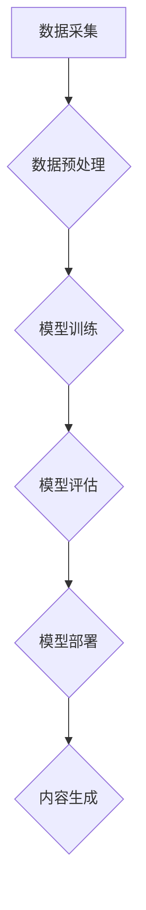

> AIGC, 生成式AI, 商业创新, 深度学习, 自然语言处理, 图像生成, 代码生成, 

## 1. 背景介绍

近年来，人工智能（AI）技术取得了飞速发展，其中生成式AI（AIGC）作为其重要分支，展现出强大的潜力，正在深刻地改变着我们生活和工作方式。AIGC是指利用人工智能技术，从已有的数据中学习，并生成新的、原创的内容，例如文本、图像、音频、视频等。

与传统的AI技术相比，AIGC更加注重创造性和想象力，能够突破人类的认知边界，生成出前所未有的内容。这为各行各业带来了无限的可能性，也为商业创新提供了新的驱动力。

## 2. 核心概念与联系

**2.1  生成式AI的定义**

生成式AI是指能够根据输入数据生成新数据的机器学习模型。这些模型通过学习大量数据中的模式和结构，并利用这些知识生成新的、类似于训练数据的内容。

**2.2  AIGC与商业创新的关系**

AIGC能够帮助企业在以下方面实现商业创新：

* **内容创作：** AIGC可以自动生成各种类型的文本内容，例如文章、广告文案、社交媒体帖子等，帮助企业节省人力成本，提高内容生产效率。
* **产品设计：** AIGC可以根据用户需求生成新的产品设计方案，帮助企业快速迭代产品，满足用户个性化需求。
* **营销推广：** AIGC可以生成个性化的营销内容，例如推荐商品、定制广告等，提高营销精准度，提升转化率。
* **客户服务：** AIGC可以构建智能客服系统，自动回答用户常见问题，提高客户服务效率。

**2.3  AIGC的架构**



## 3. 核心算法原理 & 具体操作步骤

**3.1  算法原理概述**

AIGC的核心算法主要包括：

* **深度学习：** 深度学习是AIGC的基础，利用多层神经网络学习数据中的复杂模式。
* **自然语言处理（NLP）：** NLP技术用于处理文本数据，例如文本分类、文本生成等。
* **计算机视觉：** 计算机视觉技术用于处理图像数据，例如图像识别、图像生成等。

**3.2  算法步骤详解**

1. **数据采集：** 收集大量相关数据，例如文本、图像、音频等。
2. **数据预处理：** 对数据进行清洗、格式化、标注等处理，使其适合模型训练。
3. **模型训练：** 利用深度学习算法训练模型，使其能够生成新的内容。
4. **模型评估：** 对模型的生成结果进行评估，例如准确率、流畅度等，并根据评估结果进行模型调优。
5. **模型部署：** 将训练好的模型部署到生产环境中，用于实际内容生成。

**3.3  算法优缺点**

**优点：**

* 生成内容质量高，能够接近人类水平。
* 效率高，能够快速生成大量内容。
* 可定制性强，可以根据需求调整模型参数，生成不同类型的內容。

**缺点：**

* 数据依赖性强，需要大量高质量数据进行训练。
* 容易出现偏差，如果训练数据存在偏差，生成的內容也可能存在偏差。
* 缺乏创造力，生成的內容可能缺乏原创性和想象力。

**3.4  算法应用领域**

AIGC的应用领域非常广泛，包括：

* 文本生成：文章写作、广告文案创作、聊天机器人等。
* 图像生成：图片合成、图像修复、艺术作品创作等。
* 音频生成：音乐创作、语音合成、音效制作等。
* 视频生成：视频剪辑、视频特效制作、虚拟主播等。

## 4. 数学模型和公式 & 详细讲解 & 举例说明

**4.1  数学模型构建**

AIGC模型通常基于深度学习架构，例如循环神经网络（RNN）、变分自编码器（VAE）和生成对抗网络（GAN）。这些模型通过学习数据中的模式和结构，并利用这些知识生成新的内容。

**4.2  公式推导过程**

AIGC模型的训练过程涉及到许多数学公式，例如损失函数、梯度下降算法等。这些公式用于衡量模型的性能，并指导模型参数的更新。

**4.3  案例分析与讲解**

例如，在文本生成任务中，可以使用RNN模型来生成文本序列。RNN模型的输出是一个概率分布，表示每个单词出现的概率。通过最大化似然函数，可以训练模型生成流畅、合理的文本序列。

## 5. 项目实践：代码实例和详细解释说明

**5.1  开发环境搭建**

AIGC项目开发通常需要使用Python语言和相关的深度学习框架，例如TensorFlow或PyTorch。

**5.2  源代码详细实现**

以下是一个简单的文本生成模型的代码示例：

```python
import tensorflow as tf

# 定义模型结构
model = tf.keras.Sequential([
    tf.keras.layers.Embedding(input_dim=vocab_size, output_dim=embedding_dim),
    tf.keras.layers.LSTM(units=hidden_size),
    tf.keras.layers.Dense(units=vocab_size, activation='softmax')
])

# 编译模型
model.compile(optimizer='adam', loss='sparse_categorical_crossentropy', metrics=['accuracy'])

# 训练模型
model.fit(x_train, y_train, epochs=10)

# 生成文本
text = model.predict(x_test)
```

**5.3  代码解读与分析**

这段代码定义了一个简单的文本生成模型，使用LSTM网络来学习文本序列的模式。模型的输入是单词的嵌入向量，输出是每个单词出现的概率分布。

**5.4  运行结果展示**

训练完成后，模型可以用来生成新的文本序列。生成的文本的质量取决于训练数据的质量和模型的复杂度。

## 6. 实际应用场景

**6.1  内容创作**

AIGC可以帮助企业自动生成各种类型的文本内容，例如：

* **新闻报道：** 根据新闻数据自动生成新闻报道。
* **博客文章：** 根据特定主题自动生成博客文章。
* **社交媒体帖子：** 根据目标受众自动生成社交媒体帖子。

**6.2  产品设计**

AIGC可以帮助企业根据用户需求生成新的产品设计方案，例如：

* **服装设计：** 根据用户喜好自动生成服装设计方案。
* **家具设计：** 根据用户需求自动生成家具设计方案。
* **游戏设计：** 根据游戏主题自动生成游戏场景和角色设计。

**6.3  营销推广**

AIGC可以帮助企业生成个性化的营销内容，例如：

* **推荐商品：** 根据用户的购买历史和浏览记录自动推荐商品。
* **定制广告：** 根据用户的兴趣爱好自动生成定制广告。
* **营销邮件：** 根据用户的行为自动生成营销邮件。

**6.4  未来应用展望**

AIGC技术的发展将带来更多新的应用场景，例如：

* **个性化教育：** 根据学生的学习进度和能力自动生成个性化的学习内容。
* **医疗诊断：** 根据患者的症状和病史自动生成诊断建议。
* **法律服务：** 根据法律法规和案例自动生成法律意见。

## 7. 工具和资源推荐

**7.1  学习资源推荐**

* **书籍：**
    * 《深度学习》
    * 《自然语言处理》
    * 《生成对抗网络》
* **在线课程：**
    * Coursera
    * edX
    * Udacity

**7.2  开发工具推荐**

* **TensorFlow:** 开源深度学习框架
* **PyTorch:** 开源深度学习框架
* **Hugging Face:** 提供预训练模型和工具

**7.3  相关论文推荐**

* 《Generative Adversarial Networks》
* 《Attention Is All You Need》
* 《BERT: Pre-training of Deep Bidirectional Transformers for Language Understanding》

## 8. 总结：未来发展趋势与挑战

**8.1  研究成果总结**

近年来，AIGC技术取得了显著进展，在文本生成、图像生成、音频生成等领域取得了突破性成果。

**8.2  未来发展趋势**

未来，AIGC技术将朝着以下方向发展：

* **更强大的生成能力：** 模型将能够生成更复杂、更逼真的内容。
* **更广泛的应用场景：** AIGC将应用于更多领域，例如教育、医疗、法律等。
* **更强的可解释性：** 模型的决策过程将更加透明，更容易被理解。

**8.3  面临的挑战**

AIGC技术也面临着一些挑战：

* **数据安全和隐私问题：** AIGC模型的训练需要大量数据，如何保证数据的安全和隐私是一个重要问题。
* **内容质量和可控性问题：** AIGC生成的內容可能存在偏差或错误，如何保证内容的质量和可控性是一个挑战。
* **伦理和社会影响问题：** AIGC技术可能带来一些伦理和社会问题，例如就业替代、信息操纵等，需要引起重视。

**8.4  研究展望**

未来，需要加强对AIGC技术的研发和应用，同时也要关注其潜在的风险和挑战，确保其健康发展。

## 9. 附录：常见问题与解答

**9.1  AIGC和传统AI的区别是什么？**

传统AI主要关注于数据分析和预测，而AIGC则侧重于生成新的内容。

**9.2  AIGC的应用场景有哪些？**

AIGC的应用场景非常广泛，包括内容创作、产品设计、营销推广等。

**9.3  如何评估AIGC模型的性能？**

AIGC模型的性能可以根据内容的质量、流畅度、准确率等指标进行评估。

**9.4  AIGC技术有哪些伦理和社会影响？**

AIGC技术可能带来一些伦理和社会问题，例如就业替代、信息操纵等，需要引起重视。


作者：禅与计算机程序设计艺术 / Zen and the Art of Computer Programming 
<end_of_turn>