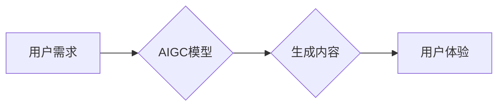

> AIGC, 生成式AI, 商业应用, 创新驱动, 价值创造

## 1. 背景介绍

近年来，人工智能（AI）技术飞速发展，特别是生成式AI的兴起，为各行各业带来了前所未有的机遇。生成式AI能够根据输入的文本、图像、音频等数据，生成新的、原创的内容，例如文本、代码、图像、音乐等。这种强大的能力赋予了企业全新的商业模式和创新潜力，催生了“AIGC”（AI-Generated Content）的概念。

AIGC是指利用人工智能技术自动生成各种内容，包括但不限于：

* **文本内容：** 文章、博客、广告文案、产品描述、剧本、诗歌等
* **图像内容：** 图片、插画、漫画、视频画面等
* **音频内容：** 音乐、语音、播客等
* **代码内容：** 软件代码、脚本等

AIGC技术正在迅速改变着内容创作、营销推广、产品开发等多个领域，为企业带来前所未有的效率提升和创新突破。

## 2. 核心概念与联系

**2.1 生成式AI的原理**

生成式AI的核心是深度学习算法，特别是基于Transformer架构的模型，例如GPT-3、DALL-E 2、Stable Diffusion等。这些模型通过学习海量数据，掌握了语言、图像、音频等数据的规律和模式，从而能够生成新的、符合规律的内容。

**2.2 AIGC与商业的联系**

AIGC技术为企业提供了以下方面的商业价值：

* **提高效率：** 自动化内容创作，节省人力成本和时间成本。
* **降低成本：** 减少对专业内容创作者的依赖，降低内容制作成本。
* **个性化定制：** 根据用户需求生成个性化的内容，提升用户体验。
* **创新驱动：** 探索新的内容形式和商业模式，推动行业创新。

**2.3 AIGC应用场景**

AIGC技术应用场景广泛，包括但不限于：

* **内容营销：** 自动生成广告文案、社交媒体内容、博客文章等。
* **客户服务：** 利用聊天机器人自动回复客户咨询，提高服务效率。
* **产品开发：** 利用AIGC生成产品原型、设计草图等，加速产品开发周期。
* **教育培训：** 生成个性化的学习内容，提升学习效率。
* **娱乐休闲：** 生成游戏场景、音乐作品、小说等，丰富用户娱乐体验。

**2.4 Mermaid 流程图**



## 3. 核心算法原理 & 具体操作步骤

### 3.1 算法原理概述

生成式AI的核心算法是基于深度学习的**生成模型**，其中Transformer架构的模型最为常见。Transformer模型通过**自注意力机制**学习文本序列之间的关系，并利用**多头注意力**机制捕捉不同层级的语义信息。

### 3.2 算法步骤详解

1. **数据预处理:** 将原始数据进行清洗、格式化、编码等处理，使其适合模型训练。
2. **模型训练:** 利用训练数据训练生成模型，通过反向传播算法不断调整模型参数，使其能够生成符合规律的内容。
3. **内容生成:** 将用户输入的文本、图像、音频等数据作为模型的输入，模型根据训练得到的知识和模式，生成新的内容。
4. **内容评估:** 对生成的內容进行评估，例如语法正确性、逻辑性、原创性等，并根据评估结果进行调整和优化。

### 3.3 算法优缺点

**优点:**

* **生成高质量内容:** 可以生成逼真、原创、高质量的内容。
* **效率高:** 自动化内容创作，节省时间和人力成本。
* **可扩展性强:** 可以应用于多种类型的内容生成。

**缺点:**

* **数据依赖:** 需要大量高质量的数据进行训练。
* **伦理风险:** 可能被用于生成虚假信息、恶意内容等。
* **缺乏创造力:** 虽然可以生成高质量内容，但缺乏真正的创造力和想象力。

### 3.4 算法应用领域

* **文本生成:** 文章、博客、广告文案、产品描述、剧本等
* **图像生成:** 图片、插画、漫画、视频画面等
* **音频生成:** 音乐、语音、播客等
* **代码生成:** 软件代码、脚本等

## 4. 数学模型和公式 & 详细讲解 & 举例说明

### 4.1 数学模型构建

生成式AI模型通常基于**概率模型**，例如**变分自编码器（VAE）**和**生成对抗网络（GAN）**。

**4.1.1 变分自编码器（VAE）**

VAE是一种用于生成数据的概率模型，它将输入数据编码成一个低维的潜在空间表示，然后解码成原始数据。

**4.1.2 生成对抗网络（GAN）**

GAN由两个神经网络组成：**生成器**和**判别器**。生成器试图生成逼真的数据，而判别器试图区分真实数据和生成数据。两者在对抗博弈中相互学习，最终生成器能够生成逼真的数据。

### 4.2 公式推导过程

**4.2.1 VAE的损失函数**

VAE的损失函数由两个部分组成：

* **重构损失:** 衡量解码后的数据与原始数据的差异。
* **KL散度:** 衡量潜在空间表示的分布与标准正态分布的差异。

**4.2.2 GAN的损失函数**

GAN的损失函数由两个部分组成：

* **生成器损失:** 判别器对生成数据的判别概率越低越好。
* **判别器损失:** 判别器对真实数据的判别概率越高越好，对生成数据的判别概率越低越好。

### 4.3 案例分析与讲解

**4.3.1 文本生成**

GPT-3是一个基于Transformer架构的文本生成模型，它可以根据输入的文本生成流畅、连贯的文本。例如，可以根据用户输入的主题，生成一篇相关的文章。

**4.3.2 图像生成**

DALL-E 2是一个基于Transformer架构的图像生成模型，它可以根据用户输入的文本描述，生成逼真的图像。例如，可以根据用户输入“一只戴着眼镜的猫”，生成一只戴着眼镜的猫的图像。

## 5. 项目实践：代码实例和详细解释说明

### 5.1 开发环境搭建

* **操作系统:** Linux/macOS/Windows
* **编程语言:** Python
* **深度学习框架:** TensorFlow/PyTorch
* **其他依赖库:** numpy, pandas, matplotlib等

### 5.2 源代码详细实现

以下是一个简单的文本生成模型的代码示例，使用PyTorch框架实现：

```python
import torch
import torch.nn as nn

class TextGenerator(nn.Module):
    def __init__(self, vocab_size, embedding_dim, hidden_dim):
        super(TextGenerator, self).__init__()
        self.embedding = nn.Embedding(vocab_size, embedding_dim)
        self.lstm = nn.LSTM(embedding_dim, hidden_dim)
        self.fc = nn.Linear(hidden_dim, vocab_size)

    def forward(self, x):
        embedded = self.embedding(x)
        output, (hidden, cell) = self.lstm(embedded)
        output = self.fc(output[:, -1, :])
        return output

# 模型参数
vocab_size = 10000
embedding_dim = 128
hidden_dim = 256

# 实例化模型
model = TextGenerator(vocab_size, embedding_dim, hidden_dim)

# 训练模型
# ...

# 生成文本
input_text = torch.tensor([1, 2, 3])
output = model(input_text)
```

### 5.3 代码解读与分析

* **Embedding层:** 将单词转换为向量表示。
* **LSTM层:** 学习文本序列之间的关系。
* **全连接层:** 将LSTM输出映射到词汇表大小。

### 5.4 运行结果展示

运行代码后，模型将根据输入的文本生成新的文本。

## 6. 实际应用场景

### 6.1 内容营销

* **自动生成广告文案:** 根据目标受众和产品特点，自动生成吸引人的广告文案。
* **创作社交媒体内容:** 自动生成吸引眼球的社交媒体帖子，提高用户互动率。
* **撰写博客文章:** 根据关键词和主题，自动生成高质量的博客文章。

### 6.2 客户服务

* **聊天机器人:** 利用AIGC技术训练聊天机器人，自动回复客户咨询，提高服务效率。
* **个性化客服:** 根据用户的历史记录和需求，生成个性化的客服回复，提升用户体验。

### 6.3 产品开发

* **产品原型设计:** 利用AIGC生成产品原型，加速产品开发周期。
* **设计草图:** 根据用户需求，自动生成产品设计草图。

### 6.4 未来应用展望

* **更个性化的内容创作:** 根据用户的喜好和需求，生成更个性化的内容。
* **跨模态内容生成:** 生成融合文本、图像、音频等多种模态的内容。
* **更智能的交互体验:** 利用AIGC技术，打造更智能、更自然的交互体验。

## 7. 工具和资源推荐

### 7.1 学习资源推荐

* **书籍:**
    * 《深度学习》
    * 《自然语言处理》
    * 《生成对抗网络》
* **在线课程:**
    * Coursera
    * edX
    * Udacity

### 7.2 开发工具推荐

* **深度学习框架:** TensorFlow, PyTorch
* **文本处理库:** NLTK, SpaCy
* **图像处理库:** OpenCV, Pillow

### 7.3 相关论文推荐

* **Generative Pre-trained Transformer 3 (GPT-3)**
* **DALL-E 2: Hierarchical Text-Conditional Image Generation with CLIP Latents**
* **Stable Diffusion: High-Resolution Image Synthesis with Latent Diffusion Models**

## 8. 总结：未来发展趋势与挑战

### 8.1 研究成果总结

AIGC技术取得了显著的进展，能够生成高质量的文本、图像、音频等内容，为各行各业带来了新的机遇。

### 8.2 未来发展趋势

* **模型规模和能力的提升:** 未来AIGC模型将更加强大，能够生成更复杂、更逼真的内容。
* **跨模态内容生成的突破:** 将文本、图像、音频等多种模态的内容融合在一起，创造更丰富的体验。
* **个性化定制的增强:** 根据用户的喜好和需求，生成更个性化的内容。

### 8.3 面临的挑战

* **数据安全和隐私保护:** AIGC模型需要大量数据进行训练，如何保证数据安全和隐私保护是一个重要挑战。
* **伦理风险:** AIGC技术可能被用于生成虚假信息、恶意内容等，需要制定相应的伦理规范和监管机制。
* **可解释性和透明度:** AIGC模型的决策过程往往难以理解，需要提高模型的可解释性和透明度。

### 8.4 研究展望

未来，AIGC技术将继续发展，为人类社会带来更多创新和价值。我们需要加强对AIGC技术的研究和探索，并积极应对其带来的挑战，确保其健康、可持续发展。

## 9. 附录：常见问题与解答

**Q1: AIGC技术与传统内容创作有什么区别？**

**A1:** AIGC技术利用人工智能自动生成内容，而传统内容创作则需要人工创作。AIGC技术可以提高效率、降低成本，但缺乏真正的创造力和想象力。

**Q2: AIGC技术是否会取代人类内容创作者？**

**A2:** AIGC技术可以辅助人类内容创作者，提高效率和创造力，但不会完全取代人类。人类的创造力和想象力仍然是不可替代的。

**Q3: 如何确保