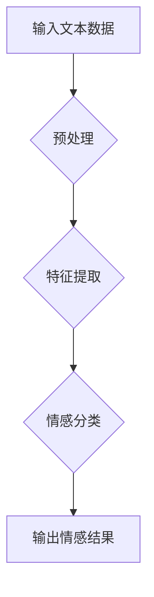

> 深度学习，文本情绪分析，自然语言处理，情感分类，卷积神经网络，循环神经网络，BERT

## 1. 背景介绍

在当今数据爆炸的时代，文本数据已成为重要的信息资源。从社交媒体评论到客户反馈，文本数据蕴含着丰富的用户情感和意图。因此，如何准确理解和分析文本情绪成为了一个重要的研究课题。文本情绪分析（Text Emotion Analysis，TEA）旨在从文本中识别和分类情感，例如积极、消极、中性等。

传统的文本情绪分析方法主要依赖于规则匹配和词袋模型等方法，但这些方法难以捕捉文本中的语义和上下文信息，准确率有限。近年来，深度学习算法的兴起为文本情绪分析带来了新的突破。深度学习算法能够自动学习文本特征，并建模复杂的语义关系，从而提高了文本情绪分析的准确率和鲁棒性。

## 2. 核心概念与联系

**2.1 自然语言处理 (NLP)**

自然语言处理 (NLP) 是人工智能的一个分支，旨在使计算机能够理解、处理和生成人类语言。NLP 涉及许多子领域，例如文本分类、情感分析、机器翻译、问答系统等。

**2.2 深度学习 (DL)**

深度学习 (DL) 是一种机器学习的子领域，它使用多层神经网络来学习数据中的复杂模式。深度学习算法能够自动学习特征，并建模复杂的非线性关系，从而在许多任务中取得了优异的性能。

**2.3 文本情绪分析 (TEA)**

文本情绪分析 (TEA) 是 NLP 的一个子领域，它旨在从文本中识别和分类情感。TEA 广泛应用于各个领域，例如市场营销、客户服务、社会科学研究等。

**2.4 流程图**



## 3. 核心算法原理 & 具体操作步骤

### 3.1  算法原理概述

深度学习算法在文本情绪分析中取得了显著的成果。常用的深度学习算法包括卷积神经网络 (CNN) 和循环神经网络 (RNN)。

* **卷积神经网络 (CNN)**：CNN 擅长提取文本中的局部特征，例如单词或短语。CNN 可以通过卷积核对文本进行滑动窗口操作，提取不同位置的特征，并通过池化层降低特征维度。

* **循环神经网络 (RNN)**：RNN 擅长处理序列数据，例如文本。RNN 的隐藏层包含循环连接，能够记忆之前的信息，从而更好地理解文本的上下文关系。

### 3.2  算法步骤详解

**3.2.1 数据预处理**

文本数据预处理是深度学习模型训练的基础。预处理步骤包括：

* **文本清洗**: 去除停用词、标点符号等无用信息。
* **文本分词**: 将文本分割成单词或短语。
* **词向量化**: 将单词映射到低维向量空间，例如 Word2Vec 或 GloVe。

**3.2.2 模型训练**

训练深度学习模型需要大量的标注数据。模型训练过程包括：

* **输入数据**: 将预处理后的文本数据输入到模型中。
* **前向传播**: 模型将输入数据进行处理，并输出情感预测结果。
* **反向传播**: 计算模型预测结果与真实标签之间的误差，并根据误差调整模型参数。
* **迭代训练**: 重复前向传播和反向传播过程，直到模型性能达到预期水平。

**3.2.3 模型评估**

模型评估是衡量模型性能的重要指标。常用的评估指标包括：

* **准确率**: 模型正确预测情感的比例。
* **精确率**: 模型预测为某一类情感的样本中，真正属于该类情感的样本比例。
* **召回率**: 模型预测出所有属于某一类情感的样本的比例。
* **F1-score**: 精确率和召回率的调和平均值。

### 3.3  算法优缺点

**优点:**

* 能够自动学习文本特征，无需人工特征工程。
* 能够建模复杂的语义关系，提高情感分析的准确率。
* 能够处理大规模文本数据。

**缺点:**

* 需要大量的标注数据进行训练。
* 训练过程耗时且资源消耗大。
* 对数据质量要求高，噪声数据会影响模型性能。

### 3.4  算法应用领域

* **市场营销**: 分析客户对产品和服务的评价，了解客户需求和反馈。
* **客户服务**: 自动识别客户情绪，提供个性化服务。
* **社会科学研究**: 分析社交媒体数据，了解社会舆情和公众态度。
* **医疗保健**: 分析患者的病历和症状，辅助医生诊断和治疗。

## 4. 数学模型和公式 & 详细讲解 & 举例说明

### 4.1  数学模型构建

深度学习模型的数学模型通常基于神经网络结构。神经网络由多个层组成，每层包含多个神经元。神经元之间通过权重连接，并使用激活函数进行非线性变换。

**4.1.1  卷积神经网络 (CNN)**

CNN 的数学模型主要包括卷积层、池化层和全连接层。

* **卷积层**: 使用卷积核对输入数据进行卷积操作，提取特征。卷积核的权重需要通过训练学习。

* **池化层**: 对卷积层的输出进行池化操作，降低特征维度，提高模型的鲁棒性。常见的池化操作包括最大池化和平均池化。

* **全连接层**: 将池化层的输出连接到全连接层，进行分类预测。

**4.1.2  循环神经网络 (RNN)**

RNN 的数学模型包含循环连接，能够记忆之前的信息。RNN 的隐藏层状态会根据当前输入和之前隐藏状态进行更新。

**4.1.3  BERT**

BERT (Bidirectional Encoder Representations from Transformers) 是一种基于 Transformer 架构的预训练语言模型。BERT 使用双向编码器，能够捕捉文本中的上下文信息。

### 4.2  公式推导过程

**4.2.1  卷积操作公式**

```
y(i, j) = sum(w(m, n) * x(i + m, j + n))
```

其中：

* y(i, j) 是卷积层的输出特征值。
* w(m, n) 是卷积核的权重。
* x(i + m, j + n) 是输入数据中的像素值。

**4.2.2  激活函数公式**

常用的激活函数包括 sigmoid 函数、ReLU 函数和 tanh 函数。

* **sigmoid 函数**:

```
f(x) = 1 / (1 + exp(-x))
```

* **ReLU 函数**:

```
f(x) = max(0, x)
```

* **tanh 函数**:

```
f(x) = (exp(x) - exp(-x)) / (exp(x) + exp(-x))
```

### 4.3  案例分析与讲解

**4.3.1  情感分类案例**

假设我们有一个文本数据集，包含一些电影评论和对应的情感标签（积极、消极、中性）。我们可以使用 CNN 或 RNN 模型对这些数据进行训练，学习情感分类的特征。

**4.3.2  文本生成案例**

BERT 模型可以用于文本生成任务。例如，我们可以使用 BERT 模型生成电影评论、新闻报道或诗歌等文本。

## 5. 项目实践：代码实例和详细解释说明

### 5.1  开发环境搭建

* **操作系统**: Linux 或 macOS
* **编程语言**: Python
* **深度学习框架**: TensorFlow 或 PyTorch
* **其他工具**: Git、Jupyter Notebook

### 5.2  源代码详细实现

```python
import tensorflow as tf

# 定义 CNN 模型
model = tf.keras.models.Sequential([
    tf.keras.layers.Embedding(input_dim=vocab_size, output_dim=embedding_dim),
    tf.keras.layers.Conv1D(filters=64, kernel_size=3, activation='relu'),
    tf.keras.layers.MaxPooling1D(pool_size=2),
    tf.keras.layers.Flatten(),
    tf.keras.layers.Dense(units=num_classes, activation='softmax')
])

# 编译模型
model.compile(optimizer='adam',
              loss='sparse_categorical_crossentropy',
              metrics=['accuracy'])

# 训练模型
model.fit(x_train, y_train, epochs=10, batch_size=32)

# 评估模型
loss, accuracy = model.evaluate(x_test, y_test)
print('Test loss:', loss)
print('Test accuracy:', accuracy)
```

### 5.3  代码解读与分析

* **Embedding 层**: 将单词映射到低维向量空间。
* **Conv1D 层**: 使用卷积核提取文本特征。
* **MaxPooling1D 层**: 对卷积层的输出进行池化操作，降低特征维度。
* **Flatten 层**: 将多维特征转换为一维向量。
* **Dense 层**: 全连接层，进行情感分类预测。

### 5.4  运行结果展示

训练完成后，我们可以使用模型对测试数据进行预测，并评估模型的性能。

## 6. 实际应用场景

### 6.1  社交媒体监控

分析社交媒体数据，识别用户对品牌、产品或事件的情绪，帮助企业了解用户反馈和舆情趋势。

### 6.2  客户服务自动化

自动识别客户的语气和情绪，提供个性化服务，提高客户满意度。

### 6.3  市场营销分析

分析客户对广告和营销活动的反应，优化营销策略，提高广告效果。

### 6.4  未来应用展望

* **更精准的情感识别**: 结合多模态数据，例如文本、图像和音频，实现更精准的情感识别。
* **个性化情感分析**: 根据用户的个人特征和上下文信息，提供个性化的情感分析结果。
* **情感分析应用场景的拓展**: 将情感分析应用于更多领域，例如教育、医疗保健和金融。

## 7. 工具和资源推荐

### 7.1  学习资源推荐

* **书籍**:
    * Deep Learning with Python by Francois Chollet
    * Natural Language Processing with Python by Steven Bird, Ewan Klein, and Edward Loper
* **在线课程**:
    * Coursera: Deep Learning Specialization
    * Udacity: Deep Learning Nanodegree
* **博客**:
    * Towards Data Science
    * Machine Learning Mastery

### 7.2  开发工具推荐

* **深度学习框架**: TensorFlow, PyTorch
* **自然语言处理库**: NLTK, spaCy
* **文本处理工具**: TextBlob

### 7.3  相关论文推荐

* **BERT**: Devlin, J., Chang, M. W., Lee, K., & Toutanova, K. (2018). BERT: Pre-training of deep bidirectional transformers for language understanding. arXiv preprint arXiv:1810.04805.
* **CNN for Text Classification**: Kim, Y. (2014). Convolutional neural networks for sentence classification. arXiv preprint arXiv:1408.5882.
* **RNN for Text Classification**: Graves, A. (2012). Generating sequences with recurrent neural networks. arXiv preprint arXiv:1308.0850.

## 8. 总结：未来发展趋势与挑战

### 8.1  研究成果总结

深度学习算法在文本情绪分析领域取得了显著的成果，能够准确识别和分类情感，并应用于多个领域。

### 8.2  未来发展趋势

* **更精准的情感识别**: 结合多模态数据，例如文本、图像和音频，实现更精准的情感识别。
* **个性化情感分析**: 根据用户的个人特征和上下文信息，提供个性化的情感分析结果。
* **情感分析应用场景的拓展**: 将情感分析应用