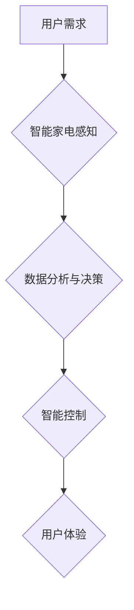

> 智能家电，人工智能，机器学习，深度学习，自然语言处理，计算机视觉，语音识别，用户体验

## 1. 背景介绍

随着科技的飞速发展，人工智能（AI）技术已经渗透到生活的方方面面，智能家电作为AI应用的重要领域之一，正在以惊人的速度改变着人们的生活方式。智能家电不再仅仅是简单的电器，而是拥有感知、学习和决策能力的智能伙伴，能够根据用户的需求和习惯，自动完成各种家务任务，提升生活品质和效率。

传统的家电产品功能单一，缺乏智能化交互，用户需要手动操作才能完成各种功能。而智能家电则通过传感器、网络连接和AI算法，实现了对环境的感知、数据的分析和智能决策，能够自主学习用户的喜好，提供个性化服务，并与其他智能设备协同工作，构建更加智能化的家居生态系统。

## 2. 核心概念与联系

**2.1 智能家电的核心概念**

智能家电是指集成了人工智能技术的电器产品，能够通过传感器、网络连接和AI算法，感知环境、分析数据、自主决策，并与用户进行交互，提供个性化服务。

**2.2 智能家电与AI技术的联系**

AI技术是智能家电的核心驱动力，它赋予了家电产品感知、学习和决策的能力。

* **感知:** 通过传感器收集环境数据，例如温度、湿度、光线、声音等。
* **学习:** 利用机器学习算法，分析收集到的数据，识别模式，并建立用户行为模型。
* **决策:** 根据用户需求和环境变化，自主做出决策，控制家电设备的运行状态。
* **交互:** 通过语音、图像、触控等方式，与用户进行交互，提供个性化服务。

**2.3 智能家电架构**

智能家电的架构通常包括以下几个主要部分：

* **硬件层:** 包括传感器、处理器、存储器、通信模块等硬件设备。
* **软件层:** 包括操作系统、应用程序、AI算法等软件组件。
* **云端平台:** 提供数据存储、处理、分析和服务等功能。

**2.4 Mermaid 流程图**



## 3. 核心算法原理 & 具体操作步骤

**3.1 算法原理概述**

智能家电中常用的AI算法包括机器学习、深度学习、自然语言处理和计算机视觉等。

* **机器学习:** 通过训练模型，让机器从数据中学习规律，并进行预测或分类。
* **深度学习:** 基于神经网络，能够学习更复杂的特征，实现更精准的识别和预测。
* **自然语言处理:** 能够理解和处理人类语言，例如语音识别、文本分析等。
* **计算机视觉:** 能够识别和理解图像和视频，例如物体识别、场景理解等。

**3.2 算法步骤详解**

以机器学习为例，其基本步骤包括：

1. **数据收集:** 收集与目标任务相关的训练数据。
2. **数据预处理:** 对收集到的数据进行清洗、转换和特征提取。
3. **模型选择:** 选择合适的机器学习模型，例如线性回归、决策树、支持向量机等。
4. **模型训练:** 使用训练数据训练模型，调整模型参数，使其能够准确地完成目标任务。
5. **模型评估:** 使用测试数据评估模型的性能，例如准确率、召回率、F1-score等。
6. **模型部署:** 将训练好的模型部署到智能家电设备中，使其能够实时进行预测或分类。

**3.3 算法优缺点**

不同的AI算法具有不同的优缺点，需要根据具体应用场景选择合适的算法。

* **机器学习:** 优点是能够从数据中学习规律，并进行预测或分类；缺点是需要大量的训练数据，并且模型解释性较差。
* **深度学习:** 优点是能够学习更复杂的特征，实现更精准的识别和预测；缺点是训练成本高，并且对数据质量要求较高。
* **自然语言处理:** 优点是能够理解和处理人类语言；缺点是处理复杂语言场景仍然存在挑战。
* **计算机视觉:** 优点是能够识别和理解图像和视频；缺点是需要大量的标注数据，并且对硬件资源要求较高。

**3.4 算法应用领域**

AI算法在智能家电领域有着广泛的应用，例如：

* **语音控制:** 通过语音识别技术，实现对智能家电的语音控制。
* **图像识别:** 通过图像识别技术，识别用户的指令、物体或场景，并进行相应的操作。
* **个性化推荐:** 通过用户行为分析，推荐个性化的产品或服务。
* **智能家居场景:** 通过多传感器融合和AI算法，实现智能家居场景的自动化控制，例如自动调节灯光、温度、窗帘等。

## 4. 数学模型和公式 & 详细讲解 & 举例说明

**4.1 数学模型构建**

在智能家电中，可以使用数学模型来描述系统行为和预测未来状态。例如，可以建立一个温度控制模型，描述空调的运行状态与室内温度之间的关系。

**4.2 公式推导过程**

假设室内温度为T，空调的制冷能力为Q，室内热损失率为H，则温度控制模型可以表示为：

```latex
dT/dt = (Q - H - T) / C
```

其中，C为室内热容量。

**4.3 案例分析与讲解**

当室内温度高于设定温度时，空调会启动制冷，Q值大于0；当室内温度低于设定温度时，空调会停止运行，Q值等于0。

通过对该模型进行分析和仿真，可以预测空调的运行时间、能耗等信息，并根据用户的需求进行优化控制。

## 5. 项目实践：代码实例和详细解释说明

**5.1 开发环境搭建**

智能家电开发通常需要使用以下开发环境：

* **操作系统:** Linux、Windows或Android等。
* **编程语言:** C/C++、Python、Java等。
* **开发工具:** IDE、调试器、仿真工具等。

**5.2 源代码详细实现**

以下是一个简单的智能照明系统代码示例，使用Python语言实现：

```python
import RPi.GPIO as GPIO
import time

# 设置GPIO引脚
GPIO.setmode(GPIO.BCM)
GPIO.setup(17, GPIO.OUT)

# 设置灯光亮度
def set_brightness(brightness):
    GPIO.output(17, brightness)

# 主程序
try:
    while True:
        # 设置灯光亮度
        set_brightness(1)
        time.sleep(1)
        set_brightness(0)
        time.sleep(1)
except KeyboardInterrupt:
    GPIO.cleanup()
```

**5.3 代码解读与分析**

该代码使用Python语言和Raspberry Pi单片机，实现了一个简单的智能照明系统。

* `RPi.GPIO`库用于控制GPIO引脚。
* `GPIO.setup(17, GPIO.OUT)`设置GPIO引脚17为输出模式。
* `set_brightness(brightness)`函数用于设置灯光亮度，参数为0或1，分别表示灯光关闭或开启。
* 主程序循环执行，每隔1秒切换灯光状态。

**5.4 运行结果展示**

运行该代码后，GPIO引脚17连接的LED灯会每隔1秒闪烁一次。

## 6. 实际应用场景

**6.1 智能冰箱**

智能冰箱可以识别食材种类和数量，并根据用户的饮食习惯和需求，提供个性化的食谱推荐和购物清单。

**6.2 智能洗衣机**

智能洗衣机可以根据衣物材质和污渍程度，自动选择合适的洗涤程序和水温，并提供智能干衣功能。

**6.3 智能空调**

智能空调可以根据用户的温度偏好和环境变化，自动调节温度，并提供个性化的舒适度调节。

**6.4 未来应用展望**

随着AI技术的不断发展，智能家电将更加智能化、个性化和人性化。未来，智能家电将能够：

* 更深入地理解用户的需求和习惯，提供更加个性化的服务。
* 与其他智能设备协同工作，构建更加智能化的家居生态系统。
* 具备更强的自主学习和决策能力，能够主动解决用户的日常生活问题。

## 7. 工具和资源推荐

**7.1 学习资源推荐**

* **在线课程:** Coursera、edX、Udacity等平台提供丰富的AI课程。
* **书籍:** 《深度学习》、《机器学习实战》等书籍。
* **开源项目:** TensorFlow、PyTorch等开源项目。

**7.2 开发工具推荐**

* **IDE:** PyCharm、VS Code等。
* **机器学习库:** TensorFlow、PyTorch、Scikit-learn等。
* **云平台:** AWS、Azure、Google Cloud等。

**7.3 相关论文推荐**

* **深度学习:** 《ImageNet Classification with Deep Convolutional Neural Networks》
* **机器学习:** 《Support Vector Machines》
* **自然语言处理:** 《Attention Is All You Need》

## 8. 总结：未来发展趋势与挑战

**8.1 研究成果总结**

近年来，AI技术在智能家电领域取得了显著的进展，智能家电的功能更加丰富，用户体验更加便捷。

**8.2 未来发展趋势**

未来，智能家电将朝着更加智能化、个性化和人性化的方向发展，例如：

* **更强的AI能力:** 智能家电将具备更强的AI能力，能够更深入地理解用户的需求和习惯，提供更加个性化的服务。
* **更广泛的应用场景:** 智能家电将应用于更多场景，例如医疗、教育、娱乐等。
* **更安全的隐私保护:** 智能家电将更加注重用户隐私保护，确保用户数据安全。

**8.3 面临的挑战**

智能家电的发展也面临着一些挑战，例如：

* **数据安全:** 智能家电收集大量的用户数据，需要确保数据安全和隐私保护。
* **算法可靠性:** AI算法的可靠性和安全性需要得到保证，避免出现安全漏洞或误判。
* **成本问题:** 高性能的AI芯片和算法开发成本较高，需要降低成本，使其更加普及。

**8.4 研究展望**

未来，需要进一步研究和探索以下问题：

* 如何开发更加安全、可靠和高效的AI算法。
* 如何构建更加智能化的家居生态系统，实现设备之间的协同工作。
* 如何降低智能家电的成本，使其更加普及。


## 9. 附录：常见问题与解答

**9.1 智能家电如何连接网络？**

智能家电通常通过Wi-Fi、蓝牙或其他无线网络协议连接网络。

**9.2 智能家电如何保护用户隐私？**

智能家电厂商通常会采取以下措施保护用户隐私：

* 数据加密：将用户数据加密传输和存储。
* 数据匿名化：将用户数据匿名化处理，避免直接识别用户身份。
* 数据访问控制：限制对用户数据的访问权限，只有授权人员才能访问。

**9.3 智能家电如何更新软件？**

智能家电通常可以通过网络自动更新软件。

**9.4 智能家电如何解决故障？**

智能家电通常会提供远程诊断和故障排除功能，用户可以通过手机APP或语音助手联系客服人员进行远程协助。


作者：禅与计算机程序设计艺术 / Zen and the Art of Computer Programming 
<end_of_turn>