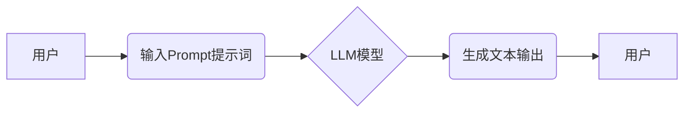

> AI大模型,Prompt提示词,模板,最佳实践,自然语言处理,文本生成,机器学习

## 1. 背景介绍

近年来，大语言模型（LLM）在自然语言处理（NLP）领域取得了显著进展，展现出强大的文本生成、翻译、摘要等能力。然而，LLM的性能很大程度上取决于输入的Prompt提示词的质量。一个精心设计的Prompt可以引导模型生成更准确、更相关的输出，而一个模糊或不完整的Prompt则可能导致模型产生错误或不相关的结果。因此，如何编写高质量的Prompt提示词成为LLM应用的关键问题之一。

Prompt提示词模板是一种有效地提高Prompt质量的方法。模板提供了一个预定义的结构和语法，可以帮助用户快速构建高质量的Prompt，并减少人为错误。

## 2. 核心概念与联系

### 2.1  Prompt提示词

Prompt提示词是指用户向LLM输入的文本指令或问题，它引导模型理解用户意图并生成相应的输出。

### 2.2  模板

模板是一种预定义的结构或格式，可以用于生成各种类型的文本，例如电子邮件、报告、代码等。在Prompt提示词的语境下，模板是指一种预定义的Prompt结构，包含了模型所需的信息和指令。

### 2.3  LLM模型

大语言模型（LLM）是一种基于深度学习的强大人工智能模型，能够理解和生成人类语言。LLM通常由数十亿甚至数万亿个参数组成，通过训练大量的文本数据，学习了语言的语法、语义和上下文关系。

**核心概念与联系流程图:**



## 3. 核心算法原理 & 具体操作步骤

### 3.1  算法原理概述

Prompt提示词模板的本质是利用预定义的结构和语法，引导LLM模型生成更准确、更相关的输出。模板通常包含以下几个关键部分：

* **任务指示:** 明确告诉模型需要完成的任务，例如“翻译”、“总结”、“生成故事”等。
* **输入信息:** 提供模型需要处理的信息，例如要翻译的文本、要总结的文章、要生成的文本类型等。
* **输出格式:** 指定模型输出的格式，例如“简短的摘要”、“详细的报告”、“诗歌形式”等。

### 3.2  算法步骤详解

1. **定义模板结构:** 根据不同的任务类型，设计相应的模板结构，包含任务指示、输入信息和输出格式等关键部分。
2. **填充模板变量:** 将用户提供的输入信息填充到模板中的变量中。
3. **输入模板到LLM模型:** 将填充后的模板作为输入，发送到LLM模型进行处理。
4. **接收模型输出:** 接收模型生成的文本输出，并根据输出格式进行处理和展示。

### 3.3  算法优缺点

**优点:**

* **提高Prompt质量:** 模板提供了一个预定义的结构，可以帮助用户快速构建高质量的Prompt，减少人为错误。
* **提高效率:** 使用模板可以节省用户的时间和精力，快速生成各种类型的Prompt。
* **增强可复用性:** 模板可以被重复使用，适用于不同的任务和场景。

**缺点:**

* **模板固化:** 模板的结构可能无法适应所有类型的任务，需要根据具体情况进行调整。
* **缺乏灵活性:** 模板的结构相对固定，用户无法自由地修改模板结构。

### 3.4  算法应用领域

Prompt提示词模板的应用领域非常广泛，例如：

* **文本生成:** 生成故事、诗歌、文章、代码等。
* **对话系统:** 构建聊天机器人、虚拟助手等。
* **机器翻译:** 将文本从一种语言翻译成另一种语言。
* **问答系统:** 回答用户提出的问题。

## 4. 数学模型和公式 & 详细讲解 & 举例说明

Prompt提示词模板的构建和优化可以借助数学模型和公式进行分析和改进。

### 4.1  数学模型构建

可以将Prompt提示词模板视为一个符号序列，每个符号代表一个特定的概念或指令。可以使用概率模型来描述不同符号出现的概率，以及符号之间的依赖关系。例如，可以使用n-gram模型来计算不同符号序列出现的概率。

### 4.2  公式推导过程

可以使用概率论和统计学中的公式来推导Prompt提示词模板的优化方法。例如，可以使用最大似然估计来估计模型参数，并使用交叉验证来评估模型性能。

### 4.3  案例分析与讲解

假设我们有一个生成故事的Prompt提示词模板：

```
故事类型: {故事类型}
人物: {人物}
场景: {场景}
情节: {情节}
```

我们可以使用n-gram模型来分析不同故事类型、人物、场景和情节的组合概率，并根据这些概率来优化模板的结构和内容。例如，我们可以发现“童话故事”+“公主”+“城堡”+“爱情”的组合概率较高，因此可以将这些词语作为模板的默认值。

## 5. 项目实践：代码实例和详细解释说明

### 5.1  开发环境搭建

可以使用Python语言和相应的库来实现Prompt提示词模板的开发和测试。例如，可以使用Transformers库来加载预训练的LLM模型，并使用Prompt工程库来构建和管理Prompt模板。

### 5.2  源代码详细实现

```python
from transformers import pipeline

# 加载文本生成模型
generator = pipeline("text-generation", model="gpt2")

# 定义Prompt模板
template = "故事类型: {story_type}
人物: {character}
场景: {setting}
情节: {plot}"

# 填充模板变量
story_type = "童话故事"
character = "公主"
setting = "城堡"
plot = "爱情"

prompt = template.format(story_type=story_type, character=character, setting=setting, plot=plot)

# 使用模型生成文本
output = generator(prompt, max_length=200, num_return_sequences=1)

# 打印输出结果
print(output[0]['generated_text'])
```

### 5.3  代码解读与分析

这段代码首先加载了预训练的GPT-2文本生成模型。然后，定义了一个Prompt模板，包含了故事类型、人物、场景和情节等变量。接着，将用户提供的输入信息填充到模板中，形成完整的Prompt。最后，使用模型生成文本，并打印输出结果。

### 5.4  运行结果展示

运行这段代码后，会输出一个根据模板生成的童话故事。

## 6. 实际应用场景

Prompt提示词模板在实际应用场景中具有广泛的应用价值。

### 6.1  教育领域

* **自动生成习题:** 根据课程内容自动生成不同难度的习题，帮助学生巩固学习成果。
* **个性化学习辅导:** 根据学生的学习进度和能力，自动生成个性化的学习辅导材料。

### 6.2  商业领域

* **客户服务自动化:** 使用Prompt模板构建聊天机器人，自动回答客户常见问题，提高客户服务效率。
* **内容创作辅助:** 使用Prompt模板辅助内容创作者生成文章、广告文案、产品描述等。

### 6.3  科研领域

* **文献摘要生成:** 根据研究论文自动生成摘要，帮助科研人员快速了解论文内容。
* **数据分析报告:** 使用Prompt模板生成数据分析报告，帮助科研人员清晰地展示研究结果。

### 6.4  未来应用展望

随着大语言模型的不断发展，Prompt提示词模板的应用场景将会更加广泛。未来，我们可以期待看到：

* **更智能的Prompt模板:** 使用机器学习算法自动生成和优化Prompt模板，提高模板的智能化程度。
* **多模态Prompt模板:** 将文本、图像、音频等多种模态信息整合到Prompt模板中，实现更丰富的交互体验。
* **个性化Prompt模板:** 根据用户的个人喜好和需求，定制个性化的Prompt模板，提供更精准的输出结果。

## 7. 工具和资源推荐

### 7.1  学习资源推荐

* **论文:**
    * "Prompt Engineering for Large Language Models"
    * "The Art of Prompting"
* **博客:**
    * OpenAI Blog
    * Hugging Face Blog

### 7.2  开发工具推荐

* **Transformers:** https://huggingface.co/docs/transformers/index
* **Prompt Engineering Toolkit:** https://github.com/prompt-engineering-toolkit/prompt-engineering-toolkit

### 7.3  相关论文推荐

* "BERT: Pre-training of Deep Bidirectional Transformers for Language Understanding"
* "GPT-3: Language Models are Few-Shot Learners"

## 8. 总结：未来发展趋势与挑战

Prompt提示词模板是LLM应用的重要组成部分，它可以有效地提高Prompt质量，并促进LLM的更广泛应用。未来，Prompt提示词模板的发展趋势将更加智能化、个性化和多模态化。

然而，Prompt提示词模板的开发和应用也面临着一些挑战，例如：

* **模板的通用性和可扩展性:** 如何设计一个通用的Prompt模板，能够适应各种类型的任务和场景？
* **模板的优化和评估:** 如何有效地优化Prompt模板，并评估其性能？
* **模板的安全性:** 如何确保Prompt模板的安全性和可靠性，避免产生有害的输出结果？

## 9. 附录：常见问题与解答

### 9.1  如何选择合适的Prompt模板？

选择合适的Prompt模板取决于具体的应用场景和任务类型。可以参考现有的Prompt模板库，或者根据自己的需求进行定制。

### 9.2  如何优化Prompt模板？

可以使用多种方法优化Prompt模板，例如：

* **调整模板结构:** 添加或删除模板中的变量，改变变量的顺序。
* **修改模板内容:** 使用更精准的词语，添加更多的上下文信息。
* **使用机器学习算法:** 自动生成和优化Prompt模板。

### 9.3  如何评估Prompt模板的性能？

可以使用多种指标来评估Prompt模板的性能，例如：

* **准确率:** 模型输出的文本与预期结果的匹配程度。
* **流畅度:** 模型生成的文本的语法和语义流畅度。
* **相关性:** 模型生成的文本与用户输入的Prompt相关性。


作者：禅与计算机程序设计艺术 / Zen and the Art of Computer Programming 
<end_of_turn>