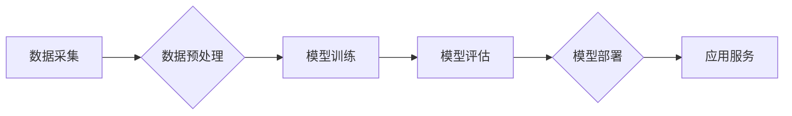

> AI大模型，创业，竞争对手，技术趋势，商业模式，市场策略，人才培养

## 1. 背景介绍

近年来，人工智能（AI）技术突飞猛进，特别是大模型的出现，为各行各业带来了革命性的变革。从自然语言处理到计算机视觉，从药物研发到金融预测，AI大模型正在改变着我们生活的方方面面。

对于创业者来说，AI大模型蕴藏着巨大的商机。然而，竞争也异常激烈。众多科技巨头和新兴公司都在积极布局AI领域，争夺市场份额。如何在这个充满机遇和挑战的赛道上脱颖而出，成为一个关键问题。

## 2. 核心概念与联系

**2.1 AI大模型概述**

AI大模型是指在海量数据上训练的深度学习模型，拥有强大的泛化能力和学习能力。它们能够处理复杂的任务，例如文本生成、图像识别、语音合成等。

**2.2 核心概念**

* **深度学习:**  一种机器学习的子领域，利用多层神经网络模拟人类大脑的学习过程。
* **大规模数据:**  AI大模型的训练需要海量数据作为基础，才能获得良好的性能。
* **模型参数:**  深度学习模型的参数决定了模型的结构和功能，需要通过训练过程不断调整。
* **训练过程:**  将数据输入模型，通过反向传播算法调整模型参数，使模型的预测结果越来越准确。

**2.3 架构图**



**2.4 联系**

AI大模型的训练和应用是一个完整的流程，从数据采集到模型部署，每个环节都至关重要。数据质量直接影响模型性能，模型训练需要强大的计算资源，模型评估需要科学的指标，模型部署需要考虑效率和可扩展性。

## 3. 核心算法原理 & 具体操作步骤

**3.1 算法原理概述**

深度学习算法的核心是神经网络，它由多个层级的神经元组成。每个神经元接收输入信号，经过激活函数处理后输出信号。神经网络通过连接不同层级的神经元，形成复杂的计算网络，从而学习数据中的模式和规律。

**3.2 算法步骤详解**

1. **数据预处理:** 将原始数据清洗、转换、规范化，使其适合模型训练。
2. **模型构建:** 根据任务需求选择合适的网络架构，并设置模型参数。
3. **模型训练:** 将数据输入模型，通过反向传播算法调整模型参数，使模型的预测结果越来越准确。
4. **模型评估:** 使用测试数据评估模型的性能，并根据评估结果调整模型参数或网络架构。
5. **模型部署:** 将训练好的模型部署到实际应用环境中，提供服务。

**3.3 算法优缺点**

**优点:**

* 强大的泛化能力：能够处理未知数据。
* 学习能力强：能够从海量数据中学习复杂模式。
* 应用范围广：可应用于各种领域，例如图像识别、自然语言处理、语音合成等。

**缺点:**

* 数据依赖性强：需要海量数据才能训练出高质量的模型。
* 计算资源消耗大：训练大型模型需要强大的计算资源。
* 可解释性差：模型的决策过程难以理解。

**3.4 算法应用领域**

* **自然语言处理:** 文本分类、情感分析、机器翻译、聊天机器人等。
* **计算机视觉:** 图像识别、物体检测、图像分割、视频分析等。
* **语音识别:** 语音转文本、语音合成、语音助手等。
* **推荐系统:** 商品推荐、内容推荐、用户画像等。
* **医疗诊断:** 病情预测、疾病诊断、药物研发等。

## 4. 数学模型和公式 & 详细讲解 & 举例说明

**4.1 数学模型构建**

深度学习模型通常采用神经网络结构，其数学模型可以表示为一系列的矩阵运算和激活函数。

**4.2 公式推导过程**

* **激活函数:**  激活函数用于引入非线性，使神经网络能够学习复杂模式。常见的激活函数包括 sigmoid 函数、ReLU 函数、tanh 函数等。
* **损失函数:**  损失函数用于衡量模型预测结果与真实值的差距。常见的损失函数包括均方误差、交叉熵等。
* **反向传播算法:**  反向传播算法用于更新模型参数，使其能够最小化损失函数。

**4.3 案例分析与讲解**

以图像分类为例，假设我们有一个包含猫和狗的图像数据集。我们可以使用卷积神经网络（CNN）来训练一个图像分类模型。

* **输入层:**  接收图像数据。
* **卷积层:**  提取图像特征。
* **池化层:**  降低图像尺寸，提高模型鲁棒性。
* **全连接层:**  将提取的特征进行分类。

训练过程中，模型会根据损失函数的梯度更新参数，最终能够将猫和狗图像分类准确。

## 5. 项目实践：代码实例和详细解释说明

**5.1 开发环境搭建**

* **操作系统:**  Linux 或 macOS
* **编程语言:**  Python
* **深度学习框架:**  TensorFlow 或 PyTorch
* **硬件环境:**  GPU 加速器

**5.2 源代码详细实现**

```python
import tensorflow as tf

# 定义模型结构
model = tf.keras.models.Sequential([
    tf.keras.layers.Conv2D(32, (3, 3), activation='relu', input_shape=(28, 28, 1)),
    tf.keras.layers.MaxPooling2D((2, 2)),
    tf.keras.layers.Conv2D(64, (3, 3), activation='relu'),
    tf.keras.layers.MaxPooling2D((2, 2)),
    tf.keras.layers.Flatten(),
    tf.keras.layers.Dense(10, activation='softmax')
])

# 编译模型
model.compile(optimizer='adam',
              loss='sparse_categorical_crossentropy',
              metrics=['accuracy'])

# 训练模型
model.fit(x_train, y_train, epochs=5)

# 评估模型
loss, accuracy = model.evaluate(x_test, y_test)
print('Test loss:', loss)
print('Test accuracy:', accuracy)
```

**5.3 代码解读与分析**

* **模型结构:**  该代码定义了一个简单的卷积神经网络，用于图像分类。
* **编译模型:**  使用 Adam 优化器、交叉熵损失函数和准确率指标编译模型。
* **训练模型:**  使用训练数据训练模型，设置训练轮数为 5。
* **评估模型:**  使用测试数据评估模型的性能，打印测试损失和准确率。

**5.4 运行结果展示**

训练完成后，模型能够对图像进行分类，并输出相应的准确率。

## 6. 实际应用场景

**6.1 图像识别:**  识别物体、场景、人脸等。

**6.2 自然语言处理:**  文本分类、情感分析、机器翻译等。

**6.3 语音识别:**  语音转文本、语音助手等。

**6.4 医疗诊断:**  辅助医生诊断疾病、预测病情。

**6.5 金融预测:**  预测股票价格、风险评估等。

**6.6 未来应用展望**

AI大模型的应用场景还在不断扩展，未来将应用于更多领域，例如自动驾驶、机器人、个性化教育等。

## 7. 工具和资源推荐

**7.1 学习资源推荐**

* **书籍:**  《深度学习》、《动手学深度学习》
* **在线课程:**  Coursera、edX、Udacity
* **开源项目:**  TensorFlow、PyTorch

**7.2 开发工具推荐**

* **深度学习框架:**  TensorFlow、PyTorch
* **数据处理工具:**  Pandas、NumPy
* **可视化工具:**  Matplotlib、Seaborn

**7.3 相关论文推荐**

* **BERT:**  Bidirectional Encoder Representations from Transformers
* **GPT-3:**  Generative Pre-trained Transformer 3
* **DALL-E:**  Generative Pre-trained Transformer for Image Generation

## 8. 总结：未来发展趋势与挑战

**8.1 研究成果总结**

近年来，AI大模型取得了显著进展，在各种任务上取得了突破性成果。

**8.2 未来发展趋势**

* **模型规模更大:**  训练更大型的模型，提升模型性能。
* **模型更加通用:**  开发能够适应多种任务的通用模型。
* **模型更加可解释:**  提高模型的透明度和可解释性。

**8.3 面临的挑战**

* **数据获取和隐私保护:**  获取高质量数据和保护用户隐私是一个挑战。
* **计算资源消耗:**  训练大型模型需要大量的计算资源。
* **模型安全性:**  确保模型安全可靠，防止被恶意利用。

**8.4 研究展望**

未来，AI大模型研究将继续深入，探索更强大的模型、更广泛的应用场景和更有效的训练方法。

## 9. 附录：常见问题与解答

**9.1 如何选择合适的AI大模型？**

选择合适的AI大模型需要根据具体任务需求、数据规模、计算资源等因素进行综合考虑。

**9.2 如何训练自己的AI大模型？**

训练自己的AI大模型需要具备一定的编程和机器学习基础，并拥有足够的计算资源。

**9.3 如何部署AI大模型？**

部署AI大模型可以采用云端部署、边缘部署等方式，需要根据实际应用场景选择合适的部署方案。


作者：禅与计算机程序设计艺术 / Zen and the Art of Computer Programming 
<end_of_turn>