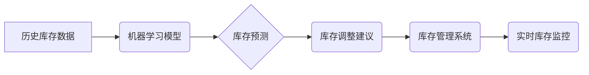

> AI、库存管理、实时监控、机器学习、预测分析、数据可视化、云计算

## 1. 背景介绍

在当今快速发展的商业环境中，高效的库存管理已成为企业竞争力的关键因素。传统的库存管理方法往往依赖于人工统计和预估，容易出现库存积压、缺货等问题，导致成本增加、服务质量下降。随着人工智能（AI）技术的快速发展，AI实时监控库存情况的应用逐渐成为一种趋势，为企业提供了一种更加智能、高效的库存管理解决方案。

AI实时监控库存情况的应用主要利用机器学习算法对历史库存数据进行分析，预测未来库存需求，并根据预测结果自动调整库存水平，从而实现库存的实时监控和优化管理。

## 2. 核心概念与联系

### 2.1 核心概念

* **库存管理:** 指企业对库存商品的采购、储存、调拨、销售等全过程的管理。
* **实时监控:** 指对库存情况进行持续、即时的跟踪和观察。
* **机器学习:** 一种人工智能技术，通过算法学习数据中的模式和规律，进行预测和决策。
* **预测分析:** 利用历史数据和统计模型预测未来趋势，为决策提供依据。
* **数据可视化:** 将数据以图表、图形等形式呈现，方便用户理解和分析。

### 2.2 架构关系



## 3. 核心算法原理 & 具体操作步骤

### 3.1 算法原理概述

AI实时监控库存情况的应用主要利用机器学习算法，例如ARIMA、Prophet、LSTM等，对历史库存数据进行分析，预测未来库存需求。这些算法通过学习数据中的时间序列特征，识别出库存变化的规律，并根据这些规律预测未来库存水平。

### 3.2 算法步骤详解

1. **数据收集:** 收集历史库存数据，包括商品ID、日期、库存数量等信息。
2. **数据预处理:** 对收集到的数据进行清洗、转换、归一化等处理，使其符合机器学习算法的输入要求。
3. **模型选择:** 根据实际情况选择合适的机器学习算法，例如ARIMA、Prophet、LSTM等。
4. **模型训练:** 使用训练数据对选定的模型进行训练，使其能够学习数据中的模式和规律。
5. **模型评估:** 使用测试数据对训练好的模型进行评估，评估模型的预测精度。
6. **模型部署:** 将训练好的模型部署到生产环境中，用于实时预测库存需求。
7. **库存调整:** 根据模型预测结果，自动调整库存水平，例如增加或减少库存数量。

### 3.3 算法优缺点

**优点:**

* **预测精度高:** 机器学习算法能够学习数据中的复杂模式，提高预测精度。
* **实时监控:** 可以实时监控库存情况，及时发现问题。
* **自动化管理:** 可以自动调整库存水平，减少人工干预。

**缺点:**

* **数据依赖:** 机器学习算法需要大量的数据进行训练，数据质量直接影响预测精度。
* **模型复杂:** 一些机器学习算法比较复杂，需要专业的技术人员进行开发和维护。
* **成本较高:** 部署和维护AI系统需要一定的成本投入。

### 3.4 算法应用领域

AI实时监控库存情况的应用广泛应用于各个行业，例如：

* **零售业:** 预测商品需求，优化库存水平，减少库存积压和缺货。
* **制造业:** 预测原材料需求，优化生产计划，提高生产效率。
* **物流业:** 预测货物运输需求，优化物流路线，提高运输效率。
* **医疗保健业:** 预测药品需求，优化药品库存，确保药品供应。

## 4. 数学模型和公式 & 详细讲解 & 举例说明

### 4.1 数学模型构建

常用的机器学习算法，例如ARIMA、Prophet、LSTM等，都建立在一定的数学模型基础上。这些模型通常包含以下几个关键要素：

* **时间序列:** 库存数据通常是时间序列数据，其特点是数据点之间存在着一定的依赖关系。
* **趋势:** 时间序列数据通常包含趋势，即数据随时间推移呈现的整体变化趋势。
* **季节性:** 一些时间序列数据存在季节性，即数据在特定时间段内呈现周期性的变化。
* **随机波动:** 时间序列数据中也存在随机波动，即无法用趋势和季节性解释的变化。

### 4.2 公式推导过程

具体的数学模型和公式推导过程因算法而异。例如，ARIMA模型的公式推导过程涉及自回归、移动平均和季节性成分的结合，而Prophet模型则利用分解时间序列的方法，将时间序列分解成趋势、季节性和残差部分。

### 4.3 案例分析与讲解

假设我们想要预测某商品的未来库存水平，可以使用ARIMA模型进行预测。首先，我们需要收集该商品的历史库存数据，并对其进行预处理。然后，我们可以使用ARIMA模型的公式对数据进行拟合，得到模型参数。最后，我们可以使用模型参数预测未来库存水平。

## 5. 项目实践：代码实例和详细解释说明

### 5.1 开发环境搭建

* **操作系统:** Linux/Windows/macOS
* **编程语言:** Python
* **库依赖:** pandas、scikit-learn、matplotlib等

### 5.2 源代码详细实现

```python
import pandas as pd
from sklearn.linear_model import LinearRegression

# 1. 数据加载
data = pd.read_csv('inventory_data.csv')

# 2. 数据预处理
# ...

# 3. 模型训练
model = LinearRegression()
model.fit(X_train, y_train)

# 4. 模型评估
# ...

# 5. 模型预测
future_dates = pd.date_range(start='2023-10-27', periods=30)
future_predictions = model.predict(future_dates)

# 6. 结果展示
# ...
```

### 5.3 代码解读与分析

* **数据加载:** 使用pandas库读取历史库存数据。
* **数据预处理:** 对数据进行清洗、转换、归一化等处理。
* **模型训练:** 使用线性回归模型对数据进行训练。
* **模型评估:** 使用测试数据评估模型的预测精度。
* **模型预测:** 使用训练好的模型预测未来库存水平。
* **结果展示:** 将预测结果以图表或表格形式展示。

### 5.4 运行结果展示

运行代码后，可以得到未来30天的库存预测结果，并以图表形式展示。

## 6. 实际应用场景

### 6.1 零售业

* **商品库存优化:** 利用AI预测商品需求，优化库存水平，减少库存积压和缺货。
* **促销活动预判:** 分析历史促销数据，预测促销活动期间的商品需求，提前做好库存准备。
* **个性化推荐:** 根据用户的购买历史和行为数据，预测用户的商品需求，提供个性化商品推荐。

### 6.2 制造业

* **原材料需求预测:** 利用AI预测原材料需求，优化采购计划，降低库存成本。
* **生产计划优化:** 根据预测的原材料需求和产品需求，优化生产计划，提高生产效率。
* **设备维护预测:** 分析设备运行数据，预测设备故障风险，提前进行维护保养。

### 6.3 物流业

* **货物运输需求预测:** 利用AI预测货物运输需求，优化运输路线，提高运输效率。
* **仓储空间优化:** 根据预测的货物需求，优化仓储空间分配，提高仓储利用率。
* **货物跟踪管理:** 利用AI技术对货物进行实时跟踪，提高货物安全性和运输效率。

### 6.4 未来应用展望

随着AI技术的不断发展，AI实时监控库存情况的应用将更加广泛和深入。未来，AI将能够更加精准地预测库存需求，并与其他系统进行集成，实现更加智能的库存管理。例如，AI可以与供应链管理系统、财务系统等进行集成，实现库存管理的自动化和智能化。

## 7. 工具和资源推荐

### 7.1 学习资源推荐

* **书籍:**
    * 《Python机器学习实战》
    * 《深度学习》
* **在线课程:**
    * Coursera: Machine Learning
    * edX: Artificial Intelligence
* **博客和网站:**
    * Towards Data Science
    * Machine Learning Mastery

### 7.2 开发工具推荐

* **Python:** 
    * pandas
    * scikit-learn
    * matplotlib
* **云平台:**
    * AWS
    * Azure
    * Google Cloud

### 7.3 相关论文推荐

* **ARIMA模型:**
    * Box, G. E. P., & Jenkins, G. M. (1976). Time series analysis: Forecasting and control. Holden-Day.
* **Prophet模型:**
    * Taylor, J. W., & Letham, C. (2017). Forecasting at scale. Proceedings of the 31st International Conference on Neural Information Processing Systems (NeurIPS), 1065-1074.

## 8. 总结：未来发展趋势与挑战

### 8.1 研究成果总结

AI实时监控库存情况的应用取得了显著的成果，能够有效提高库存管理效率，降低库存成本。

### 8.2 未来发展趋势

* **模型精度提升:** 研究更精准的机器学习算法，提高预测精度。
* **数据融合:** 将不同类型的数据融合在一起，例如销售数据、天气数据、经济数据等，提高预测准确性。
* **个性化定制:** 根据不同企业的具体需求，定制个性化的库存管理解决方案。
* **边缘计算:** 将AI模型部署到边缘设备，实现更实时、更低延迟的库存监控。

### 8.3 面临的挑战

* **数据质量:** 确保数据质量，避免模型训练偏差。
* **模型解释性:** 提高模型的解释性，帮助企业理解模型的预测结果。
* **安全性和隐私:** 保护数据安全和用户隐私。

### 8.4 研究展望

未来，AI实时监控库存情况的应用将更加智能、更加深入，为企业提供更加高效、更加智能的库存管理解决方案。


## 9. 附录：常见问题与解答

* **Q1: AI实时监控库存情况的应用需要哪些技术？**

* **A1:** 需要掌握机器学习、数据分析、软件开发等技术。

* **Q2: AI实时监控库存情况的应用成本高吗？**

* **A2:** AI系统的部署和维护成本需要根据具体情况进行评估，但随着技术的成熟和成本的下降，AI应用的成本将逐渐降低。

* **Q3: AI实时监控库存情况的应用是否会取代人工管理？**

* **A3:** AI技术可以辅助人工管理，提高效率，但不会完全取代人工管理。人工管理仍然需要在一些方面发挥作用，例如对异常情况的处理和决策。


作者：禅与计算机程序设计艺术 / Zen and the Art of Computer Programming 
<end_of_turn>