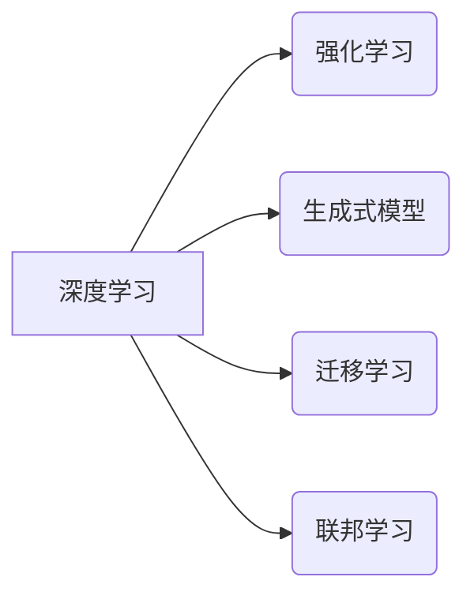

> 深度学习、强化学习、生成式模型、迁移学习、联邦学习、神经网络、自然语言处理、计算机视觉、机器人学

## 1. 背景介绍

人工智能（AI）技术近年来发展迅速，取得了令人瞩目的成就。从语音识别、图像识别到自然语言处理，AI已经渗透到我们生活的方方面面。这些进步离不开深度学习、强化学习等核心技术的不断发展。

深度学习算法的出现，为人工智能领域带来了革命性的变革。通过多层神经网络结构，深度学习模型能够自动从海量数据中学习特征，并实现对复杂问题的建模和解决。强化学习则通过奖励机制，训练智能体在环境中采取最优行动，从而实现目标。

## 2. 核心概念与联系

**2.1 深度学习**

深度学习是一种机器学习的子领域，它利用多层神经网络来模拟人类大脑的学习过程。深度学习模型能够自动从数据中学习特征，并进行复杂的模式识别和预测。

**2.2 强化学习**

强化学习是一种基于交互学习的机器学习方法。智能体通过与环境的交互，学习如何采取最优行动以获得最大奖励。强化学习算法广泛应用于机器人控制、游戏 AI、自动驾驶等领域。

**2.3 生成式模型**

生成式模型能够从已有的数据中学习数据分布，并生成新的数据样本。例如，GPT-3 是一种强大的文本生成模型，能够生成逼真的文本内容。

**2.4 迁移学习**

迁移学习是指将已训练好的模型参数应用于新的任务或领域。迁移学习能够有效降低模型训练成本和时间，并提高模型性能。

**2.5 联邦学习**

联邦学习是一种分布式机器学习方法，它允许在不共享原始数据的情况下，训练一个全局模型。联邦学习能够保护用户隐私，并促进数据共享。

**2.6  核心概念关系图**



## 3. 核心算法原理 & 具体操作步骤

### 3.1  算法原理概述

**3.1.1 深度学习算法原理**

深度学习算法的核心是多层神经网络结构。神经网络由多个层组成，每层包含多个神经元。每个神经元接收来自上一层的输入，并通过激活函数进行处理，输出到下一层。通过训练，神经网络能够学习到数据的特征表示，并实现对数据的分类、预测等任务。

**3.1.2 强化学习算法原理**

强化学习算法的核心是智能体与环境的交互过程。智能体在环境中采取行动，并根据环境的反馈获得奖励或惩罚。通过不断地学习和调整策略，智能体能够找到最优行动序列，以获得最大的总奖励。

### 3.2  算法步骤详解

**3.2.1 深度学习算法步骤**

1. **数据预处理:** 将原始数据进行清洗、转换和特征工程，使其适合深度学习模型的训练。
2. **模型构建:** 选择合适的深度学习模型架构，并定义模型参数。
3. **模型训练:** 使用训练数据训练深度学习模型，并通过反向传播算法更新模型参数。
4. **模型评估:** 使用测试数据评估模型的性能，并根据评估结果进行模型调优。
5. **模型部署:** 将训练好的模型部署到实际应用场景中。

**3.2.2 强化学习算法步骤**

1. **环境定义:** 定义强化学习环境，包括状态空间、动作空间、奖励函数等。
2. **策略选择:** 选择合适的策略算法，例如 Q 学习、SARSA 等。
3. **环境交互:** 智能体与环境交互，根据策略选择动作，并获得环境的反馈。
4. **策略更新:** 根据环境的反馈，更新策略参数，以提高智能体的策略性能。
5. **策略评估:** 使用测试环境评估策略的性能，并根据评估结果进行策略调优。

### 3.3  算法优缺点

**3.3.1 深度学习算法优缺点**

* **优点:** 能够自动学习特征，性能优异，适用于各种复杂任务。
* **缺点:** 需要大量数据进行训练，训练时间长，易受过拟合影响。

**3.3.2 强化学习算法优缺点**

* **优点:** 能够学习复杂的行为策略，适用于动态环境下的任务。
* **缺点:** 训练过程复杂，需要大量的试错和探索，收敛速度慢。

### 3.4  算法应用领域

**3.4.1 深度学习算法应用领域**

* **计算机视觉:** 图像识别、目标检测、图像分割、视频分析等。
* **自然语言处理:** 文本分类、情感分析、机器翻译、文本生成等。
* **语音识别:** 语音转文本、语音合成等。
* **推荐系统:** 商品推荐、内容推荐等。

**3.4.2 强化学习算法应用领域**

* **机器人控制:** 机器人导航、抓取、运动控制等。
* **游戏 AI:** 游戏策略制定、游戏角色控制等。
* **自动驾驶:** 车辆路径规划、避障、决策控制等。

## 4. 数学模型和公式 & 详细讲解 & 举例说明

### 4.1  数学模型构建

**4.1.1 深度学习模型数学模型**

深度学习模型的数学模型主要基于神经网络结构。神经网络由多个层组成，每层包含多个神经元。每个神经元接收来自上一层的输入，并通过激活函数进行处理，输出到下一层。

**4.1.2 强化学习模型数学模型**

强化学习模型的数学模型主要基于马尔可夫决策过程（MDP）。MDP 定义了一个状态空间、动作空间、转移概率和奖励函数。智能体在每个状态下选择一个动作，并根据转移概率进入下一个状态，并获得相应的奖励。

### 4.2  公式推导过程

**4.2.1 深度学习模型损失函数**

深度学习模型的训练目标是最小化模型预测值与真实值的误差。常用的损失函数包括均方误差（MSE）、交叉熵损失（Cross-Entropy Loss）等。

**4.2.2 强化学习模型价值函数**

强化学习模型的目标是最大化智能体在环境中获得的总奖励。价值函数用来评估智能体在某个状态下采取某个动作的长期价值。常用的价值函数包括状态价值函数（State-Value Function）、动作价值函数（Action-Value Function）等。

### 4.3  案例分析与讲解

**4.3.1 深度学习模型案例分析**

图像识别任务中，可以使用卷积神经网络（CNN）模型进行训练。CNN 模型能够自动学习图像特征，并实现对图像的分类、检测等任务。

**4.3.2 强化学习模型案例分析**

自动驾驶任务中，可以使用强化学习算法训练智能驾驶系统。智能驾驶系统需要学习如何根据环境信息做出最优驾驶决策，以实现安全、高效的驾驶。

## 5. 项目实践：代码实例和详细解释说明

### 5.1  开发环境搭建

**5.1.1 软件环境:**

* Python 3.x
* TensorFlow 或 PyTorch 深度学习框架
* NumPy 科学计算库
* Matplotlib 数据可视化库

**5.1.2 硬件环境:**

* GPU 加速器 (可选)

### 5.2  源代码详细实现

**5.2.1 深度学习模型代码示例 (TensorFlow)**

```python
import tensorflow as tf

# 定义模型结构
model = tf.keras.models.Sequential([
    tf.keras.layers.Conv2D(32, (3, 3), activation='relu', input_shape=(28, 28, 1)),
    tf.keras.layers.MaxPooling2D((2, 2)),
    tf.keras.layers.Conv2D(64, (3, 3), activation='relu'),
    tf.keras.layers.MaxPooling2D((2, 2)),
    tf.keras.layers.Flatten(),
    tf.keras.layers.Dense(10, activation='softmax')
])

# 定义损失函数和优化器
model.compile(loss='sparse_categorical_crossentropy',
              optimizer='adam',
              metrics=['accuracy'])

# 训练模型
model.fit(x_train, y_train, epochs=10)

# 评估模型
loss, accuracy = model.evaluate(x_test, y_test)
print('Test loss:', loss)
print('Test accuracy:', accuracy)
```

**5.2.2 强化学习模型代码示例 (OpenAI Gym)**

```python
import gym

# 创建环境
env = gym.make('CartPole-v1')

# 定义策略
def policy(state):
    # 根据状态选择动作
    return 0 if state[2] < 0 else 1

# 训练智能体
for episode in range(100):
    state = env.reset()
    done = False
    while not done:
        action = policy(state)
        next_state, reward, done, _ = env.step(action)
        env.render()
        state = next_state

env.close()
```

### 5.3  代码解读与分析

**5.3.1 深度学习模型代码解读**

* 代码定义了一个简单的卷积神经网络模型，用于图像分类任务。
* 模型包含卷积层、池化层和全连接层。
* 模型使用均方误差损失函数和 Adam 优化器进行训练。

**5.3.2 强化学习模型代码解读**

* 代码使用 OpenAI Gym 库创建了一个 CartPole 环境。
* 智能体使用一个简单的策略，根据状态选择动作。
* 智能体在环境中进行交互，并根据奖励进行策略更新。

### 5.4  运行结果展示

**5.4.1 深度学习模型运行结果**

训练完成后，模型能够对图像进行分类，并输出分类结果的概率分布。

**5.4.2 强化学习模型运行结果**

训练完成后，智能体能够在 CartPole 环境中保持平衡，并获得较高的奖励。

## 6. 实际应用场景

### 6.1  深度学习在医疗领域的应用

* **疾病诊断:** 利用深度学习模型分析医学影像数据，辅助医生诊断疾病。
* **药物研发:** 利用深度学习模型预测药物的活性，加速药物研发过程。
* **个性化医疗:** 利用深度学习模型分析患者的基因信息和生活习惯，提供个性化的医疗方案。

### 6.2  强化学习在机器人领域的应用

* **机器人导航:** 利用强化学习算法训练机器人自主导航，避开障碍物，到达目标位置。
* **机器人抓取:** 利用强化学习算法训练机器人学习抓取不同形状和大小的物体。
* **机器人协作:** 利用强化学习算法训练多个机器人协作完成复杂任务。

### 6.3  其他应用场景

* **自然语言处理:** 机器翻译、文本摘要、对话系统等。
* **推荐系统:** 商品推荐、内容推荐等。
* **金融领域:** 风险评估、欺诈检测等。

### 6.4  未来应用展望

随着人工智能技术的不断发展，深度学习和强化学习将在更多领域得到应用，例如：

* **自动驾驶:** 实现完全自动驾驶汽车。
* **医疗保健:** 提供更精准、个性化的医疗服务。
* **教育:** 提供个性化的学习体验。
* **科学研究:** 加速科学发现和技术创新。

## 7. 工具和资源推荐

### 7.1  学习资源推荐

* **在线课程:** Coursera、edX、Udacity 等平台提供深度学习和强化学习相关的在线课程。
* **书籍:** 《深度学习》、《强化学习：原理、算法和应用》等书籍。
* **博客和论坛:** TensorFlow、PyTorch 等深度学习框架的官方博客和论坛。

### 7.2  开发工具推荐

* **深度学习框架:** TensorFlow、PyTorch、Keras 等。
* **数据处理工具:** Pandas、NumPy 等。
* **可视化工具:** Matplotlib