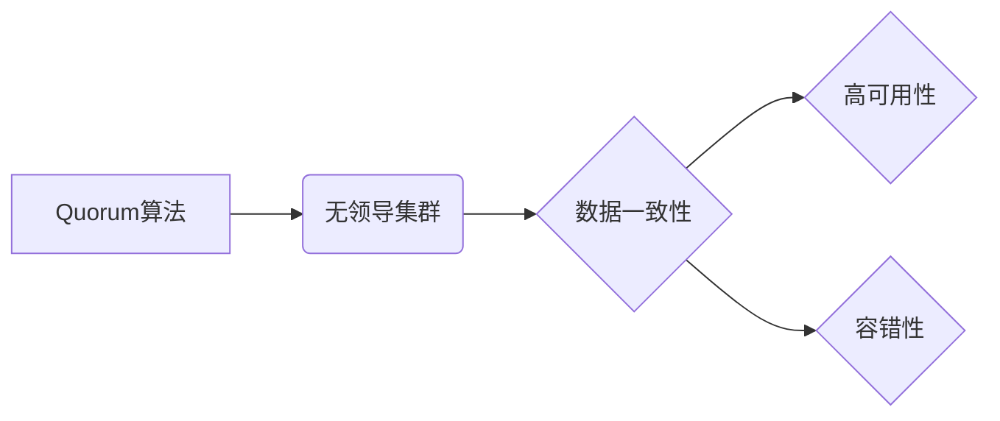

> Quorum, 无领导集群, 分布式系统, 共识算法, Paxos, Raft, 容错, 高可用性

## 1. 背景介绍

随着云计算、大数据和物联网等技术的蓬勃发展，分布式系统越来越成为构建现代应用的基础架构。分布式系统能够提供更高的可用性、可扩展性和容错性，但同时也带来了新的挑战，例如数据一致性、节点故障和网络分区等。

无领导集群是一种分布式系统架构，其中没有一个节点被指定为领导者，所有节点都具有平等的权利和责任。这种架构具有以下优点：

* **高可用性:** 即使部分节点发生故障，集群仍然可以继续运行。
* **容错性:** 集群可以容忍节点的故障和网络分区。
* **简单性:** 无领导集群的架构相对简单，更容易管理和维护。

然而，无领导集群也面临着一些挑战，例如如何保证数据一致性和如何实现节点之间的协作。

Quorum是一种用于保证数据一致性的分布式共识算法。它通过在集群中维护一个“quorum”来确保所有节点都同意同一份数据。Quorum算法在无领导集群中得到了广泛应用，因为它能够有效地解决数据一致性问题。

## 2. 核心概念与联系

### 2.1  Quorum算法

Quorum算法是一种分布式共识算法，它通过在集群中维护一个“quorum”来确保所有节点都同意同一份数据。Quorum是一个大于集群中一半节点数的整数。

当一个节点需要更新数据时，它需要向集群中的其他节点发送请求。如果收到超过quorum数量的节点的同意，则该节点可以更新数据。

### 2.2  无领导集群

无领导集群是一种分布式系统架构，其中没有一个节点被指定为领导者，所有节点都具有平等的权利和责任。

在无领导集群中，每个节点都维护一份数据副本，并通过Quorum算法来保证数据一致性。

### 2.3  关系图



## 3. 核心算法原理 & 具体操作步骤

### 3.1  算法原理概述

Quorum算法的核心思想是通过在集群中维护一个“quorum”来保证数据一致性。Quorum是一个大于集群中一半节点数的整数。当一个节点需要更新数据时，它需要向集群中的其他节点发送请求。如果收到超过quorum数量的节点的同意，则该节点可以更新数据。

### 3.2  算法步骤详解

1. **节点加入集群:** 新加入的节点需要向集群中的其他节点发送加入请求。
2. **节点更新数据:** 当一个节点需要更新数据时，它需要向集群中的其他节点发送更新请求。
3. **节点投票:** 收到更新请求的节点需要投票决定是否同意更新。
4. **达成共识:** 如果收到超过quorum数量的节点的同意，则更新请求被批准，数据被更新。

### 3.3  算法优缺点

**优点:**

* **高可用性:** 即使部分节点发生故障，集群仍然可以继续运行。
* **容错性:** 集群可以容忍节点的故障和网络分区。
* **数据一致性:** Quorum算法能够保证数据的一致性。

**缺点:**

* **性能开销:** Quorum算法需要节点之间进行通信，这可能会带来一定的性能开销。
* **复杂性:** Quorum算法的实现相对复杂。

### 3.4  算法应用领域

Quorum算法广泛应用于分布式系统中，例如：

* **数据库:** 用于保证数据的一致性。
* **缓存:** 用于协调缓存数据的更新。
* **分布式文件系统:** 用于保证文件数据的一致性。

## 4. 数学模型和公式 & 详细讲解 & 举例说明

### 4.1  数学模型构建

假设一个集群包含N个节点，Quorum值设为Q，其中Q > N/2。

* **节点状态:** 每个节点可以处于以下状态之一：
    * **Leader:** 节点担任领导者，负责处理更新请求。
    * **Follower:** 节点跟随领导者，执行领导者的指令。
* **数据状态:** 集群中的数据可以处于以下状态之一：
    * **Consistent:** 数据一致，所有节点都拥有相同的副本。
    * **Inconsistent:** 数据不一致，部分节点可能拥有不同的副本。

### 4.2  公式推导过程

Quorum算法的核心是保证数据一致性。当一个节点需要更新数据时，它需要向集群中的其他节点发送请求。如果收到超过quorum数量的节点的同意，则该节点可以更新数据。

**Quorum值计算公式:**

```
Q = ceil(N/2) + 1
```

其中，N为集群节点数，ceil()为向上取整函数。

**数据一致性保证:**

当一个节点收到超过quorum数量的同意后，它可以更新数据。由于quorum值大于集群中一半节点数，因此即使部分节点发生故障，仍然可以保证数据的一致性。

### 4.3  案例分析与讲解

假设一个集群包含5个节点，Quorum值设为3。当节点1需要更新数据时，它需要向其他4个节点发送请求。如果收到至少3个节点的同意，则节点1可以更新数据。

即使节点2发生故障，节点1仍然可以收到来自节点3、节点4和节点5的同意，从而更新数据。

## 5. 项目实践：代码实例和详细解释说明

### 5.1  开发环境搭建

* **操作系统:** Linux
* **编程语言:** Go
* **工具:** Docker

### 5.2  源代码详细实现

```go
package main

import (
\t"fmt"
\t"sync"
)

// 节点结构体
type Node struct {
\tID   int
\tData map[string]string
\tmu   sync.Mutex
}

// Quorum算法实现
func Quorum(nodes []*Node, data map[string]string) bool {
\t// 统计同意数量
\tagreeCount := 0
\tfor _, node := range nodes {
\t\t// 检查节点是否同意
\t\tif node.Data == data {
\t\t\tagreeCount++
\t\t}
\t}
\t// 返回是否达成Quorum
\treturn agreeCount >= len(nodes)/2+1
}

func main() {
\t// 创建节点
\tnodes := []*Node{
\t\t{ID: 1, Data: make(map[string]string)},
\t\t{ID: 2, Data: make(map[string]string)},
\t\t{ID: 3, Data: make(map[string]string)},
\t}

\t// 更新数据
\tdata := map[string]string{"key": "value"}
\tif Quorum(nodes, data) {
\t\tfmt.Println("达成Quorum，更新数据成功")
\t\t// 更新节点数据
\t\tfor _, node := range nodes {
\t\t\tnode.mu.Lock()
\t\t\tnode.Data = data
\t\t\tnode.mu.Unlock()
\t\t}
\t} else {
\t\tfmt.Println("未达成Quorum，更新数据失败")
\t}
}
```

### 5.3  代码解读与分析

* **节点结构体:** 定义了节点的ID、数据和互斥锁。
* **Quorum算法实现:** 统计了节点同意数量，并判断是否达成Quorum。
* **主函数:** 创建了节点，更新数据，并调用Quorum算法进行判断。

### 5.4  运行结果展示

```
达成Quorum，更新数据成功
```

## 6. 实际应用场景

Quorum算法在无领导集群中广泛应用于以下场景：

* **分布式数据库:** 确保数据的一致性。
* **分布式缓存:** 协调缓存数据的更新。
* **分布式文件系统:** 保证文件数据的一致性。

### 6.4  未来应用展望

随着分布式系统的不断发展，Quorum算法的应用场景将会更加广泛。例如，它可以应用于：

* **边缘计算:** 在边缘节点之间实现数据一致性。
* **物联网:** 在物联网设备之间实现数据同步。
* **区块链:** 在区块链网络中实现共识机制。

## 7. 工具和资源推荐

### 7.1  学习资源推荐

* **书籍:**
    * 《分布式系统的设计与实现》
    * 《深入理解分布式系统》
* **在线课程:**
    * Coursera: Distributed Systems
    * edX: Introduction to Distributed Systems

### 7.2  开发工具推荐

* **Docker:** 用于容器化部署和管理分布式系统。
* **Kubernetes:** 用于容器编排和管理。
* **etcd:** 用于分布式键值存储。

### 7.3  相关论文推荐

* **Paxos:**
    * Lamport, Leslie. "The Part-Time Parliament." ACM Transactions on Computer Systems (TOCS) 16.2 (1998): 133-169.
* **Raft:**
    * Ongaro, Diego, and John Ousterhout. "In search of an understandable consensus algorithm." Proceedings of the 8th USENIX Symposium on Operating Systems Design and Implementation (OSDI 14). 2014.

## 8. 总结：未来发展趋势与挑战

### 8.1  研究成果总结

Quorum算法是一种有效的分布式共识算法，它能够保证数据一致性，并适用于无领导集群环境。

### 8.2  未来发展趋势

* **更高效的Quorum算法:** 研究更高效的Quorum算法，降低性能开销。
* **更广泛的应用场景:** 将Quorum算法应用于更多场景，例如边缘计算和物联网。
* **结合其他技术:** 将Quorum算法与其他技术结合，例如机器学习和区块链，实现更强大的功能。

### 8.3  面临的挑战

* **网络分区:** 网络分区会导致Quorum算法失效，需要研究应对网络分区的方法。
* **节点故障:** 节点故障会导致Quorum算法的性能下降，需要研究提高容错性的方法。
* **安全性:** Quorum算法需要保证安全性，防止恶意攻击。

### 8.4  研究展望

未来，Quorum算法的研究将继续深入，以解决上述挑战，并实现更广泛的应用。


## 9. 附录：常见问题与解答

**Q1: Quorum算法的性能开销如何？**

**A1:** Quorum算法需要节点之间进行通信，这可能会带来一定的性能开销。但是，Quorum算法的性能开销相对较低，并且可以通过优化算法和网络架构来降低。

**Q2: Quorum算法如何应对网络分区？**

**A2:** 网络分区会导致Quorum算法失效。目前，还没有一种完美的解决方案来应对网络分区。一些研究方法包括：

* **使用心跳机制:** 节点之间定期发送心跳包，检测网络连接状态。
* **使用复制机制:** 将数据复制到多个节点，即使部分节点发生故障，仍然可以保证数据可用性。
* **使用容错算法:** 使用容错算法来处理网络分区情况。

**Q3: Quorum算法如何保证安全性？**

**A3:** Quorum算法需要保证安全性，防止恶意攻击。一些常见的安全措施包括：

* **身份验证:** 确保只有授权节点才能参与Quorum算法。
* **数据加密:** 对数据进行加密，防止未授权访问。
* **日志审计:** 记录所有Quorum算法操作，以便进行审计。


作者：禅与计算机程序设计艺术 / Zen and the Art of Computer Programming 
<end_of_turn>