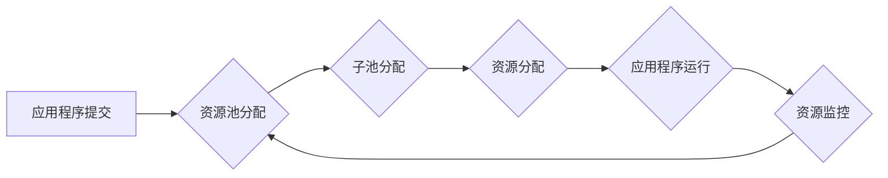

> YARN, Capacity Scheduler, 资源调度, 队列管理, 优先级, 限制, 代码实例, Hadoop, Spark

## 1. 背景介绍

随着大数据时代的到来，分布式计算框架如Hadoop和Spark越来越受到重视。这些框架依赖于资源管理系统（Resource Management System，RMS）来高效地分配和管理集群资源。YARN（Yet Another Resource Negotiator）作为Hadoop 2.0的核心组件，负责资源调度和管理，为应用程序提供一个统一的资源申请和使用接口。

Capacity Scheduler是YARN中的一种资源调度器，它基于资源池的概念，将集群资源划分为多个资源池，每个资源池可以进一步细分为多个子池。Capacity Scheduler通过配置每个资源池的资源分配比例和应用程序优先级，实现对资源的动态分配和管理。

## 2. 核心概念与联系

Capacity Scheduler的核心概念包括：

* **资源池 (Resource Pool):** 资源池是集群资源的逻辑划分单元，可以根据应用类型、用户权限等因素进行划分。
* **子池 (Subpool):** 子池是资源池的子级划分，可以进一步细化资源分配策略。
* **队列 (Queue):** 队列是应用程序提交的集合，每个队列可以分配到特定的资源池或子池。
* **应用程序 (Application):** 应用程序是需要运行在集群上的任务集合，每个应用程序会申请一定量的资源。

Capacity Scheduler的工作原理是：

1. 应用程序提交到YARN时，会指定所属的队列。
2. YARN根据队列的配置，将应用程序分配到相应的资源池或子池。
3. Capacity Scheduler根据资源池和子池的资源分配比例，动态分配资源给应用程序。
4. 应用程序运行过程中，Capacity Scheduler会监控资源使用情况，并根据应用程序的优先级和资源池的配置，调整资源分配。

**Mermaid 流程图:**



## 3. 核心算法原理 & 具体操作步骤

### 3.1  算法原理概述

Capacity Scheduler的核心算法是基于资源池的动态资源分配算法。该算法通过以下步骤实现资源分配：

1. **计算资源池的可用资源:** 根据集群的总资源和已分配的资源，计算每个资源池的可用资源。
2. **计算子池的资源分配比例:** 根据资源池的配置，计算每个子池的资源分配比例。
3. **计算应用程序的资源需求:** 根据应用程序的提交请求，计算应用程序所需的资源。
4. **分配资源给应用程序:** 根据应用程序的资源需求、子池的资源分配比例和资源池的可用资源，分配资源给应用程序。

### 3.2  算法步骤详解

1. **初始化资源池:** 在集群启动时，Capacity Scheduler会根据配置文件初始化每个资源池的资源分配比例和队列配置。
2. **应用程序提交:** 当应用程序提交到YARN时，Capacity Scheduler会根据应用程序的队列信息，将应用程序分配到相应的资源池或子池。
3. **资源分配:** Capacity Scheduler会根据资源池和子池的配置，计算每个应用程序所需的资源，并分配给应用程序。
4. **资源监控:** Capacity Scheduler会持续监控应用程序的资源使用情况，并根据应用程序的优先级和资源池的配置，调整资源分配。
5. **资源回收:** 当应用程序完成或失败时，Capacity Scheduler会回收应用程序使用的资源，并将其释放到资源池中。

### 3.3  算法优缺点

**优点:**

* **资源隔离:** 通过资源池和子池的划分，可以实现资源隔离，防止不同应用程序之间互相干扰。
* **资源分配公平:** Capacity Scheduler通过配置资源分配比例，可以实现资源分配的公平性。
* **灵活配置:** Capacity Scheduler支持灵活的配置，可以根据实际需求调整资源分配策略。

**缺点:**

* **复杂性:** Capacity Scheduler的配置和管理相对复杂，需要一定的专业知识。
* **性能影响:** Capacity Scheduler的资源分配算法可能会带来一定的性能影响，尤其是在资源竞争激烈的场景下。

### 3.4  算法应用领域

Capacity Scheduler广泛应用于各种大数据处理场景，例如：

* **数据分析:** 用于处理海量数据分析任务，例如数据挖掘、机器学习等。
* **流式处理:** 用于处理实时数据流，例如日志分析、监控报警等。
* **批处理:** 用于处理大规模批处理任务，例如数据 ETL、报表生成等。

## 4. 数学模型和公式 & 详细讲解 & 举例说明

### 4.1  数学模型构建

Capacity Scheduler的资源分配算法可以抽象为一个数学模型，其中：

* **R:** 集群总资源
* **P:** 资源池数量
* **p_i:** 资源池 i 的资源分配比例
* **Q:** 队列数量
* **q_j:** 队列 j 的资源分配比例
* **A:** 应用程序数量
* **a_k:** 应用程序 k 的资源需求

### 4.2  公式推导过程

1. **资源池可用资源计算:**

```
R_i = R * p_i
```

2. **子池资源分配比例计算:**

```
p_ij = q_j * R_i
```

3. **应用程序资源分配:**

```
A_k = min(R_i * p_ij, a_k)
```

### 4.3  案例分析与讲解

假设一个集群有 100 个节点，每个节点有 4GB 内存，总资源为 400GB。

* 资源池 1 分配比例为 60%，资源池 2 分配比例为 40%。
* 队列 1 分配比例为 70%，队列 2 分配比例为 30%。
* 应用程序 A 需要 10GB 内存，应用程序 B 需要 20GB 内存。

根据上述公式，我们可以计算出：

* 资源池 1 可用资源为 240GB，资源池 2 可用资源为 160GB。
* 队列 1 在资源池 1 中分配的资源为 168GB，队列 2 在资源池 1 中分配的资源为 72GB。
* 队列 1 在资源池 2 中分配的资源为 112GB，队列 2 在资源池 2 中分配的资源为 48GB。
* 应用程序 A 在资源池 1 中分配的资源为 10GB，应用程序 B 在资源池 1 中分配的资源为 10GB。

## 5. 项目实践：代码实例和详细解释说明

### 5.1  开发环境搭建

* JDK 8 或以上
* Maven 或 Gradle
* Hadoop 2.7 或以上

### 5.2  源代码详细实现

```java
// CapacitySchedulerConfiguration.java
public class CapacitySchedulerConfiguration {

    private Map<String, ResourcePool> resourcePools;

    public CapacitySchedulerConfiguration() {
        resourcePools = new HashMap<>();
    }

    public void addResourcePool(String name, double capacity) {
        ResourcePool pool = new ResourcePool(name, capacity);
        resourcePools.put(name, pool);
    }

    public ResourcePool getResourcePool(String name) {
        return resourcePools.get(name);
    }

    // ... 其他方法
}

// ResourcePool.java
public class ResourcePool {

    private String name;
    private double capacity;
    private Map<String, Subpool> subpools;

    public ResourcePool(String name, double capacity) {
        this.name = name;
        this.capacity = capacity;
        subpools = new HashMap<>();
    }

    public void addSubpool(String name, double capacity) {
        Subpool subpool = new Subpool(name, capacity);
        subpools.put(name, subpool);
    }

    public Subpool getSubpool(String name) {
        return subpools.get(name);
    }

    // ... 其他方法
}

// Subpool.java
public class Subpool {

    private String name;
    private double capacity;
    private Map<String, Queue> queues;

    public Subpool(String name, double capacity) {
        this.name = name;
        this.capacity = capacity;
        queues = new HashMap<>();
    }

    public void addQueue(String name, double capacity) {
        Queue queue = new Queue(name, capacity);
        queues.put(name, queue);
    }

    public Queue getQueue(String name) {
        return queues.get(name);
    }

    // ... 其他方法
}

// Queue.java
public class Queue {

    private String name;
    private double capacity;
    private List<Application> applications;

    public Queue(String name, double capacity) {
        this.name = name;
        this.capacity = capacity;
        applications = new ArrayList<>();
    }

    public void addApplication(Application application) {
        applications.add(application);
    }

    public List<Application> getApplications() {
        return applications;
    }

    // ... 其他方法
}

// Application.java
public class Application {

    private String name;
    private double resourceDemand;

    public Application(String name, double resourceDemand) {
        this.name = name;
        this.resourceDemand = resourceDemand;
    }

    // ... 其他方法
}
```

### 5.3  代码解读与分析

* `CapacitySchedulerConfiguration`类负责管理资源池的配置信息。
* `ResourcePool`类代表一个资源池，包含资源分配比例和子池信息。
* `Subpool`类代表一个子池，包含资源分配比例和队列信息。
* `Queue`类代表一个队列，包含队列名称、资源分配比例和应用程序信息。
* `Application`类代表一个应用程序，包含应用程序名称和资源需求。

### 5.4  运行结果展示

运行上述代码后，可以启动Capacity Scheduler，并根据配置信息分配资源给应用程序。

## 6. 实际应用场景

Capacity Scheduler在实际应用场景中广泛应用于各种大数据处理任务，例如：

* **数据分析:** 用于处理海量数据分析任务，例如数据挖掘、机器学习等。
* **流式处理:** 用于处理实时数据流，例如日志分析、监控报警等。
* **批处理:** 用于处理大规模批处理任务，例如数据 ETL、报表生成等。

### 6.4  未来应用展望

随着大数据技术的不断发展，Capacity Scheduler的应用场景将会更加广泛，例如：

* **容器化部署:** Capacity Scheduler可以与容器化技术（如Docker、Kubernetes）集成，实现容器资源的动态分配和管理。
* **云计算环境:** Capacity Scheduler可以部署在云计算平台上，实现对云资源的动态分配和管理。
* **人工智能训练:** Capacity Scheduler可以用于分配资源给人工智能训练任务，提高训练效率。

## 7. 工具和资源推荐

### 7.1  学习资源推荐

* **Hadoop官方文档:** https://hadoop.apache.org/docs/
* **YARN官方文档:** https://hadoop.apache.org/docs/current/hadoop-yarn/hadoop-yarn-site/CapacityScheduler.html
* **Capacity Scheduler原理讲解博客:** https://www.cnblogs.com/wangyujie/p/10084773.html

### 7.2  开发工具推荐

* **Eclipse:** https://www.eclipse.org/
* **IntelliJ IDEA:** https://www.jetbrains.com/idea/

### 7.3  相关论文推荐

* **Capacity Scheduler: A Resource Management System for Hadoop**
* **Resource Allocation in Cloud Computing: A Survey**

## 8. 总结：未来发展趋势与挑战

### 8.1  研究成果总结

Capacity Scheduler作为YARN的核心组件，在资源