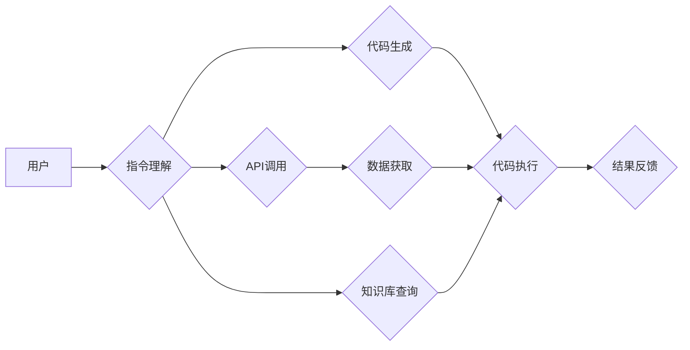

> MetaGPT, AI Agent, 大模型应用, 编程, 代码生成, 语言模型, 知识蒸馏, 

## 1. 背景介绍

近年来，大语言模型（LLM）在自然语言处理领域取得了显著进展，例如GPT-3、LaMDA等模型展现出强大的文本生成、翻译、问答等能力。然而，这些模型通常缺乏与外部世界交互的能力，无法直接执行用户指令或完成实际任务。为了解决这一问题，MetaGPT应运而生。

MetaGPT是一种基于大语言模型的AI Agent，它能够理解用户指令，并通过调用外部API或执行代码来完成任务。MetaGPT的核心思想是将大语言模型与程序执行能力相结合，从而赋予AI Agent更强的智能和实用性。

## 2. 核心概念与联系

MetaGPT的核心概念包括：

* **大语言模型（LLM）：** 作为MetaGPT的基础，LLM负责理解用户指令、生成文本和进行知识推理。
* **代码生成器：** MetaGPT可以根据用户指令生成相应的代码，并将其执行以完成任务。
* **API调用：** MetaGPT可以调用外部API获取数据或执行特定功能，例如查询天气、获取新闻等。
* **知识库：** MetaGPT可以连接到知识库，获取相关信息并进行知识推理。

**MetaGPT架构图**



## 3. 核心算法原理 & 具体操作步骤

### 3.1  算法原理概述

MetaGPT的核心算法原理是基于**知识蒸馏**和**强化学习**。

* **知识蒸馏:** 将大型语言模型的知识迁移到更小的模型中，提高模型的效率和可部署性。
* **强化学习:** 通过奖励机制训练模型，使其能够更好地理解用户指令并完成任务。

### 3.2  算法步骤详解

1. **用户输入指令:** 用户向MetaGPT输入指令，例如“查询今天的天气”或“写一个Python程序计算两个数的和”。
2. **指令理解:** MetaGPT使用LLM对用户指令进行理解，识别出指令的意图和所需信息。
3. **代码生成:** 根据指令内容，MetaGPT使用代码生成器生成相应的代码。
4. **代码执行:** MetaGPT执行生成的代码，并获取结果。
5. **结果反馈:** MetaGPT将结果反馈给用户。

### 3.3  算法优缺点

**优点:**

* **强大的功能:** MetaGPT能够理解自然语言指令，并执行各种任务，例如代码生成、数据查询、文本处理等。
* **可扩展性强:** MetaGPT可以连接到各种外部API和知识库，扩展其功能和知识范围。
* **易于使用:** 用户无需编写代码，即可使用自然语言与MetaGPT交互。

**缺点:**

* **安全性问题:** MetaGPT执行用户代码时存在安全风险，需要采取措施防止恶意代码的执行。
* **准确性问题:** MetaGPT的代码生成和任务执行可能存在错误，需要不断改进算法和训练数据。
* **资源消耗:** MetaGPT的训练和运行需要大量的计算资源。

### 3.4  算法应用领域

MetaGPT在以下领域具有广泛的应用前景：

* **软件开发:** 自动生成代码、辅助程序员编写代码、测试代码等。
* **数据分析:** 自动生成数据分析脚本、提取数据 insights 等。
* **自动化办公:** 自动化日常办公任务，例如发送邮件、安排会议等。
* **教育:** 提供个性化学习辅导、自动批改作业等。

## 4. 数学模型和公式 & 详细讲解 & 举例说明

### 4.1  数学模型构建

MetaGPT的数学模型主要基于Transformer架构，并结合了强化学习算法。

* **Transformer:** Transformer是一种基于注意力机制的神经网络架构，能够有效处理序列数据，例如文本。
* **强化学习:** 强化学习算法通过奖励机制训练模型，使其能够学习最优的行为策略。

### 4.2  公式推导过程

MetaGPT的训练过程涉及到以下公式：

* **损失函数:** 用于衡量模型预测结果与真实值的差异。
* **奖励函数:** 用于评估模型执行任务的质量。
* **策略梯度:** 用于更新模型参数，使其能够最大化奖励。

这些公式的推导过程较为复杂，涉及到概率论、统计学和机器学习等多个领域。

### 4.3  案例分析与讲解

假设用户输入指令“写一个Python程序计算两个数的和”。MetaGPT会使用以下步骤完成任务：

1. **指令理解:** MetaGPT使用LLM识别出指令的意图是“计算两个数的和”。
2. **代码生成:** MetaGPT使用代码生成器生成以下Python代码：

```python
def sum_two_numbers(a, b):
  return a + b

# 获取用户输入的两个数
num1 = float(input("请输入第一个数: "))
num2 = float(input("请输入第二个数: "))

# 计算两个数的和
result = sum_two_numbers(num1, num2)

# 打印结果
print("两个数的和为:", result)
```

3. **代码执行:** MetaGPT执行生成的代码，并获取用户输入的两个数，计算其和并打印结果。

## 5. 项目实践：代码实例和详细解释说明

### 5.1  开发环境搭建

MetaGPT的开发环境需要包含以下软件：

* Python 3.x
* TensorFlow 或 PyTorch
* Jupyter Notebook

### 5.2  源代码详细实现

MetaGPT的源代码实现较为复杂，涉及到多个模块和文件。

* **指令理解模块:** 使用LLM对用户指令进行理解。
* **代码生成模块:** 使用代码生成器根据指令生成代码。
* **代码执行模块:** 执行生成的代码并获取结果。
* **API调用模块:** 调用外部API获取数据。
* **知识库查询模块:** 查询知识库获取相关信息。

### 5.3  代码解读与分析

MetaGPT的代码实现主要基于Transformer架构和强化学习算法。

* **Transformer:** 用于处理用户指令和代码生成。
* **强化学习:** 用于训练模型，使其能够更好地理解指令和完成任务。

### 5.4  运行结果展示

MetaGPT的运行结果展示可以包括以下内容：

* **指令理解结果:** 显示模型对用户指令的理解结果。
* **代码生成结果:** 显示模型生成的代码。
* **代码执行结果:** 显示代码执行的结果。

## 6. 实际应用场景

### 6.1  代码生成辅助

MetaGPT可以帮助程序员快速生成代码，例如生成函数、类、接口等，提高开发效率。

### 6.2  自动化测试

MetaGPT可以根据代码生成测试用例，自动执行测试，提高软件测试效率。

### 6.3  数据分析

MetaGPT可以根据用户指令生成数据分析脚本，自动分析数据，提取数据 insights。

### 6.4  未来应用展望

MetaGPT在未来将有更广泛的应用场景，例如：

* **个性化教育:** 提供个性化学习辅导，自动批改作业。
* **智能客服:** 自动回答用户问题，提供智能客服服务。
* **创意写作:** 辅助作家创作小说、诗歌等创意作品。

## 7. 工具和资源推荐

### 7.1  学习资源推荐

* **论文:**

* **书籍:**

* **在线课程:**

### 7.2  开发工具推荐

* **Python:**

* **TensorFlow:**

* **PyTorch:**

### 7.3  相关论文推荐

* **Attention Is All You Need:** https://arxiv.org/abs/1706.03762
* **BERT: Pre-training of Deep Bidirectional Transformers for Language Understanding:** https://arxiv.org/abs/1810.04805

## 8. 总结：未来发展趋势与挑战

### 8.1  研究成果总结

MetaGPT是一种基于大语言模型的AI Agent，它能够理解用户指令，并通过调用外部API或执行代码来完成任务。MetaGPT的开发取得了显著进展，并在代码生成、数据分析、自动化办公等领域具有广泛的应用前景。

### 8.2  未来发展趋势

MetaGPT的未来发展趋势包括：

* **模型规模和能力提升:** 训练更大规模的模型，提高模型的理解能力和任务完成能力。
* **多模态交互:** 支持多模态交互，例如文本、图像、音频等。
* **个性化定制:** 提供个性化定制服务，满足不同用户的需求。

### 8.3  面临的挑战

MetaGPT的发展也面临着一些挑战：

* **安全性问题:** MetaGPT执行用户代码时存在安全风险，需要采取措施防止恶意代码的执行。
* **准确性问题:** MetaGPT的代码生成和任务执行可能存在错误，需要不断改进算法和训练数据。
* **资源消耗:** MetaGPT的训练和运行需要大量的计算资源。

### 8.4  研究展望

未来，MetaGPT的研究将继续深入，探索更强大的AI Agent模型，并将其应用于更多领域，为人类社会带来更多便利。

## 9. 附录：常见问题与解答

* **Q1: MetaGPT与其他AI Agent有什么区别？**

* **A1:** MetaGPT与其他AI Agent的主要区别在于它能够理解自然语言指令，并通过调用外部API或执行代码来完成任务。

* **Q2: MetaGPT的安全性如何保证？**

* **A2:** MetaGPT的安全性通过以下措施来保证：

* **代码沙盒:** 将用户代码运行在隔离的环境中，防止恶意代码对系统造成损害。
* **代码审核:** 对用户提交的代码进行审核，过滤掉潜在的恶意代码。
* **安全更新:** 定期发布安全更新，修复已知的漏洞。

* **Q3: MetaGPT的训练数据是什么？**

* **A3:** MetaGPT的训练数据包括大量的文本数据和代码数据，来自互联网、开源项目等多种来源。

* **Q4: 如何使用MetaGPT？**

* **A4:** MetaGPT可以通过API或Web界面进行使用。

* **Q5: MetaGPT的未来发展方向是什么？**

* **A5:** MetaGPT的未来发展方向包括模型规模和能力提升、多模态交互、个性化定制等。


作者：禅与计算机程序设计艺术 / Zen and the Art of Computer Programming 
<end_of_turn>