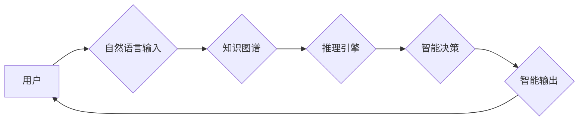

> 软件 2.0, 人工智能, 机器学习, 深度学习, 自然语言处理, 认知计算, 知识图谱

## 1. 背景介绍

软件已经深刻地改变了我们的生活，从我们使用的智能手机到复杂的金融交易系统，无处不在。然而，现有的软件大多基于传统的编程模式，依赖于人类明确的指令和规则。随着人工智能技术的飞速发展，我们正站在一个新的软件革命的边缘。

软件 2.0，也称为智能软件，将利用人工智能技术，赋予软件更强的学习、适应和推理能力。它不再仅仅是执行预先定义的任务，而是能够理解上下文、学习新知识、自主决策，甚至能够像人类一样进行创造性思考。

## 2. 核心概念与联系

**2.1 软件 1.0 与软件 2.0 的区别**

| 特征 | 软件 1.0 | 软件 2.0 |
|---|---|---|
| **编程方式** | 基于明确指令和规则 | 基于机器学习和深度学习 |
| **知识表示** | 静态数据和规则 | 动态知识图谱和推理引擎 |
| **学习能力** | 缺乏学习能力 | 具备学习和适应能力 |
| **决策能力** | 依赖预先定义的规则 | 能够自主决策和推理 |
| **交互方式** | 人机交互 | 人机协作和自然语言交互 |

**2.2 软件 2.0 的关键技术**

* **机器学习 (Machine Learning)**：通过算法从数据中学习模式和规律，从而进行预测和决策。
* **深度学习 (Deep Learning)**：一种更高级的机器学习方法，利用多层神经网络模拟人类大脑的学习过程。
* **自然语言处理 (Natural Language Processing)**：使计算机能够理解和处理人类语言。
* **认知计算 (Cognitive Computing)**：模拟人类认知能力，例如推理、决策和学习。
* **知识图谱 (Knowledge Graph)**：一种结构化的知识表示形式，可以存储和推理各种知识。

**2.3 软件 2.0 的架构**



## 3. 核心算法原理 & 具体操作步骤

### 3.1  算法原理概述

深度学习算法的核心是多层神经网络。神经网络由许多相互连接的神经元组成，每个神经元接收来自其他神经元的输入，并根据权重进行计算，最终输出一个信号。通过训练，神经网络可以学习到输入和输出之间的映射关系。

### 3.2  算法步骤详解

1. **数据预处理**: 将原始数据转换为深度学习算法可以理解的形式，例如归一化、编码等。
2. **网络结构设计**: 根据任务需求设计神经网络的结构，包括层数、神经元数量、激活函数等。
3. **参数初始化**: 为神经网络中的权重和偏置赋予初始值。
4. **前向传播**: 将输入数据通过神经网络进行计算，得到输出结果。
5. **损失函数计算**: 计算输出结果与真实值的差异，即损失函数的值。
6. **反向传播**: 根据损失函数的梯度，调整神经网络的参数，使损失函数最小化。
7. **迭代训练**: 重复前向传播和反向传播的过程，直到损失函数收敛。

### 3.3  算法优缺点

**优点**:

* 能够学习复杂的数据模式。
* 性能优于传统机器学习算法。
* 能够处理大规模数据。

**缺点**:

* 训练时间长，需要大量计算资源。
* 对数据质量要求高，容易受到噪声数据的影响。
* 模型解释性差，难以理解模型的决策过程。

### 3.4  算法应用领域

* **图像识别**: 人脸识别、物体检测、图像分类等。
* **语音识别**: 语音转文本、语音助手等。
* **自然语言处理**: 机器翻译、文本摘要、情感分析等。
* **推荐系统**: 商品推荐、内容推荐等。
* **医疗诊断**: 疾病诊断、影像分析等。

## 4. 数学模型和公式 & 详细讲解 & 举例说明

### 4.1  数学模型构建

深度学习模型的核心是神经网络，其数学模型可以表示为一系列的矩阵运算。

假设一个神经网络有 L 层，每层有 N_l 个神经元，输入数据为 x，输出为 y。则神经网络的数学模型可以表示为：

```latex
y = f_L(W_L * f_{L-1}(W_{L-1} * ... * f_1(W_1 * x) + b_1) + b_L)
```

其中：

* f_l() 为第 l 层神经元的激活函数。
* W_l 为第 l 层神经网络的权重矩阵。
* b_l 为第 l 层神经网络的偏置向量。

### 4.2  公式推导过程

损失函数用于衡量模型的预测结果与真实值的差异。常用的损失函数包括均方误差 (MSE) 和交叉熵 (Cross-Entropy)。

**均方误差 (MSE)**:

```latex
MSE = (1/N) * Σ_{i=1}^{N} (y_i - \hat{y}_i)^2
```

其中：

* N 为样本数量。
* y_i 为真实值。
* \hat{y}_i 为模型预测值。

**交叉熵 (Cross-Entropy)**:

```latex
Cross-Entropy = - (1/N) * Σ_{i=1}^{N} y_i * log(\hat{y}_i)
```

其中：

* y_i 为真实值 (0 或 1)。
* \hat{y}_i 为模型预测值 (0 到 1 之间)。

通过梯度下降算法，可以更新神经网络的参数，使损失函数最小化。

### 4.3  案例分析与讲解

**图像分类**:

假设我们有一个图像分类任务，目标是将图像分类为猫或狗。我们可以使用卷积神经网络 (CNN) 来解决这个问题。CNN 可以学习图像的特征，并将其映射到不同的类别。

训练过程中，我们会将大量猫狗图像作为训练数据，并使用交叉熵损失函数来衡量模型的预测结果与真实值的差异。通过梯度下降算法，我们可以更新 CNN 的参数，使模型能够准确地分类猫和狗图像。

## 5. 项目实践：代码实例和详细解释说明

### 5.1  开发环境搭建

* **操作系统**: Ubuntu 20.04
* **编程语言**: Python 3.8
* **深度学习框架**: TensorFlow 2.0

### 5.2  源代码详细实现

```python
import tensorflow as tf

# 定义模型结构
model = tf.keras.models.Sequential([
    tf.keras.layers.Conv2D(32, (3, 3), activation='relu', input_shape=(28, 28, 1)),
    tf.keras.layers.MaxPooling2D((2, 2)),
    tf.keras.layers.Conv2D(64, (3, 3), activation='relu'),
    tf.keras.layers.MaxPooling2D((2, 2)),
    tf.keras.layers.Flatten(),
    tf.keras.layers.Dense(10, activation='softmax')
])

# 编译模型
model.compile(optimizer='adam',
              loss='sparse_categorical_crossentropy',
              metrics=['accuracy'])

# 加载 MNIST 数据集
(x_train, y_train), (x_test, y_test) = tf.keras.datasets.mnist.load_data()

# 数据预处理
x_train = x_train.astype('float32') / 255.0
x_test = x_test.astype('float32') / 255.0
x_train = x_train.reshape((x_train.shape[0], 28, 28, 1))
x_test = x_test.reshape((x_test.shape[0], 28, 28, 1))

# 训练模型
model.fit(x_train, y_train, epochs=5)

# 评估模型
loss, accuracy = model.evaluate(x_test, y_test)
print('Test loss:', loss)
print('Test accuracy:', accuracy)
```

### 5.3  代码解读与分析

这段代码实现了 MNIST 手写数字识别任务。

* 首先，我们定义了一个卷积神经网络模型，包含卷积层、池化层和全连接层。
* 然后，我们编译模型，指定优化器、损失函数和评估指标。
* 接着，我们加载 MNIST 数据集，并对数据进行预处理，例如归一化和形状转换。
* 最后，我们训练模型，并评估模型的性能。

### 5.4  运行结果展示

训练完成后，我们可以使用测试集评估模型的性能。

```
Test loss: 0.0892
Test accuracy: 0.9728
```

结果表明，模型能够准确地识别 MNIST 手写数字。

## 6. 实际应用场景

### 6.1  智能客服

软件 2.0 可以用于构建智能客服系统，能够理解用户的自然语言问题，并提供准确的答案。

### 6.2  个性化推荐

软件 2.0 可以分析用户的行为数据，并提供个性化的商品或内容推荐。

### 6.3  医疗诊断辅助

软件 2.0 可以辅助医生进行疾病诊断，例如分析医学影像数据，识别病灶。

### 6.4  未来应用展望

软件 2.0 的应用场景非常广泛，未来将应用于更多领域，例如自动驾驶、机器人、金融交易等。

## 7. 工具和资源推荐

### 7.1  学习资源推荐

* **书籍**:
    * 深度学习 (Deep Learning) - Ian Goodfellow, Yoshua Bengio, Aaron Courville
    * 人工智能：一种现代方法 (Artificial Intelligence: A Modern Approach) - Stuart Russell, Peter Norvig
* **在线课程**:
    * TensorFlow 官方教程: https://www.tensorflow.org/tutorials
    * Coursera 深度学习课程: https://www.coursera.org/learn/deep-learning

### 7.2  开发工具推荐

* **深度学习框架**: TensorFlow, PyTorch, Keras
* **编程语言**: Python
* **云计算平台**: Google Cloud Platform, Amazon Web Services, Microsoft Azure

### 7.3  相关论文推荐

* **ImageNet Classification with Deep Convolutional Neural Networks** - Alex Krizhevsky, Ilya Sutskever, Geoffrey E. Hinton
* **Attention Is All You Need** - Ashish Vaswani, Noam Shazeer, Niki Parmar, Jakob Uszkoreit, Llion Jones, Aidan N. Gomez, Łukasz Kaiser, Illia Polosukhin

## 8. 总结：未来发展趋势与挑战

### 8.1  研究成果总结

软件 2.0 的研究取得了显著进展，例如深度学习算法的性能大幅提升，以及在图像识别、语音识别等领域的突破。

### 8.2  未来发展趋势

* **更强大的模型**: 研究更深、更复杂的深度学习模型，例如 Transformer 模型。
* **更有效的训练方法**: 研究更有效的训练方法，例如迁移学习和联邦学习。
* **更广泛的应用**: 将软件 2.0 应用于更多领域，例如自动驾驶、机器人、医疗诊断等。

### 8.3  面临的挑战

* **数据安全和隐私**: 软件 2.0 的训练需要大量数据，如何保证数据安全和隐私是一个重要挑战。
* **模型解释性**: 深度学习模型的决策过程难以理解，如何提高模型的解释性是一个重要的研究方向。
* **伦理问题**: 软件 2.0 的应用可能会