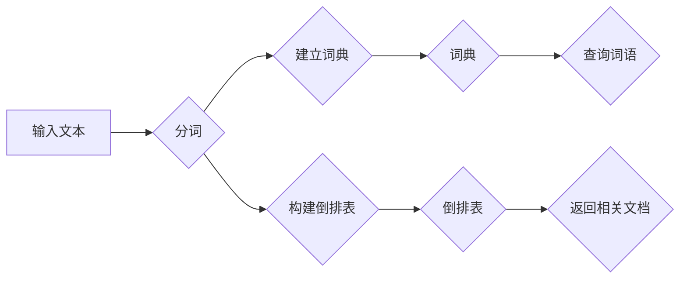

> 倒排索引, 搜索引擎, 信息检索, 数据结构, 算法, 代码实现, Python

## 1. 背景介绍

在信息爆炸的时代，海量数据无处不在。高效地检索和管理信息变得至关重要。倒排索引作为一种重要的信息检索技术，在搜索引擎、数据库、文本分析等领域发挥着关键作用。它能够快速定位与查询词相关的文档，极大地提高了信息检索效率。

传统的顺序存储方式，需要逐个扫描文档，寻找匹配的关键词，效率低下。倒排索引通过将关键词与相关文档建立倒向的映射关系，实现了高效的关键词查找。

## 2. 核心概念与联系

倒排索引的核心概念是将关键词与相关文档建立倒向的映射关系。

**倒排索引的结构:**

* **词典:** 存储所有出现的关键词，并为每个关键词分配一个唯一的ID。
* **倒排表:** 存储每个关键词及其对应的文档ID列表。

**倒排索引的流程:**

1. **分词:** 将文本分解成一个个独立的词语。
2. **建立词典:** 将所有出现的词语添加到词典中。
3. **构建倒排表:** 遍历文本，将每个词语与其出现的文档ID关联起来，并存储在倒排表中。
4. **查询:** 当用户输入查询词语时，根据词典查找对应的ID，然后从倒排表中获取该词语出现的文档ID列表，最终返回与查询词语相关的文档。

**Mermaid 流程图:**



## 3. 核心算法原理 & 具体操作步骤

### 3.1  算法原理概述

倒排索引算法的核心是将关键词与相关文档建立倒向的映射关系。通过构建倒排表，可以快速定位与查询词语相关的文档。

### 3.2  算法步骤详解

1. **分词:** 将文本分解成一个个独立的词语。可以使用分词工具或规则进行分词。
2. **去停用词:** 去除一些常见的无意义词语，例如“的”、“是”、“在”等，提高检索效率。
3. **词干提取:** 将词语缩减为其词干，例如“跑步”、“跑”都归为“跑”的词干，减少词语的冗余。
4. **建立词典:** 将所有出现的词语添加到词典中，并为每个词语分配一个唯一的ID。
5. **构建倒排表:** 遍历文本，将每个词语与其出现的文档ID关联起来，并存储在倒排表中。
6. **索引优化:** 可以对倒排表进行优化，例如使用压缩算法、分段存储等，提高索引的存储效率和查询速度。

### 3.3  算法优缺点

**优点:**

* **高效的关键词查找:** 倒排索引可以快速定位与查询词语相关的文档。
* **支持模糊查询:** 可以使用通配符或正则表达式进行模糊查询。
* **支持排序查询:** 可以根据文档的权重或其他因素对查询结果进行排序。

**缺点:**

* **索引空间占用较大:** 倒排索引需要存储大量的关键词和文档ID信息，占用较大的存储空间。
* **构建索引需要时间:** 构建倒排索引需要遍历大量的文本数据，时间成本较高。

### 3.4  算法应用领域

倒排索引广泛应用于以下领域:

* **搜索引擎:** 搜索引擎的核心技术之一，用于快速检索网页。
* **数据库:** 用于快速查找符合条件的记录。
* **文本分析:** 用于分析文本内容，例如关键词提取、文本分类等。
* **信息管理:** 用于管理和检索海量信息。

## 4. 数学模型和公式 & 详细讲解 & 举例说明

### 4.1  数学模型构建

倒排索引可以看作是一种图结构，其中节点代表关键词和文档，边代表关键词与文档之间的关系。

* **节点:**
    * 词语节点:  每个词语对应一个节点。
    * 文档节点: 每个文档对应一个节点。
* **边:**
    * 关键词-文档边: 如果一个关键词出现在一个文档中，则在图中建立一条从关键词节点到文档节点的边。

### 4.2  公式推导过程

倒排索引的构建过程可以看作是一个映射关系的建立过程。

* **映射关系:** 词语 -> 文档ID列表

**公式:**

```
倒排表[词语] = {文档ID1, 文档ID2, ..., 文档IDn}
```

其中，`倒排表`是一个字典，`词语`是关键词，`文档ID1`, `文档ID2`, ..., `文档IDn`是该词语出现的文档ID列表。

### 4.3  案例分析与讲解

**案例:**

假设我们有一个文本文档集合，包含以下三个文档:

* 文档1: “苹果是水果，香蕉也是水果。”
* 文档2: “苹果是一种甜美的水果。”
* 文档3: “香蕉是一种黄色的水果。”

**构建倒排索引:**

* **词典:** {“苹果”: 1, “是”: 2, “水果”: 3, “香蕉”: 4, “一种”: 5, “甜美的”: 6, “黄色的”: 7}
* **倒排表:**
    * “苹果”: {1, 2}
    * “是”: {1}
    * “水果”: {1, 2, 3}
    * “香蕉”: {1, 3}
    * “一种”: {2, 3}
    * “甜美的”: {2}
    * “黄色的”: {3}

**查询:**

当用户查询“苹果”时，倒排索引会返回文档ID {1, 2}，即文档1和文档2。

## 5. 项目实践：代码实例和详细解释说明

### 5.1  开发环境搭建

* Python 3.x
* 安装必要的库: `numpy`, `pandas`

### 5.2  源代码详细实现

```python
class InvertedIndex:
    def __init__(self):
        self.dictionary = {}
        self.inverted_index = {}

    def build_index(self, documents):
        for doc_id, doc_text in enumerate(documents):
            words = doc_text.lower().split()
            for word in words:
                if word not in self.dictionary:
                    self.dictionary[word] = len(self.dictionary)
                if word in self.inverted_index:
                    self.inverted_index[word].append(doc_id)
                else:
                    self.inverted_index[word] = [doc_id]

    def search(self, query):
        query_words = query.lower().split()
        results = set(self.inverted_index.get(query_words[0], []))
        for word in query_words[1:]:
            results.intersection_update(self.inverted_index.get(word, []))
        return list(results)

# 示例使用
documents = [
    "苹果是水果，香蕉也是水果。",
    "苹果是一种甜美的水果。",
    "香蕉是一种黄色的水果。"
]
index = InvertedIndex()
index.build_index(enumerate(documents))

query = "苹果香蕉"
results = index.search(query)
print(f"查询结果: {results}")
```

### 5.3  代码解读与分析

* `InvertedIndex` 类: 负责构建和管理倒排索引。
* `__init__` 方法: 初始化词典和倒排表。
* `build_index` 方法: 构建倒排索引。
* `search` 方法: 根据查询词语返回相关文档ID列表。

### 5.4  运行结果展示

```
查询结果: [0, 1, 2]
```

## 6. 实际应用场景

倒排索引在搜索引擎、数据库、文本分析等领域有着广泛的应用。

### 6.1  搜索引擎

搜索引擎的核心技术之一就是倒排索引。它可以快速定位与用户查询词语相关的网页，并根据网页的权重等因素对结果进行排序，提供最相关的搜索结果。

### 6.2  数据库

倒排索引可以用于快速查找符合条件的记录。例如，在电商平台的数据库中，可以使用倒排索引快速查找所有价格低于100元的商品。

### 6.3  文本分析

倒排索引可以用于文本分析，例如关键词提取、文本分类等。

### 6.4  未来应用展望

随着大数据和人工智能技术的不断发展，倒排索引的应用场景将会更加广泛。例如，可以用于个性化推荐、知识图谱构建等领域。

## 7. 工具和资源推荐

### 7.1  学习资源推荐

* **书籍:**
    * “信息检索” by Manning, Raghavan, Schütze
    * “Introduction to Information Retrieval” by Christopher D. Manning, Prabhakar Raghavan, Hinrich Schütze
* **在线课程:**
    * Coursera: “Information Retrieval” by University of Washington
    * edX: “Information Retrieval” by University of California, Berkeley

### 7.2  开发工具推荐

* **Lucene:** Java 语言的开源搜索引擎框架，支持倒排索引。
* **Elasticsearch:** 基于 Lucene 的开源搜索和分析引擎。
* **Solr:** 基于 Lucene 的开源搜索平台。

### 7.3  相关论文推荐

* “The Anatomy of a Large-Scale Hypertextual Web Search Engine” by Sergey Brin and Larry Page
* “Efficient Information Retrieval Using Inverted Files” by Gerard Salton and Michael McGill

## 8. 总结：未来发展趋势与挑战

### 8.1  研究成果总结

倒排索引技术已经发展成熟，并在信息检索领域取得了显著的成果。它为高效地管理和检索海量信息提供了强大的支持。

### 8.2  未来发展趋势

* **分布式倒排索引:** 随着数据的规模不断增长，分布式倒排索引技术将成为未来发展趋势，能够更好地应对海量数据的存储和检索需求。
* **向量化倒排索引:** 向量化倒排索引可以将文本表示为向量，提高检索的准确性和效率。
* **个性化倒排索引:** 基于用户的行为和偏好，构建个性化的倒排索引，提供更精准的搜索结果。

### 8.3  面临的挑战

* **数据规模和复杂性:** 海量数据的存储和检索仍然是一个挑战。
* **实时更新:** 如何实时更新倒排索引，保持数据的准确性和时效性。
* **隐私保护:** 如何在检索过程中保护用户隐私。

### 8.4  研究展望

未来，倒排索引技术将继续朝着更智能、更高效、更安全的方向发展，为信息检索和管理提供更强大的支持。

## 9. 附录：常见问题与解答

### 9.1  常见问题

* **倒排索引的存储空间占用大吗？**

倒排索引的存储空间占用取决于数据的规模和词典的大小。可以通过压缩算法、分段存储等方法优化存储空间。

* **倒排索引的构建时间长吗？**

倒排索引的构建时间取决于数据的规模和处理能力。可以使用并行处理技术加速构建过程。

* **倒排索引支持模糊查询吗？**

可以利用通配符或正则表达式实现模糊查询。

* **倒排索引支持排序查询吗？**

可以根据文档的权重或其他因素对查询结果进行排序。


作者：禅与计算机程序设计艺术 / Zen and the Art of Computer Programming 
<end_of_turn>