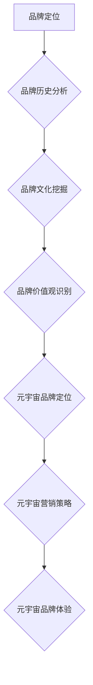

> 元宇宙、品牌考古、数字化营销、营销历史、品牌传播、用户体验、数据驱动

## 1. 背景介绍

元宇宙概念的兴起，为品牌营销带来了前所未有的机遇和挑战。在这个虚拟世界中，品牌需要重新思考其存在方式、与用户互动的方式以及价值传递的方式。而对数字化营销历史的追溯与分析，可以为品牌在元宇宙中找到新的发展方向，并避免重蹈覆辙。

从传统广告到社交媒体营销，再到如今的元宇宙营销，数字化营销一直在不断演变。每一次变革都伴随着新的技术、新的平台和新的用户行为模式。回顾历史，我们可以发现一些重要的规律和趋势，这些规律和趋势可以帮助我们更好地理解元宇宙营销的本质，并为品牌制定更有效的营销策略。

## 2. 核心概念与联系

**2.1 元宇宙**

元宇宙是一个由虚拟现实、增强现实、区块链、人工智能等技术融合而成的沉浸式虚拟世界。它拥有以下核心特征：

* **沉浸式体验:** 用户可以通过虚拟现实设备或增强现实设备，身临其境地体验元宇宙世界。
* **持久性:** 元宇宙世界不会随着用户退出而消失，而是会持续存在，并不断发展演变。
* **去中心化:** 元宇宙世界由多个参与者共同构建和维护，而不是由单一实体控制。
* **经济系统:** 元宇宙世界拥有自己的经济系统，用户可以通过虚拟货币进行交易。

**2.2 品牌考古**

品牌考古是指通过对品牌历史、文化、价值观等方面的研究，挖掘品牌内在的价值和故事，并将其转化为品牌营销的资源。

**2.3 数字化营销**

数字化营销是指利用互联网和数字技术进行的营销活动。它包括搜索引擎优化、社交媒体营销、内容营销、电子邮件营销等多种形式。

**2.4 核心概念联系**

元宇宙为品牌营销提供了全新的平台和机遇，而品牌考古可以帮助品牌在元宇宙中找到新的定位和价值。数字化营销的经验和方法可以为品牌在元宇宙中进行营销活动提供指导。

**2.5 元宇宙品牌考古流程图**



## 3. 核心算法原理 & 具体操作步骤

**3.1 算法原理概述**

元宇宙品牌考古的核心算法原理是基于数据挖掘和机器学习技术，通过分析品牌历史数据、用户行为数据和市场趋势数据，挖掘品牌内在的价值和故事，并将其转化为品牌营销的资源。

**3.2 算法步骤详解**

1. **数据收集:** 收集品牌历史数据、用户行为数据和市场趋势数据。
2. **数据清洗:** 对收集到的数据进行清洗和预处理，去除噪声和异常值。
3. **特征提取:** 从数据中提取关键特征，例如品牌名称、品牌logo、品牌故事、用户评论等。
4. **模型训练:** 使用机器学习算法对提取的特征进行训练，构建品牌考古模型。
5. **模型预测:** 将训练好的模型应用于新的数据，预测品牌在元宇宙中的潜在价值和故事。
6. **结果分析:** 分析模型预测的结果，并将其转化为品牌营销的资源。

**3.3 算法优缺点**

**优点:**

* 可以挖掘品牌内在的价值和故事。
* 可以帮助品牌找到新的定位和价值。
* 可以提高品牌营销的效率和效果。

**缺点:**

* 需要大量的历史数据和用户行为数据。
* 需要专业的技术人员进行模型训练和结果分析。
* 模型的预测结果可能存在一定的误差。

**3.4 算法应用领域**

* 品牌定位和品牌故事挖掘
* 元宇宙品牌营销策略制定
* 用户体验设计和优化
* 品牌资产管理

## 4. 数学模型和公式 & 详细讲解 & 举例说明

**4.1 数学模型构建**

元宇宙品牌考古的数学模型可以基于用户行为数据和品牌资产数据构建。

**用户行为数据:** 包括用户访问品牌网站、社交媒体平台、元宇宙平台的次数、停留时间、互动行为等。

**品牌资产数据:** 包括品牌知名度、品牌忠诚度、品牌价值等。

**数学模型:**

```latex
BrandValue = f(UserBehavior, BrandAsset)
```

其中，BrandValue表示品牌价值，UserBehavior表示用户行为数据，BrandAsset表示品牌资产数据，f()表示一个复杂的函数，该函数需要根据具体情况进行设计。

**4.2 公式推导过程**

具体的公式推导过程需要根据具体的数学模型和数据特征进行设计。

**4.3 案例分析与讲解**

假设我们有一个品牌A，其用户行为数据和品牌资产数据如下：

* 用户行为数据: 用户访问品牌网站的次数为1000次，平均停留时间为5分钟，点赞和评论的次数分别为100次和50次。
* 品牌资产数据: 品牌知名度为80%，品牌忠诚度为70%，品牌价值为1000万元。

我们可以将这些数据代入到上述的数学模型中，得到品牌A在元宇宙中的潜在价值。

## 5. 项目实践：代码实例和详细解释说明

**5.1 开发环境搭建**

* Python 3.x
* Jupyter Notebook
* pandas
* scikit-learn

**5.2 源代码详细实现**

```python
import pandas as pd
from sklearn.linear_model import LinearRegression

# 加载数据
data = pd.read_csv('brand_data.csv')

# 特征工程
X = data[['website_visits', 'average_stay_time', 'likes', 'comments']]
y = data['brand_value']

# 模型训练
model = LinearRegression()
model.fit(X, y)

# 模型预测
new_data = pd.DataFrame({'website_visits': [1500], 'average_stay_time': [7], 'likes': [150], 'comments': [70]})
predicted_value = model.predict(new_data)

# 打印预测结果
print(f'预测的品牌价值: {predicted_value[0]}')
```

**5.3 代码解读与分析**

* 代码首先加载品牌数据，然后进行特征工程，提取用户行为数据和品牌资产数据作为模型输入。
* 然后使用线性回归模型对数据进行训练，建立品牌价值预测模型。
* 最后使用训练好的模型对新的数据进行预测，得到品牌在元宇宙中的潜在价值。

**5.4 运行结果展示**

运行代码后，会输出预测的品牌价值。

## 6. 实际应用场景

**6.1 元宇宙品牌体验设计**

元宇宙品牌考古可以帮助品牌设计更具吸引力和沉浸感的品牌体验。例如，品牌可以根据品牌历史和文化，打造一个虚拟博物馆，让用户体验品牌的起源和发展历程。

**6.2 元宇宙品牌营销活动策划**

元宇宙品牌考古可以帮助品牌策划更具创意和互动性的营销活动。例如，品牌可以根据用户行为数据，定制个性化的营销内容，并通过虚拟现实技术，让用户身临其境地体验品牌产品和服务。

**6.3 元宇宙品牌资产管理**

元宇宙品牌考古可以帮助品牌更好地管理其品牌资产。例如，品牌可以根据品牌价值和用户偏好，选择合适的元宇宙平台进行推广，并通过数据分析，跟踪品牌在元宇宙中的表现。

**6.4 未来应用展望**

随着元宇宙技术的不断发展，元宇宙品牌考古将发挥越来越重要的作用。未来，我们可以期待看到更多元宇宙品牌考古的应用场景，例如：

* 元宇宙品牌故事创作
* 元宇宙品牌形象设计
* 元宇宙品牌社区建设
* 元宇宙品牌资产交易

## 7. 工具和资源推荐

**7.1 学习资源推荐**

* **书籍:**
    * 《元宇宙：下一个互联网》
    * 《元宇宙：未来世界的构建》
* **在线课程:**
    * Coursera: 元宇宙基础
    * Udemy: 元宇宙开发

**7.2 开发工具推荐**

* **Unity:** 游戏引擎，用于开发元宇宙应用
* **Unreal Engine:** 游戏引擎，用于开发元宇宙应用
* **Decentraland:** 元宇宙平台，用于创建和体验虚拟世界

**7.3 相关论文推荐**

* 《元宇宙：概念、技术和应用》
* 《元宇宙的商业模式》
* 《元宇宙的社会影响》

## 8. 总结：未来发展趋势与挑战

**8.1 研究成果总结**

元宇宙品牌考古是一个新兴的领域，它为品牌营销提供了全新的视角和方法。通过对品牌历史、文化和用户行为数据的分析，我们可以挖掘品牌内在的价值和故事，并将其转化为品牌营销的资源。

**8.2 未来发展趋势**

未来，元宇宙品牌考古将朝着以下几个方向发展：

* **更加智能化:** 利用人工智能技术，自动分析品牌数据，并生成更精准的品牌洞察。
* **更加个性化:** 根据用户的个性化需求，定制化的品牌体验。
* **更加沉浸式:** 利用虚拟现实和增强现实技术，打造更具沉浸感的品牌体验。

**8.3 面临的挑战**

元宇宙品牌考古也面临着一些挑战：

* 数据获取和隐私保护
* 模型准确性和可解释性
* 技术标准和生态建设

**8.4 研究展望**

未来，我们需要继续深入研究元宇宙品牌考古的理论和方法，并探索其在不同行业和场景中的应用。同时，我们也需要关注元宇宙品牌考古带来的伦理和社会问题，并制定相应的规范和制度。

## 9. 附录：常见问题与解答

**9.1 如何收集品牌历史数据？**

可以从以下几个方面收集品牌历史数据：

* 公司档案
* 媒体报道
* 用户评论
* 社交媒体数据

**9.2 如何进行品牌文化挖掘？**

可以采用以下方法进行品牌文化挖掘：

* 文本分析
* 图像分析
* 用户访谈

**9.3 如何评估品牌考古模型的准确性？**

可以使用以下指标评估品牌考古模型的准确性：

* 均方误差 (MSE)
* 平均绝对误差 (MAE)
* R-squared

作者：禅与计算机程序设计艺术 / Zen and the Art of Computer Programming


<end_of_turn>