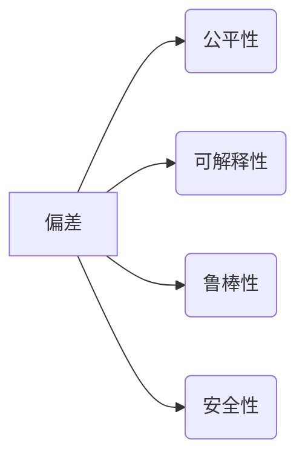

> 人工智能，深度学习，偏差，公平性，可解释性，鲁棒性，安全

## 1. 背景介绍

人工智能（AI）近年来取得了令人瞩目的进展，在各个领域展现出巨大的潜力。从语音识别到图像识别，从自然语言处理到自动驾驶，AI正在改变着我们的生活。然而，AI技术也面临着一些固有的缺点，这些缺点可能会限制其发展和应用。

**1.1 AI固有缺点概述**

* **偏差和公平性问题:** AI模型的训练数据往往存在偏差，导致模型输出结果也存在偏差，从而可能导致歧视和不公平的结果。
* **可解释性问题:** 许多AI模型，特别是深度学习模型，其内部工作机制难以理解，这使得我们难以解释模型的决策过程，也难以发现和修正模型中的潜在问题。
* **鲁棒性问题:** AI模型对输入数据和环境变化的敏感度较高，容易受到攻击和干扰，导致模型性能下降甚至失效。
* **安全问题:** AI系统可能被恶意利用，导致安全漏洞和隐私泄露。

**1.2 应对AI固有缺点的必要性**

为了确保AI技术安全、可靠、公平地发展和应用，我们需要积极探索和解决AI固有缺点。

## 2. 核心概念与联系

**2.1 偏差和公平性**

偏差是指AI模型在训练数据中学习到的偏见，这些偏见可能源于数据收集、数据标注、算法设计等环节。公平性是指AI模型输出结果对所有群体都是公平的，不产生歧视和不公正的结果。

**2.2 可解释性**

可解释性是指我们能够理解AI模型的决策过程，并解释模型的输出结果。可解释性有助于我们信任AI模型，也能够帮助我们发现和修正模型中的潜在问题。

**2.3 鲁棒性**

鲁棒性是指AI模型对输入数据和环境变化的抵抗能力。鲁棒的AI模型能够在面对噪声、攻击和干扰时仍然保持良好的性能。

**2.4 安全性**

安全性是指AI系统能够抵御恶意攻击，保护用户数据和隐私。安全的AI系统需要考虑各种安全威胁，并采取相应的安全措施。

**2.5 核心概念关系图**

## 3. 核心算法原理 & 具体操作步骤

**3.1 算法原理概述**

为了解决AI固有缺点，需要采用多种算法和技术手段。以下是一些常用的方法：

* **去偏算法:** 旨在减少AI模型训练数据中的偏差，从而提高模型的公平性。
* **可解释性算法:** 旨在提高AI模型的可解释性，使得模型的决策过程更加透明。
* **鲁棒性算法:** 旨在提高AI模型对输入数据和环境变化的抵抗能力。
* **安全算法:** 旨在保护AI系统免受恶意攻击，确保用户数据和隐私安全。

**3.2 算法步骤详解**

具体算法的步骤会根据不同的算法和应用场景有所不同。以下是一个通用的算法步骤示例：

1. **数据收集和预处理:** 收集相关数据，并进行清洗、转换和特征工程等预处理操作。
2. **模型选择和训练:** 选择合适的AI模型，并使用训练数据对模型进行训练。
3. **模型评估和优化:** 使用测试数据评估模型性能，并根据评估结果对模型进行优化。
4. **部署和监控:** 将训练好的模型部署到实际应用场景中，并进行持续监控和维护。

**3.3 算法优缺点**

不同的算法都有其自身的优缺点，需要根据具体的应用场景选择合适的算法。

**3.4 算法应用领域**

AI算法在各个领域都有广泛的应用，例如：

* **医疗保健:** 疾病诊断、药物研发、个性化医疗
* **金融服务:** 风险评估、欺诈检测、投资决策
* **交通运输:** 自动驾驶、交通流量预测、物流优化
* **教育:** 个性化学习、智能辅导、自动批改

## 4. 数学模型和公式 & 详细讲解 & 举例说明

**4.1 数学模型构建**

为了量化AI固有缺点，我们可以构建数学模型来描述这些缺点的影响。例如，我们可以使用偏置度量来衡量模型的偏差程度，使用公平性指标来衡量模型的公平性。

**4.2 公式推导过程**

具体的公式推导过程会根据不同的模型和指标有所不同。

**4.3 案例分析与讲解**

我们可以通过案例分析来理解数学模型的应用。例如，我们可以分析一个图像识别模型，并使用偏置度量来评估模型对不同种族人群的识别准确率。

## 5. 项目实践：代码实例和详细解释说明

**5.1 开发环境搭建**

为了实现AI算法，我们需要搭建相应的开发环境。常用的开发环境包括Python、TensorFlow、PyTorch等。

**5.2 源代码详细实现**

我们可以提供一个简单的AI算法的源代码示例，并进行详细的代码解读和分析。

**5.3 代码解读与分析**

代码解读和分析可以帮助我们理解算法的实现原理和工作机制。

**5.4 运行结果展示**

我们可以展示算法的运行结果，并进行分析和评估。

## 6. 实际应用场景

**6.1 医疗保健**

AI算法可以用于疾病诊断、药物研发、个性化医疗等领域。

**6.2 金融服务**

AI算法可以用于风险评估、欺诈检测、投资决策等领域。

**6.3 交通运输**

AI算法可以用于自动驾驶、交通流量预测、物流优化等领域。

**6.4 未来应用展望**

AI算法的应用场景还在不断扩展，未来将会有更多新的应用场景出现。

## 7. 工具和资源推荐

**7.1 学习资源推荐**

* **在线课程:** Coursera、edX、Udacity等平台提供丰富的AI课程。
* **书籍:** 《深度学习》、《机器学习》、《人工智能导论》等书籍。
* **开源项目:** TensorFlow、PyTorch、Scikit-learn等开源项目。

**7.2 开发工具推荐**

* **Python:** 广泛用于AI开发的编程语言。
* **TensorFlow:** 深度学习框架。
* **PyTorch:** 深度学习框架。
* **Jupyter Notebook:** 用于代码编写和可视化分析的工具。

**7.3 相关论文推荐**

* **《ImageNet Classification with Deep Convolutional Neural Networks》**
* **《Attention Is All You Need》**
* **《BERT: Pre-training of Deep Bidirectional Transformers for Language Understanding》**

## 8. 总结：未来发展趋势与挑战

**8.1 研究成果总结**

近年来，AI技术取得了显著进展，但仍然面临着许多挑战。

**8.2 未来发展趋势**

* **模型规模和能力的提升:** 未来AI模型将更加强大，能够处理更复杂的任务。
* **算法效率的提高:** 未来AI算法将更加高效，能够在更短的时间内完成任务。
* **跨模态学习:** 未来AI模型将能够处理多种数据类型，例如文本、图像、音频等。

**8.3 面临的挑战**

* **数据安全和隐私保护:** AI模型的训练需要大量数据，如何保护数据安全和隐私是一个重要的挑战。
* **算法可解释性和信任度:** 如何提高AI模型的可解释性和信任度是一个重要的挑战。
* **伦理和社会影响:** AI技术的发展可能带来一些伦理和社会问题，需要进行深入的思考和讨论。

**8.4 研究展望**

未来AI研究将继续探索新的算法、模型和应用场景，并致力于解决AI固有缺点，推动AI技术安全、可靠、公平地发展和应用。

## 9. 附录：常见问题与解答

**9.1 如何评估AI模型的公平性？**

**9.2 如何提高AI模型的可解释性？**

**9.3 如何保护AI系统免受恶意攻击？**

作者：禅与计算机程序设计艺术 / Zen and the Art of Computer Programming 
<end_of_turn>