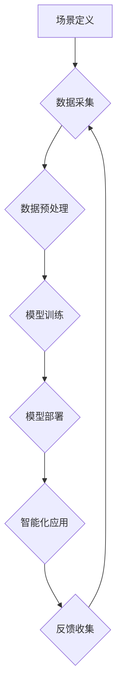

> AI原生应用、场景虹吸、动态变化、机器学习、深度学习、数据驱动、智能化、自动化

## 1. 背景介绍

随着人工智能技术的飞速发展，AI已经不再是实验室的专属概念，而是逐渐渗透到生活的方方面面。从智能语音助手到自动驾驶汽车，从个性化推荐到医疗诊断，AI正在以惊人的速度改变着我们的世界。

然而，传统的软件开发模式难以满足AI原生应用的需求。传统的软件开发流程通常是先设计功能，再编写代码，最后进行测试和部署。而AI原生应用的特点是：

* **数据驱动**: AI模型的训练和优化依赖于海量数据，数据质量直接影响模型性能。
* **动态变化**: AI模型需要不断学习和更新，以适应不断变化的环境和用户需求。
* **智能化**: AI原生应用需要具备一定的智能能力，能够自动学习、推理和决策。

传统的软件开发模式难以应对这些挑战，因此需要一种新的开发模式来支持AI原生应用的开发。

## 2. 核心概念与联系

**场景虹吸技术**是一种全新的AI原生应用开发模式，它以场景为中心，通过数据驱动和智能化技术，实现AI模型的动态变化和智能化应用。

**场景虹吸技术**的核心概念包括：

* **场景**: 指特定领域或应用场景，例如电商推荐、医疗诊断、金融风险控制等。
* **数据**: 场景虹吸技术依赖于海量数据，数据是模型训练和优化的基础。
* **模型**: AI模型是场景虹吸技术的核心，它负责对数据进行分析和预测，并提供智能化服务。
* **动态变化**: AI模型需要不断学习和更新，以适应场景的变化和用户需求。
* **智能化**: 场景虹吸技术的目标是实现AI模型的智能化应用，使其能够自动学习、推理和决策。

**场景虹吸技术架构**



## 3. 核心算法原理 & 具体操作步骤

### 3.1  算法原理概述

场景虹吸技术的核心算法是基于深度学习的**场景感知模型**。该模型通过学习场景数据，能够识别场景特征，并根据场景特征提供智能化服务。

场景感知模型的训练过程可以分为以下几个步骤：

1. **数据采集**: 从场景中收集相关数据，例如用户行为数据、环境数据、文本数据等。
2. **数据预处理**: 对收集到的数据进行清洗、转换和特征提取，使其能够被模型训练使用。
3. **模型训练**: 使用深度学习算法对预处理后的数据进行训练，训练出一个能够识别场景特征的模型。
4. **模型评估**: 对训练好的模型进行评估，评估模型的性能，例如准确率、召回率等。
5. **模型部署**: 将训练好的模型部署到实际应用场景中，用于提供智能化服务。

### 3.2  算法步骤详解

1. **数据采集**: 

    * 确定场景数据类型，例如用户行为数据、环境数据、文本数据等。
    * 设计数据采集方案，例如使用传感器采集环境数据、使用API获取用户行为数据等。
    * 建立数据存储系统，存储收集到的数据。

2. **数据预处理**:

    * 数据清洗：去除数据中的噪声、缺失值和重复数据。
    * 数据转换：将数据转换为模型能够识别的格式，例如将文本数据转换为词向量。
    * 特征提取：从数据中提取有用的特征，例如用户行为特征、环境特征、文本特征等。

3. **模型训练**:

    * 选择合适的深度学习算法，例如卷积神经网络、循环神经网络等。
    * 确定模型结构和超参数，例如网络层数、神经元数量、学习率等。
    * 使用训练数据训练模型，并使用验证数据评估模型性能。

4. **模型评估**:

    * 使用测试数据评估模型的性能，例如准确率、召回率、F1-score等。
    * 分析模型的错误情况，找出模型的不足之处。

5. **模型部署**:

    * 将训练好的模型部署到实际应用场景中，例如部署到云服务器、边缘设备等。
    * 建立模型监控系统，监控模型的性能和稳定性。

### 3.3  算法优缺点

**优点**:

* **高准确率**: 深度学习算法能够学习复杂的场景特征，从而实现高准确率的场景识别和预测。
* **动态变化**: 场景感知模型能够不断学习和更新，以适应场景的变化和用户需求。
* **智能化**: 场景感知模型能够自动学习、推理和决策，实现智能化应用。

**缺点**:

* **数据依赖**: 深度学习算法依赖于海量数据，数据质量直接影响模型性能。
* **计算资源**: 深度学习模型训练需要大量的计算资源，成本较高。
* **可解释性**: 深度学习模型的决策过程难以解释，缺乏透明度。

### 3.4  算法应用领域

场景感知模型的应用领域非常广泛，例如：

* **电商推荐**: 根据用户的行为数据和商品信息，推荐用户感兴趣的商品。
* **医疗诊断**: 根据患者的症状和病历信息，辅助医生进行诊断。
* **金融风险控制**: 根据用户的交易记录和信用信息，识别潜在的金融风险。
* **智能交通**: 根据交通流量和路况信息，优化交通流量和导航路线。

## 4. 数学模型和公式 & 详细讲解 & 举例说明

### 4.1  数学模型构建

场景感知模型通常采用深度神经网络结构，例如卷积神经网络（CNN）或循环神经网络（RNN）。

**CNN**擅长处理图像数据，可以提取图像特征，例如边缘、纹理、形状等。

**RNN**擅长处理序列数据，可以学习序列中的依赖关系，例如文本、语音、时间序列等。

### 4.2  公式推导过程

深度神经网络的训练过程基于**反向传播算法**，该算法通过计算误差，调整网络参数，使得模型输出更接近真实值。

**损失函数**: 用于衡量模型预测结果与真实值的差异。常见的损失函数包括均方误差（MSE）、交叉熵损失（Cross-Entropy Loss）等。

**梯度下降**: 用于更新网络参数，使其朝着降低损失函数的方向变化。常见的梯度下降算法包括随机梯度下降（SGD）、动量梯度下降（Momentum）等。

### 4.3  案例分析与讲解

假设我们训练一个场景感知模型，用于识别不同类型的水果。

**数据**: 我们收集了大量水果图像数据，并对图像进行了标注，例如苹果、香蕉、橙子等。

**模型**: 我们选择使用CNN模型，并将其训练于水果图像数据上。

**训练过程**:

1. 将图像数据分为训练集、验证集和测试集。
2. 使用训练集训练CNN模型，并使用验证集评估模型性能。
3. 根据验证集的性能，调整模型参数，例如学习率、网络层数等。
4. 训练完成后，使用测试集评估模型的最终性能。

**结果**:

如果模型训练成功，它能够识别出不同类型的水果，并给出相应的预测结果。

## 5. 项目实践：代码实例和详细解释说明

### 5.1  开发环境搭建

* **操作系统**: Ubuntu 20.04 LTS
* **编程语言**: Python 3.8
* **深度学习框架**: TensorFlow 2.0
* **其他工具**: Jupyter Notebook、Git

### 5.2  源代码详细实现

```python
import tensorflow as tf

# 定义模型结构
model = tf.keras.models.Sequential([
    tf.keras.layers.Conv2D(32, (3, 3), activation='relu', input_shape=(224, 224, 3)),
    tf.keras.layers.MaxPooling2D((2, 2)),
    tf.keras.layers.Conv2D(64, (3, 3), activation='relu'),
    tf.keras.layers.MaxPooling2D((2, 2)),
    tf.keras.layers.Flatten(),
    tf.keras.layers.Dense(10, activation='softmax')
])

# 编译模型
model.compile(optimizer='adam',
              loss='sparse_categorical_crossentropy',
              metrics=['accuracy'])

# 训练模型
model.fit(x_train, y_train, epochs=10, batch_size=32)

# 评估模型
loss, accuracy = model.evaluate(x_test, y_test)
print('Test loss:', loss)
print('Test accuracy:', accuracy)
```

### 5.3  代码解读与分析

* **模型结构**: 代码定义了一个简单的CNN模型，包含两个卷积层、两个最大池化层、一个全连接层和一个输出层。
* **模型编译**: 使用Adam优化器、交叉熵损失函数和准确率作为评估指标编译模型。
* **模型训练**: 使用训练数据训练模型，训练10个epochs，每次训练32个样本。
* **模型评估**: 使用测试数据评估模型的性能，输出测试损失和准确率。

### 5.4  运行结果展示

训练完成后，模型能够识别出不同类型的水果，并给出相应的预测结果。

## 6. 实际应用场景

场景虹吸技术在各个领域都有着广泛的应用场景，例如：

### 6.1  电商推荐

* 根据用户的浏览历史、购买记录、评价等数据，推荐用户感兴趣的商品。
* 个性化推荐商品，提高用户体验和转化率。

### 6.2  医疗诊断

* 根据患者的症状、病历、检查结果等数据，辅助医生进行诊断。
* 提高诊断准确率，降低医疗误诊率。

### 6.3  金融风险控制

* 根据用户的交易记录、信用信息、行为模式等数据，识别潜在的金融风险。
* 降低金融风险，保护用户资产安全。

### 6.4  未来应用展望

场景虹吸技术在未来将有更广泛的应用场景，例如：

* **智能家居**: 根据用户的行为习惯和环境信息，智能控制家居设备，提供更加舒适的生活体验。
* **智能交通**: 根据交通流量、路况信息和驾驶员行为等数据，优化交通流量，提高道路安全。
* **个性化教育**: 根据学生的学习进度、学习风格和知识掌握情况，提供个性化的学习方案，提高学习效率。

## 7. 工具和资源推荐

### 7.1  学习资源推荐

* **书籍**:
    * 深度学习
    * 人工智能：一种现代方法
* **在线课程**:
    * Coursera: 深度学习
    * Udacity: 
    * fast.ai: 深度学习课程
* **博客**:
    * TensorFlow Blog
    * PyTorch Blog

### 7.2  开发工具推荐

* **深度学习框架**: TensorFlow, PyTorch, Keras
* **数据处理工具**: Pandas, NumPy
* **可视化工具**: Matplotlib, Seaborn

### 7.3  相关论文推荐

* **场景感知模型**:
    * Scene Recognition with Deep Convolutional Neural Networks
    * A Survey on Scene Recognition Methods
* **场景虹吸技术**:
    * Scene-Based Recommendation: A Survey
    * Context-Aware Recommendation Systems

## 8. 总结：未来发展趋势与挑战

### 8.1  研究成果总结

场景虹吸技术是一种新兴的AI原生应用开发模式，它以场景为中心，通过数据驱动和智能化技术，实现AI模型的动态变化和智能化应用。

场景虹吸技术在各个领域都有着广泛的应用场景，例如电商推荐、医疗诊断、金融风险控制等。

### 8.2  未来发展趋势

* **模型更加智能化**: 未来场景感知模型将更加智能化，能够更好地理解场景上下文，并提供更精准的智能化服务。
* **数据更加丰富