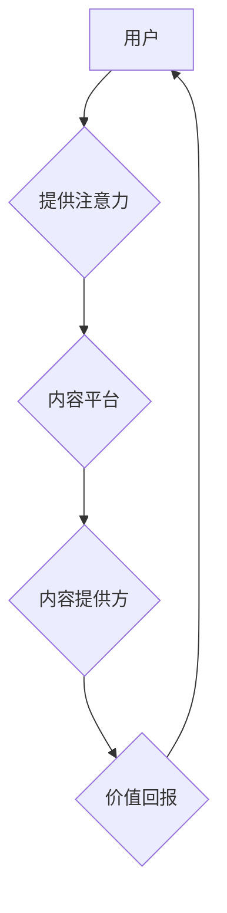

> 区块链，注意力经济，价值交换，去中心化，智能合约，数据隐私

## 1. 背景介绍

在数字时代，注意力已成为最稀缺的资源。互联网平台通过算法推荐和个性化内容，不断争夺用户的注意力，形成了一种“注意力经济”。然而，现有的注意力经济模式存在着诸多问题：

* **中心化控制：** 互联网平台拥有用户数据和注意力，掌握着信息传播和价值分配的控制权，缺乏透明度和公平性。
* **数据隐私泄露：** 用户数据被平台收集、分析和利用，存在着隐私泄露和滥用风险。
* **注意力碎片化：** 用户注意力被碎片化，难以集中，难以获得高质量的内容和服务。

区块链技术作为一种去中心化、透明、安全的数据存储和交易平台，为解决注意力经济中的问题提供了新的思路。

## 2. 核心概念与联系

**2.1 区块链**

区块链是一种分布式账本技术，其特点是：

* **去中心化：** 数据存储在多个节点上，不存在单点故障和控制中心。
* **透明公开：** 所有交易记录都公开透明，可追溯。
* **安全可靠：** 使用加密算法保证数据安全，防止篡改。

**2.2 注意力经济**

注意力经济是指以用户注意力为核心资源的经济模式。用户注意力是平台获取广告收入、提供个性化服务的关键。

**2.3 价值交换**

价值交换是指用户提供注意力，平台提供内容、服务或其他价值回报的交易过程。

**2.4 核心架构**

区块链驱动的注意力价值交换平台的核心架构包括：

* **用户端：** 用户通过平台访问内容、提供注意力，并获得相应的价值回报。
* **内容提供方：** 内容提供方通过平台发布内容，吸引用户注意力，获得广告收入或其他收益。
* **平台端：** 平台提供基础设施和服务，管理用户、内容和价值交换过程。
* **智能合约：** 智能合约自动执行价值交换协议，确保交易安全和公平。

**2.5 Mermaid 流程图**



## 3. 核心算法原理 & 具体操作步骤

**3.1 算法原理概述**

区块链驱动的注意力价值交换平台的核心算法原理是基于用户注意力和价值的计量和分配。平台通过以下步骤实现注意力价值的交换：

* **注意力计量：** 使用技术手段，例如眼动追踪、用户行为分析等，准确计量用户的注意力时长和深度。
* **价值评估：** 根据用户注意力和内容质量等因素，评估内容的价值。
* **价值分配：** 使用智能合约自动分配价值回报，确保公平性和透明性。

**3.2 算法步骤详解**

1. **用户注册：** 用户注册平台账号，并授权平台收集其注意力数据。
2. **内容浏览：** 用户浏览平台上的内容，平台记录其注意力时长和深度。
3. **注意力计量：** 平台使用技术手段计量用户的注意力，并将其转换为注意力积分。
4. **价值评估：** 平台根据用户注意力和内容质量等因素，评估内容的价值，并将其转换为价值积分。
5. **价值分配：** 智能合约根据用户注意力积分和内容价值积分，自动分配价值回报，例如广告收入、平台币等。
6. **价值兑换：** 用户可以将价值积分兑换成现实世界中的商品或服务。

**3.3 算法优缺点**

* **优点：**
    * **公平透明：** 智能合约确保价值分配的公平性和透明性。
    * **去中心化：** 平台不再控制用户数据和价值分配，用户拥有更多自主权。
    * **数据安全：** 区块链技术保障用户数据安全和隐私。
* **缺点：**
    * **技术复杂：** 区块链技术和智能合约开发难度较高。
    * **用户体验：** 用户需要理解注意力计量和价值分配机制，才能充分利用平台。
    * **生态建设：** 平台需要吸引内容提供方和用户参与，才能形成良性生态。

**3.4 算法应用领域**

区块链驱动的注意力价值交换平台可以应用于以下领域：

* **内容创作和分发：** 奖励优质内容创作者，促进优质内容的传播。
* **广告营销：** 打破广告拦截和欺诈行为，实现精准广告投放。
* **数据交易：** 用户可以将自己的注意力数据出售给第三方，获得收益。
* **教育培训：** 奖励学生注意力和学习成果，提高学习效率。

## 4. 数学模型和公式 & 详细讲解 & 举例说明

**4.1 数学模型构建**

我们使用以下数学模型来描述注意力价值交换平台的价值分配机制：

* **用户注意力积分 (AI)：** AI = f(AT, CQ)
    * AT: 用户对内容的注意力时长
    * CQ: 内容的质量得分
    * f: 注意力计量函数
* **内容价值积分 (CV)：** CV = g(AI, TR)
    * AI: 用户对内容的注意力积分
    * TR: 内容的传播范围
    * g: 价值评估函数

**4.2 公式推导过程**

* **价值分配公式：** VA = h(CV, P)
    * VA: 用户获得的价值回报
    * CV: 内容价值积分
    * P: 平台分成比例
    * h: 分配函数

**4.3 案例分析与讲解**

假设用户A浏览了内容B，注意力时长为30分钟，内容B的质量得分是80分，传播范围是1000人。

* **用户注意力积分 (AI)：** AI = f(30, 80)
* **内容价值积分 (CV)：** CV = g(AI, 1000)
* **价值分配 (VA)：** VA = h(CV, 0.2)

通过以上公式，我们可以计算出用户A获得的价值回报。

## 5. 项目实践：代码实例和详细解释说明

**5.1 开发环境搭建**

* **操作系统：** Ubuntu 20.04 LTS
* **编程语言：** Python 3.8
* **区块链框架：** Hyperledger Fabric
* **数据库：** PostgreSQL

**5.2 源代码详细实现**

```python
# 用户注意力计量
def measure_attention(user_id, content_id, attention_time):
    # 使用眼动追踪、用户行为分析等技术计量注意力
    # 返回注意力积分
    pass

# 内容价值评估
def evaluate_content(content_id, attention_score, spread_range):
    # 根据注意力积分和传播范围评估内容价值
    # 返回价值积分
    pass

# 智能合约执行
def execute_contract(user_id, content_id, attention_score, value_score):
    # 使用智能合约自动分配价值回报
    pass

# 用户注册
def register_user(user_id, username, password):
    # 将用户注册信息存储在数据库中
    pass

# 内容发布
def publish_content(content_id, title, content, author_id):
    # 将内容信息存储在数据库中
    pass
```

**5.3 代码解读与分析**

* `measure_attention()` 函数负责计量用户对内容的注意力时长，并将其转换为注意力积分。
* `evaluate_content()` 函数根据用户注意力积分和内容传播范围，评估内容的价值，并将其转换为价值积分。
* `execute_contract()` 函数使用智能合约自动执行价值分配协议，将价值回报分配给用户。
* `register_user()` 和 `publish_content()` 函数分别负责用户注册和内容发布。

**5.4 运行结果展示**

运行以上代码，可以实现用户注册、内容发布、注意力计量、价值评估和价值分配等功能。

## 6. 实际应用场景

**6.1 内容创作平台**

区块链驱动的注意力价值交换平台可以激励优质内容创作者，促进优质内容的传播。例如，平台可以根据用户对内容的注意力时长和深度，向内容创作者分配价值回报，鼓励他们创作更优质的内容。

**6.2 广告营销平台**

区块链驱动的注意力价值交换平台可以打破广告拦截和欺诈行为，实现精准广告投放。平台可以根据用户的注意力偏好和兴趣，精准投放广告，提高广告效果。

**6.3 数据交易平台**

用户可以将自己的注意力数据出售给第三方，获得收益。平台可以提供一个安全可靠的数据交易平台，让用户可以自主控制自己的数据，并获得相应的收益。

**6.4 未来应用展望**

区块链驱动的注意力价值交换平台具有广阔的应用前景，未来可以应用于更多领域，例如教育培训、游戏娱乐、社交互动等。

## 7. 工具和资源推荐

**7.1 学习资源推荐**

* **区块链技术入门书籍：** 《区块链：从原理到实践》
* **注意力经济相关书籍：** 《注意力经济》
* **智能合约开发教程：** Hyperledger Fabric 官方文档

**7.2 开发工具推荐**

* **区块链框架：** Hyperledger Fabric
* **编程语言：** Python 3.8
* **数据库：** PostgreSQL

**7.3 相关论文推荐**

* **区块链技术在注意力经济中的应用：** [论文链接]
* **智能合约在价值交换中的应用：** [论文链接]

## 8. 总结：未来发展趋势与挑战

**8.1 研究成果总结**

本文介绍了区块链驱动的注意力价值交换平台的原理、算法、代码实现和应用场景。该平台利用区块链技术，实现注意力价值的公平透明分配，为用户、内容提供方和平台创造新的价值。

**8.2 未来发展趋势**

* **更精准的注意力计量：** 利用人工智能和机器学习技术，实现更精准的注意力计量。
* **更丰富的价值回报：** 提供更多样的价值回报，例如虚拟货币、积分、商品等。
* **更完善的生态系统：** 吸引更多用户、内容提供方和开发者参与平台生态。

**8.3 面临的挑战**

* **技术复杂性：** 区块链技术和智能合约开发难度较高，需要专业的技术团队。
* **用户体验：** 用户需要理解注意力计量和价值分配机制，才能充分利用平台。
* **监管政策：** 区块链技术和数据隐私保护等方面，需要完善的监管政策。

**8.4 研究展望**

未来，我们将继续研究区块链驱动的注意力价值交换平台，探索更精准的注意力计量方法、更丰富的价值回报模式和更完善的生态系统，为用户和社会创造更大的价值。

## 9. 附录：常见问题与解答

**9.1 如何注册平台账号？**

用户可以通过平台官网或APP进行注册，需要填写用户名、密码和邮箱地址等信息。

**9.2 如何计量用户注意力？**

平台使用眼动追踪、用户行为分析等技术，准确计量用户的注意力时长和深度。

**9.3 如何获得价值回报？**

用户可以通过浏览优质内容、参与平台活动等方式获得价值回报，例如广告收入、平台币等。

**9.4 平台数据是否安全？**

平台使用区块链技术保障用户数据安全和隐私，数据存储在分布式账本上，无法被篡改或泄露。


作者：禅与计算机程序设计艺术 / Zen and the Art of Computer Programming 
<end_of_turn>