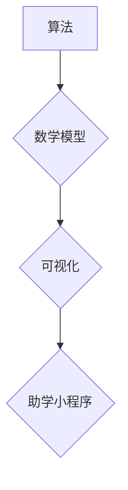

> Python, Turtle库, 可视化, 助学小程序, 算法, 数学模型, 项目实践

## 1. 背景介绍

在当今数字化时代，教育领域也迎来了前所未有的变革。传统的教学模式逐渐被更加生动、互动、直观的学习体验所取代。可视化学习作为一种新兴的教学方法，凭借其直观易懂、生动形象的特点，逐渐成为教育领域的重要组成部分。

Python作为一种简洁易学的编程语言，在教育领域得到了广泛应用。其丰富的库函数和模块，为可视化编程提供了强大的支持。其中，Turtle库作为Python内置的可视化库，以其简单易用、功能丰富的特点，成为了初学者学习编程和探索可视化概念的理想工具。

基于此背景，本文将介绍如何利用Python-Turtle库开发一个扩展助学小程序，通过可视化的方式，帮助学生更好地理解和掌握算法、数学模型等核心概念。

## 2. 核心概念与联系

### 2.1 算法

算法是指解决特定问题的一系列步骤或指令。它是一种逻辑化的思维过程，通过明确的步骤和规则，将问题分解成更小的子问题，最终达到解决问题的目的。

### 2.2 数学模型

数学模型是指用数学语言和符号来描述现实世界现象或问题的抽象表示。它通过建立数学方程、不等式等，来模拟和分析现实世界中的复杂关系。

### 2.3 可视化

可视化是指将抽象的数据或概念转化为图形、图表等直观易懂的视觉形式，以帮助人们更好地理解和分析信息。

**核心概念与联系流程图:**



## 3. 核心算法原理 & 具体操作步骤

### 3.1 算法原理概述

本文将采用递归算法来实现图形绘制。递归算法是一种自调用自身函数的算法，它将问题分解成与原问题相似的子问题，直到子问题可以被直接解决为止。

### 3.2 算法步骤详解

1. **定义函数:** 定义一个名为`draw_fractal`的函数，该函数接受一个参数`n`，表示递归深度。

2. **边界条件:** 当`n`等于0时，绘制一个单位正方形。

3. **递归步骤:** 当`n`大于0时，绘制一个正方形，然后递归调用`draw_fractal`函数，将`n`减1，并在正方形的四个角绘制四个子正方形。

### 3.3 算法优缺点

**优点:**

* 能够生成复杂的图形图案。
* 算法简洁易懂。

**缺点:**

* 递归深度过大会导致栈溢出错误。
* 计算复杂度较高。

### 3.4 算法应用领域

递归算法广泛应用于计算机科学领域，例如：

* 图形绘制
* 数据结构的实现
* 搜索算法
* 编译器设计

## 4. 数学模型和公式 & 详细讲解 & 举例说明

### 4.1 数学模型构建

本文将使用几何图形的性质来构建数学模型，例如正方形的边长、角度等。

### 4.2 公式推导过程

假设正方形的边长为`s`，则子正方形的边长为`s/2`。

递归深度为`n`时，正方形的边长为`s * (1/2)^n`。

### 4.3 案例分析与讲解

当`n`等于3时，正方形的边长为`s * (1/2)^3 = s/8`。

## 5. 项目实践：代码实例和详细解释说明

### 5.1 开发环境搭建

* Python 3.x 环境
* 安装 Turtle 库

```bash
pip install turtle
```

### 5.2 源代码详细实现

```python
import turtle

def draw_fractal(n, s):
    if n == 0:
        turtle.forward(s)
        turtle.left(90)
        turtle.forward(s)
        turtle.left(90)
        turtle.forward(s)
        turtle.left(90)
        turtle.forward(s)
        turtle.left(90)
    else:
        turtle.forward(s/2)
        turtle.left(90)
        draw_fractal(n-1, s/2)
        turtle.right(90)
        draw_fractal(n-1, s/2)
        turtle.right(90)
        draw_fractal(n-1, s/2)
        turtle.right(90)
        draw_fractal(n-1, s/2)
        turtle.left(90)
        turtle.backward(s/2)

# 设置画布大小
turtle.setup(width=600, height=600)

# 设置画笔颜色
turtle.color("blue")

# 设置画笔粗细
turtle.pensize(3)

# 设置初始位置
turtle.penup()
turtle.goto(0, -200)
turtle.pendown()

# 调用函数绘制图形
draw_fractal(5, 400)

# 保持窗口打开
turtle.done()
```

### 5.3 代码解读与分析

* `draw_fractal`函数实现递归绘制图形。
* `n`参数表示递归深度，`s`参数表示正方形边长。
* 当`n`等于0时，绘制一个单位正方形。
* 当`n`大于0时，绘制一个正方形，然后递归调用`draw_fractal`函数，将`n`减1，并在正方形的四个角绘制四个子正方形。

### 5.4 运行结果展示

运行代码后，将生成一个类似于雪花的图形图案。

## 6. 实际应用场景

### 6.1 教育领域

* 帮助学生理解递归算法的原理和应用。
* 通过可视化的方式，帮助学生理解数学模型的构建过程。
* 作为编程教学的辅助工具，帮助学生掌握编程基础知识。

### 6.2 艺术创作

* 利用递归算法生成复杂的图形图案，用于艺术创作。
* 通过可视化的方式，探索新的艺术表达形式。

### 6.3 科学研究

* 利用递归算法模拟自然现象，例如雪花、树枝等。
* 通过可视化的方式，分析和研究复杂系统。

### 6.4 未来应用展望

随着人工智能和可视化技术的不断发展，基于Python-Turtle库的扩展助学小程序将拥有更广泛的应用场景，例如：

* 虚拟现实和增强现实教育
* 个性化学习平台
* 数据可视化分析工具

## 7. 工具和资源推荐

### 7.1 学习资源推荐

* Python官方文档: https://docs.python.org/3/
* Turtle库文档: https://docs.python.org/3/library/turtle.html
* 在线编程平台: https://www.codecademy.com/

### 7.2 开发工具推荐

* PyCharm: https://www.jetbrains.com/pycharm/
* VS Code: https://code.visualstudio.com/

### 7.3 相关论文推荐

* "A Survey of Fractal Image Compression"
* "Visual Programming for Education: A Review"

## 8. 总结：未来发展趋势与挑战

### 8.1 研究成果总结

本文介绍了如何利用Python-Turtle库开发一个扩展助学小程序，通过可视化的方式，帮助学生更好地理解和掌握算法、数学模型等核心概念。

### 8.2 未来发展趋势

* 结合人工智能技术，开发更加智能化的助学小程序。
* 利用虚拟现实和增强现实技术，打造更加沉浸式的学习体验。
* 开发更加丰富的可视化工具，支持更多学科的教学。

### 8.3 面临的挑战

* 如何设计更加高效、易用的可视化工具。
* 如何将可视化学习与传统教学模式相结合。
* 如何保证可视化学习的准确性和有效性。

### 8.4 研究展望

未来，我们将继续致力于开发更加先进的可视化学习工具，为教育领域的发展贡献力量。

## 9. 附录：常见问题与解答

### 9.1 问题：代码运行后，图形没有显示出来？

### 9.2 问题：如何调整图形的大小和颜色？

### 9.3 问题：如何修改递归算法的深度？


作者：禅与计算机程序设计艺术 / Zen and the Art of Computer Programming 
<end_of_turn>