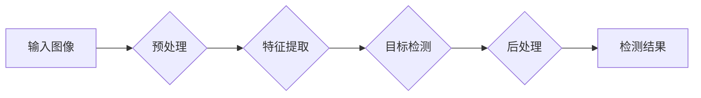

> YOLOv3, 安全帽检测, 深度学习, 图像识别, 工业安全

## 1. 背景介绍

在现代社会，安全生产已成为各行各业的重中之重。尤其是在施工现场，安全帽作为重要的个人防护装备，能够有效降低因坠落物或其他意外伤害造成的风险。然而，由于施工现场环境复杂、人员流动频繁，传统的安全帽佩戴监管方式难以有效保障安全。因此，利用人工智能技术实现安全帽佩戴情况的自动检测，成为保障施工现场安全生产的重要手段。

图像识别技术作为人工智能领域的重要分支，在安全帽检测方面展现出巨大的潜力。近年来，基于深度学习的图像识别算法取得了显著的进展，其中YOLOv3算法凭借其速度快、精度高、易于部署等特点，成为安全帽检测领域的研究热点。

## 2. 核心概念与联系

### 2.1  YOLOv3算法概述

YOLOv3（You Only Look Once，一次只看）是一种基于深度学习的实时目标检测算法，其核心思想是将图像分割成网格，每个网格单元负责预测该区域内是否存在目标，以及目标的类别和位置信息。

YOLOv3算法相较于其前代版本YOLOv1和YOLOv2，在精度和速度方面都有了显著提升。其主要改进包括：

* **改进的网络结构:** YOLOv3采用了Darknet-53网络作为主干网络，该网络具有较强的特征提取能力。
* **多尺度特征融合:** YOLOv3引入了多尺度特征融合机制，能够更好地捕捉目标物体的不同尺度特征。
* **改进的损失函数:** YOLOv3采用了改进的损失函数，能够更好地平衡定位精度和分类精度。

### 2.2  安全帽检测流程

基于YOLOv3的安全帽检测流程主要包括以下步骤：

1. **图像预处理:** 对输入图像进行尺寸调整、归一化等预处理操作，以提高算法的性能。
2. **特征提取:** 将预处理后的图像输入到YOLOv3网络中，提取图像特征。
3. **目标检测:** YOLOv3网络根据提取的特征，预测图像中安全帽的类别、位置和尺寸信息。
4. **后处理:** 对检测结果进行非极大值抑制等操作，去除冗余检测框，最终输出检测结果。

**Mermaid 流程图**



## 3. 核心算法原理 & 具体操作步骤

### 3.1  算法原理概述

YOLOv3算法的核心思想是将输入图像划分为多个网格单元，每个网格单元负责预测该区域内是否存在目标，以及目标的类别和位置信息。

YOLOv3算法采用了一种端到端的训练方式，即从输入图像到输出检测结果，整个过程都是通过神经网络进行学习和预测。

### 3.2  算法步骤详解

1. **图像分割:** 将输入图像划分为S x S个网格单元。
2. **特征提取:** 将每个网格单元的图像特征输入到Darknet-53网络中进行提取。
3. **预测:** 每个网格单元会预测多个bounding box，每个bounding box包含目标的类别概率、中心点坐标和尺寸信息。
4. **非极大值抑制:** 对每个类别进行非极大值抑制，去除冗余的检测框。
5. **输出结果:** 将最终的检测结果输出，包括目标的类别、位置和置信度。

### 3.3  算法优缺点

**优点:**

* **速度快:** YOLOv3算法的检测速度非常快，能够实现实时目标检测。
* **精度高:** YOLOv3算法的检测精度较高，能够准确地检测出目标。
* **易于部署:** YOLOv3算法的部署非常简单，能够在多种硬件平台上运行。

**缺点:**

* **对小目标检测能力有限:** YOLOv3算法对小目标的检测能力相对较弱。
* **边界框回归精度有限:** YOLOv3算法的边界框回归精度相对较低，可能会导致检测框的尺寸不准确。

### 3.4  算法应用领域

YOLOv3算法在安全帽检测领域具有广泛的应用前景，例如：

* **施工现场安全监管:** 自动检测施工人员佩戴安全帽情况，及时提醒未佩戴安全帽的工人。
* **工厂安全管理:** 自动检测工人佩戴安全帽情况，提高工厂安全生产水平。
* **交通安全监控:** 自动检测驾驶员佩戴安全帽情况，预防交通事故发生。

## 4. 数学模型和公式 & 详细讲解 & 举例说明

### 4.1  数学模型构建

YOLOv3算法的核心数学模型是基于卷积神经网络的回归模型，其目标是预测每个网格单元内目标的类别概率、中心点坐标和尺寸信息。

**类别概率预测:**

对于每个网格单元，YOLOv3算法会预测多个类别概率，每个类别概率代表该网格单元内目标属于该类别的概率。

**中心点坐标预测:**

YOLOv3算法会预测每个bounding box的中心点坐标，中心点坐标的预测值与实际中心点坐标之间的误差被最小化。

**尺寸信息预测:**

YOLOv3算法会预测每个bounding box的宽度和高度，宽度和高度的预测值与实际尺寸之间的误差被最小化。

### 4.2  公式推导过程

YOLOv3算法的损失函数由以下几个部分组成：

* **分类损失:** 使用交叉熵损失函数计算类别概率预测的误差。
* **位置损失:** 使用均方误差损失函数计算中心点坐标和尺寸信息的预测误差。
* **置信度损失:** 使用二元交叉熵损失函数计算目标是否存在于该网格单元的预测误差。

**公式推导过程:**

* **分类损失:**

$$
L_{cls} = -\sum_{i=1}^{N} \sum_{c=1}^{C} y_{i}^{c} \log(p_{i}^{c})
$$

* **位置损失:**

$$
L_{loc} = \sum_{i=1}^{N} \sum_{b=1}^{B} \left( \left| x_{i}^{b} - \hat{x}_{i}^{b} \right| + \left| y_{i}^{b} - \hat{y}_{i}^{b} \right| + \left| w_{i}^{b} - \hat{w}_{i}^{b} \right| + \left| h_{i}^{b} - \hat{h}_{i}^{b} \right| \right)
$$

* **置信度损失:**

$$
L_{conf} = -\sum_{i=1}^{N} \left( y_{i} \log(p_{i}) + (1-y_{i}) \log(1-p_{i}) \right)
$$

**其中:**

* $y_{i}^{c}$: 真实标签，表示第i个网格单元内目标属于第c类别的标签。
* $p_{i}^{c}$: 模型预测的类别概率，表示第i个网格单元内目标属于第c类别的概率。
* $x_{i}^{b}$, $y_{i}^{b}$, $w_{i}^{b}$, $h_{i}^{b}$: 真实标签的中心点坐标和尺寸信息。
* $\hat{x}_{i}^{b}$, $\hat{y}_{i}^{b}$, $\hat{w}_{i}^{b}$, $\hat{h}_{i}^{b}$: 模型预测的中心点坐标和尺寸信息。
* $y_{i}$: 真实标签，表示第i个网格单元内是否存在目标。
* $p_{i}$: 模型预测的置信度，表示第i个网格单元内是否存在目标的概率。

### 4.3  案例分析与讲解

假设我们有一个输入图像，其中包含一个安全帽。YOLOv3算法会将图像分割成多个网格单元，然后对每个网格单元进行预测。

如果某个网格单元内存在安全帽，YOLOv3算法会预测该网格单元内目标的类别概率、中心点坐标和尺寸信息。

例如，如果某个网格单元内存在安全帽，YOLOv3算法可能会预测：

* 类别概率: 安全帽类别概率为0.9，其他类别概率为0.1。
* 中心点坐标: (x, y) = (0.5, 0.7)。
* 尺寸信息: 宽度为0.2，高度为0.3。

## 5. 项目实践：代码实例和详细解释说明

### 5.1  开发环境搭建

为了实现基于YOLOv3的安全帽检测项目，我们需要搭建一个合适的开发环境。

**硬件要求:**

* CPU: Intel Core i7 或以上
* GPU: NVIDIA GeForce GTX 1080 或以上

**软件要求:**

* Python 3.6 或以上
* TensorFlow 或 PyTorch 深度学习框架
* OpenCV 图像处理库
* CUDA 和 cuDNN 深度学习加速库

### 5.2  源代码详细实现

YOLOv3的源代码可以从GitHub上获取，地址为：https://github.com/ultralytics/yolov3

**代码实现步骤:**

1. 下载YOLOv3源代码。
2. 安装依赖库。
3. 修改配置文件，设置训练参数和数据路径。
4. 训练模型。
5. 评估模型性能。
6. 部署模型。

**代码示例:**

```python
import tensorflow as tf

# 定义模型结构
model = tf.keras.models.Sequential([
    # ...
])

# 编译模型
model.compile(optimizer='adam',
              loss='categorical_crossentropy',
              metrics=['accuracy'])

# 训练模型
model.fit(x_train, y_train, epochs=10)
```

### 5.3  代码解读与分析

**代码解读:**

* **模型结构定义:** 代码中定义了YOLOv3模型的结构，包括卷积层、池化层、全连接层等。
* **模型编译:** 代码中编译了YOLOv3模型，设置了优化器、损失函数和评价指标。
* **模型训练:** 代码中训练了YOLOv3模型，使用训练数据进行训练，并设置训练轮数。

**代码分析:**

* YOLOv3模型的结构设计非常复杂，包含多个卷积层和池化层，能够提取图像特征。
* 损失函数和优化器的选择对模型训练效果有重要影响。
* 训练数据的大小和质量对模型性能有直接影响。

### 5.4  运行结果展示

训练完成后，我们可以使用测试数据评估模型的性能。

**性能指标:**

* **精度:** 模型正确预测目标的比例。
* **召回率:** 模型能够正确识别出所有目标的比例。
* **F1-score:** 精度和召回率的调和平均值。

**结果展示:**

我们可以使用图像可视化工具展示模型的检测结果，例如将检测框绘制在输入图像上。

## 6. 实际应用场景

### 6.1  施工现场安全监管

在施工现场，安全帽是必不可少的个人防护装备。然而，由于施工现场环境复杂、人员流动频繁，传统的安全帽佩戴监管方式难以有效保障安全。基于YOLOv3的安全帽检测算法可以自动检测施工人员佩戴安全帽情况，及时提醒未佩戴安全帽的工人，有效提高施工现场的安全生产水平。

### 6.2  工厂安全管理

在工厂生产过程中，安全帽也是重要的个人防护装备。基于YOLOv3的安全帽检测算法可以自动检测工人佩戴安全帽情况，并与其他安全监控系统集成，形成全面的安全管理体系，提高工厂安全生产水平。

### 6.3  交通安全监控

在交通安全监控中，驾驶员佩戴安全帽是重要的安全措施。基于YOLOv3的安全帽检测算法可以自动检测驾驶