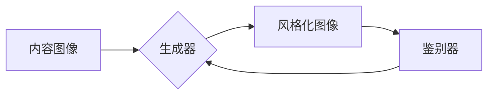

> 生成对抗网络 (GAN)，图像风格迁移，商品包装设计，艺术风格，个性化定制

## 1. 背景介绍

随着电商平台的蓬勃发展，商品包装设计已成为品牌营销和产品推广的重要环节。消费者对个性化、独特的产品包装需求日益增长，传统的设计方法难以满足这一需求。图像风格迁移技术作为一种新兴的图像处理技术，能够将一种图像的风格迁移到另一幅图像上，为商品包装设计提供了新的思路和可能性。

生成对抗网络 (GAN) 是一种强大的深度学习模型，能够生成逼真的图像数据。近年来，基于 GAN 的图像风格迁移技术取得了显著进展，在艺术创作、图像编辑等领域得到了广泛应用。将 GAN 应用于商品包装设计，可以实现以下优势：

* **个性化定制:**  消费者可以根据自己的喜好选择不同的艺术风格，定制独一无二的商品包装。
* **提升品牌形象:**  独特的包装设计可以增强品牌辨识度，提升品牌形象。
* **增强产品吸引力:**  艺术风格的包装设计可以吸引消费者的眼球，提升产品吸引力。

## 2. 核心概念与联系

### 2.1  图像风格迁移

图像风格迁移是指将一幅图像的风格迁移到另一幅图像上，保留原始图像的内容，同时改变其视觉风格。例如，将梵高的绘画风格迁移到一张风景照片上，使照片呈现出梵高的艺术风格。

### 2.2  生成对抗网络 (GAN)

GAN 由两个神经网络组成：生成器 (Generator) 和鉴别器 (Discriminator)。生成器负责生成新的图像数据，鉴别器负责判断图像是否为真实图像或生成图像。两者在对抗博弈中相互竞争，生成器不断改进生成图像的质量，鉴别器不断提高识别真实图像的能力。最终，生成器能够生成逼真的图像数据，与真实图像难以区分。

### 2.3  GAN 在图像风格迁移中的应用

在图像风格迁移中，GAN 可以将风格图像的特征迁移到内容图像上。生成器学习生成具有目标风格的图像，鉴别器判断图像是否具有目标风格。通过对抗训练，生成器能够生成具有目标风格的内容图像。

**Mermaid 流程图**



## 3. 核心算法原理 & 具体操作步骤

### 3.1  算法原理概述

基于 GAN 的图像风格迁移算法的核心思想是利用生成器学习目标风格的特征，并将这些特征迁移到内容图像上。具体步骤如下：

1. **预处理:** 将内容图像和风格图像进行预处理，例如调整尺寸、归一化等。
2. **特征提取:** 使用卷积神经网络提取内容图像和风格图像的特征。
3. **风格迁移:** 将风格图像的特征迁移到内容图像上，生成风格化图像。
4. **图像重建:** 将风格化图像进行反向处理，恢复到原始图像尺寸。

### 3.2  算法步骤详解

1. **预处理:** 将内容图像和风格图像进行预处理，例如调整尺寸、归一化等。预处理可以使图像数据更加符合模型的输入要求。
2. **特征提取:** 使用预训练的卷积神经网络 (例如 VGGNet) 提取内容图像和风格图像的特征。卷积神经网络能够学习图像的层次特征，提取图像的语义信息。
3. **风格迁移:** 将风格图像的特征迁移到内容图像上。可以使用 Gram矩阵来衡量图像风格的相似度。Gram矩阵可以表示图像特征的协方差矩阵，可以用来比较不同图像的风格。
4. **图像重建:** 将风格化图像进行反向处理，恢复到原始图像尺寸。可以使用反卷积网络 (Deconvolutional Network) 来进行图像重建。

### 3.3  算法优缺点

**优点:**

* **生成逼真的图像:** GAN 能够生成逼真的图像数据，可以实现高质量的图像风格迁移。
* **灵活的风格选择:** 可以选择不同的风格图像作为参考，生成具有不同风格的图像。
* **个性化定制:** 可以根据用户的需求定制个性化的图像风格。

**缺点:**

* **训练复杂:** GAN 的训练过程比较复杂，需要大量的训练数据和计算资源。
* **模式崩溃:** GAN 容易出现模式崩溃问题，生成器生成的图像可能缺乏多样性。
* **训练不稳定:** GAN 的训练过程不稳定，需要精心调参才能获得好的效果。

### 3.4  算法应用领域

基于 GAN 的图像风格迁移算法在以下领域得到了广泛应用:

* **艺术创作:** 将不同的艺术风格迁移到照片上，创作出具有艺术感的图像。
* **图像编辑:** 将图像的风格进行修改，例如将黑白照片变成彩色照片。
* **游戏开发:** 为游戏角色和场景生成不同的风格。
* **电影特效:** 为电影场景生成不同的风格，例如将现实场景变成科幻场景。

## 4. 数学模型和公式 & 详细讲解 & 举例说明

### 4.1  数学模型构建

**生成器 (G):**

生成器是一个神经网络，其输入是随机噪声，输出是生成图像。

**鉴别器 (D):**

鉴别器也是一个神经网络，其输入是图像，输出是判断图像是否为真实图像的概率。

**损失函数:**

生成器和鉴别器的损失函数分别为：

* **生成器损失函数:**  $L_G = -log(D(G(z)))$

* **鉴别器损失函数:** $L_D = -log(D(x)) - log(1 - D(G(z)))$

其中，$z$ 是随机噪声，$x$ 是真实图像，$D(G(z))$ 是鉴别器对生成图像的判断概率。

### 4.2  公式推导过程

损失函数的推导过程如下：

* **生成器损失函数:** 生成器希望生成能够欺骗鉴别器的图像，因此其损失函数是使鉴别器对生成图像的判断概率最大化。

* **鉴别器损失函数:** 鉴别器希望能够正确区分真实图像和生成图像，因此其损失函数是使对真实图像的判断概率最大化，对生成图像的判断概率最小化。

### 4.3  案例分析与讲解

假设我们想要将梵高的绘画风格迁移到一张风景照片上。

1. **选择风格图像:** 选择一张梵高的绘画作品作为风格图像。
2. **选择内容图像:** 选择一张风景照片作为内容图像。
3. **训练 GAN 模型:** 使用 GAN 模型训练，将梵高的绘画风格迁移到风景照片上。
4. **生成风格化图像:** 使用训练好的 GAN 模型生成风格化图像。

## 5. 项目实践：代码实例和详细解释说明

### 5.1  开发环境搭建

* **操作系统:** Ubuntu 18.04
* **Python 版本:** 3.7
* **深度学习框架:** TensorFlow 2.0
* **其他依赖库:** numpy, matplotlib, PIL

### 5.2  源代码详细实现

```python
# 导入必要的库
import tensorflow as tf
from tensorflow.keras import layers

# 定义生成器模型
def build_generator(input_shape):
    model = tf.keras.Sequential([
        layers.Dense(128 * 7 * 7, use_bias=False, input_shape=input_shape),
        layers.BatchNormalization(),
        layers.LeakyReLU(0.2),
        layers.Reshape((7, 7, 128)),
        layers.Conv2DTranspose(64, (5, 5), strides=(2, 2), padding='same', use_bias=False),
        layers.BatchNormalization(),
        layers.LeakyReLU(0.2),
        layers.Conv2DTranspose(32, (5, 5), strides=(2, 2), padding='same', use_bias=False),
        layers.BatchNormalization(),
        layers.LeakyReLU(0.2),
        layers.Conv2DTranspose(3, (5, 5), strides=(2, 2), padding='same', activation='tanh'),
    ])
    return model

# 定义鉴别器模型
def build_discriminator(input_shape):
    model = tf.keras.Sequential([
        layers.Conv2D(32, (5, 5), strides=(2, 2), padding='same', input_shape=input_shape),
        layers.LeakyReLU(0.2),
        layers.Conv2D(64, (5, 5), strides=(2, 2), padding='same'),
        layers.BatchNormalization(),
        layers.LeakyReLU(0.2),
        layers.Flatten(),
        layers.Dense(1, activation='sigmoid'),
    ])
    return model

# 构建生成器和鉴别器模型
generator = build_generator(input_shape=(100,))
discriminator = build_discriminator(input_shape=(128, 128, 3))

# 定义损失函数和优化器
loss_fn = tf.keras.losses.BinaryCrossentropy()
optimizer_G = tf.keras.optimizers.Adam(1e-4, beta_1=0.5)
optimizer_D = tf.keras.optimizers.Adam(1e-4, beta_1=0.5)

# 训练 GAN 模型
def train_step(real_images):
    # 生成噪声
    noise = tf.random.normal([batch_size, 100])

    # 生成图像
    generated_images = generator(noise)

    # 训练鉴别器
    with tf.GradientTape() as tape_D:
        real_output = discriminator(real_images)
        generated_output = discriminator(generated_images)
        d_loss_real = loss_fn(tf.ones_like(real_output), real_output)
        d_loss_fake = loss_fn(tf.zeros_like(generated_output), generated_output)
        d_loss = d_loss_real + d_loss_fake

    gradients_of_D = tape_D.gradient(d_loss, discriminator.trainable_variables)
    optimizer_D.apply_gradients(zip(gradients_of_D, discriminator.trainable_variables))

    # 训练生成器
    with tf.GradientTape() as tape_G:
        generated_output = discriminator(generated_images)
        g_loss = loss_fn(tf.ones_like(generated_output), generated_output)

    gradients_of_G = tape_G.gradient(g_loss, generator.trainable_variables)
    optimizer_G.apply_gradients(zip(gradients_of_G, generator.trainable_variables))

    return d_loss, g_loss

# 训练循环
for epoch in range(epochs):
    for batch in dataset:
        d_loss, g_loss = train_step(batch)
        print(f'Epoch: {epoch}, Batch: {batch}, D Loss: {d_loss}, G Loss: {g_loss}')

# 保存模型
generator.save('generator_model.h5')
discriminator.save('discriminator_model.h5')

```

### 5.3  代码解读与分析

* **模型构建:** 代码首先定义了生成器和鉴别器的模型结构。生成器是一个解码器，将随机噪声转换为图像。鉴别器是一个编码器，将图像转换为一个概率值，判断图像是否为真实图像。
* **损失函数:** 代码使用二元交叉熵损失函数来训练生成器和鉴别器。
* **训练循环:** 代码使用一个训练循环来训练生成器和鉴别器。在每个训练步骤中，首先生成随机噪声，然后使用生成器生成图像。然后，使用鉴别器判断生成的图像和真实图像是否为真实图像。最后，根据损失函数的梯度更新生成器和鉴别器的参数。
* **模型保存:** 训练完成后，代码将生成器