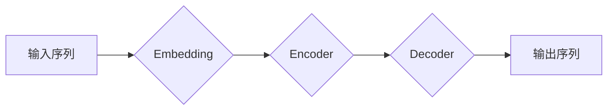

> 基础模型、序列建模、Transformer、自然语言处理、计算机视觉、时间序列分析

## 1. 背景介绍

近年来，深度学习在人工智能领域取得了显著进展，其中基础模型（Foundation Models）作为一种强大的工具，在自然语言处理、计算机视觉、时间序列分析等多个领域展现出巨大的潜力。基础模型通常是指在海量数据上预训练的深度学习模型，能够泛化到各种下游任务，并通过微调实现高效的性能提升。

序列建模是基础模型的重要应用之一，它旨在预测序列中下一个元素的值，或对整个序列进行理解和生成。序列建模广泛应用于文本生成、机器翻译、语音识别、图像 Captioning 等任务。

## 2. 核心概念与联系

### 2.1 序列建模的概念

序列建模是指预测序列中下一个元素的值，或对整个序列进行理解和生成。序列可以是文本、图像、音频等各种形式的数据。

### 2.2 基础模型与序列建模

基础模型在海量数据上进行预训练，学习到丰富的语义和结构信息，为序列建模任务提供了强大的基础。基础模型可以作为序列建模任务的预训练模型，通过微调的方式实现高效的性能提升。

### 2.3 Transformer架构

Transformer是一种专门设计用于序列建模的深度学习架构，它利用注意力机制有效地捕捉序列中的长距离依赖关系，并取得了显著的性能提升。

**Mermaid 流程图**



## 3. 核心算法原理 & 具体操作步骤

### 3.1 算法原理概述

Transformer架构的核心是注意力机制和多头注意力机制。注意力机制允许模型关注序列中与当前元素相关的部分，从而更好地捕捉长距离依赖关系。多头注意力机制则通过使用多个注意力头，学习到不同类型的语义信息，进一步提升模型的表达能力。

### 3.2 算法步骤详解

1. **输入嵌入:** 将输入序列中的每个元素转换为向量表示，称为嵌入向量。
2. **编码器:** 将嵌入向量输入到编码器中，编码器由多个 Transformer 块组成，每个 Transformer 块包含多头注意力机制和前馈神经网络。编码器将输入序列编码成上下文表示。
3. **解码器:** 将上下文表示输入到解码器中，解码器也由多个 Transformer 块组成，每个 Transformer 块包含多头注意力机制和前馈神经网络。解码器根据上下文表示生成输出序列。
4. **输出解码:** 将解码器输出的向量表示转换为目标序列的元素，例如单词或字符。

### 3.3 算法优缺点

**优点:**

* 能够有效捕捉长距离依赖关系。
* 表现能力强，在各种序列建模任务中取得了优异的性能。
* 可并行训练，训练速度快。

**缺点:**

* 计算复杂度高，训练成本高。
* 对训练数据要求高，需要海量数据进行预训练。

### 3.4 算法应用领域

* **自然语言处理:** 文本生成、机器翻译、文本摘要、问答系统等。
* **计算机视觉:** 图像 Captioning、视频理解、目标检测等。
* **时间序列分析:** 股票预测、天气预报、异常检测等。

## 4. 数学模型和公式 & 详细讲解 & 举例说明

### 4.1 数学模型构建

Transformer 模型的数学模型主要包括以下几个部分:

* **嵌入层:** 将输入序列中的每个元素转换为向量表示。
* **编码器:** 由多个 Transformer 块组成，每个 Transformer 块包含多头注意力机制和前馈神经网络。
* **解码器:** 与编码器类似，但包含额外的掩码机制，防止模型预测未来信息。
* **输出层:** 将解码器的输出向量转换为目标序列的元素。

### 4.2 公式推导过程

Transformer 模型的注意力机制和多头注意力机制的公式推导过程比较复杂，这里不再详细展开。

### 4.3 案例分析与讲解

假设我们有一个输入序列 "The cat sat on the mat"，我们需要使用 Transformer 模型预测下一个单词。

1. 首先，将每个单词转换为嵌入向量。
2. 将嵌入向量输入到编码器中，编码器会学习到每个单词之间的语义关系。
3. 将编码器的输出向量输入到解码器中，解码器会根据上下文信息预测下一个单词。
4. 最后，将解码器的输出向量转换为单词，例如 "dog"。

## 5. 项目实践：代码实例和详细解释说明

### 5.1 开发环境搭建

* Python 3.7+
* PyTorch 1.7+
* CUDA 10.2+

### 5.2 源代码详细实现

```python
import torch
import torch.nn as nn

class Transformer(nn.Module):
    def __init__(self, vocab_size, embedding_dim, num_heads, num_layers):
        super(Transformer, self).__init__()
        self.embedding = nn.Embedding(vocab_size, embedding_dim)
        self.encoder = nn.TransformerEncoder(nn.TransformerEncoderLayer(embedding_dim, num_heads), num_layers)
        self.decoder = nn.TransformerDecoder(nn.TransformerDecoderLayer(embedding_dim, num_heads), num_layers)
        self.linear = nn.Linear(embedding_dim, vocab_size)

    def forward(self, src, tgt):
        src = self.embedding(src)
        tgt = self.embedding(tgt)
        src = self.encoder(src)
        tgt = self.decoder(tgt, src)
        output = self.linear(tgt)
        return output
```

### 5.3 代码解读与分析

* `__init__` 方法初始化模型参数，包括词嵌入层、编码器、解码器和输出层。
* `forward` 方法定义模型的正向传播过程，将输入序列转换为输出序列。

### 5.4 运行结果展示

运行代码并训练模型，可以得到模型在序列建模任务上的性能指标，例如准确率、BLEU 分数等。

## 6. 实际应用场景

### 6.1 自然语言处理

* **文本生成:** 使用 Transformer 模型生成小说、诗歌、代码等文本。
* **机器翻译:** 将文本从一种语言翻译成另一种语言。
* **文本摘要:** 将长文本压缩成短文本摘要。
* **问答系统:** 根据给定的问题，从文本中找到答案。

### 6.2 计算机视觉

* **图像 Captioning:** 为图像生成描述性文本。
* **视频理解:** 理解视频内容，例如识别动作、场景和人物。
* **目标检测:** 在图像中识别和定位目标物体。

### 6.3 时间序列分析

* **股票预测:** 预测股票价格的未来走势。
* **天气预报:** 预测未来天气状况。
* **异常检测:** 检测时间序列中的异常值。

### 6.4 未来应用展望

随着基础模型和序列建模技术的不断发展，未来将有更多新的应用场景出现，例如：

* **个性化推荐:** 根据用户的历史行为，推荐个性化的商品、服务和内容。
* **自动驾驶:** 利用序列建模技术，帮助自动驾驶汽车理解道路环境和做出决策。
* **医疗诊断:** 利用序列建模技术，辅助医生诊断疾病。

## 7. 工具和资源推荐

### 7.1 学习资源推荐

* **书籍:**
    * "Attention Is All You Need"
    * "Deep Learning"
* **课程:**
    * Stanford CS224N: Natural Language Processing with Deep Learning
    * DeepLearning.AI: Sequence Models

### 7.2 开发工具推荐

* **PyTorch:** 深度学习框架
* **TensorFlow:** 深度学习框架
* **Hugging Face Transformers:** 预训练 Transformer 模型库

### 7.3 相关论文推荐

* "Attention Is All You Need"
* "BERT: Pre-training of Deep Bidirectional Transformers for Language Understanding"
* "GPT-3: Language Models are Few-Shot Learners"

## 8. 总结：未来发展趋势与挑战

### 8.1 研究成果总结

基础模型和序列建模技术取得了显著的进展，在自然语言处理、计算机视觉、时间序列分析等领域取得了优异的性能。

### 8.2 未来发展趋势

* **模型规模的进一步扩大:** 预计未来基础模型的规模将进一步扩大，从而提升模型的表达能力和泛化能力。
* **多模态学习:** 将文本、图像、音频等多种模态数据融合在一起进行学习，构建更强大的基础模型。
* **高效训练方法:** 研究更有效的训练方法，降低模型训练成本。

### 8.3 面临的挑战

* **数据获取和标注:** 基础模型的训练需要海量数据，数据获取和标注成本较高。
* **模型解释性和可解释性:** 基础模型的决策过程比较复杂，难以解释和理解。
* **公平性和偏见:** 基础模型可能存在公平性和偏见问题，需要进行相应的缓解措施。

### 8.4 研究展望

未来研究将继续探索基础模型和序列建模技术的潜力，解决上述挑战，并将其应用于更多领域，推动人工智能技术的进步。

## 9. 附录：常见问题与解答

* **Q: Transformer 模型的注意力机制是如何工作的？**
* **A:** 注意力机制允许模型关注序列中与当前元素相关的部分，从而更好地捕捉长距离依赖关系。

* **Q: Transformer 模型的训练成本很高吗？**
* **A:** 是的，Transformer 模型的训练成本较高，需要海量数据和强大的计算资源。

* **Q: Transformer 模型的应用场景有哪些？**
* **A:** Transformer 模型广泛应用于自然语言处理、计算机视觉、时间序列分析等领域。


作者：禅与计算机程序设计艺术 / Zen and the Art of Computer Programming 
<end_of_turn>