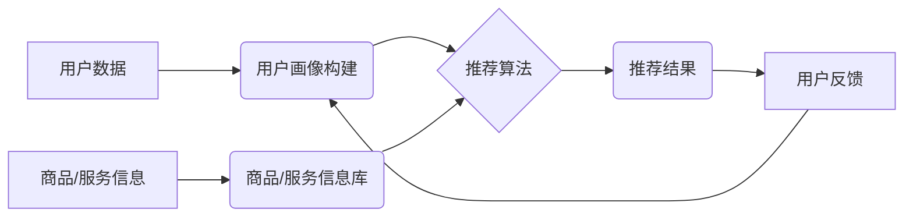

> 个性化推荐, 算法原理, 提升客单价, 数据挖掘, 机器学习, 协同过滤, 内容过滤, 深度学习

## 1. 背景介绍

在当今数据爆炸的时代，企业积累了海量的用户数据，如何有效利用这些数据提升用户体验和商业价值成为一个关键问题。个性化推荐作为一种数据驱动型技术，能够根据用户的兴趣、行为和偏好，精准推荐相关商品或服务，从而提升用户满意度、促进交易转化，最终实现增加客单价的目标。

传统的推荐系统往往采用基于规则或基于内容的推荐方法，但这些方法缺乏灵活性，难以捕捉用户复杂的需求。随着机器学习和深度学习技术的快速发展，个性化推荐系统迎来了新的突破。基于机器学习的个性化推荐系统能够从海量用户数据中挖掘出隐藏的模式和关系，并根据这些模式为用户提供更精准、更个性化的推荐，从而有效提升客单价。

## 2. 核心概念与联系

个性化推荐的核心在于理解用户的需求和偏好，并根据这些理解为用户提供个性化的服务。

**2.1 核心概念**

* **用户画像:** 通过收集用户的行为数据、偏好数据、人口统计数据等，构建用户画像，以便更好地理解用户的需求和特征。
* **商品/服务信息:** 收集商品/服务的属性信息、描述信息、评论信息等，构建商品/服务信息库，以便更好地匹配用户需求。
* **推荐算法:** 利用机器学习算法，从用户画像和商品/服务信息中挖掘出潜在的关系，并预测用户对特定商品/服务的兴趣和偏好。

**2.2 架构图**



## 3. 核心算法原理 & 具体操作步骤

**3.1 算法原理概述**

个性化推荐算法主要分为两大类：协同过滤和内容过滤。

* **协同过滤:** 基于用户的行为相似性进行推荐。例如，如果用户A和用户B都喜欢购买相同的商品，那么当用户A购买了新的商品时，系统会推荐该商品给用户B。
* **内容过滤:** 基于商品/服务的属性信息进行推荐。例如，如果用户A喜欢购买运动鞋，那么系统会推荐其他运动鞋类型的商品给用户A。

**3.2 算法步骤详解**

**协同过滤算法步骤:**

1. **数据预处理:** 收集用户行为数据，例如用户对商品的评分、购买记录等，并进行清洗、处理和转换。
2. **相似度计算:** 计算用户之间的相似度，可以使用余弦相似度、皮尔逊相关系数等方法。
3. **推荐生成:** 根据用户之间的相似度，从相似用户的购买记录中推荐商品给目标用户。

**内容过滤算法步骤:**

1. **特征提取:** 从商品/服务的属性信息中提取特征，例如商品类别、品牌、价格等。
2. **用户偏好建模:** 建立用户对不同特征的偏好模型，可以使用机器学习算法，例如逻辑回归、支持向量机等。
3. **推荐生成:** 根据用户的偏好模型，从商品/服务信息库中推荐符合用户偏好的商品/服务。

**3.3 算法优缺点**

**协同过滤算法:**

* **优点:** 可以发现用户之间的隐性关系，推荐更精准的商品。
* **缺点:** 数据稀疏性问题，当用户行为数据不足时，算法效果会下降。

**内容过滤算法:**

* **优点:** 不需要用户行为数据，可以推荐新商品。
* **缺点:** 难以捕捉用户复杂的兴趣偏好。

**3.4 算法应用领域**

个性化推荐算法广泛应用于电商、视频网站、音乐平台、社交媒体等领域，例如：

* **电商平台:** 推荐商品、优惠券、促销活动等。
* **视频网站:** 推荐视频、电视剧、电影等。
* **音乐平台:** 推荐歌曲、专辑、音乐人等。
* **社交媒体:** 推荐好友、群组、话题等。

## 4. 数学模型和公式 & 详细讲解 & 举例说明

**4.1 数学模型构建**

协同过滤算法中常用的数学模型是矩阵分解模型。假设用户集合为U，商品集合为I，用户对商品的评分矩阵为R，其中R(u,i)表示用户u对商品i的评分。

矩阵分解模型将评分矩阵R分解成两个低维矩阵：用户特征矩阵U和商品特征矩阵V。

**4.2 公式推导过程**

R(u,i) ≈ u<sup>T</sup>v<sub>i</sub>

其中，u<sup>T</sup>表示用户u的特征向量，v<sub>i</sub>表示商品i的特征向量。

**4.3 案例分析与讲解**

假设用户A对电影1评分为4，对电影2评分为3，用户B对电影1评分为5，对电影2评分为4。

我们可以将用户和电影的评分信息表示为一个评分矩阵：

```
R = [
    [4, 3],
    [5, 4]
]
```

通过矩阵分解模型，我们可以将评分矩阵分解成两个低维矩阵：

* 用户特征矩阵U：

```
U = [
    [0.8, 0.6],
    [1.2, 0.8]
]
```

* 商品特征矩阵V：

```
V = [
    [0.6, 0.8],
    [0.8, 0.6]
]
```

通过计算u<sup>T</sup>v<sub>i</sub>，我们可以预测用户A对电影3的评分。

## 5. 项目实践：代码实例和详细解释说明

**5.1 开发环境搭建**

* Python 3.x
* scikit-learn
* pandas
* numpy

**5.2 源代码详细实现**

```python
import pandas as pd
from sklearn.metrics.pairwise import cosine_similarity

# 加载用户评分数据
ratings_data = pd.read_csv('ratings.csv')

# 计算用户之间的相似度
user_similarity = cosine_similarity(ratings_data)

# 获取用户A的ID
user_a_id = 1

# 获取用户A喜欢的电影
user_a_liked_movies = ratings_data[ratings_data['user_id'] == user_a_id][['movie_id', 'rating']].sort_values(by='rating', ascending=False)

# 推荐给用户A的电影
recommended_movies = []
for movie_id in user_a_liked_movies['movie_id']:
    similar_users = user_similarity[user_a_id].argsort()[:-10:-1]
    for similar_user_id in similar_users:
        if ratings_data[ratings_data['user_id'] == similar_user_id]['movie_id'].isin([movie_id]).any():
            continue
        recommended_movies.append(movie_id)
        break

# 打印推荐结果
print(f'推荐给用户A的电影：{recommended_movies}')
```

**5.3 代码解读与分析**

* 代码首先加载用户评分数据，并计算用户之间的相似度。
* 然后获取用户A的ID，并获取用户A喜欢的电影。
* 接着，代码遍历用户A喜欢的电影，并找到与用户A相似度高的用户，从这些用户的评分数据中推荐新的电影给用户A。
* 最后，代码打印推荐结果。

**5.4 运行结果展示**

运行代码后，会输出一个包含推荐电影ID的列表。

## 6. 实际应用场景

个性化推荐技术在电商平台、视频网站、音乐平台等领域得到了广泛应用。

**6.1 电商平台**

* **商品推荐:** 根据用户的浏览历史、购买记录、收藏列表等数据，推荐用户可能感兴趣的商品。
* **优惠券推荐:** 根据用户的消费习惯和偏好，推荐用户可用的优惠券。
* **促销活动推荐:** 根据用户的兴趣和需求，推荐用户参与的促销活动。

**6.2 视频网站**

* **视频推荐:** 根据用户的观看历史、点赞记录、评论等数据，推荐用户可能感兴趣的视频。
* **电视剧推荐:** 根据用户的观看历史、评分等数据，推荐用户可能感兴趣的电视剧。
* **电影推荐:** 根据用户的观看历史、评分等数据，推荐用户可能感兴趣的电影。

**6.3 音乐平台**

* **歌曲推荐:** 根据用户的播放历史、收藏列表、点赞等数据，推荐用户可能感兴趣的歌曲。
* **专辑推荐:** 根据用户的播放历史、收藏列表、点赞等数据，推荐用户可能感兴趣的专辑。
* **音乐人推荐:** 根据用户的播放历史、收藏列表、点赞等数据，推荐用户可能感兴趣的音乐人。

**6.4 未来应用展望**

随着人工智能技术的不断发展，个性化推荐技术将更加智能化、精准化。未来，个性化推荐技术将应用于更多领域，例如：

* **教育:** 根据学生的学习进度和兴趣，推荐个性化的学习内容。
* **医疗:** 根据患者的病史和症状，推荐个性化的治疗方案。
* **金融:** 根据用户的理财需求和风险偏好，推荐个性化的理财产品。

## 7. 工具和资源推荐

**7.1 学习资源推荐**

* **书籍:**
    * 《推荐系统实践》
    * 《机器学习》
* **在线课程:**
    * Coursera: Recommender Systems
    * edX: Machine Learning

**7.2 开发工具推荐**

* **Python:** 
    * scikit-learn
    * pandas
    * numpy
* **Spark:** 
    * MLlib

**7.3 相关论文推荐**

* **协同过滤:**
    * "Collaborative Filtering for Implicit Feedback Datasets"
* **内容过滤:**
    * "Content-Based Recommendation Systems"
* **深度学习推荐:**
    * "Deep Learning for Recommender Systems"

## 8. 总结：未来发展趋势与挑战

**8.1 研究成果总结**

个性化推荐技术已经取得了显著的成果，能够有效提升用户体验和商业价值。

**8.2 未来发展趋势**

* **更精准的推荐:** 利用深度学习等先进算法，挖掘更深层次的用户需求和偏好，提供更精准的推荐。
* **更个性化的推荐:** 结合用户的多方面信息，例如年龄、性别、兴趣爱好等，提供更个性化的推荐。
* **更跨域的推荐:** 将不同领域的推荐技术融合在一起，例如将电商平台的商品推荐与视频网站的视频推荐结合起来。

**8.3 面临的挑战**

* **数据稀疏性问题:** 当用户行为数据不足时，推荐算法效果会下降。
* **冷启动问题:** 当新用户或新商品加入系统时，由于缺乏数据，难以进行推荐。
* **用户隐私问题:** 个性化推荐需要收集用户的个人信息，如何保护用户隐私是一个重要的挑战。

**8.4 研究展望**

未来，个性化推荐技术将继续朝着更精准、更个性化、更跨域的方向发展。研究者们将继续探索新的算法和技术，以解决数据稀疏性、冷启动和用户隐私等问题，为用户提供更优质的体验。

## 9. 附录：常见问题与解答

**9.1 如何解决数据稀疏性问题？**

* 利用协同过滤算法中的矩阵分解模型，将稀疏的评分矩阵分解成低维矩阵，从而降低数据稀疏性的影响。
* 利用内容过滤算法，从商品/服务的属性信息中提取特征，即使用户行为数据不足，也可以进行推荐。
* 利用混合推荐算法，将协同过滤和内容过滤算法结合起来，发挥各自的优势。

**9.2 如何解决冷启动问题？**

* 利用用户画像信息，例如用户的年龄、性别、兴趣爱好等，对新用户进行初步的推荐。
* 利用商品/服务的属性信息，例如商品类别、品牌、价格等，对新商品进行初步的推荐。
* 利用其他用户的行为数据，例如用户的浏览