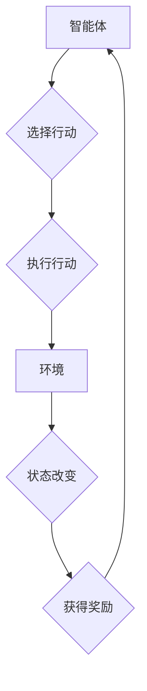

> 奖励机制、强化学习、深度学习、目标函数、反馈机制、模型训练、算法优化、应用场景

## 1. 背景介绍

在人工智能领域，特别是强化学习领域，奖励机制扮演着至关重要的角色。它如同一个指引，引导智能体在不断探索和学习的过程中，朝着预期的目标前进。 

强化学习的核心思想是通过试错学习，让智能体在与环境交互的过程中，通过获得奖励来学习最优策略。奖励机制的设置直接影响着智能体的学习效果，它决定了智能体会如何评估自己的行为，并根据评估结果调整未来的行动。

## 2. 核心概念与联系

**2.1 核心概念**

* **智能体 (Agent):**  执行行动并与环境交互的实体。
* **环境 (Environment):** 智能体所处的外部世界，它会根据智能体的行动做出相应的反应。
* **状态 (State):** 环境在特定时刻的描述。
* **行动 (Action):** 智能体可以执行的操作，它会改变环境的状态。
* **奖励 (Reward):** 智能体在执行某个行动后获得的反馈信号，它可以是正数、负数或零。

**2.2 奖励机制与强化学习的关系**

奖励机制是强化学习的核心组成部分。它通过反馈信号来指导智能体的学习过程。智能体会根据获得的奖励来评估自己的行为，并尝试执行能够获得更高奖励的行动。

**2.3 奖励机制的类型**

* **离散奖励:**  奖励是离散的，例如，游戏中的积分或完成任务的奖励。
* **连续奖励:**  奖励是连续的，例如，机器人控制任务中的误差值。
* **即时奖励:**  奖励在执行行动后立即获得。
* **延迟奖励:**  奖励在执行行动后延迟获得。

**2.4 Mermaid 流程图**



## 3. 核心算法原理 & 具体操作步骤

**3.1 算法原理概述**

强化学习算法的核心目标是学习一个策略，该策略能够使智能体在与环境交互的过程中获得最大的累积奖励。常用的强化学习算法包括：

* **Q-学习:**  通过学习一个Q表，Q表存储了每个状态-行动对的期望奖励。
* **SARSA:**  与Q-学习类似，但SARSA在更新Q表时使用的是当前状态-行动对的实际奖励。
* **深度强化学习:**  利用深度神经网络来学习策略，能够处理更复杂的环境。

**3.2 算法步骤详解**

以Q-学习为例，其算法步骤如下：

1. 初始化Q表，将所有状态-行动对的Q值设置为0。
2. 在环境中进行探索，智能体随机选择行动并执行。
3. 根据环境的反馈，获得奖励和下一个状态。
4. 更新Q表：

```
Q(s, a) = Q(s, a) + α * [r + γ * max(Q(s', a')) - Q(s, a)]
```

其中：

* s: 当前状态
* a: 当前行动
* r: 获得的奖励
* s': 下一个状态
* a': 在下一个状态下选择的最优行动
* α: 学习率
* γ: 折扣因子

5. 重复步骤2-4，直到Q表收敛。

**3.3 算法优缺点**

* **优点:**  相对简单易懂，能够有效地学习策略。
* **缺点:**  需要事先定义状态空间，对于高维状态空间，学习效率较低。

**3.4 算法应用领域**

* **游戏:**  例如，AlphaGo、AlphaZero等游戏AI。
* **机器人控制:**  例如，机器人导航、抓取等任务。
* **推荐系统:**  例如，个性化推荐、内容过滤等。

## 4. 数学模型和公式 & 详细讲解 & 举例说明

**4.1 数学模型构建**

强化学习可以建模为马尔可夫决策过程 (MDP)。MDP由以下五个要素组成：

* 状态空间 S: 所有可能的系统状态的集合。
* 行动空间 A: 在每个状态下可执行的行动的集合。
* 转移概率 P(s', r | s, a): 从状态 s 执行行动 a 后，转移到状态 s' 并获得奖励 r 的概率。
* 奖励函数 R(s, a): 在状态 s 执行行动 a 后获得的奖励。
* 折扣因子 γ:  表示未来奖励的价值。

**4.2 公式推导过程**

目标是找到一个策略 π(s) ，该策略能够使智能体在与环境交互的过程中获得最大的累积奖励。

累积奖励可以表示为：

```
R(π) = E[∑_{t=0}^{∞} γ^t * r_t]
```

其中：

* R(π):  策略 π 的累积奖励
* E:  期望值
* r_t:  在时间步 t 获得的奖励

**4.3 案例分析与讲解**

例如，考虑一个简单的迷宫问题。智能体需要从起点走到终点。

* 状态空间 S: 迷宫中的所有格子。
* 行动空间 A: 向上、向下、向左、向右四个方向移动。
* 转移概率 P(s', r | s, a):  取决于迷宫的结构，例如，如果智能体在墙上移动，则不会转移到下一个状态。
* 奖励函数 R(s, a):  如果智能体到达终点，则获得最大奖励，否则获得较小的奖励。

通过使用强化学习算法，智能体可以学习出最优的路径，从起点走到终点。

## 5. 项目实践：代码实例和详细解释说明

**5.1 开发环境搭建**

* Python 3.x
* TensorFlow 或 PyTorch

**5.2 源代码详细实现**

```python
import tensorflow as tf

# 定义模型
model = tf.keras.Sequential([
    tf.keras.layers.Dense(128, activation='relu'),
    tf.keras.layers.Dense(64, activation='relu'),
    tf.keras.layers.Dense(4, activation='linear')
])

# 定义损失函数和优化器
loss_fn = tf.keras.losses.MeanSquaredError()
optimizer = tf.keras.optimizers.Adam()

# 训练模型
for epoch in range(100):
    # 训练数据
    states = ...
    actions = ...
    rewards = ...
    # 计算损失
    with tf.GradientTape() as tape:
        predictions = model(states)
        loss = loss_fn(rewards, predictions)
    # 更新模型参数
    gradients = tape.gradient(loss, model.trainable_variables)
    optimizer.apply_gradients(zip(gradients, model.trainable_variables))

# 评估模型
# ...
```

**5.3 代码解读与分析**

* 模型定义: 使用多层感知机 (MLP) 来构建强化学习模型。
* 损失函数: 使用均方误差 (MSE) 作为损失函数，目标是使模型的预测值与实际奖励尽可能接近。
* 优化器: 使用 Adam 优化器来更新模型参数。
* 训练过程: 迭代训练模型，使用训练数据更新模型参数。

**5.4 运行结果展示**

* 训练过程中，可以监控模型的损失值，观察模型的学习效果。
* 训练完成后，可以评估模型的性能，例如，在测试数据上计算模型的平均奖励。

## 6. 实际应用场景

**6.1 游戏 AI**

强化学习在游戏 AI 中取得了显著的成果，例如 AlphaGo、AlphaZero 等游戏 AI 能够战胜人类世界冠军。

**6.2 机器人控制**

强化学习可以用于训练机器人执行各种任务，例如导航、抓取、组装等。

**6.3 推荐系统**

强化学习可以用于构建个性化推荐系统，例如推荐用户可能感兴趣的商品、文章或视频。

**6.4 其他应用场景**

* 自动驾驶
* 金融交易
* 医疗诊断

**6.5 未来应用展望**

随着强化学习算法的不断发展，其应用场景将会更加广泛。例如，强化学习可以用于训练更智能的虚拟助手、开发更安全的自动驾驶系统、以及解决更复杂的问题。

## 7. 工具和资源推荐

**7.1 学习资源推荐**

* **书籍:**
    * Reinforcement Learning: An Introduction by Richard S. Sutton and Andrew G. Barto
    * Deep Reinforcement Learning Hands-On by Maxim Lapan
* **课程:**
    * Deep Reinforcement Learning Specialization by DeepLearning.AI
    * Reinforcement Learning by David Silver (University of DeepMind)

**7.2 开发工具推荐**

* **TensorFlow:**  开源深度学习框架，支持强化学习算法的开发。
* **PyTorch:**  开源深度学习框架，支持强化学习算法的开发。
* **OpenAI Gym:**  强化学习环境库，提供各种标准的强化学习任务。

**7.3 相关论文推荐**

* Deep Q-Network (DQN)
* Proximal Policy Optimization (PPO)
* Trust Region Policy Optimization (TRPO)

## 8. 总结：未来发展趋势与挑战

**8.1 研究成果总结**

近年来，强化学习取得了显著的进展，在游戏 AI、机器人控制、推荐系统等领域取得了突破性成果。

**8.2 未来发展趋势**

* **更强大的算法:**  开发更强大、更鲁棒的强化学习算法，能够解决更复杂的问题。
* **更丰富的环境:**  构建更丰富的、更真实的强化学习环境，能够更好地模拟现实世界。
* **更有效的训练方法:**  开发更有效的训练方法，能够加速强化学习模型的训练过程。

**8.3 面临的挑战**

* **样本效率:**  强化学习算法通常需要大量的训练数据，这在现实世界中可能难以实现。
* **可解释性:**  强化学习模型的决策过程往往难以解释，这可能会导致模型的不可信赖性。
* **安全性和可靠性:**  强化学习模型在现实世界中的应用需要保证其安全性和可靠性。

**8.4 研究展望**

未来，强化学习的研究将继续朝着更强大、更智能、更安全的方向发展。


## 9. 附录：常见问题与解答

**9.1 什么是强化学习？**

强化学习是一种机器学习方法，它通过试错学习，让智能体在与环境交互的过程中，通过获得奖励来学习最优策略。

**9.2 强化学习与监督学习的区别？**

* **监督学习:**  使用标记数据训练模型，模型学习输入到输出的映射关系。
* **强化学习:**  智能体与环境交互，通过获得奖励来学习最优策略。

**9.3 强化学习的应用场景有哪些？**

强化学习的应用场景非常广泛，例如：

* 游戏 AI
* 机器人控制
* 推荐系统
* 自动驾驶
* 金融交易
* 医疗诊断

**9.4 如何学习强化学习？**

可以参考以下资源学习强化学习：

* 书籍:
    * Reinforcement Learning: An Introduction by Richard S. Sutton and Andrew G. Barto
    * Deep Reinforcement Learning Hands-On by Maxim Lapan
* 课程:
    * Deep Reinforcement Learning Specialization by DeepLearning.AI
    * Reinforcement Learning by David Silver (University of DeepMind)


作者：禅与计算机程序设计艺术 / Zen and the Art of Computer Programming 
<end_of_turn>