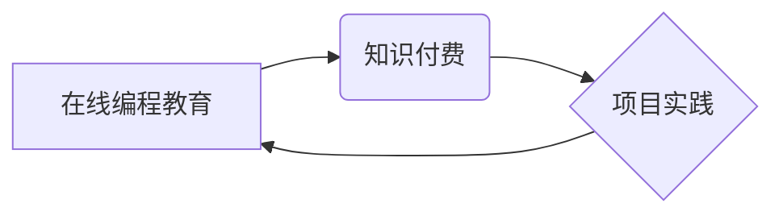

> 在线编程教育, 知识付费, 项目实践, 编程技能, 软件开发, 课程设计, 学习平台

## 1. 背景介绍

在当今数字化时代，编程技能已成为一项至关重要的能力，广泛应用于各个领域，从软件开发到数据分析、人工智能等。然而，传统的编程教育模式往往存在着诸多局限性，例如教学内容枯燥乏味、缺乏实践操作机会、学习进度难以跟上等问题。

知识付费模式的兴起为在线编程教育提供了新的机遇。通过线上平台，编程教育资源可以更加便捷地传播，学习者可以根据自身需求选择合适的课程，并通过互动式学习、项目实践等方式提升编程技能。

## 2. 核心概念与联系

**2.1 在线编程教育**

在线编程教育是指利用互联网技术，通过线上平台提供编程知识和技能的学习资源和服务。

**2.2 知识付费**

知识付费是指以知识、技能、经验等为核心内容，通过付费的方式获取学习资源和服务。

**2.3 项目实践**

项目实践是指将学习到的编程知识和技能应用于实际项目中，通过实践操作来巩固和提升学习效果。

**2.4 核心概念关系图**



## 3. 核心算法原理 & 具体操作步骤

**3.1 算法原理概述**

在线编程教育平台的开发需要涉及到多种算法，例如用户行为分析算法、课程推荐算法、项目匹配算法等。这些算法可以帮助平台更好地理解用户的学习需求，推荐合适的课程和项目，提高学习效率。

**3.2 算法步骤详解**

以用户行为分析算法为例，其步骤可以概括为以下几个方面：

1. 收集用户行为数据：包括用户访问记录、学习进度、评价反馈等。
2. 数据预处理：对收集到的数据进行清洗、转换、格式化等处理。
3. 特征提取：从用户行为数据中提取出有价值的特征，例如学习时长、学习频率、学习偏好等。
4. 模型训练：利用机器学习算法对用户行为数据进行建模，建立用户行为预测模型。
5. 模型评估：评估模型的预测精度，并进行模型优化。
6. 应用预测结果：将模型预测结果应用于个性化推荐、学习进度跟踪等功能。

**3.3 算法优缺点**

**优点：**

* 可以帮助平台更好地理解用户的学习需求，提供个性化学习体验。
* 可以提高学习效率，帮助用户更快地掌握编程技能。

**缺点：**

* 需要收集和处理大量用户数据，存在数据隐私安全问题。
* 模型训练需要专业技术人员，成本较高。

**3.4 算法应用领域**

用户行为分析算法广泛应用于在线教育平台、电商平台、社交媒体平台等领域，用于用户画像分析、个性化推荐、用户行为预测等。

## 4. 数学模型和公式 & 详细讲解 & 举例说明

**4.1 数学模型构建**

用户行为分析算法通常采用基于用户的协同过滤算法，其核心思想是根据用户的历史行为数据，预测用户对未来内容的兴趣。

**4.2 公式推导过程**

假设用户u对物品i的评分为r(u,i)，则用户u对物品j的评分预测值可以表示为：

```latex
\hat{r}(u,j) = \frac{\sum_{i \in N(u)} \frac{r(u,i) * sim(u,v)}{ \sum_{i \in N(u)} sim(u,v)}}{\sum_{j \in N(u)} sim(u,v)}
```

其中：

* N(u) 表示用户u已经评分过的物品集合。
* sim(u,v) 表示用户u和用户v之间的相似度。

**4.3 案例分析与讲解**

假设用户A对编程语言Python的评分为5，对数据结构算法的评分为4，用户B对Python的评分为4，对数据库管理的评分为5。

如果我们使用余弦相似度作为相似度度量，可以计算出用户A和用户B之间的相似度为0.707。

根据公式，我们可以预测用户A对数据库管理的评分为：

```latex
\hat{r}(A,数据库管理) = \frac{5 * 0.707}{0.707} = 5
```

## 5. 项目实践：代码实例和详细解释说明

**5.1 开发环境搭建**

在线编程教育平台的开发环境通常包括以下几个方面：

* 服务器：用于运行平台的应用程序和数据库。
* 数据库：用于存储用户数据、课程数据、项目数据等。
* 编程语言：例如Python、Java、JavaScript等。
* 开发工具：例如IDE、版本控制系统等。

**5.2 源代码详细实现**

以下是一个简单的在线编程教育平台的代码示例，使用Python语言实现用户注册功能：

```python
from flask import Flask, render_template, request

app = Flask(__name__)

# 用户数据存储
users = {}

@app.route('/')
def index():
    return render_template('index.html')

@app.route('/register', methods=['POST'])
def register():
    username = request.form['username']
    password = request.form['password']

    if username in users:
        return '用户名已存在'
    else:
        users[username] = password
        return '注册成功'

if __name__ == '__main__':
    app.run(debug=True)
```

**5.3 代码解读与分析**

* 该代码使用Flask框架构建了一个简单的Web应用程序。
* 用户注册功能通过POST请求处理，获取用户名和密码。
* 用户数据存储在字典`users`中。
* 如果用户名已存在，则返回错误信息；否则，注册成功并存储用户数据。

**5.4 运行结果展示**

运行该代码后，可以访问`http://127.0.0.1:5000/`，看到一个简单的注册页面。填写用户名和密码后，点击注册按钮，即可完成注册操作。

## 6. 实际应用场景

在线编程教育平台可以应用于以下场景：

* **个人学习:** 个人可以根据自身需求选择合适的课程，学习编程知识和技能。
* **企业培训:** 企业可以利用平台进行员工编程技能培训，提升团队整体技术水平。
* **教育机构:** 教育机构可以利用平台提供在线编程课程，拓展教育资源。

**6.4 未来应用展望**

未来，在线编程教育平台将更加智能化、个性化、互动化。例如：

* 利用人工智能技术，提供个性化学习路径和推荐。
* 通过虚拟现实技术，打造沉浸式的编程学习体验。
* 更加注重项目实践，帮助用户将学习到的知识应用于实际项目中。

## 7. 工具和资源推荐

**7.1 学习资源推荐**

* **在线编程学习平台:** Codecademy, Udemy, Coursera, edX
* **编程语言官方文档:** Python官方文档, Java官方文档, JavaScript官方文档
* **编程社区:** Stack Overflow, GitHub

**7.2 开发工具推荐**

* **集成开发环境 (IDE):** Visual Studio Code, PyCharm, IntelliJ IDEA
* **版本控制系统:** Git, GitHub

**7.3 相关论文推荐**

* **基于用户的协同过滤算法:** "Collaborative Filtering: A User-Based Approach" by Goldberg et al. (1992)
* **个性化学习路径推荐:** "Personalized Learning Paths: A Survey" by Chen et al. (2018)

## 8. 总结：未来发展趋势与挑战

**8.1 研究成果总结**

在线编程教育平台的发展取得了显著成果，为编程教育提供了新的模式和途径。

**8.2 未来发展趋势**

未来，在线编程教育平台将更加智能化、个性化、互动化，并与其他技术融合，例如人工智能、虚拟现实等。

**8.3 面临的挑战**

在线编程教育平台也面临着一些挑战，例如：

* 如何提高学习者的学习兴趣和参与度。
* 如何保证课程质量和教学效果。
* 如何解决数据隐私安全问题。

**8.4 研究展望**

未来研究方向包括：

* 开发更加智能化、个性化的学习系统。
* 探索新的编程教育模式和教学方法。
* 研究在线编程教育的社会影响和伦理问题。

## 9. 附录：常见问题与解答

**9.1 如何选择合适的在线编程教育平台？**

选择在线编程教育平台时，可以考虑以下因素：

* 平台的课程内容是否丰富，是否符合自己的学习需求。
* 平台的教学质量如何，是否有经验丰富的老师指导。
* 平台的学习体验是否良好，是否提供互动式学习和项目实践机会。
* 平台的收费标准是否合理，是否提供试用课程。

**9.2 如何提高在线编程学习的效率？**

* 制定学习计划，并坚持执行。
* 积极参与互动式学习，与老师和同学交流。
* 多做练习，巩固学习成果。
* 参加项目实践，将学习到的知识应用于实际项目中。

**9.3 在线编程学习有什么风险？**

* 数据隐私安全问题：需要选择信誉良好的平台，保护个人信息安全。
* 学习效果不确定：需要根据自身情况选择合适的课程和学习方法。
* 缺乏线下交流：需要积极寻找线下学习机会，与其他学习者交流学习经验。


作者：禅与计算机程序设计艺术 / Zen and the Art of Computer Programming 
<end_of_turn>