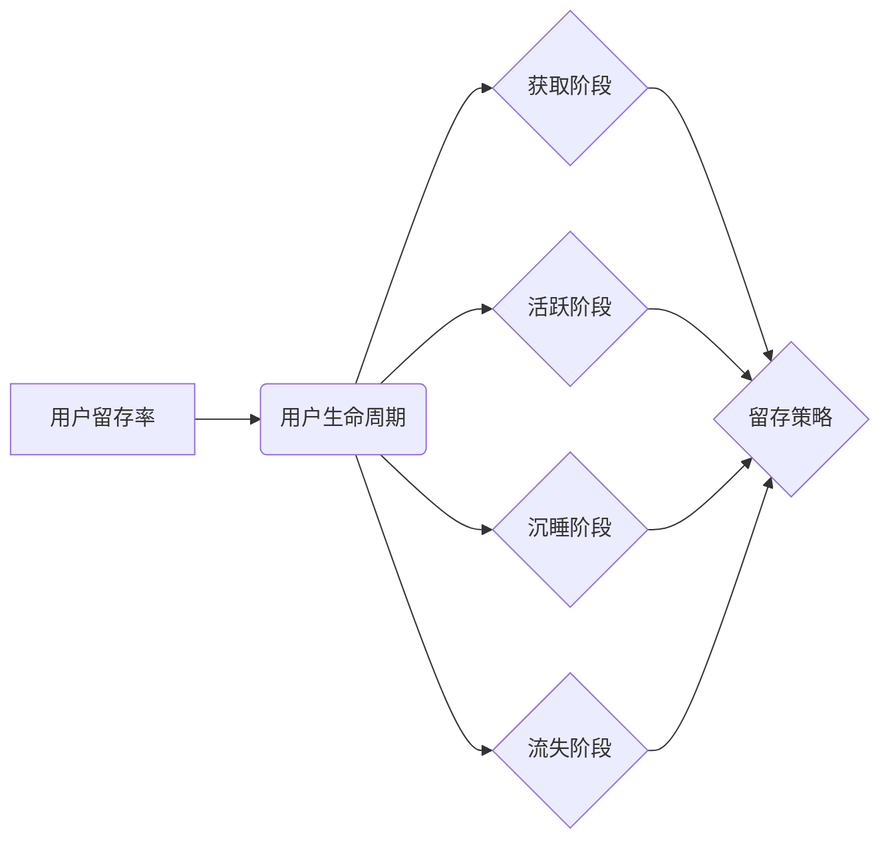

> 知识付费、用户留存、产品设计、用户体验、数据分析、运营策略

## 1. 背景介绍

知识付费行业近年来发展迅速，涌现出众多优质内容和平台。然而，用户留存率一直是知识付费产品面临的挑战。高昂的学习成本、内容质量参差不齐、学习体验不佳等因素都可能导致用户流失。因此，提高知识付费产品的用户留存率至关重要，这不仅关系到平台的商业可持续性，也关系到用户对知识付费的信任和认可。

## 2. 核心概念与联系

**2.1 用户留存率**

用户留存率是指在特定时间段内，仍然活跃使用产品的用户比例。它是一个衡量产品用户粘性、用户体验和产品价值的重要指标。

**2.2 用户生命周期**

用户生命周期是指用户从首次接触产品到最终流失的整个过程，可以分为以下几个阶段：

* **获取阶段:** 用户首次接触产品，并注册或订阅。
* **活跃阶段:** 用户积极使用产品，并完成学习任务或参与互动。
* **沉睡阶段:** 用户使用频率降低，但尚未完全流失。
* **流失阶段:** 用户不再使用产品，并最终取消订阅或删除账号。

**2.3 留存策略**

留存策略是指通过一系列措施，提高用户在不同生命周期阶段的留存率，延长用户生命周期，最终提升用户价值。

**2.4 核心概念关系图**



## 3. 核心算法原理 & 具体操作步骤

**3.1 算法原理概述**

用户留存率的计算和分析通常采用以下算法：

* **日留存率:** 计算每天活跃用户数量占前一天活跃用户数量的比例。
* **周留存率:** 计算每周活跃用户数量占前一周活跃用户数量的比例。
* **月留存率:** 计算每月活跃用户数量占前一月活跃用户数量的比例。

**3.2 算法步骤详解**

1. 收集用户行为数据，包括注册时间、登录时间、学习时间、完成任务时间等。
2. 将用户数据按照时间维度进行分组，例如每天、每周、每月。
3. 计算每个时间段内活跃用户数量。
4. 计算留存率，公式如下：

```
留存率 = 活跃用户数量 / 前一个时间段活跃用户数量
```

**3.3 算法优缺点**

* **优点:** 计算简单，易于理解和实施。
* **缺点:** 只能反映用户在不同时间段的整体留存情况，无法深入分析用户流失原因。

**3.4 算法应用领域**

* 产品经理和运营人员可以使用留存率数据来评估产品用户粘性，并制定相应的留存策略。
* 数据分析师可以使用留存率数据来分析用户行为模式，并挖掘用户流失原因。

## 4. 数学模型和公式 & 详细讲解 & 举例说明

**4.1 数学模型构建**

用户留存率可以看作是一个时间序列模型，可以使用以下数学模型进行建模：

```
L(t) = L(0) * (1 - r)^t
```

其中：

* L(t) 表示时间 t 时刻的用户留存率。
* L(0) 表示初始用户留存率。
* r 表示用户流失率。
* t 表示时间步长。

**4.2 公式推导过程**

假设初始用户留存率为 L(0)，用户流失率为 r，则在时间步长为 1 的情况下，用户留存率为：

```
L(1) = L(0) * (1 - r)
```

在时间步长为 2 的情况下，用户留存率为：

```
L(2) = L(1) * (1 - r) = L(0) * (1 - r)^2
```

以此类推，可以得到时间步长为 t 的用户留存率公式：

```
L(t) = L(0) * (1 - r)^t
```

**4.3 案例分析与讲解**

假设一个知识付费平台的初始用户留存率为 80%，用户流失率为 10%，则用户留存率随时间变化的曲线如下：

```
L(t) = 0.8 * (0.9)^t
```

从曲线可以看出，用户留存率随着时间的推移呈指数下降趋势。

## 5. 项目实践：代码实例和详细解释说明

**5.1 开发环境搭建**

* Python 3.x
* Pandas
* Matplotlib

**5.2 源代码详细实现**

```python
import pandas as pd
import matplotlib.pyplot as plt

# 用户行为数据
data = {
    'date': pd.to_datetime(['2023-01-01', '2023-01-02', '2023-01-03', '2023-01-04', '2023-01-05', '2023-01-06', '2023-01-07']),
    'active_users': [100, 90, 80, 70, 60, 50, 40]
}
df = pd.DataFrame(data)

# 计算日留存率
df['daily_retention'] = df['active_users'].pct_change() * 100

# 绘制日留存率曲线
plt.plot(df['date'], df['daily_retention'])
plt.xlabel('日期')
plt.ylabel('日留存率 (%)')
plt.title('知识付费产品日留存率')
plt.show()
```

**5.3 代码解读与分析**

* 代码首先导入必要的库，包括 Pandas 和 Matplotlib。
* 然后，定义一个用户行为数据字典，包含日期和活跃用户数量。
* 使用 Pandas 库将数据转换为 DataFrame 格式。
* 计算日留存率，并将其存储在 DataFrame 中。
* 使用 Matplotlib 库绘制日留存率曲线。

**5.4 运行结果展示**

运行代码后，将生成一个日留存率曲线图，可以直观地看到用户留存率随时间的变化趋势。

## 6. 实际应用场景

**6.1 用户画像分析**

通过分析用户留存率数据，可以构建用户画像，了解不同用户群体的留存特征，例如年龄、性别、职业、学习习惯等。

**6.2 内容推荐优化**

根据用户留存率数据，可以分析哪些内容更受用户欢迎，并优化内容推荐策略，提高用户留存率。

**6.3 学习路径设计**

根据用户留存率数据，可以分析用户学习路径的有效性，并优化学习路径设计，提高用户学习效率和留存率。

**6.4 运营活动策划**

根据用户留存率数据，可以分析用户参与活动的意愿，并策划相应的运营活动，提高用户活跃度和留存率。

**6.5 产品迭代优化**

根据用户留存率数据，可以分析产品功能的优劣，并进行产品迭代优化，提高用户体验和留存率。

## 7. 工具和资源推荐

**7.1 学习资源推荐**

* **书籍:**
    * 《用户留存：从数据分析到运营策略》
    * 《产品经理的留存秘籍》
* **在线课程:**
    * Udemy: 用户留存分析
    * Coursera: 数据分析与用户留存

**7.2 开发工具推荐**

* **数据分析工具:**
    * Google Analytics
    * Mixpanel
    * Amplitude
* **数据可视化工具:**
    * Tableau
    * Power BI
    * Datawrapper

**7.3 相关论文推荐**

* **用户留存模型研究:**
    * 《基于深度学习的用户留存预测模型》
    * 《一种基于用户行为特征的用户留存预测方法》
* **用户留存策略研究:**
    * 《提高用户留存率的策略研究》
    * 《基于用户画像的个性化留存策略研究》

## 8. 总结：未来发展趋势与挑战

**8.1 研究成果总结**

近年来，用户留存率的研究取得了显著进展，涌现出许多有效的留存模型和策略。

**8.2 未来发展趋势**

* **人工智能技术应用:** 利用人工智能技术，例如机器学习和深度学习，构建更精准的用户留存预测模型，并制定更个性化的留存策略。
* **用户行为分析深度挖掘:** 通过更深入地分析用户行为数据，挖掘用户流失原因，并制定针对性的留存策略。
* **跨平台用户留存研究:** 研究跨平台用户留存问题，例如用户在不同平台之间的切换和流失。

**8.3 面临的挑战**

* **数据质量问题:** 用户行为数据质量参差不齐，难以构建准确的留存模型。
* **用户隐私保护:** 用户行为数据涉及用户隐私，需要妥善处理和保护。
* **留存策略的个性化:** 用户需求多样化，需要制定更个性化的留存策略。

**8.4 研究展望**

未来，用户留存率研究将更加注重人工智能技术应用、用户行为分析深度挖掘和跨平台用户留存研究，并积极应对数据质量问题、用户隐私保护和留存策略个性化等挑战。

## 9. 附录：常见问题与解答

**9.1 如何提高用户留存率？**

提高用户留存率需要从多个方面入手，例如：

* **优化产品体验:** 提升产品易用性、功能性和美观度。
* **提供优质内容:** 持续更新优质内容，满足用户需求。
* **加强用户互动:** 组织线上线下活动，增强用户粘性。
* **个性化推荐:** 根据用户喜好推荐相关内容。
* **提供良好的客户服务:** 及时解决用户问题，提升用户满意度。

**9.2 如何分析用户留存率数据？**

可以使用以下方法分析用户留存率数据：

* **计算留存率:** 计算不同时间段的用户留存率。
* **绘制留存曲线:** 绘制用户留存率随时间的变化曲线。
* **分析用户画像:** 分析不同用户群体的留存特征。
* **挖掘流失原因:** 分析用户流失原因，并制定针对性策略。


作者：禅与计算机程序设计艺术 / Zen and the Art of Computer Programming 
<end_of_turn>