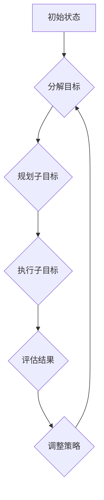

>  Agent, 子目标分解, 智能体, 决策, 规划, 分层控制, 复杂系统

## 1. 背景介绍

在人工智能领域，Agent（智能体）的概念至关重要。Agent 是能够感知环境、做出决策并采取行动的独立实体。从简单的聊天机器人到复杂的无人驾驶汽车，Agent 正在各个领域发挥着越来越重要的作用。然而，构建能够有效应对复杂环境的智能体是一个巨大的挑战。

子目标分解（Subgoal Decomposition）是一种常用的技术，用于解决 Agent 在复杂任务中的决策和规划问题。它通过将一个大型目标分解成一系列更小的、可管理的目标，从而简化 Agent 的决策过程，提高其效率和鲁棒性。

## 2. 核心概念与联系

子目标分解的核心思想是将一个复杂的任务分解成一系列相互关联的子目标。每个子目标都是一个更小的、更易于解决的问题。通过逐步完成这些子目标，最终可以实现整个任务的目标。

**子目标分解的优势:**

* **简化决策:** 将复杂问题分解成更小的子问题，可以减轻 Agent 的决策负担，提高决策效率。
* **提高鲁棒性:** 如果某个子目标无法实现，Agent 可以调整策略，尝试完成其他子目标，从而提高其应对环境变化的鲁棒性。
* **促进模块化设计:** 子目标分解可以促进 Agent 的模块化设计，使得不同模块之间更加独立和可维护。

**子目标分解与其他概念的联系:**

* **规划:** 子目标分解是规划算法的重要组成部分。规划算法通常使用子目标分解来生成任务执行的步骤序列。
* **决策树:** 子目标分解可以用于构建决策树，帮助 Agent 在面对多个选择时做出最优决策。
* **层次控制:** 子目标分解与层次控制相结合，可以构建更复杂的 Agent，能够处理更复杂的任务。

**Mermaid 流程图:**



## 3. 核心算法原理 & 具体操作步骤

### 3.1  算法原理概述

子目标分解算法的核心是将一个大型目标分解成一系列更小的、可管理的目标。这可以通过多种方法实现，例如：

* **顶层分解:** 从高层目标开始，逐步分解成更具体的子目标。
* **层次分解:** 将目标分解成多个层次，每个层次包含一系列子目标。
* **基于知识的分解:** 利用领域知识和专家经验，将目标分解成更合理的子目标。

### 3.2  算法步骤详解

1. **定义目标:** 明确需要完成的任务目标。
2. **分解目标:** 将目标分解成一系列子目标。
3. **规划子目标:** 为每个子目标制定执行计划。
4. **执行子目标:** 根据计划执行每个子目标。
5. **评估结果:** 评估每个子目标的执行结果。
6. **调整策略:** 根据评估结果，调整执行策略，确保最终实现目标。

### 3.3  算法优缺点

**优点:**

* 简化决策
* 提高鲁棒性
* 促进模块化设计

**缺点:**

* 分解目标的复杂性
* 子目标之间的依赖关系
* 评估结果的准确性

### 3.4  算法应用领域

子目标分解广泛应用于各种领域，例如：

* **机器人学:** 控制机器人完成复杂任务，例如导航、抓取、组装等。
* **游戏开发:** 设计游戏中的 AI 敌人，使其能够做出更智能的决策。
* **自然语言处理:** 将自然语言文本分解成更小的语义单元，以便进行理解和分析。

## 4. 数学模型和公式 & 详细讲解 & 举例说明

### 4.1  数学模型构建

我们可以用一个状态空间模型来描述 Agent 的行为。

* 状态空间 S：表示 Agent 可能处于的所有状态。
* 动作空间 A：表示 Agent 可以执行的所有动作。
* 状态转移函数 T(s, a, s')：描述 Agent 执行动作 a 在状态 s 下转移到状态 s' 的概率。
* 奖励函数 R(s, a)：描述 Agent 在状态 s 执行动作 a 得到的奖励。

### 4.2  公式推导过程

子目标分解的目标是找到一个最优的策略 π，使得 Agent 在状态空间中从初始状态 s0 到目标状态 sg 的累积奖励最大化。

我们可以使用动态规划算法来求解最优策略。动态规划算法的基本思想是：

1. 将状态空间划分为多个子空间。
2. 对于每个子空间，求解最优策略。
3. 将子空间的最优策略组合起来，得到整个状态空间的最优策略。

### 4.3  案例分析与讲解

例如，假设 Agent 需要完成一个从起点到终点的导航任务。我们可以将导航任务分解成一系列子目标，例如：

* 到达第一个路口
* 选择正确的道路
* 到达第二个路口
* ...

我们可以使用动态规划算法来求解每个子目标的最优策略，然后将这些策略组合起来，得到整个导航任务的最优策略。

## 5. 项目实践：代码实例和详细解释说明

### 5.1  开发环境搭建

* 操作系统：Ubuntu 20.04
* 编程语言：Python 3.8
* 开发工具：VS Code

### 5.2  源代码详细实现

```python
# 子目标分解示例代码

class Agent:
    def __init__(self, goal):
        self.goal = goal
        self.subgoals = self.decompose_goal(goal)

    def decompose_goal(self, goal):
        # 将目标分解成子目标
        # ...

    def plan(self):
        # 规划子目标的执行计划
        # ...

    def execute(self):
        # 执行子目标
        # ...

    def evaluate(self):
        # 评估子目标的执行结果
        # ...

# 实例化 Agent
agent = Agent("到达终点")

# 规划子目标的执行计划
agent.plan()

# 执行子目标
agent.execute()

# 评估子目标的执行结果
agent.evaluate()
```

### 5.3  代码解读与分析

* `Agent` 类代表一个智能体，它包含一个目标和一系列子目标。
* `decompose_goal()` 方法负责将目标分解成子目标。
* `plan()` 方法负责规划子目标的执行计划。
* `execute()` 方法负责执行子目标。
* `evaluate()` 方法负责评估子目标的执行结果。

### 5.4  运行结果展示

运行代码后，Agent 将会按照规划的步骤执行子目标，最终实现目标。

## 6. 实际应用场景

子目标分解在许多实际应用场景中发挥着重要作用，例如：

* **机器人导航:** 将导航任务分解成一系列子目标，例如：到达路口、选择道路、避开障碍物等。
* **游戏 AI:** 将游戏中的 AI 敌人设计成能够分解任务，例如：寻找玩家、攻击玩家、躲避攻击等。
* **自然语言理解:** 将自然语言文本分解成更小的语义单元，例如：词语、短语、句子等，以便进行理解和分析。

### 6.4  未来应用展望

随着人工智能技术的不断发展，子目标分解将在更多领域得到应用，例如：

* **自动驾驶:** 将自动驾驶任务分解成一系列子目标，例如：感知环境、规划路径、控制车辆等。
* **医疗诊断:** 将医疗诊断任务分解成一系列子目标，例如：收集病史、进行体检、分析检查结果等。
* **个性化教育:** 将个性化教育任务分解成一系列子目标，例如：评估学生能力、制定学习计划、提供个性化辅导等。

## 7. 工具和资源推荐

### 7.1  学习资源推荐

* **书籍:**
    * Artificial Intelligence: A Modern Approach by Stuart Russell and Peter Norvig
    * Introduction to Artificial Intelligence by George F. Luger
* **在线课程:**
    * Coursera: Artificial Intelligence
    * edX: Artificial Intelligence

### 7.2  开发工具推荐

* **Python:** 广泛用于人工智能开发的编程语言。
* **TensorFlow:** 深度学习框架。
* **PyTorch:** 深度学习框架。

### 7.3  相关论文推荐

* **Subgoal Decomposition for Planning in Complex Environments** by Michael Genesereth
* **Hierarchical Task Networks for Planning** by Daniel Weld

## 8. 总结：未来发展趋势与挑战

### 8.1  研究成果总结

子目标分解是一种有效的技术，可以帮助 Agent 在复杂环境中做出决策和规划。它已被广泛应用于各种领域，并取得了显著的成果。

### 8.2  未来发展趋势

未来，子目标分解技术将朝着以下方向发展：

* **更智能的子目标分解:** 利用机器学习等技术，自动生成更合理的子目标。
* **更灵活的子目标分解:** 能够根据环境变化动态调整子目标。
* **更协同的子目标分解:** 能够支持多个 Agent 协同完成复杂任务。

### 8.3  面临的挑战

子目标分解技术也面临着一些挑战，例如：

* **子目标的确定:** 如何确定最合适的子目标是一个难题。
* **子目标之间的依赖关系:** 如何处理子目标之间的依赖关系也是一个挑战。
* **子目标的执行效率:** 如何提高子目标的执行效率也是一个需要解决的问题。

### 8.4  研究展望

未来，我们将继续研究子目标分解技术，努力解决上述挑战，使其能够更好地应用于人工智能领域。

## 9. 附录：常见问题与解答

**Q1: 子目标分解的复杂度如何？**

**A1:** 子目标分解的复杂度取决于目标的复杂度和子目标的数量。一般来说，目标越复杂，子目标越多，复杂度越高。

**Q2: 如何确定最合适的子目标？**

**A2:** 确定最合适的子目标是一个需要根据具体任务和环境进行分析的问题。可以参考领域知识、专家经验、算法分析等方法。

**Q3: 子目标分解技术有哪些局限性？**

**A3:** 子目标分解技术虽然有效，但也存在一些局限性，例如：

* **子目标的确定:** 如何确定最合适的子目标是一个难题。
* **子目标之间的依赖关系:** 如何处理子目标之间的依赖关系也是一个挑战。
* **子目标的执行效率:** 如何提高子目标的执行效率也是一个需要解决的问题。


作者：禅与计算机程序设计艺术 / Zen and the Art of Computer Programming 
<end_of_turn>