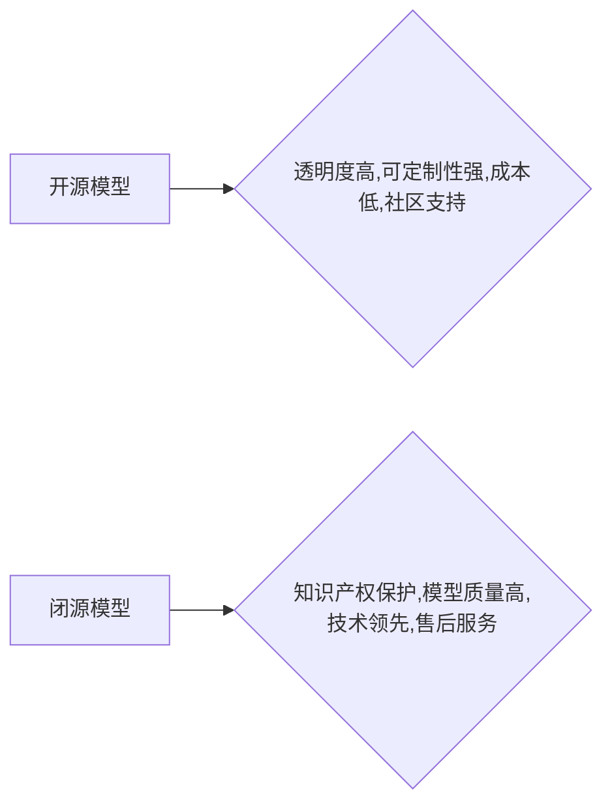

> 开源模型，闭源模型，人工智能，机器学习，深度学习，模型训练，数据隐私，商业竞争，开源社区

## 1. 背景介绍

人工智能（AI）技术近年来发展迅速，深度学习模型在图像识别、自然语言处理、语音识别等领域取得了突破性进展。这些模型的训练需要海量数据和强大的计算资源，因此模型的开发和部署面临着诸多挑战。开源模型和闭源模型是两种不同的模型开发模式，各有优缺点，在AI领域扮演着重要的角色。

开源模型是指源代码、模型参数和训练数据都公开可用的模型，任何人都可以自由地访问、使用、修改和重新发布。闭源模型则相反，其源代码、模型参数和训练数据都由开发公司或机构严格控制，只有授权用户才能访问和使用。

## 2. 核心概念与联系

**2.1 开源模型**

开源模型的核心概念是开放共享，鼓励社区参与和协作。其优势在于：

* **透明度高:**  源代码公开，任何人都可以查看模型的内部结构和工作原理，提高模型的可信度和安全性。
* **可定制性强:**  用户可以根据自己的需求修改模型的架构、参数和训练数据，使其更适合特定应用场景。
* **成本低:**  开源模型可以免费使用，降低了开发和部署的成本。
* **社区支持:**  开源社区提供丰富的技术支持和资源，帮助用户解决问题和改进模型。

**2.2 闭源模型**

闭源模型的核心概念是知识产权保护，开发公司或机构对模型的源代码和训练数据进行严格控制。其优势在于：

* **知识产权保护:**  防止模型被盗用或非法使用，保护开发公司的商业利益。
* **模型质量高:**  开发公司通常拥有强大的研发实力和海量数据资源，可以训练出更高质量的模型。
* **技术领先:**  闭源模型往往是开发公司最新的技术成果，具有较强的竞争力。
* **售后服务:**  开发公司可以提供专业的售后服务，帮助用户解决问题和优化模型性能。

**2.3 模型关系图**



## 3. 核心算法原理 & 具体操作步骤

**3.1 算法原理概述**

深度学习模型的核心算法是神经网络，它模仿了人脑的神经元结构和功能。神经网络由多个层组成，每层包含多个神经元。每个神经元接收来自上一层的输入信号，经过激活函数处理后，将输出信号传递给下一层。通过训练，神经网络可以学习到输入数据和输出标签之间的映射关系，从而实现预测或分类等任务。

**3.2 算法步骤详解**

1. **数据预处理:** 将原始数据转换为模型可以理解的格式，例如归一化、编码等。
2. **模型构建:** 根据任务需求选择合适的网络架构，例如卷积神经网络（CNN）、循环神经网络（RNN）等。
3. **模型训练:** 使用训练数据训练模型，调整模型参数，使模型的预测结果与真实标签尽可能接近。
4. **模型评估:** 使用测试数据评估模型的性能，例如准确率、召回率等。
5. **模型部署:** 将训练好的模型部署到实际应用场景中，例如服务器、移动设备等。

**3.3 算法优缺点**

* **优点:** 
    * 表现力强: 深度学习模型能够学习到复杂的数据模式，在图像识别、自然语言处理等领域取得了突破性进展。
    * 自动特征提取: 深度学习模型可以自动学习数据特征，无需人工特征工程。
* **缺点:** 
    * 数据依赖性强: 深度学习模型需要海量数据进行训练，否则性能会下降。
    * 计算资源消耗大: 深度学习模型训练需要大量的计算资源，成本较高。
    * 可解释性差: 深度学习模型的内部工作机制复杂，难以解释其决策过程。

**3.4 算法应用领域**

深度学习算法广泛应用于各个领域，例如：

* **计算机视觉:** 图像识别、物体检测、图像分割、人脸识别等。
* **自然语言处理:** 文本分类、情感分析、机器翻译、对话系统等。
* **语音识别:** 语音转文本、语音助手等。
* **推荐系统:** 商品推荐、内容推荐等。
* **医疗诊断:** 病情诊断、疾病预测等。

## 4. 数学模型和公式 & 详细讲解 & 举例说明

**4.1 数学模型构建**

深度学习模型的数学模型主要基于神经网络的结构和激活函数。

* **神经网络结构:** 神经网络由输入层、隐藏层和输出层组成。每个层包含多个神经元，神经元之间通过权重连接。

* **激活函数:** 激活函数用于引入非线性，使神经网络能够学习到复杂的数据模式。常见的激活函数包括 sigmoid 函数、ReLU 函数、tanh 函数等。

**4.2 公式推导过程**

深度学习模型的训练过程基于梯度下降算法。目标函数是模型预测结果与真实标签之间的误差。梯度下降算法通过迭代更新模型参数，使目标函数最小化。

* **损失函数:** 衡量模型预测结果与真实标签之间的误差。常见的损失函数包括均方误差（MSE）、交叉熵损失等。

* **梯度:** 损失函数对模型参数的偏导数，表示参数变化对损失函数的影响。

* **更新规则:** 使用梯度下降算法更新模型参数，例如：

```
参数 = 参数 - 学习率 * 梯度
```

**4.3 案例分析与讲解**

以图像分类为例，假设我们使用卷积神经网络（CNN）训练一个模型，识别猫和狗的图片。

* **输入数据:** 猫和狗的图片。
* **模型结构:** CNN 包含多个卷积层、池化层和全连接层。
* **损失函数:** 交叉熵损失。
* **训练过程:** 使用训练数据训练模型，迭代更新模型参数，使模型能够准确地识别猫和狗的图片。

## 5. 项目实践：代码实例和详细解释说明

**5.1 开发环境搭建**

使用 Python 语言和深度学习框架 TensorFlow 或 PyTorch 开发深度学习模型。

**5.2 源代码详细实现**

```python
import tensorflow as tf

# 定义模型结构
model = tf.keras.models.Sequential([
    tf.keras.layers.Conv2D(32, (3, 3), activation='relu', input_shape=(28, 28, 1)),
    tf.keras.layers.MaxPooling2D((2, 2)),
    tf.keras.layers.Conv2D(64, (3, 3), activation='relu'),
    tf.keras.layers.MaxPooling2D((2, 2)),
    tf.keras.layers.Flatten(),
    tf.keras.layers.Dense(10, activation='softmax')
])

# 编译模型
model.compile(optimizer='adam',
              loss='sparse_categorical_crossentropy',
              metrics=['accuracy'])

# 训练模型
model.fit(x_train, y_train, epochs=10)

# 评估模型
loss, accuracy = model.evaluate(x_test, y_test)
print('Test loss:', loss)
print('Test accuracy:', accuracy)
```

**5.3 代码解读与分析**

* **模型结构:** 代码定义了一个简单的卷积神经网络模型，包含两个卷积层、两个池化层和一个全连接层。
* **编译模型:** 使用 Adam 优化器、交叉熵损失函数和准确率作为评估指标编译模型。
* **训练模型:** 使用训练数据训练模型，训练 10 个 epochs。
* **评估模型:** 使用测试数据评估模型的性能，打印测试损失和准确率。

**5.4 运行结果展示**

训练完成后，模型可以用于预测新的图像类别。

## 6. 实际应用场景

**6.1 图像识别**

* **人脸识别:** 用于解锁手机、验证身份、监控安全等。
* **物体检测:** 用于自动驾驶、安防监控、工业自动化等。
* **图像分类:** 用于电商商品分类、医疗影像诊断等。

**6.2 自然语言处理**

* **机器翻译:** 将文本从一种语言翻译成另一种语言。
* **文本摘要:** 自动生成文本的简短摘要。
* **情感分析:** 分析文本的情感倾向，例如正面、负面、中性。

**6.3 语音识别**

* **语音助手:** 例如 Siri、Alexa、Google Assistant 等。
* **语音转文本:** 将语音转换为文本，用于会议记录、语音输入等。

**6.4 其他应用场景**

* **推荐系统:** 根据用户的历史行为推荐商品、内容等。
* **医疗诊断:** 辅助医生诊断疾病、预测病情。
* **金融风险控制:** 检测欺诈交易、评估信用风险等。

**6.5 未来应用展望**

随着人工智能技术的不断发展，开源和闭源模型将在更多领域得到应用，例如：

* **个性化教育:** 根据学生的学习情况提供个性化的学习内容和辅导。
* **智能医疗:** 辅助医生进行诊断、治疗和康复。
* **自动驾驶:** 实现无人驾驶汽车的自动驾驶功能。

## 7. 工具和资源推荐

**7.1 学习资源推荐**

* **在线课程:** Coursera、edX、Udacity 等平台提供深度学习相关的在线课程。
* **书籍:** 《深度学习》、《动手学深度学习》等书籍。
* **博客和论坛:** TensorFlow、PyTorch 等深度学习框架的官方博客和论坛。

**7.2 开发工具推荐**

* **深度学习框架:** TensorFlow、PyTorch、Keras 等。
* **编程语言:** Python。
* **数据处理工具:** Pandas、NumPy 等。

**7.3 相关论文推荐**

* **AlexNet:** 《ImageNet Classification with Deep Convolutional Neural Networks》
* **VGGNet:** 《Very Deep Convolutional Networks for Large-Scale Image Recognition》
* **ResNet:** 《Deep Residual Learning for Image Recognition》

## 8. 总结：未来发展趋势与挑战

**8.1 研究成果总结**

近年来，深度学习模型取得了显著的进展，在图像识别、自然语言处理等领域取得了突破性成果。开源模型和闭源模型各有优缺点，共同推动了人工智能的发展。

**8.2 未来发展趋势**

* **模型规模和复杂度不断提高:** 随着计算资源的不断发展，深度学习模型的规模和复杂度将不断提高，模型性能将进一步提升。
* **模型解释性和可解释性增强:** 研究人员将致力于开发更可解释的深度学习模型，使模型的决策过程更加透明。
* **边缘计算和联邦学习的应用:** 深度学习模型将更多地部署到边缘设备和分布式数据中心，实现更高效、更私密的模型训练和推理。

**8.3 面临的挑战**

* **数据安全和隐私保护:** 深度学习模型的训练需要海量数据，如何保护数据安全和隐私是一个重要的挑战。
* **模型公平性和可信度:** 深度学习模型可能存在偏见和歧视，如何确保模型的公平性和可信度是一个重要的研究方向。
* **模型可维护性和可解释性:** 深度学习模型的复杂性使得模型的维护和解释成为一个挑战。

**8.4 研究展望**

未来，人工智能研究将继续朝着更智能、更安全、更可解释的方向发展。开源模型和闭源模型将继续扮演重要的角色，推动人工智能技术的进步和应用。

## 9. 附录：常见问题与解答

**9.1 什么是开源模型？**

开源模型是指源代码、模型参数和训练数据都公开可用的模型。

**9.2 什么是闭源模型？**

闭源模型是指源代码、模型参数和训练数据都由开发公司或机构严格控制的模型。

**9.3 开源模型和闭源模型有什么区别？**

开源模型和闭源