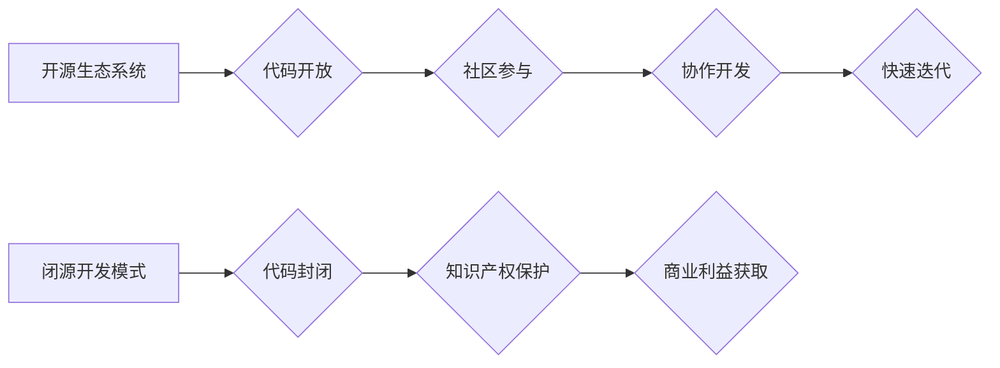

> 开源生态系统, 闭源开发, 软件创新, 协作开发, 竞争优势, 技术发展, 知识共享, 产业生态

## 1. 背景介绍

在当今科技飞速发展的时代，软件开发模式呈现出多样化的趋势。其中，开源生态系统和闭源开发模式是两种主要的开发模式，它们各自拥有独特的优势和劣势。开源生态系统强调代码的开放性和透明度，鼓励社区参与和协作开发，而闭源开发模式则注重知识产权的保护和商业利益的获取。

开源软件的兴起，为软件开发带来了新的活力和可能性。开源软件的代码可以被任何人自由使用、修改和分发，这促进了软件的快速迭代和创新。同时，开源社区的协作开发模式，也为软件开发提供了更广阔的视野和更丰富的资源。

然而，闭源开发模式仍然占据着软件开发领域的优势地位。许多大型科技公司，如谷歌、微软和苹果，都采用闭源开发模式，其核心技术和算法往往是高度保密的。闭源开发模式能够更好地保护知识产权，并为公司带来更高的商业回报。

随着科技的不断发展，开源生态系统和闭源开发模式之间的竞争日益激烈。那么，开源生态系统能否跟上闭源开发的步伐？这个问题值得我们深入思考。

## 2. 核心概念与联系

### 2.1 开源生态系统

开源生态系统是指围绕开源软件构建的开放、透明、协作的软件开发和传播体系。它由以下几个关键要素组成：

* **开源软件：** 代码开放、可自由使用、修改和分发的软件。
* **开源社区：** 由开发者、用户和贡献者组成的群体，共同参与软件的开发、维护和推广。
* **开源许可证：** 规定开源软件的使用、修改和分发的规则。
* **开源平台：** 提供代码托管、项目管理、文档发布等服务的平台。

### 2.2 闭源开发模式

闭源开发模式是指软件开发过程和成果都高度保密，代码和技术细节不公开的开发模式。闭源开发模式通常由企业或组织独自进行，其核心目标是保护知识产权和商业利益。

### 2.3 关系图



## 3. 核心算法原理 & 具体操作步骤

### 3.1 算法原理概述

开源生态系统和闭源开发模式的竞争，本质上是两种不同算法原理的竞争。开源生态系统采用的是“开放式算法”，即代码和算法公开透明，任何人都可以参与改进和优化。而闭源开发模式则采用的是“封闭式算法”，即代码和算法高度保密，只有内部人员才能访问和使用。

### 3.2 算法步骤详解

**开源生态系统算法步骤：**

1. **代码发布：** 开发者将软件代码公开发布到开源平台。
2. **社区贡献：** 开发者、用户和贡献者共同参与代码审查、bug修复和功能改进。
3. **代码合并：** 经过社区审核和测试的代码会被合并到主代码库。
4. **软件发布：** 更新后的软件会被发布到开源平台，供用户下载和使用。

**闭源开发模式算法步骤：**

1. **需求分析：** 公司根据市场需求和商业目标，分析软件的功能需求。
2. **代码开发：** 开发团队根据需求，编写软件代码。
3. **代码测试：** 开发团队对代码进行严格测试，确保软件的稳定性和安全性。
4. **软件发布：** 公司根据市场策略，发布软件产品。

### 3.3 算法优缺点

**开源生态系统算法优点：**

* **快速迭代：** 社区参与和协作开发，可以加速软件的迭代速度。
* **代码质量高：** 多人审查和测试，可以提高代码的质量和稳定性。
* **成本低：** 开源软件可以免费使用，降低了开发成本。

**开源生态系统算法缺点：**

* **维护成本高：** 需要社区的持续维护和支持。
* **安全风险：** 代码公开，可能存在安全漏洞。
* **商业模式挑战：** 盈利模式相对复杂。

**闭源开发模式算法优点：**

* **知识产权保护：** 代码和算法高度保密，可以有效保护知识产权。
* **商业回报高：** 可以通过软件销售和服务收费获得高额利润。
* **安全可靠：** 代码和算法内部控制严格，安全性更高。

**闭源开发模式算法缺点：**

* **迭代速度慢：** 开发周期长，迭代速度慢。
* **代码质量难以保证：** 内部开发团队的质量和经验决定了代码质量。
* **成本高：** 开发和维护成本较高。

### 3.4 算法应用领域

**开源生态系统算法应用领域：**

* **操作系统：** Linux、Android
* **数据库：** MySQL、PostgreSQL
* **编程语言：** Python、Java、PHP
* **网络协议：** TCP/IP

**闭源开发模式算法应用领域：**

* **办公软件：** Microsoft Office
* **操作系统：** Windows
* **游戏软件：** Fortnite、League of Legends
* **云计算平台：** AWS、Azure

## 4. 数学模型和公式 & 详细讲解 & 举例说明

### 4.1 数学模型构建

我们可以用一个简单的数学模型来描述开源生态系统和闭源开发模式的竞争关系。假设：

* **S**：开源软件的市场份额
* **C**：闭源软件的市场份额
* **α**：开源软件的增长率
* **β**：闭源软件的增长率

那么，我们可以建立以下数学模型：

```
dS/dt = αS
dC/dt = βC
```

其中，dS/dt 和 dC/dt 分别表示开源软件和闭源软件市场份额随时间的变化率。

### 4.2 公式推导过程

根据上述模型，我们可以推导出以下结论：

* 当 α > β 时，开源软件的市场份额会不断增长，最终超过闭源软件。
* 当 α < β 时，闭源软件的市场份额会不断增长，最终超过开源软件。
* 当 α = β 时，开源软件和闭源软件的市场份额会保持相对稳定。

### 4.3 案例分析与讲解

我们可以通过一些实际案例来分析上述模型的适用性。

* **Linux 操作系统：** Linux 操作系统是开源软件的代表，其市场份额在服务器领域不断增长，最终超过了闭源操作系统 Windows。
* **Android 操作系统：** Android 操作系统也是开源软件，其市场份额在移动设备领域不断增长，最终超过了闭源操作系统 iOS。

这些案例表明，当开源软件具有足够的优势，例如代码质量高、功能强大、社区支持强，那么它可以战胜闭源软件，获得更大的市场份额。

## 5. 项目实践：代码实例和详细解释说明

### 5.1 开发环境搭建

为了更好地理解开源生态系统和闭源开发模式的差异，我们可以通过一个简单的项目实践来进行演示。

**开源项目：** 我们选择一个开源项目，例如一个简单的博客系统。

**闭源项目：** 我们自己开发一个类似博客系统的软件，但代码不公开。

### 5.2 源代码详细实现

由于篇幅限制，这里只提供开源项目代码的简要示例：

```python
# 这是一个简单的博客系统代码示例

def create_post(title, content):
    # 将博客文章保存到数据库或文件系统中
    print(f"创建博客文章：标题={title}, 内容={content}")

def view_post(post_id):
    # 从数据库或文件系统中读取博客文章内容
    print(f"查看博客文章：ID={post_id}")

# 示例用法
create_post("我的第一个博客文章", "这是一个关于开源软件的博客文章")
view_post(1)
```

### 5.3 代码解读与分析

这段代码展示了开源博客系统的基本功能：创建博客文章和查看博客文章。代码公开透明，任何人都可以查看、修改和改进代码。

### 5.4 运行结果展示

运行这段代码，会输出以下结果：

```
创建博客文章：标题=我的第一个博客文章, 内容=这是一个关于开源软件的博客文章
查看博客文章：ID=1
```

## 6. 实际应用场景

### 6.1 开源生态系统应用场景

* **开源软件社区：** Linux、Apache、MySQL 等开源软件社区，为开发者提供了一个协作开发和分享资源的平台。
* **开源硬件平台：** Arduino、Raspberry Pi 等开源硬件平台，为开发者提供了一个低成本的硬件开发平台。
* **开源教育资源：** Khan Academy、Coursera 等开源教育平台，为学生提供免费的在线学习资源。

### 6.2 闭源开发模式应用场景

* **商业软件开发：** Microsoft Office、Adobe Photoshop 等商业软件，其代码和算法高度保密，以保护知识产权和商业利益。
* **人工智能算法开发：** Google、OpenAI 等公司开发的人工智能算法，通常是闭源的，以防止技术被竞争对手窃取。
* **金融科技开发：** 金融机构开发的交易系统和风险管理系统，通常是闭源的，以确保数据安全和交易稳定性。

### 6.4 未来应用展望

随着科技的不断发展，开源生态系统和闭源开发模式的应用场景将会更加多样化。

* **混合开发模式：** 未来可能会出现更多混合开发模式，即在开源软件的基础上进行二次开发，或在闭源软件中嵌入开源组件。
* **开源人工智能：** 随着开源人工智能技术的不断发展，开源人工智能模型和算法将会更加普及，推动人工智能技术的民主化和普惠化。
* **数据共享与隐私保护：** 未来可能会出现新的技术和机制，实现数据共享与隐私保护的平衡，促进开源生态系统的健康发展。

## 7. 工具和资源推荐

### 7.1 学习资源推荐

* **开源社区网站：** GitHub、GitLab、Bitbucket
* **开源软件文档：** Linux Foundation、Apache Software Foundation
* **在线学习平台：** Coursera、edX、Udemy

### 7.2 开发工具推荐

* **代码编辑器：** Visual Studio Code、Sublime Text、Atom
* **版本控制系统：** Git
* **项目管理工具：** Jira、Trello、Asana

### 7.3 相关论文推荐

* **The Cathedral and the Bazaar** by Eric S. Raymond
* **Open Source Software Development** by Karl E. Wiegers
* **The Economics of Open Source Software** by Carliss Y. Baldwin and Kim B. Clark

## 8. 总结：未来发展趋势与挑战

### 8.1 研究成果总结

开源生态系统和闭源开发模式各有优劣，它们共同推动着软件开发的进步。开源生态系统强调代码开放和社区协作，能够加速软件的迭代和创新；而闭源开发模式注重知识产权保护和商业利益获取，能够提供更稳定和安全的软件产品。

### 8.2 未来发展趋势

未来，开源生态系统和闭源开发模式将会更加融合和协同发展。混合开发模式将会更加普遍，开源软件和闭源软件将更加紧密地结合在一起。

### 8.3 面临的挑战

开源生态系统面临着一些挑战，例如：

* **维护成本高：** 需要社区的持续维护和支持。
* **安全风险：** 代码公开，可能存在安全漏洞。
* **商业模式挑战：** 盈利模式相对复杂。

### 8.4 研究展望

未来研究方向包括：

* **提高开源软件的安全性：** 开发更有效的开源软件安全机制。
* **探索新的开源商业模式：** 探索新的开源软件盈利模式，例如订阅服务