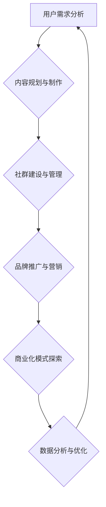

> 技术社区，运营策略，用户增长，内容建设，社群管理，品牌建设，商业化

## 1. 背景介绍

在当今数字化时代，技术社区已成为科技爱好者、开发者和企业家交流、学习和合作的重要平台。从最初的论坛和博客，到如今的社交媒体和在线协作工具，技术社区的形态和功能不断演变，其影响力也日益扩大。

技术社区的兴起，源于人们对知识共享、共同进步的渴望。开发者们渴望与同行交流经验、解决技术难题，而企业则希望通过社区与用户建立联系，获取反馈和洞察。

然而，运营一个成功的技术社区并非易事。它需要精心策划的运营策略、持续的内容建设、有效的社群管理以及对用户需求的敏锐洞察。

## 2. 核心概念与联系

**2.1 技术社区运营的核心概念**

* **用户：** 技术社区的核心是用户，包括开发者、爱好者、企业等。
* **内容：** 高质量的内容是吸引和留住用户的关键。
* **社群：** 建立活跃的社群氛围，促进用户之间的互动和交流。
* **品牌：** 构建独特的社区品牌，提升用户粘性和影响力。
* **商业化：** 探索可持续的商业模式，实现社区的长期发展。

**2.2 技术社区运营的流程**



**2.3 技术社区运营的联系**

技术社区运营是一个系统工程，各个环节相互关联，共同影响着社区的整体发展。用户需求分析是运营的起点，内容规划和制作是吸引用户的关键，社群建设和管理是提升用户粘性的核心，品牌推广和营销是扩大社区影响力的重要手段，商业化模式探索是实现社区可持续发展的保障。数据分析和优化是整个运营过程的闭环，帮助我们不断改进和完善运营策略。

## 3. 核心算法原理 & 具体操作步骤

**3.1 算法原理概述**

在技术社区运营中，算法可以用于用户画像、内容推荐、社群管理等多个方面。例如，基于用户的浏览历史、点赞记录和评论内容，我们可以构建用户画像，并根据用户的兴趣爱好推荐相关内容。

**3.2 算法步骤详解**

1. **数据收集:** 收集用户行为数据，包括浏览记录、点赞记录、评论内容、关注关系等。
2. **数据预处理:** 对收集到的数据进行清洗、转换和格式化，以便于算法的训练和应用。
3. **特征提取:** 从用户行为数据中提取特征，例如用户喜欢的主题、关注的领域、活跃时间段等。
4. **模型训练:** 使用机器学习算法，例如协同过滤、深度学习等，对用户特征进行建模，构建用户画像和推荐模型。
5. **模型评估:** 对训练好的模型进行评估，并根据评估结果进行调整和优化。
6. **模型应用:** 将训练好的模型应用于实际场景，例如推荐内容、匹配用户、识别潜在用户等。

**3.3 算法优缺点**

* **优点:** 算法可以帮助我们更精准地理解用户需求，提供个性化的服务，提高用户体验。
* **缺点:** 算法需要大量的训练数据，并且算法本身也存在一定的局限性，可能无法完全满足用户的需求。

**3.4 算法应用领域**

* **内容推荐:** 根据用户的兴趣爱好推荐相关内容。
* **用户画像:** 建立用户的兴趣爱好、行为习惯等画像。
* **社群管理:** 识别潜在的社群成员，促进用户之间的互动。
* **精准营销:** 根据用户的特征进行精准的营销推广。

## 4. 数学模型和公式 & 详细讲解 & 举例说明

**4.1 数学模型构建**

在技术社区运营中，我们可以使用数学模型来描述用户行为、内容传播和社群发展等现象。例如，我们可以使用SIR模型来描述用户在社区中的传播过程，其中S代表易感用户，I代表感染用户，R代表恢复用户。

**4.2 公式推导过程**

SIR模型的三个状态变量的微分方程如下：

```latex
dS/dt = -βSI
dI/dt = βSI - γI
dR/dt = γI
```

其中，β代表感染率，γ代表恢复率。

**4.3 案例分析与讲解**

假设一个技术社区有1000个用户，其中10个用户感染了某个新技术，感染率为0.1，恢复率为0.2。我们可以使用SIR模型来预测用户感染和恢复的趋势。

通过数值模拟，我们可以得到以下结果：

* 在最初的几天，感染用户数量会迅速增加。
* 随着时间的推移，感染用户数量会逐渐趋于稳定。
* 恢复用户数量会逐渐增加，最终达到与感染用户数量相似的水平。

## 5. 项目实践：代码实例和详细解释说明

**5.1 开发环境搭建**

* 操作系统：Linux/macOS/Windows
* 编程语言：Python
* 开发工具：VS Code/Atom/Sublime Text
* 框架：Django/Flask

**5.2 源代码详细实现**

```python
# views.py
from django.shortcuts import render

def index(request):
    return render(request, 'index.html')
```

**5.3 代码解读与分析**

* `views.py` 文件包含了视图函数，用于处理用户请求并返回响应。
* `index()` 函数是首页的视图函数，它会渲染 `index.html` 模板。

**5.4 运行结果展示**

运行代码后，访问 `http://localhost:8000/`，即可看到技术社区的首页。

## 6. 实际应用场景

**6.1 技术社区运营的应用场景**

* **开源软件社区:** 促进开源软件的开发和维护，建立开发者社区。
* **企业内部社区:** 增强员工之间的沟通和协作，促进知识共享。
* **行业论坛:** 汇聚行业专家和从业者，促进行业交流和发展。
* **兴趣爱好社群:** 聚集拥有共同兴趣的人群，促进交流和互动。

**6.2 技术社区运营的未来发展趋势**

* **人工智能驱动的社区运营:** 利用人工智能技术，实现更精准的用户画像、内容推荐和社群管理。
* **元宇宙技术的应用:** 将技术社区构建在元宇宙平台上，提供更沉浸式的交互体验。
* **Web3技术的整合:** 利用区块链技术，构建去中心化的技术社区，赋予用户更多自主权。

**6.3 未来应用展望**

技术社区将成为未来科技发展的重要引擎，推动科技创新和社会进步。

## 7. 工具和资源推荐

**7.1 学习资源推荐**

* **书籍:** 《社区运营实战》、《用户增长黑客》、《内容营销 bible》
* **网站:** 社区运营网、产品经理网、技术社区运营指南
* **课程:** Udemy、Coursera、Udacity

**7.2 开发工具推荐**

* **社区平台:** Discourse、NodeBB、Flarum
* **内容管理系统:** WordPress、Drupal、Ghost
* **社交媒体平台:** Twitter、Facebook、LinkedIn

**7.3 相关论文推荐**

* **社区网络分析:** "Community Structure in Social Networks"
* **内容推荐算法:** "Collaborative Filtering for Recommender Systems"
* **社群管理策略:** "Strategies for Managing Online Communities"

## 8. 总结：未来发展趋势与挑战

**8.1 研究成果总结**

技术社区运营是一个不断发展和演变的领域，近年来取得了显著的成果。

**8.2 未来发展趋势**

未来，技术社区运营将更加注重用户体验、个性化服务和人工智能技术应用。

**8.3 面临的挑战**

技术社区运营也面临着一些挑战，例如用户增长、内容质量、社群管理和商业化等。

**8.4 研究展望**

未来，我们需要继续探索新的技术和方法，以更好地服务于技术社区的发展。

## 9. 附录：常见问题与解答

**9.1 如何吸引用户加入技术社区？**

* 提供高质量的内容
* 建立活跃的社群氛围
* 举办线下活动
* 利用社交媒体进行推广

**9.2 如何管理技术社区？**

* 制定社区规则
* 建立社区管理团队
* 监控社区动态
* 处理用户投诉

**9.3 如何实现技术社区的商业化？**

* 赞助商合作
* 会费收入
* 产品销售
* 广告收入


作者：禅与计算机程序设计艺术 / Zen and the Art of Computer Programming 
<end_of_turn>