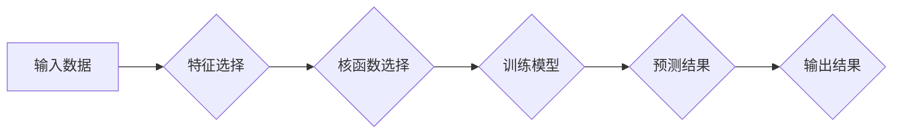

> 支持向量机(SVM)、机器学习、分类、回归、核函数、线性可分、线性不可分、软间隔、硬间隔、代码实例

## 1. 背景介绍

在机器学习领域，分类和回归问题占据着重要地位。支持向量机 (Support Vector Machines, SVM) 作为一种强大的监督学习算法，在解决这些问题方面表现出色。其核心思想是找到一个最佳的分隔超平面，将数据点有效地分类或拟合。

SVM 算法最初由 Vapnik 和 Chervonenkis 等学者提出，并在 1990 年代中期迅速发展起来。其优异的泛化能力和对高维数据处理的有效性使其成为许多应用领域的热门选择，例如图像识别、文本分类、生物信息学等。

## 2. 核心概念与联系

**2.1  线性可分与线性不可分**

* **线性可分:** 当数据点可以被一条直线或超平面完美地分割成两类时，称之为线性可分。

* **线性不可分:** 当数据点无法被一条直线或超平面完美地分割成两类时，称之为线性不可分。

**2.2  硬间隔与软间隔**

* **硬间隔:**  硬间隔是指在训练过程中，要求所有数据点都落在超平面的正确一侧，即没有数据点被错误分类。

* **软间隔:**  软间隔是指允许一些数据点落在超平面的错误一侧，通过引入松弛变量来控制允许的错误分类数量。

**2.3  支持向量**

支持向量是指距离超平面最近的那些数据点，它们对超平面的位置和方向有决定性的影响。

**2.4  核函数**

核函数是一种将低维数据映射到高维空间的技术，用于解决线性不可分问题。常用的核函数包括线性核、多项式核、径向基函数核等。

**2.5  SVM 流程图**



## 3. 核心算法原理 & 具体操作步骤

### 3.1  算法原理概述

SVM 算法的目标是找到一个最佳的分隔超平面，使得数据点在超平面的两侧尽可能地远离。

* **硬间隔 SVM:**  寻找一个最大化间隔的超平面，使得所有数据点都落在超平面的正确一侧。
* **软间隔 SVM:**  允许一些数据点落在超平面的错误一侧，通过引入松弛变量来控制允许的错误分类数量，并寻找一个最大化间隔的超平面，同时最小化松弛变量的和。

### 3.2  算法步骤详解

1. **数据预处理:** 对输入数据进行清洗、归一化等预处理操作。
2. **特征选择:** 选择合适的特征，用于训练 SVM 模型。
3. **核函数选择:** 根据数据的特性选择合适的核函数，用于将数据映射到高维空间。
4. **训练模型:** 使用训练数据训练 SVM 模型，求解最佳的分隔超平面。
5. **预测结果:** 使用训练好的 SVM 模型对新的数据进行分类或回归预测。

### 3.3  算法优缺点

**优点:**

* 泛化能力强，能够有效地避免过拟合。
* 对高维数据处理能力强。
* 能够处理非线性分类问题。

**缺点:**

* 训练时间较长，尤其是在数据量较大时。
* 对参数的选择较为敏感。
* 难以解释模型的决策边界。

### 3.4  算法应用领域

* **图像识别:**  例如人脸识别、物体检测、图像分类等。
* **文本分类:**  例如垃圾邮件过滤、情感分析、文本摘要等。
* **生物信息学:**  例如基因表达分析、蛋白质结构预测等。
* **金融领域:**  例如欺诈检测、信用评分等。

## 4. 数学模型和公式 & 详细讲解 & 举例说明

### 4.1  数学模型构建

假设我们有训练数据集 D = {(x1, y1), (x2, y2), ..., (xn, yn)}，其中 xi ∈ R^d 是第 i 个样本的特征向量，yi ∈ {-1, 1} 是第 i 个样本的类别标签。

SVM 的目标是找到一个最佳的分隔超平面，其数学表达式为:

```latex
w^T x + b = 0
```

其中 w 是超平面的法向量，b 是超平面的截距。

### 4.2  公式推导过程

**硬间隔 SVM:**

最大化间隔的条件下，求解 w 和 b 的最佳值。

```latex
max_{w, b} \frac{2}{\|w\|}
```

约束条件:

```latex
y_i (w^T x_i + b) \geq 1, \quad i = 1, 2, ..., n
```

**软间隔 SVM:**

引入松弛变量 ξi ≥ 0，允许一些数据点落在超平面的错误一侧。

```latex
min_{w, b, ξ} \frac{1}{2} \|w\|^2 + C \sum_{i=1}^{n} ξ_i
```

约束条件:

```latex
y_i (w^T x_i + b) \geq 1 - ξ_i, \quad i = 1, 2, ..., n
ξ_i \geq 0, \quad i = 1, 2, ..., n
```

其中 C 是惩罚参数，用于控制允许的错误分类数量。

### 4.3  案例分析与讲解

假设我们有以下数据点:

```
(1, 1), (2, 1), (3, 1), (1, -1), (2, -1)
```

我们可以使用 SVM 算法将其分类。

* **硬间隔 SVM:**  可以找到一条直线将数据点完美地分割成两类。
* **软间隔 SVM:**  可以允许一些数据点落在超平面的错误一侧，从而找到一个更鲁棒的分类模型。

## 5. 项目实践：代码实例和详细解释说明

### 5.1  开发环境搭建

* Python 3.x
* scikit-learn 库

### 5.2  源代码详细实现

```python
from sklearn import svm
from sklearn.datasets import make_classification
from sklearn.model_selection import train_test_split
from sklearn.metrics import accuracy_score

# 生成分类数据
X, y = make_classification(n_samples=100, n_features=2, random_state=42)

# 将数据划分为训练集和测试集
X_train, X_test, y_train, y_test = train_test_split(X, y, test_size=0.2, random_state=42)

# 创建 SVM 模型
clf = svm.SVC(kernel='linear')

# 训练模型
clf.fit(X_train, y_train)

# 预测测试集结果
y_pred = clf.predict(X_test)

# 计算准确率
accuracy = accuracy_score(y_test, y_pred)
print(f"Accuracy: {accuracy}")
```

### 5.3  代码解读与分析

* 使用 `make_classification` 函数生成分类数据。
* 使用 `train_test_split` 函数将数据划分为训练集和测试集。
* 创建 SVM 模型，并指定核函数为线性核。
* 使用 `fit` 方法训练模型。
* 使用 `predict` 方法预测测试集结果。
* 使用 `accuracy_score` 函数计算准确率。

### 5.4  运行结果展示

运行上述代码，可以得到 SVM 模型在测试集上的准确率。

## 6. 实际应用场景

SVM 算法在许多实际应用场景中发挥着重要作用，例如:

* **图像识别:**  SVM 可以用于人脸识别、物体检测、图像分类等任务。
* **文本分类:**  SVM 可以用于垃圾邮件过滤、情感分析、文本摘要等任务。
* **生物信息学:**  SVM 可以用于基因表达分析、蛋白质结构预测等任务。
* **金融领域:**  SVM 可以用于欺诈检测、信用评分等任务。

### 6.4  未来应用展望

随着机器学习技术的不断发展，SVM 算法在未来将有更广泛的应用前景。例如:

* **深度学习结合:**  将 SVM 与深度学习算法结合，可以提高模型的性能。
* **大规模数据处理:**  开发更高效的 SVM 算法，能够处理更大规模的数据集。
* **解释性模型:**  研究更具解释性的 SVM 模型，以便更好地理解模型的决策边界。

## 7. 工具和资源推荐

### 7.1  学习资源推荐

* **书籍:**
    * 《支持向量机》 - Vapnik
    * 《机器学习》 - 周志华
* **在线课程:**
    * Coursera: Machine Learning
    * edX: Introduction to Machine Learning

### 7.2  开发工具推荐

* **Python:**  Python 是机器学习领域最常用的编程语言。
* **scikit-learn:**  scikit-learn 是一个强大的机器学习库，包含了 SVM 算法的实现。
* **TensorFlow/PyTorch:**  TensorFlow 和 PyTorch 是深度学习框架，可以用于与 SVM 算法结合。

### 7.3  相关论文推荐

* **Support Vector Machines** - Vapnik, 1995
* **A Tutorial on Support Vector Machines for Pattern Recognition** - Cristianini & Shawe-Taylor, 2000

## 8. 总结：未来发展趋势与挑战

### 8.1  研究成果总结

SVM 算法在分类和回归问题中取得了显著的成果，其泛化能力强、对高维数据处理能力强等特点使其成为机器学习领域的重要算法。

### 8.2  未来发展趋势

* **深度学习结合:**  将 SVM 与深度学习算法结合，可以提高模型的性能。
* **大规模数据处理:**  开发更高效的 SVM 算法，能够处理更大规模的数据集。
* **解释性模型:**  研究更具解释性的 SVM 模型，以便更好地理解模型的决策边界。

### 8.3  面临的挑战

* **参数选择:**  SVM 算法的参数选择较为敏感，需要进行仔细的调优。
* **计算复杂度:**  对于高维数据，SVM 算法的训练时间较长。
* **非线性问题:**  对于复杂非线性问题，需要选择合适的核函数，否则模型性能会下降。

### 8.4  研究展望

未来，SVM 算法的研究将继续深入，探索其在更多领域中的应用，并解决其面临的挑战，使其成为更强大、更灵活的机器学习算法。

## 9. 附录：常见问题与解答

* **Q: SVM 的核函数有什么作用？**

* **A:** 核函数的作用是将低维数据映射到高维空间，从而解决线性不可分问题。

* **Q: SVM 的参数 C 的作用是什么？**

* **A:** C 是惩罚参数，用于控制允许的错误分类数量。C 值越大，对错误分类的惩罚越严重，模型的复杂度越高。

* **Q: 如何选择 SVM 的核函数？**

* **A:** 核函数的选择取决于数据的特性。常用的核函数包括线性核、多项式核、径向基函数核等。可以通过交叉验证等方法选择最优的核函数。


作者：禅与计算机程序设计艺术 / Zen and the Art of Computer Programming 
<end_of_turn>