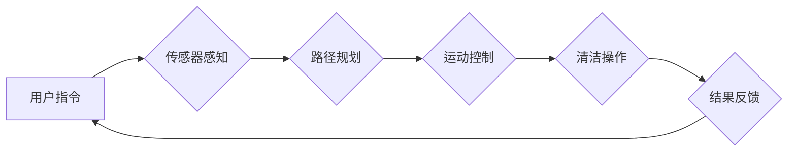

> 智能家居，清洁机器人，人工智能，机器学习，计算机视觉，SLAM，路径规划，导航算法，深度学习，自然语言处理

## 1. 背景介绍

随着生活节奏的加快和对生活品质的追求，智能家居已成为现代家庭发展的重要趋势。其中，智能清洁机器人作为智能家居的核心应用之一，凭借其自动化、便捷、高效的特点，逐渐走进千家万户。

智能家居清洁创业是一个充满机遇和挑战的领域。一方面，市场需求旺盛，消费者对智能清洁机器人的接受度不断提高；另一方面，技术发展迅速，人工智能、机器学习、计算机视觉等技术的进步为智能清洁机器人提供了强大的技术支撑。

## 2. 核心概念与联系

智能家居清洁机器人主要由以下核心模块组成：

* **硬件平台:** 包括机械结构、传感器、电机、电池等硬件设备，为机器人提供运动、感知和执行功能。
* **软件平台:** 包括操作系统、算法库、应用程序等软件组件，负责机器人控制、数据处理和用户交互。
* **人工智能模块:** 包括机器学习、深度学习、计算机视觉等人工智能技术，赋予机器人智能感知、决策和学习能力。

**核心概念原理和架构的 Mermaid 流程图:**



## 3. 核心算法原理 & 具体操作步骤

### 3.1  算法原理概述

智能家居清洁机器人需要依靠一系列算法来实现自主导航、路径规划、障碍物避让等功能。其中，SLAM（Simultaneous Localization and Mapping）算法是核心算法之一，它能够实时构建机器人周围环境地图并确定自身位置。

### 3.2  算法步骤详解

SLAM算法的具体步骤如下：

1. **数据采集:** 机器人利用传感器（如激光雷达、摄像头等）采集环境数据。
2. **特征提取:** 从采集到的数据中提取特征点，例如角点、边缘等。
3. **特征匹配:** 利用特征点进行匹配，确定相邻帧之间的关系。
4. **地图构建:** 根据特征点匹配结果，构建机器人周围环境地图。
5. **位置估计:** 利用地图信息和传感器数据，估计机器人的当前位置。

### 3.3  算法优缺点

**优点:**

* 能够实现自主导航和环境地图构建。
* 适用于复杂环境，能够应对未知环境的挑战。

**缺点:**

* 计算复杂度高，对硬件资源要求较高。
* 算法精度受传感器精度和环境复杂度影响。

### 3.4  算法应用领域

SLAM算法广泛应用于机器人导航、无人驾驶、3D建模等领域。

## 4. 数学模型和公式 & 详细讲解 & 举例说明

### 4.1  数学模型构建

SLAM算法的数学模型主要基于概率论和图论。

* **概率模型:** 利用贝叶斯定理和概率图模型描述机器人位置和地图状态之间的关系。
* **图论模型:** 将环境地图和机器人轨迹表示为图结构，利用图论算法进行路径规划和地图优化。

### 4.2  公式推导过程

SLAM算法的公式推导过程较为复杂，涉及到概率论、线性代数、优化算法等多个数学分支。

### 4.3  案例分析与讲解

通过对实际案例的分析，可以更好地理解SLAM算法的原理和应用。例如，在无人驾驶领域，SLAM算法可以帮助无人车构建周围环境地图，并根据地图信息进行路径规划和避障。

## 5. 项目实践：代码实例和详细解释说明

### 5.1  开发环境搭建

智能家居清洁机器人开发环境通常包括操作系统、编程语言、机器人控制库等软件工具。

### 5.2  源代码详细实现

以下是一个简单的SLAM算法实现示例，使用Python语言和ROS（Robot Operating System）框架：

```python
# SLAM算法实现示例

import rospy
from sensor_msgs.msg import LaserScan
from nav_msgs.msg import Odometry

class SLAM:
    def __init__(self):
        # 初始化传感器数据订阅和地图发布
        rospy.init_node('slam')
        self.laser_sub = rospy.Subscriber('/scan', LaserScan, self.laser_callback)
        self.odom_sub = rospy.Subscriber('/odom', Odometry, self.odom_callback)
        self.map_pub = rospy.Publisher('/map', OccupancyGrid, queue_size=10)

    def laser_callback(self, msg):
        # 处理激光雷达数据
        # ...

    def odom_callback(self, msg):
        # 处理里程计数据
        # ...

    def build_map(self):
        # 根据传感器数据构建地图
        # ...

    def estimate_pose(self):
        # 根据地图信息和传感器数据估计机器人位置
        # ...

if __name__ == '__main__':
    slam = SLAM()
    rospy.spin()
```

### 5.3  代码解读与分析

这段代码展示了SLAM算法的基本流程，包括传感器数据处理、地图构建、位置估计等步骤。

### 5.4  运行结果展示

运行该代码后，机器人将能够感知周围环境，构建地图，并估计自身位置。

## 6. 实际应用场景

智能家居清洁机器人已在多个实际应用场景中得到应用，例如：

* **家庭清洁:** 清洁地板、家具、窗户等。
* **商业清洁:** 清洁商场、酒店、办公室等场所。
* **医疗清洁:** 清洁医院、诊所等医疗场所。

### 6.4  未来应用展望

未来，智能家居清洁机器人将朝着更加智能化、自动化、个性化的方向发展。例如：

* **语音控制:** 通过语音指令控制机器人清洁。
* **智能识别:** 识别不同类型的污渍，并选择相应的清洁方式。
* **个性化定制:** 根据用户的清洁习惯和需求，定制清洁方案。

## 7. 工具和资源推荐

### 7.1  学习资源推荐

* **书籍:**
    * 《机器人操作系统》
    * 《人工智能》
    * 《计算机视觉》
* **在线课程:**
    * Coursera
    * edX
    * Udacity

### 7.2  开发工具推荐

* **ROS（Robot Operating System）:** 开源机器人软件框架。
* **Gazebo:** 开源机器人仿真平台。
* **Python:** 通用编程语言，广泛应用于机器人开发。

### 7.3  相关论文推荐

* **SLAM算法论文:**
    * 《Simultaneous Localization and Mapping: Probabilistic Algorithms and Techniques》
    * 《A Tutorial on Simultaneous Localization and Mapping》
* **人工智能算法论文:**
    * 《Deep Learning》
    * 《Computer Vision: Algorithms and Applications》

## 8. 总结：未来发展趋势与挑战

### 8.1  研究成果总结

智能家居清洁机器人技术发展迅速，取得了显著成果。SLAM算法、机器学习、深度学习等技术为机器人赋予了智能感知、决策和学习能力，使机器人能够自主导航、避障、清洁等。

### 8.2  未来发展趋势

未来，智能家居清洁机器人将朝着更加智能化、自动化、个性化的方向发展。例如：

* **更强大的人工智能能力:** 利用更先进的人工智能算法，使机器人能够更好地理解用户需求，并提供更个性化的清洁服务。
* **更丰富的功能:** 除了清洁功能，机器人还将具备更多功能，例如巡逻、安防、陪伴等。
* **更广泛的应用场景:** 智能家居清洁机器人将应用于更多场景，例如医疗、教育、工业等。

### 8.3  面临的挑战

智能家居清洁机器人技术发展也面临着一些挑战，例如：

* **技术复杂性:** 智能家居清洁机器人涉及多个技术领域，技术开发难度较大。
* **成本问题:** 高性能的传感器、计算平台等硬件成本较高，制约了智能家居清洁机器人的普及。
* **安全问题:** 机器人需要在复杂环境中安全运行，需要解决安全问题。

### 8.4  研究展望

未来，需要继续加强智能家居清洁机器人技术研究，攻克技术难题，降低成本，提高安全性，推动智能家居清洁机器人技术更快地发展和应用。

## 9. 附录：常见问题与解答

**常见问题:**

* **智能家居清洁机器人如何避免碰撞？**
* **智能家居清洁机器人如何识别不同类型的污渍？**
* **智能家居清洁机器人如何与其他智能家居设备协同工作？**

**解答:**

* 智能家居清洁机器人利用传感器（如激光雷达、摄像头等）感知周围环境，并通过路径规划算法避开障碍物。
* 智能家居清洁机器人利用机器学习算法识别不同类型的污渍，并选择相应的清洁方式。
* 智能家居清洁机器人可以通过网络协议与其他智能家居设备进行通信，实现协同工作。


作者：禅与计算机程序设计艺术 / Zen and the Art of Computer Programming 
<end_of_turn>