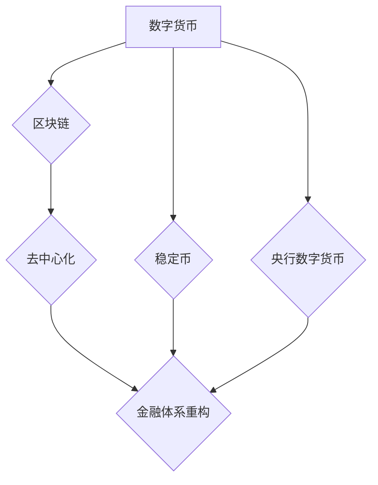

> 数字货币，区块链，去中心化，金融科技，全球货币体系，加密货币，稳定币，央行数字货币

## 1. 背景介绍

金融科技的蓬勃发展正在深刻地改变着传统的金融体系。数字货币作为金融科技的重要组成部分，以其去中心化、透明、安全等特点，正在逐渐改变人们对货币的认知和使用方式。从比特币的诞生到稳定币的兴起，数字货币的发展历程充满了创新和挑战。

当前，全球范围内对数字货币的探索和应用正处于快速发展阶段。各国央行纷纷开始研究和探索自己的数字货币，而私营机构也积极开发各种类型的数字货币产品。数字货币的未来发展势不可挡，它将深刻地影响着全球金融体系的重构。

## 2. 核心概念与联系

**2.1 数字货币**

数字货币是一种使用密码学技术保障安全的电子货币。它不依赖于任何中央机构，而是通过分布式账本技术实现交易记录的透明和不可篡改。

**2.2 区块链**

区块链是一种分布式账本技术，它将交易记录以块的形式链接在一起，形成一个不可篡改的链条。每个区块都包含了多个交易记录，并通过加密算法与前一个区块连接，确保数据的安全性和完整性。

**2.3 去中心化**

去中心化是指没有单一实体控制或管理的系统。数字货币的去中心化特性意味着任何人都可以参与到网络中，并参与到交易和验证过程中。

**2.4 稳定币**

稳定币是一种与法定货币挂钩的数字货币，其价值相对稳定。稳定币通常通过抵押法定货币或其他资产来保证其价值。

**2.5 央行数字货币 (CBDC)**

央行数字货币是由各国央行发行的数字货币。CBDC与传统法定货币一样具有法偿性，但它以数字形式存在，并通过区块链或其他分布式技术实现交易和结算。

**2.6  金融体系重构**

数字货币的出现将对传统的金融体系产生深远的影响，包括支付结算、金融监管、货币政策等方面。

**Mermaid 流程图**



## 3. 核心算法原理 & 具体操作步骤

**3.1 算法原理概述**

数字货币的核心算法原理主要包括：

* **密码学算法**: 用于保障交易安全性和数据完整性。
* **哈希算法**: 用于生成区块的唯一标识符，并确保区块链的不可篡改性。
* **共识机制**: 用于验证交易和生成新的区块，确保网络的安全性。

**3.2 算法步骤详解**

1. **交易发起**: 用户发起交易请求，包含交易金额、交易地址等信息。
2. **交易广播**: 交易请求被广播到网络中，所有节点都收到该交易请求。
3. **交易验证**: 节点验证交易的合法性，包括账户余额、签名验证等。
4. **区块打包**: 验证通过的交易被打包成一个区块。
5. **共识机制**: 节点通过共识机制验证区块的有效性，并将其添加到区块链中。
6. **交易确认**: 当区块被添加到区块链中后，交易被确认。

**3.3 算法优缺点**

**优点**:

* **安全**: 密码学算法和哈希算法保障交易安全性和数据完整性。
* **透明**: 所有交易记录都记录在区块链中，任何人都可以查看。
* **不可篡改**: 区块链的结构确保交易记录不可篡改。

**缺点**:

* **可扩展性**: 区块链的处理能力有限，难以处理大量交易。
* **隐私性**: 区块链上的交易记录公开透明，缺乏隐私保护。
* **监管难度**: 去中心化的特性使得数字货币监管难度较大。

**3.4 算法应用领域**

* **支付结算**: 数字货币可以用于跨境支付、微支付等场景。
* **供应链管理**: 数字货币可以用于追踪商品的来源和流通路径。
* **身份认证**: 数字货币可以用于建立可信的数字身份。
* **投票和治理**: 数字货币可以用于构建去中心化的投票和治理系统。

## 4. 数学模型和公式 & 详细讲解 & 举例说明

**4.1 数学模型构建**

数字货币的数学模型主要包括：

* **哈希函数**: 用于生成区块的唯一标识符。
* **公钥加密**: 用于保障交易的安全性。
* **数字签名**: 用于验证交易的合法性。

**4.2 公式推导过程**

* **哈希函数**:  H(x) = y，其中 x 是输入数据，y 是哈希值。哈希函数是一个单向函数，即无法从哈希值反推原数据。

* **公钥加密**:  E(m, pk) = c，其中 m 是明文，pk 是公钥，c 是密文。

* **数字签名**:  S(m, sk) = sig，其中 m 是明文，sk 是私钥，sig 是数字签名。

**4.3 案例分析与讲解**

假设 Alice 想要向 Bob 发送 1 个比特币。

1. Alice 使用私钥对交易信息进行数字签名。
2. Alice 将数字签名和交易信息广播到网络中。
3. 节点验证交易的合法性，包括签名验证和账户余额验证。
4. 验证通过的交易被打包成一个区块。
5. 区块被添加到区块链中后，交易被确认。

## 5. 项目实践：代码实例和详细解释说明

**5.1 开发环境搭建**

* 安装 Python 3.x
* 安装必要的库，例如：
    * `requests`：用于发送 HTTP 请求
    * `web3.py`：用于与以太坊网络交互
    * `cryptography`：用于密码学操作

**5.2 源代码详细实现**

```python
from web3 import Web3

# 连接以太坊网络
w3 = Web3(Web3.HTTPProvider("https://mainnet.infura.io/v3/YOUR_INFURA_PROJECT_ID"))

# 获取账户地址
account = w3.eth.accounts[0]

# 发送交易
transaction = {
    "from": account,
    "to": "0xYOUR_RECIPIENT_ADDRESS",
    "value": w3.toWei(1, "ether"),
}

# 发送交易并获取交易哈希
tx_hash = w3.eth.sendTransaction(transaction)

# 打印交易哈希
print(f"Transaction hash: {tx_hash}")
```

**5.3 代码解读与分析**

* `Web3` 类用于连接以太坊网络。
* `eth.accounts` 属性返回用户的账户地址列表。
* `eth.sendTransaction` 方法用于发送交易。
* `toWei` 方法用于将以太币转换为 Wei (以太币的基本单位)。

**5.4 运行结果展示**

运行代码后，将输出交易哈希，表示交易已成功发送到以太坊网络。

## 6. 实际应用场景

**6.1 跨境支付**

数字货币可以降低跨境支付的成本和时间，并提高支付效率。

**6.2 微支付**

数字货币可以用于微支付场景，例如在线游戏、音乐下载等。

**6.3 供应链管理**

数字货币可以用于追踪商品的来源和流通路径，提高供应链的透明度和效率。

**6.4 未来应用展望**

数字货币的未来应用场景非常广泛，包括：

* **去中心化金融 (DeFi)**
* **数字身份**
* **物联网**
* **游戏**

## 7. 工具和资源推荐

**7.1 学习资源推荐**

* **书籍**:
    * 《Mastering Bitcoin》
    * 《Blockchain Basics》
* **在线课程**:
    * Coursera: Blockchain Specialization
    * edX: Blockchain Fundamentals

**7.2 开发工具推荐**

* **以太坊开发工具**: Remix, Truffle, Hardhat
* **比特币开发工具**: Bitcoin Core, BitcoinJ

**7.3 相关论文推荐**

* **比特币白皮书**: https://bitcoin.org/bitcoin.pdf
* **以太坊白皮书**: https://ethereum.org/en/whitepaper/

## 8. 总结：未来发展趋势与挑战

**8.1 研究成果总结**

数字货币技术已经取得了显著的进展，并逐渐走向成熟。区块链技术、密码学算法、共识机制等核心技术不断发展，数字货币的安全性、效率和可扩展性也在不断提升。

**8.2 未来发展趋势**

* **央行数字货币 (CBDC)** 的普及
* **去中心化金融 (DeFi)** 的发展
* **数字身份** 的应用
* **数字货币与传统金融体系的融合**

**8.3 面临的挑战**

* **监管挑战**: 数字货币的去中心化特性使得监管难度较大。
* **可扩展性挑战**: 区块链的处理能力有限，难以处理大量交易。
* **隐私性挑战**: 区块链上的交易记录公开透明，缺乏隐私保护。

**8.4 研究展望**

未来，数字货币技术将继续发展，并对金融体系、经济体系和社会生活产生深远的影响。研究者需要继续探索数字货币的应用场景，解决其面临的挑战，并推动数字货币技术向更安全、更高效、更可持续的方向发展。

## 9. 附录：常见问题与解答

**9.1 什么是数字货币？**

数字货币是一种使用密码学技术保障安全的电子货币。它不依赖于任何中央机构，而是通过分布式账本技术实现交易记录的透明和不可篡改。

**9.2 区块链是什么？**

区块链是一种分布式账本技术，它将交易记录以块的形式链接在一起，形成一个不可篡改的链条。每个区块都包含了多个交易记录，并通过加密算法与前一个区块连接，确保数据的安全性和完整性。

**9.3 数字货币的优势是什么？**

数字货币的优势包括：

* **安全**: 密码学算法和哈希算法保障交易安全性和数据完整性。
* **透明**: 所有交易记录都记录在区块链中，任何人都可以查看。
* **不可篡改**: 区块链的结构确保交易记录不可篡改。

**9.4 数字货币的缺点是什么？**

数字货币的缺点包括：

* **可扩展性**: 区块链的处理能力有限，难以处理大量交易。
* **隐私性**: 区块链上的交易记录公开透明，缺乏隐私保护。
* **监管难度**: 去中心化的特性使得数字货币监管难度较大。


作者：禅与计算机程序设计艺术 / Zen and the Art of Computer Programming 
<end_of_turn>