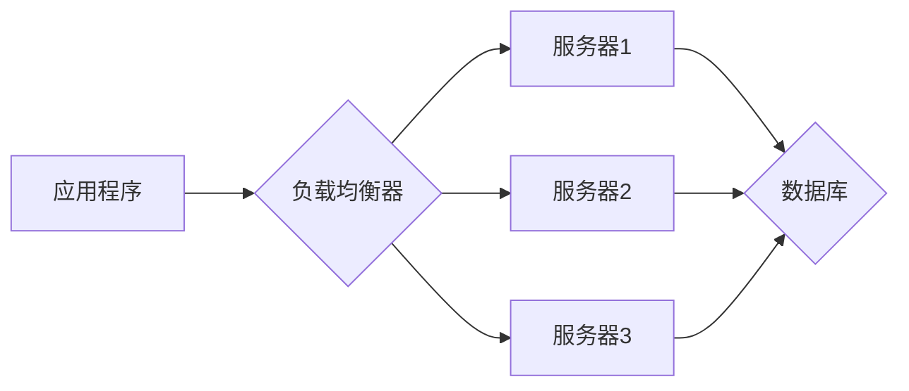

>  横向扩展，纵向扩展，云计算，分布式系统，高可用性，性能优化，架构设计

## 1. 背景介绍

随着互联网和云计算的蓬勃发展，应用程序的规模和复杂度不断增长。传统的单机架构已经难以满足现代应用对高可用性、高性能和可扩展性的需求。为了应对这些挑战，横向扩展和纵向扩展成为两种重要的架构模式。

横向扩展（Horizontal Scaling）是指通过增加服务器数量来扩展系统容量，而纵向扩展（Vertical Scaling）是指通过升级单个服务器的硬件资源来提高系统性能。两种扩展模式各有优缺点，选择哪种模式取决于具体的应用场景和需求。

## 2. 核心概念与联系

**2.1 横向扩展**

横向扩展的核心思想是将应用程序的负载分摊到多个服务器上，每个服务器负责处理一部分请求。通过增加服务器数量，可以提高系统的处理能力和吞吐量。

**2.2 纵向扩展**

纵向扩展的核心思想是升级单个服务器的硬件资源，例如CPU、内存和硬盘，以提高服务器的处理能力和性能。

**2.3 横向扩展与纵向扩展的联系**

横向扩展和纵向扩展可以相互补充，共同构建高可用、高性能的分布式系统。例如，在初期阶段，可以使用纵向扩展来提高系统的性能；随着业务规模的增长，可以采用横向扩展来增加系统的容量。

**2.4 架构图**



## 3. 核心算法原理 & 具体操作步骤

**3.1 算法原理概述**

横向扩展和纵向扩展的实现依赖于多种算法和技术，例如负载均衡、数据分片、缓存机制等。

**3.2 算法步骤详解**

**3.2.1 负载均衡**

负载均衡器负责将请求分发到不同的服务器上，以避免单个服务器过载。常见的负载均衡算法包括轮询算法、加权轮询算法、最小连接数算法等。

**3.2.2 数据分片**

数据分片是指将数据按照一定的规则分割成多个部分，分别存储在不同的服务器上。数据分片可以提高数据的访问效率和并发能力。

**3.2.3 缓存机制**

缓存机制是指将经常访问的数据存储在高速缓存中，以减少对数据库的访问次数，提高系统的响应速度。

**3.3 算法优缺点**

**3.3.1 负载均衡算法**

* **轮询算法:** 简单易实现，但可能导致服务器负载不均衡。
* **加权轮询算法:** 可以根据服务器的性能和负载情况进行权重分配，提高负载均衡效果。
* **最小连接数算法:** 将请求分配到连接数最少的服务器，可以提高服务器的利用率。

**3.3.2 数据分片算法**

* **哈希分片:** 根据数据的哈希值将数据分配到不同的服务器上，可以实现数据分布均匀。
* **范围分片:** 将数据按照一定的范围进行划分，每个服务器负责处理特定范围的数据。

**3.4 算法应用领域**

* **电商平台:** 应对高峰期流量的冲击，提高用户体验。
* **社交网络:** 处理海量用户数据和消息，保证系统稳定运行。
* **在线游戏:** 提供流畅的游戏体验，支持大量玩家同时在线。

## 4. 数学模型和公式 & 详细讲解 & 举例说明

**4.1 数学模型构建**

假设一个系统有N个服务器，每个服务器的处理能力为P，请求的平均处理时间为T。系统的总处理能力为NP，平均处理时间为T/NP。

**4.2 公式推导过程**

* 系统总处理能力：NP
* 平均处理时间：T/NP

**4.3 案例分析与讲解**

假设一个系统有10个服务器，每个服务器的处理能力为1000请求/秒，请求的平均处理时间为0.1秒。

* 系统总处理能力：10 * 1000 = 10000请求/秒
* 平均处理时间：0.1 / (10 * 1000) = 0.00001秒

## 5. 项目实践：代码实例和详细解释说明

**5.1 开发环境搭建**

* 操作系统：Linux
* 编程语言：Python
* 框架：Flask

**5.2 源代码详细实现**

```python
from flask import Flask, request, jsonify

app = Flask(__name__)

# 模拟服务器处理能力
server_capacity = 1000

@app.route('/process', methods=['POST'])
def process_request():
    # 获取请求数据
    data = request.get_json()

    # 模拟处理请求
    # ...

    # 返回处理结果
    return jsonify({'status': 'success'})

if __name__ == '__main__':
    app.run(host='0.0.0.0', port=5000)
```

**5.3 代码解读与分析**

* 使用Flask框架构建一个简单的API。
* `/process`路由处理POST请求，模拟处理请求数据。
* `server_capacity`变量模拟服务器的处理能力。

**5.4 运行结果展示**

启动应用程序，访问`http://localhost:5000/process`接口，发送POST请求，即可测试应用程序的处理能力。

## 6. 实际应用场景

**6.1 电商平台**

* 应对高峰期流量的冲击，保证网站稳定运行。
* 分布式存储商品信息和用户数据，提高数据访问效率。

**6.2 社交网络**

* 处理海量用户数据和消息，保证系统稳定运行。
* 分布式存储用户数据和社交关系，提高数据访问效率。

**6.3 在线游戏**

* 提供流畅的游戏体验，支持大量玩家同时在线。
* 分布式存储游戏数据和玩家信息，提高数据访问效率。

**6.4 未来应用展望**

随着云计算和人工智能技术的不断发展，横向扩展和纵向扩展将应用于更多领域，例如物联网、大数据分析、机器学习等。

## 7. 工具和资源推荐

**7.1 学习资源推荐**

* 《分布式系统的设计与实现》
* 《云计算架构设计》
* 《Kubernetes实战》

**7.2 开发工具推荐**

* Docker
* Kubernetes
* Apache Kafka

**7.3 相关论文推荐**

* The Case for Scalability
* Designing Data-Intensive Applications

## 8. 总结：未来发展趋势与挑战

**8.1 研究成果总结**

横向扩展和纵向扩展是构建高可用、高性能分布式系统的关键技术。

**8.2 未来发展趋势**

* 自动化运维
* serverless架构
* 微服务架构

**8.3 面临的挑战**

* 数据一致性
* 故障容错
* 安全性

**8.4 研究展望**

未来研究将重点关注如何提高分布式系统的可靠性、安全性、可维护性和可扩展性。

## 9. 附录：常见问题与解答

**9.1 如何选择横向扩展还是纵向扩展？**

选择哪种扩展模式取决于具体的应用场景和需求。

**9.2 如何实现数据一致性？**

可以使用分布式数据库、数据同步机制等技术来实现数据一致性。

**9.3 如何提高系统的故障容错能力？**

可以使用冗余机制、故障转移机制等技术来提高系统的故障容错能力。


作者：禅与计算机程序设计艺术 / Zen and the Art of Computer Programming 
<end_of_turn>