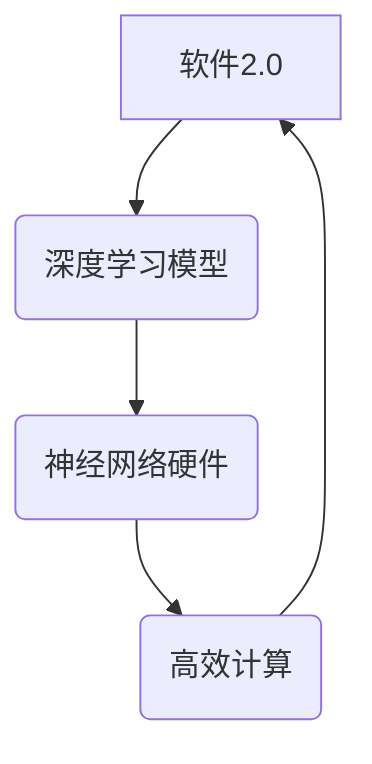

> 神经网络,硬件加速,深度学习,人工智能,软件2.0,计算架构,专用芯片

## 1. 背景介绍

人工智能（AI）的蓬勃发展，特别是深度学习技术的突破，对计算资源提出了前所未有的挑战。传统的通用处理器在处理海量数据和复杂的计算任务时，效率低下，难以满足深度学习模型训练和推理的需求。为了解决这一瓶颈，神经网络硬件应运而生，成为深度学习软件2.0运行环境的基石。

近年来，神经网络硬件领域取得了显著进展，涌现出各种专门为深度学习模型优化的芯片和系统架构。这些硬件加速器通过并行计算、数据流优化和专用指令集等方式，大幅提升了深度学习模型的训练和推理速度，降低了能耗，推动了人工智能技术的快速发展。

## 2. 核心概念与联系

**2.1 神经网络硬件**

神经网络硬件是指专门为深度学习模型设计的硬件平台，其架构和功能都围绕着神经网络的计算特点进行优化。

**2.2 软件2.0**

软件2.0是指以深度学习模型为核心，利用人工智能技术构建的下一代软件。它具有以下特点：

* **数据驱动:** 软件2.0依赖于海量数据进行训练和学习，能够从数据中提取知识和规律。
* **智能化:** 软件2.0能够像人类一样学习和思考，具备决策、推理和解决问题的能力。
* **个性化:** 软件2.0能够根据用户的需求和喜好进行个性化定制。

**2.3 关系**

神经网络硬件是软件2.0运行环境的基础。深度学习模型是软件2.0的核心，而神经网络硬件能够高效地执行深度学习模型的计算，为软件2.0的运行提供强大的计算能力。



## 3. 核心算法原理 & 具体操作步骤

**3.1 算法原理概述**

神经网络硬件的核心算法原理是基于深度学习模型的计算结构和特点进行优化。常见的算法包括：

* **卷积神经网络 (CNN):** 用于图像识别、物体检测等任务。
* **循环神经网络 (RNN):** 用于自然语言处理、语音识别等任务。
* **Transformer:** 用于机器翻译、文本摘要等任务。

这些算法通过多层神经元网络结构，利用权重和激活函数进行数据处理，实现对数据的学习和预测。

**3.2 算法步骤详解**

1. **数据预处理:** 将原始数据转换为神经网络可以理解的格式，例如归一化、编码等。
2. **前向传播:** 将数据输入神经网络，逐层计算，最终得到输出结果。
3. **反向传播:** 计算输出结果与真实值的误差，并根据误差调整神经网络的权重和偏置，使模型的预测结果更加准确。
4. **训练:** 重复前向传播和反向传播的过程，直到模型的性能达到预设的目标。

**3.3 算法优缺点**

**优点:**

* **高精度:** 深度学习模型能够学习到复杂的模式和关系，实现高精度的预测。
* **自动化:** 深度学习模型的训练和优化过程可以自动化，减少人工干预。
* **可扩展性:** 深度学习模型可以轻松扩展到更大的数据集和更复杂的模型架构。

**缺点:**

* **数据依赖:** 深度学习模型需要大量的训练数据才能达到良好的性能。
* **计算资源消耗:** 深度学习模型的训练和推理过程需要大量的计算资源。
* **可解释性差:** 深度学习模型的决策过程难以解释，难以理解模型的内部机制。

**3.4 算法应用领域**

深度学习算法广泛应用于各个领域，例如：

* **计算机视觉:** 图像识别、物体检测、图像分割、人脸识别等。
* **自然语言处理:** 机器翻译、文本摘要、情感分析、对话系统等。
* **语音识别:** 语音转文本、语音助手等。
* **医疗诊断:** 病理图像分析、疾病预测等。
* **金融分析:** 风险评估、欺诈检测等。

## 4. 数学模型和公式 & 详细讲解 & 举例说明

**4.1 数学模型构建**

深度学习模型的数学模型主要基于神经网络的结构和计算方式。

* **神经元:** 神经元是深度学习模型的基本单元，它接收输入信号，经过激活函数处理，输出结果。
* **层:** 神经元按照一定的结构排列成层，每一层负责处理数据的不同特征。
* **权重:** 神经元之间的连接权重决定了信号传递的强度。
* **偏置:** 每个神经元都有一个偏置项，用于调整神经元的激活阈值。

**4.2 公式推导过程**

深度学习模型的训练过程基于梯度下降算法，其核心公式包括：

* **损失函数:** 用于衡量模型预测结果与真实值的误差。
* **梯度:** 用于计算损失函数对模型参数的导数。
* **更新规则:** 用于根据梯度更新模型参数，使损失函数最小化。

**4.3 案例分析与讲解**

以卷积神经网络为例，其核心计算过程包括卷积、池化和全连接层。

* **卷积层:** 使用卷积核对输入数据进行卷积运算，提取特征。
* **池化层:** 对卷积层的输出进行池化操作，降低数据维度，提高模型鲁棒性。
* **全连接层:** 将池化层的输出连接到全连接层，进行分类或回归预测。

## 5. 项目实践：代码实例和详细解释说明

**5.1 开发环境搭建**

* **操作系统:** Linux
* **编程语言:** Python
* **深度学习框架:** TensorFlow 或 PyTorch
* **硬件平台:** GPU 加速器

**5.2 源代码详细实现**

```python
import tensorflow as tf

# 定义卷积神经网络模型
model = tf.keras.models.Sequential([
    tf.keras.layers.Conv2D(32, (3, 3), activation='relu', input_shape=(28, 28, 1)),
    tf.keras.layers.MaxPooling2D((2, 2)),
    tf.keras.layers.Conv2D(64, (3, 3), activation='relu'),
    tf.keras.layers.MaxPooling2D((2, 2)),
    tf.keras.layers.Flatten(),
    tf.keras.layers.Dense(10, activation='softmax')
])

# 编译模型
model.compile(optimizer='adam',
              loss='sparse_categorical_crossentropy',
              metrics=['accuracy'])

# 训练模型
model.fit(x_train, y_train, epochs=10)

# 评估模型
loss, accuracy = model.evaluate(x_test, y_test)
print('Test loss:', loss)
print('Test accuracy:', accuracy)
```

**5.3 代码解读与分析**

* 代码定义了一个简单的卷积神经网络模型，包含卷积层、池化层和全连接层。
* 模型使用 Adam 优化器、交叉熵损失函数和准确率指标进行训练。
* 训练过程使用训练数据进行迭代训练，直到达到预设的 epochs 数。
* 训练完成后，使用测试数据评估模型的性能。

**5.4 运行结果展示**

训练完成后，模型的准确率会输出到控制台，可以根据实际情况调整模型参数和训练过程，提高模型性能。

## 6. 实际应用场景

**6.1 图像识别**

神经网络硬件可以加速图像识别任务，例如人脸识别、物体检测、场景理解等。

**6.2 语音识别**

神经网络硬件可以提高语音识别的准确性和实时性，例如语音助手、语音转文本等。

**6.3 自然语言处理**

神经网络硬件可以加速自然语言处理任务，例如机器翻译、文本摘要、情感分析等。

**6.4 医疗诊断**

神经网络硬件可以辅助医生进行医疗诊断，例如病理图像分析、疾病预测等。

**6.5 自动驾驶**

神经网络硬件可以支持自动驾驶系统的感知和决策，例如物体检测、路径规划等。

**6.6 未来应用展望**

随着神经网络硬件技术的不断发展，其应用场景将更加广泛，例如：

* **增强现实 (AR) 和虚拟现实 (VR):** 提供更逼真的虚拟体验。
* **机器人:** 赋予机器人更强的感知和决策能力。
* **个性化教育:** 提供定制化的学习方案。
* **科学研究:** 加速科学发现和技术创新。

## 7. 工具和资源推荐

**7.1 学习资源推荐**

* **书籍:**
    * 深度学习
    * 神经网络与深度学习
* **在线课程:**
    * Coursera 深度学习课程
    * Udacity 深度学习工程师 Nanodegree

**7.2 开发工具推荐**

* **深度学习框架:** TensorFlow, PyTorch, Keras
* **编程语言:** Python
* **硬件平台:** NVIDIA GPU, Google TPU

**7.3 相关论文推荐**

* AlexNet: ImageNet Classification with Deep Convolutional Neural Networks
* ResNet: Deep Residual Learning for Image Recognition
* BERT: Pre-training of Deep Bidirectional Transformers for Language Understanding

## 8. 总结：未来发展趋势与挑战

**8.1 研究成果总结**

神经网络硬件技术取得了显著进展，为深度学习的快速发展提供了强大的计算基础。

**8.2 未来发展趋势**

* **更高效的计算架构:** 探索新的计算模型和硬件架构，进一步提高计算效率。
* **更低的功耗:** 开发更节能的硬件设计，降低能源消耗。
* **更广泛的应用场景:** 将神经网络硬件应用于更多领域，例如医疗、教育、金融等。

**8.3 面临的挑战**

* **算法与硬件的协同优化:** 需要更好地结合算法设计和硬件架构，实现算法和硬件的协同优化。
* **可解释性和安全性:** 深度学习模型的可解释性和安全性仍然是一个挑战，需要进一步研究和解决。
* **人才培养:** 需要培养更多神经网络硬件领域的专业人才。

**8.4 研究展望**

未来，神经网络硬件技术将继续发展，推动人工智能技术的进步，为人类社会带来更多福祉。


## 9. 附录：常见问题与解答

**9.1 什么是神经网络加速器？**

神经网络加速器是一种专门为深度学习模型设计的硬件，其架构和功能都围绕着神经网络的计算特点进行优化，能够大幅提升深度学习模型的训练和推理速度。

**9.2 神经网络硬件有哪些类型？**

常见的类型包括：

* **GPU 加速器:** 利用图形处理单元的并行计算能力加速深度学习训练。
* **专用芯片:** 专为深度学习模型设计的芯片，例如 Google TPU, Intel Nervana, NVIDIA Tensor Core 等。
* **FPGA 加速器:** 利用现场可编程门阵列的灵活性，根据不同的深度学习模型进行定制化加速。

**9.3 如何选择合适的硬件平台？**

选择硬件平台需要考虑以下因素：

* **模型规模:** 不同的模型对硬件资源的需求不同。
* **训练速度:** 不同的硬件平台对训练速度的影响不同。
* **成本:** 不同的硬件平台价格不同。
* **开发环境:** 不同的硬件平台支持不同的开发环境和工具。


作者：禅与计算机程序设计艺术 / Zen and the Art of Computer Programming 
<end_of_turn>