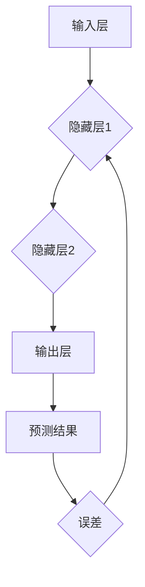

> 神经网络,深度学习,机器学习,人工智能,算法,模型,应用

## 1. 背景介绍

人类文明的进步离不开对世界规律的探索和理解。从古希腊哲学家对宇宙的思考，到现代科学的探索，我们一直在试图用逻辑和数学来描述世界。而人工智能（AI）的出现，则标志着我们迈向一个新的里程碑。AI的目标是创造能够像人类一样思考、学习和解决问题的机器。

神经网络作为AI领域的核心技术之一，以其强大的学习能力和应用潜力，在各个领域掀起了革命性的变革。从语音识别、图像识别到自然语言处理，神经网络已经渗透到我们生活的方方面面。

## 2. 核心概念与联系

### 2.1 神经网络的灵感来源

神经网络的灵感来源于人类大脑的结构和功能。大脑由数十亿的神经元组成，这些神经元通过复杂的连接相互传递信息。当我们学习新的知识或技能时，神经元之间的连接会发生改变，从而形成新的知识和技能的表示。

### 2.2 神经网络的结构

神经网络由多个层组成，每一层都包含多个神经元。这些层可以分为输入层、隐藏层和输出层。

* **输入层:**接收来自外部世界的原始数据。
* **隐藏层:**对输入数据进行处理和转换，提取特征和模式。
* **输出层:**输出最终的结果。

神经元之间通过连接进行信息传递，每个连接都具有一个权重，权重决定了信息传递的强度。

### 2.3 神经网络的学习过程

神经网络的学习过程就是通过调整连接权重来最小化预测误差的过程。

* **前向传播:**将输入数据传递到输出层，得到预测结果。
* **反向传播:**计算预测结果与真实结果之间的误差，并根据误差调整连接权重。

通过反复的训练，神经网络可以逐渐学习到数据的规律和模式，从而提高预测精度。



## 3. 核心算法原理 & 具体操作步骤

### 3.1 算法原理概述

神经网络学习的核心算法是反向传播算法（Backpropagation）。该算法通过计算误差梯度，逐步调整神经网络的连接权重，从而使网络的预测结果越来越接近真实值。

### 3.2 算法步骤详解

1. **前向传播:** 将输入数据传递到输出层，计算输出结果。
2. **误差计算:** 计算输出结果与真实值的误差。
3. **反向传播:** 从输出层开始，反向传播误差信息到输入层，计算每个神经元的误差梯度。
4. **权重更新:** 根据误差梯度，更新每个神经元的连接权重。
5. **重复步骤1-4:** 重复上述步骤，直到误差达到预设阈值或训练次数达到上限。

### 3.3 算法优缺点

**优点:**

* 能够学习复杂非线性关系。
* 具有强大的泛化能力，能够对未知数据进行预测。

**缺点:**

* 训练时间长，需要大量的计算资源。
* 容易陷入局部最优解。
* 训练过程难以解释，缺乏可解释性。

### 3.4 算法应用领域

反向传播算法广泛应用于各种机器学习任务，例如：

* **图像识别:** 识别物体、场景和人脸。
* **语音识别:** 将语音转换为文本。
* **自然语言处理:** 机器翻译、文本摘要、情感分析等。
* **推荐系统:** 根据用户历史行为推荐商品或内容。

## 4. 数学模型和公式 & 详细讲解 & 举例说明

### 4.1 数学模型构建

神经网络的数学模型可以表示为一个多层感知机（MLP）。MLP由多个层组成，每一层包含多个神经元。每个神经元接收来自上一层的输入信号，并通过激活函数进行处理，输出到下一层。

### 4.2 公式推导过程

* **激活函数:** 激活函数将神经元的输入信号转换为输出信号。常用的激活函数包括 sigmoid 函数、ReLU 函数等。

* **权重更新:** 权重更新规则通常使用梯度下降算法，通过调整连接权重来最小化预测误差。

* **损失函数:** 损失函数用于衡量预测结果与真实值的差异。常用的损失函数包括均方误差（MSE）、交叉熵损失等。

### 4.3 案例分析与讲解

假设我们有一个简单的二分类问题，需要判断图像是否包含猫。我们可以使用一个两层神经网络进行训练。

* **输入层:** 接收图像的像素值。
* **隐藏层:** 提取图像特征。
* **输出层:** 输出预测结果，即图像是否包含猫。

通过训练数据，神经网络可以学习到猫的特征，并能够准确地预测图像是否包含猫。

## 5. 项目实践：代码实例和详细解释说明

### 5.1 开发环境搭建

* **Python:** Python 是神经网络开发的常用语言，拥有丰富的机器学习库。
* **TensorFlow/PyTorch:** TensorFlow 和 PyTorch 是两种流行的神经网络框架，提供高效的计算和模型训练工具。

### 5.2 源代码详细实现

```python
import tensorflow as tf

# 定义模型结构
model = tf.keras.models.Sequential([
    tf.keras.layers.Dense(128, activation='relu', input_shape=(784,)),
    tf.keras.layers.Dense(10, activation='softmax')
])

# 编译模型
model.compile(optimizer='adam',
              loss='sparse_categorical_crossentropy',
              metrics=['accuracy'])

# 训练模型
model.fit(x_train, y_train, epochs=10)

# 评估模型
loss, accuracy = model.evaluate(x_test, y_test)
print('Test loss:', loss)
print('Test accuracy:', accuracy)
```

### 5.3 代码解读与分析

* **模型定义:** 使用 `tf.keras.models.Sequential` 创建一个顺序模型，包含两层全连接层。
* **激活函数:** 使用 `relu` 激活函数，可以提高模型的表达能力。
* **损失函数:** 使用 `sparse_categorical_crossentropy` 损失函数，适用于多分类问题。
* **优化器:** 使用 `adam` 优化器，可以加速模型训练。
* **训练模型:** 使用 `model.fit` 方法训练模型，指定训练数据、 epochs 数等参数。
* **评估模型:** 使用 `model.evaluate` 方法评估模型在测试集上的性能。

### 5.4 运行结果展示

训练完成后，可以查看模型在测试集上的准确率，并根据需要调整模型结构、参数等进行优化。

## 6. 实际应用场景

### 6.1 语音识别

神经网络可以用于构建语音识别系统，将语音信号转换为文本。例如，智能手机的语音助手、语音搜索引擎等。

### 6.2 图像识别

神经网络可以用于构建图像识别系统，识别物体、场景和人脸。例如，自动驾驶汽车、医疗影像分析等。

### 6.3 自然语言处理

神经网络可以用于构建自然语言处理系统，例如机器翻译、文本摘要、情感分析等。例如，在线翻译工具、聊天机器人等。

### 6.4 未来应用展望

随着人工智能技术的不断发展，神经网络的应用场景将更加广泛。例如：

* **个性化推荐:** 根据用户的兴趣和行为，推荐个性化的商品、内容和服务。
* **医疗诊断:** 利用神经网络分析医学影像，辅助医生进行诊断。
* **金融风险控制:** 利用神经网络识别金融风险，降低金融机构的损失。

## 7. 工具和资源推荐

### 7.1 学习资源推荐

* **书籍:**
    * 《深度学习》
    * 《神经网络与深度学习》
* **在线课程:**
    * Coursera: 深度学习
    * Udacity: 
    * fast.ai: 深度学习课程

### 7.2 开发工具推荐

* **TensorFlow:** https://www.tensorflow.org/
* **PyTorch:** https://pytorch.org/
* **Keras:** https://keras.io/

### 7.3 相关论文推荐

* **AlexNet:** http://papers.nips.cc/paper/4824-imagenet-classification-with-deep-convolutional-neural-networks.pdf
* **VGGNet:** http://arxiv.org/abs/1409.1556
* **ResNet:** http://arxiv.org/abs/1512.03385

## 8. 总结：未来发展趋势与挑战

### 8.1 研究成果总结

神经网络技术取得了显著的进展，在图像识别、语音识别、自然语言处理等领域取得了突破性的成果。

### 8.2 未来发展趋势

* **模型规模和复杂度:** 随着计算资源的不断提升，神经网络模型的规模和复杂度将进一步提高，从而提升模型的性能。
* **模型解释性和可解释性:** 如何解释和理解神经网络的决策过程，是未来研究的重要方向。
* **高效训练算法:** 如何提高神经网络的训练效率，是另一个重要的研究方向。

### 8.3 面临的挑战

* **数据依赖性:** 神经网络的性能依赖于训练数据的质量和数量。
* **计算资源需求:** 训练大型神经网络需要大量的计算资源，这对于资源有限的机构或个人来说是一个挑战。
* **伦理问题:** 神经网络的应用可能带来一些伦理问题，例如数据隐私、算法偏见等，需要引起重视和解决。

### 8.4 研究展望

未来，神经网络技术将继续发展，并在更多领域发挥重要作用。我们需要不断探索新的算法、模型和应用场景，并积极应对挑战，推动神经网络技术朝着更加安全、可靠、可解释的方向发展。

## 9. 附录：常见问题与解答

### 9.1 什么是激活函数？

激活函数是神经网络中一个重要的组成部分，它决定了神经元的输出信号。常用的激活函数包括 sigmoid 函数、ReLU 函数、tanh 函数等。

### 9.2 什么是反向传播算法？

反向传播算法是神经网络训练的核心算法，它通过计算误差梯度，逐步调整神经网络的连接权重，从而使网络的预测结果越来越接近真实值。

### 9.3 如何选择合适的激活函数？

选择合适的激活函数取决于具体的应用场景和模型结构。例如，对于二分类问题，sigmoid 函数是一个常用的选择；对于多分类问题，softmax 函数是一个常用的选择。

### 9.4 如何评估神经网络的性能？

常用的评估指标包括准确率、召回率、F1 值等。具体的评估指标选择取决于具体的应用场景和任务目标。

### 9.5 如何解决神经网络过拟合问题？

过拟合是指神经网络在训练数据上表现良好，但在测试数据上表现较差。解决过拟合问题的方法包括：

* **增加训练数据量**
* **使用正则化技术**
* **使用 dropout 技术**
* **减少模型复杂度**


作者：禅与计算机程序设计艺术 / Zen and the Art of Computer Programming 
<end_of_turn>