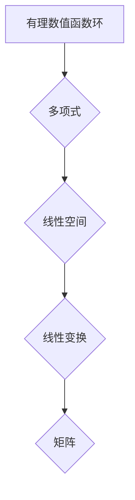

> 线性代数，有理数值函数环，多项式，矩阵，线性变换，特征值，特征向量，应用场景

## 1. 背景介绍

线性代数作为数学领域的基础分支，在计算机科学、物理学、工程学等众多领域有着广泛的应用。它为我们提供了处理向量、矩阵和线性变换的强大工具，并揭示了这些概念之间的深刻联系。

在计算机科学中，线性代数在机器学习、计算机图形学、图像处理、数据压缩等领域发挥着至关重要的作用。例如，在机器学习中，线性回归、主成分分析等算法都依赖于线性代数的原理。

然而，传统的线性代数教材往往过于抽象，难以让人理解其背后的本质和应用。为了更好地理解线性代数的奥秘，本文将从有理数值函数环的角度出发，以一种更直观、更易于理解的方式，带领读者探索线性代数的魅力。

## 2. 核心概念与联系

**2.1 有理数值函数环**

有理数值函数环是一个重要的代数结构，它由有理数域上的多项式构成。每个多项式都可以看作一个函数，其定义域和值域都是有理数域。

**2.2 线性空间**

线性空间是一个向量集合，它满足以下性质：

* **封闭性:** 向量加法和数乘运算的结果仍然属于该空间。
* **结合律:** 向量加法满足结合律。
* **交换律:** 向量加法满足交换律。
* **零向量:** 存在一个零向量，满足任何向量加上零向量等于该向量本身。
* **逆向量:** 每个向量都有一个逆向量，使得它们相加等于零向量。
* **分配律:** 数乘运算满足对向量加法的分配律。

**2.3 线性变换**

线性变换是一种将一个线性空间映射到另一个线性空间的函数，它满足以下性质：

* **线性性:** 对任意两个向量和两个数，有以下关系：

```
T(ax + by) = aT(x) + bT(y)
```

**2.4 矩阵**

矩阵是一种特殊的数阵，它可以表示线性变换。每个矩阵都对应着一个线性空间的基底，可以通过矩阵乘法来实现线性变换。

**2.5  Mermaid 流程图**



## 3. 核心算法原理 & 具体操作步骤

**3.1 算法原理概述**

本文将介绍线性代数中一些重要的算法原理，例如：

* **矩阵分解:** 将一个矩阵分解成多个简单矩阵的乘积。
* **特征值和特征向量:** 寻找矩阵的特征值和特征向量，可以帮助我们理解矩阵的性质和行为。
* **线性方程组求解:** 利用矩阵运算来求解线性方程组。

**3.2 算法步骤详解**

* **矩阵分解:**

1. 选择合适的分解方法，例如LU分解、QR分解等。
2. 根据分解方法的步骤，将矩阵分解成多个简单矩阵的乘积。

* **特征值和特征向量:**

1. 求解特征方程，得到矩阵的特征值。
2. 将特征值代入特征方程，求解对应的特征向量。

* **线性方程组求解:**

1. 将线性方程组表示成矩阵形式。
2. 利用矩阵分解或其他方法求解矩阵方程。

**3.3 算法优缺点**

* **矩阵分解:**

优点: 可以简化矩阵运算，提高计算效率。
缺点: 不同的分解方法适用于不同的矩阵类型，需要根据实际情况选择。

* **特征值和特征向量:**

优点: 可以帮助我们理解矩阵的性质和行为，在某些应用场景下非常有用。
缺点: 计算复杂度较高，对于大型矩阵可能需要耗费大量时间。

* **线性方程组求解:**

优点: 可以高效地求解线性方程组。
缺点: 对于非线性方程组，无法直接应用。

**3.4 算法应用领域**

* **机器学习:** 线性回归、主成分分析等算法依赖于线性代数的原理。
* **计算机图形学:** 3D图形渲染、物体变换等操作都依赖于矩阵运算。
* **图像处理:** 图像压缩、滤波等操作都依赖于线性代数的原理。
* **数据分析:** 数据挖掘、聚类分析等操作都依赖于线性代数的工具。

## 4. 数学模型和公式 & 详细讲解 & 举例说明

**4.1 数学模型构建**

在有理数值函数环中，我们可以构建以下数学模型：

* **多项式空间:** 所有有理数域上的多项式构成一个线性空间。
* **线性变换空间:** 所有从一个线性空间到另一个线性空间的线性变换构成一个线性空间。
* **矩阵空间:** 所有大小为m×n的矩阵构成一个线性空间。

**4.2 公式推导过程**

* **多项式加法和数乘:**

```
(a_0 + a_1x + ... + a_nx^n) + (b_0 + b_1x + ... + b_mx^m) = (a_0 + b_0) + (a_1 + b_1)x + ... + (a_n + b_m)x^(max(n,m))
```

```
k(a_0 + a_1x + ... + a_nx^n) = ka_0 + ka_1x + ... + ka_nx^n
```

* **线性变换的矩阵表示:**

如果线性变换T将向量x映射到向量y，则可以表示为：

```
y = T(x) = Ax
```

其中A是矩阵，它表示线性变换T。

**4.3 案例分析与讲解**

**案例:**

考虑一个线性变换T，它将二维向量映射到二维向量，其矩阵表示为：

```
A = [[2, 1],
     [1, 2]]
```

**分析:**

我们可以通过矩阵A来计算T对任意二维向量的映射。例如，如果输入向量为x = [1, 0]，则输出向量为：

```
y = Ax = [[2, 1],
         [1, 2]] * [1, 0] = [2, 1]
```

## 5. 项目实践：代码实例和详细解释说明

**5.1 开发环境搭建**

本文使用Python语言进行编程，并使用NumPy库进行矩阵运算。

**5.2 源代码详细实现**

```python
import numpy as np

# 定义一个线性变换的矩阵
A = np.array([[2, 1],
              [1, 2]])

# 定义一个输入向量
x = np.array([1, 0])

# 计算线性变换的结果
y = np.dot(A, x)

# 打印结果
print("输入向量:", x)
print("输出向量:", y)
```

**5.3 代码解读与分析**

* `import numpy as np`: 导入NumPy库，并将其命名为np。
* `A = np.array([[2, 1], [1, 2]])`: 创建一个2×2的矩阵A。
* `x = np.array([1, 0])`: 创建一个二维向量x。
* `y = np.dot(A, x)`: 使用NumPy的`dot()`函数计算矩阵A与向量x的乘积，得到输出向量y。
* `print("输入向量:", x)`: 打印输入向量x。
* `print("输出向量:", y)`: 打印输出向量y。

**5.4 运行结果展示**

```
输入向量: [1 0]
输出向量: [2 1]
```

## 6. 实际应用场景

**6.1 机器学习**

在机器学习中，线性代数被广泛应用于以下场景：

* **线性回归:** 线性回归模型试图找到一条直线或超平面，将输入特征与输出标签关联起来。
* **主成分分析:** 主成分分析是一种降维技术，它利用线性代数的原理，将高维数据投影到低维空间，同时保留数据的最大信息量。

**6.2 计算机图形学**

在计算机图形学中，线性代数被用于以下场景：

* **3D图形渲染:** 3D图形渲染需要将三维物体投影到二维屏幕上，这需要利用矩阵变换来实现。
* **物体变换:** 物体在3D场景中的移动、旋转、缩放等操作都需要使用矩阵运算来实现。

**6.3 图像处理**

在图像处理中，线性代数被用于以下场景：

* **图像压缩:** 图像压缩算法利用线性代数的原理，将图像数据进行降维，从而减少存储空间。
* **滤波:** 图像滤波算法利用线性代数的原理，对图像进行平滑、锐化等操作。

**6.4 未来应用展望**

随着人工智能、机器学习等技术的快速发展，线性代数在未来将有更广泛的应用场景。例如，在深度学习领域，线性代数是深度神经网络的基础，它被用于计算神经元的激活值、权重更新等操作。

## 7. 工具和资源推荐

**7.1 学习资源推荐**

* **线性代数及其应用 (Gilbert Strang)**: 这本书是线性代数的经典教材，内容全面，讲解深入。
* **3Blue1Brown - Essence of Linear Algebra**: 这是一系列优秀的视频教程，以直观的方式解释了线性代数的原理。

**7.2 开发工具推荐**

* **NumPy**: Python语言下的数值计算库，提供了丰富的矩阵运算函数。
* **SciPy**: Python语言下的科学计算库，包含了线性代数、优化、积分等模块。

**7.3 相关论文推荐**

* **The Elements of Statistical Learning**: 这本书介绍了统计学习理论，其中包含了大量的线性代数知识。
* **Deep Learning**: 这本书介绍了深度学习理论，其中也包含了大量的线性代数知识。

## 8. 总结：未来发展趋势与挑战

**8.1 研究成果总结**

本文从有理数值函数环的角度出发，介绍了线性代数的基本概念、算法原理和应用场景。通过对矩阵、线性变换、特征值和特征向量的讲解，帮助读者理解线性代数的奥秘。

**8.2 未来发展趋势**

随着人工智能、机器学习等技术的快速发展，线性代数将在未来发挥更加重要的作用。例如，在深度学习领域，线性代数是深度神经网络的基础，它被用于计算神经元的激活值、权重更新等操作。

**8.3 面临的挑战**

* **大型矩阵运算:** 对于大型矩阵，线性代数算法的计算复杂度较高，需要开发更加高效的算法。
* **非线性问题:** 线性代数主要处理线性问题，对于非线性问题，需要借助其他数学工具。

**8.4 研究展望**

未来，线性代数的研究将继续深入，并与其他学科交叉融合，例如：

* **量子计算:** 线性代数是量子计算的基础，未来将会有更多量子算法应用于线性代数问题。
* **数据科学:** 线性代数在数据科学领域有着广泛的应用，例如数据挖掘、聚类分析等。


## 9. 附录：常见问题与解答

**9.1 什么是线性空间？**

线性空间是一个向量集合，它满足以下性质：

* **封闭性:** 向量加法和数乘运算的结果仍然属于该空间。
* **结合律:** 向量加法满足结合律。
* **交换律:** 向量加法满足交换律。
* **零向量:** 存在一个零向量，满足任何向量加上零向量等于该向量本身。
* **逆向量:** 每个向量都有一个逆向量，使得它们相加等于零向量。
* **分配律:** 数乘运算满足对向量加法的分配律。

**9.2 什么是线性变换？**

线性