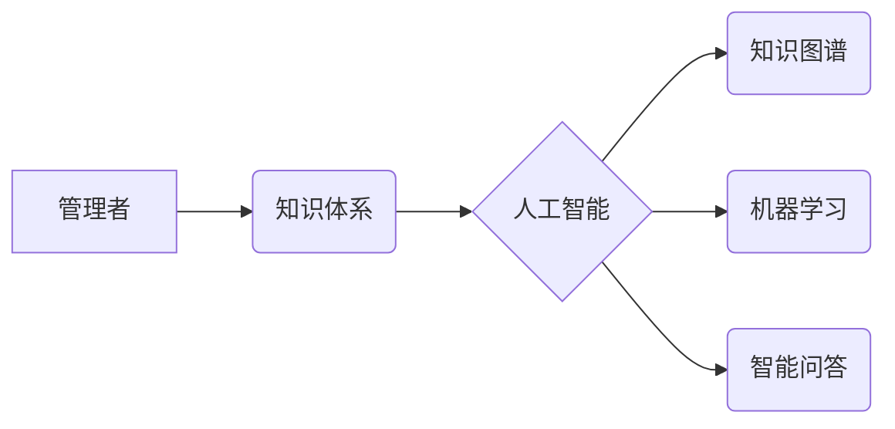

> 知识体系、管理者、人工智能、数据分析、决策支持、学习路径、知识图谱、深度学习

## 1. 背景介绍

在当今信息爆炸的时代，知识已成为企业竞争的核心驱动力。管理者作为企业决策的领导者，需要具备强大的知识体系，才能有效地应对复杂环境下的挑战，做出明智的决策。然而，传统的管理教育往往侧重于理论知识和经验分享，缺乏系统性的知识体系构建方法。随着人工智能、大数据等技术的快速发展，构建高效的知识体系成为管理者提升竞争力的关键。

## 2. 核心概念与联系

**2.1 知识体系的概念**

知识体系是指对某一领域或主题的知识进行系统化、结构化、整合和组织的框架。它包含了知识的各个方面，包括概念、原理、理论、方法、案例等。

**2.2 管理者知识体系的构建**

管理者知识体系的构建需要从以下几个方面入手：

* **明确目标:** 首先要明确构建知识体系的目标，例如提升决策能力、增强创新能力、提高团队管理水平等。
* **确定范围:** 根据目标，确定知识体系的范围，例如财务管理、市场营销、人力资源管理等。
* **选择框架:** 选择合适的知识体系框架，例如层次结构、网络结构、主题结构等。
* **收集整理:** 收集和整理相关领域的知识资源，包括书籍、论文、案例、数据等。
* **结构化组织:** 将收集到的知识资源进行结构化组织，形成知识体系的框架和层次。
* **持续更新:** 知识体系需要不断更新和完善，以适应不断变化的环境和需求。

**2.3 知识体系与人工智能的结合**

人工智能技术可以有效地辅助管理者构建和利用知识体系。例如：

* **知识图谱:** 利用知识图谱技术，将知识点和关系进行可视化表示，方便管理者理解和记忆。
* **机器学习:** 利用机器学习算法，从海量数据中提取知识，并进行自动分类和组织。
* **智能问答:** 利用智能问答系统，帮助管理者快速获取所需知识。

**2.4 核心概念关系图**



## 3. 核心算法原理 & 具体操作步骤

**3.1 算法原理概述**

知识体系构建的核心算法通常基于信息提取、知识表示和推理等技术。

* **信息提取:** 从文本、数据等来源中提取关键信息，例如概念、关系、事件等。
* **知识表示:** 将提取的信息以结构化的形式表示，例如知识图谱、语义网络等。
* **推理:** 基于知识表示，进行逻辑推理，发现新的知识或关系。

**3.2 算法步骤详解**

1. **数据预处理:** 对原始数据进行清洗、格式化、标注等处理，使其适合算法处理。
2. **信息提取:** 利用自然语言处理、机器学习等技术，从数据中提取关键信息。
3. **知识表示:** 将提取的信息以知识图谱、语义网络等形式表示。
4. **知识推理:** 利用逻辑推理、规则引擎等技术，进行知识推理，发现新的知识或关系。
5. **知识体系构建:** 将提取到的知识、关系和推理结果整合在一起，构建完整的知识体系。

**3.3 算法优缺点**

* **优点:** 能够自动提取和组织知识，提高效率和准确性。
* **缺点:** 算法的性能和准确性依赖于训练数据和算法模型，需要不断优化和改进。

**3.4 算法应用领域**

* **企业知识管理:** 建立企业内部知识库，方便员工获取和共享知识。
* **决策支持系统:** 为管理者提供数据分析和决策支持。
* **智能客服:** 利用知识图谱和自然语言处理技术，构建智能客服系统。

## 4. 数学模型和公式 & 详细讲解 & 举例说明

**4.1 数学模型构建**

知识体系可以抽象为一个图结构，其中节点代表知识点，边代表知识之间的关系。

* **节点:**  节点可以表示概念、理论、方法、案例等。
* **边:** 边可以表示概念之间的关联、理论之间的支持、方法之间的应用等。

**4.2 公式推导过程**

可以使用图论中的算法来分析和推理知识体系。例如：

* **路径查找:** 寻找从一个知识点到另一个知识点的路径。
* **连通性分析:** 分析知识体系的连通性，识别关键知识点。
* **聚类分析:** 将知识点进行聚类，发现知识之间的相似性和差异性。

**4.3 案例分析与讲解**

例如，我们可以构建一个关于“人工智能”的知识体系。

* **节点:** 人工智能、机器学习、深度学习、自然语言处理、计算机视觉等。
* **边:** 人工智能包含机器学习、深度学习等子领域；机器学习应用于自然语言处理、计算机视觉等领域。

通过分析知识体系的路径、连通性和聚类，我们可以发现人工智能的发展趋势、关键技术和应用领域。

## 5. 项目实践：代码实例和详细解释说明

**5.1 开发环境搭建**

* **操作系统:** Ubuntu 20.04
* **编程语言:** Python 3.8
* **库依赖:** NetworkX, rdflib, spacy

**5.2 源代码详细实现**

```python
import networkx as nx
from rdflib import Graph, Literal, URIRef

# 创建知识图谱
g = Graph()

# 添加知识点
g.add((URIRef("http://example.org/AI"), None, Literal("人工智能")))
g.add((URIRef("http://example.org/ML"), None, Literal("机器学习")))
g.add((URIRef("http://example.org/DL"), None, Literal("深度学习")))

# 添加知识关系
g.add((URIRef("http://example.org/AI"), URIRef("http://example.org/is_a"), URIRef("http://example.org/Field")))
g.add((URIRef("http://example.org/ML"), URIRef("http://example.org/is_a"), URIRef("http://example.org/AI")))
g.add((URIRef("http://example.org/DL"), URIRef("http://example.org/is_a"), URIRef("http://example.org/ML")))

# 创建知识图谱网络
graph = nx.DiGraph()
for s, p, o in g:
    graph.add_edge(s, o, label=p)

# 绘制知识图谱
nx.draw(graph, with_labels=True, node_color="skyblue", font_weight="bold")
plt.show()
```

**5.3 代码解读与分析**

* 使用NetworkX库构建知识图谱网络，并使用rdflib库进行知识表示。
* 添加知识点和知识关系，构建知识图谱。
* 使用NetworkX库绘制知识图谱，展示知识之间的关系。

**5.4 运行结果展示**

代码运行后，将生成一个知识图谱的图形表示，展示人工智能、机器学习、深度学习之间的关系。

## 6. 实际应用场景

**6.1 企业知识管理**

知识体系可以帮助企业建立内部知识库，方便员工获取和共享知识。例如，可以构建一个关于公司产品、技术、流程的知识体系，方便员工快速查找所需信息。

**6.2 决策支持系统**

知识体系可以为管理者提供数据分析和决策支持。例如，可以构建一个关于市场趋势、竞争对手分析的知识体系，帮助管理者做出更明智的决策。

**6.3 智能客服**

知识体系可以帮助构建智能客服系统，提供更准确和高效的客户服务。例如，可以构建一个关于产品、服务、常见问题的知识体系，帮助智能客服系统回答客户问题。

**6.4 未来应用展望**

随着人工智能技术的不断发展，知识体系的应用场景将更加广泛。例如：

* **个性化学习:** 根据用户的学习需求和知识水平，构建个性化的知识体系，提供定制化的学习路径。
* **智能推荐:** 基于用户的兴趣和行为，推荐相关的知识资源。
* **跨领域知识融合:** 将不同领域的知识进行融合，发现新的知识和洞察。

## 7. 工具和资源推荐

**7.1 学习资源推荐**

* **书籍:**
    * 《知识管理》
    * 《人工智能》
    * 《数据挖掘》
* **在线课程:**
    * Coursera: 人工智能、数据科学
    * edX: 知识管理、数据分析

**7.2 开发工具推荐**

* **知识图谱构建工具:** Protégé, GraphDB
* **机器学习库:** TensorFlow, PyTorch
* **自然语言处理库:** spaCy, NLTK

**7.3 相关论文推荐**

* **知识图谱:**
    * "A Survey on Knowledge Graph Embedding"
    * "Knowledge Graph Construction and Reasoning"
* **机器学习:**
    * "Deep Learning"
    * "Machine Learning: A Probabilistic Perspective"

## 8. 总结：未来发展趋势与挑战

**8.1 研究成果总结**

近年来，人工智能、大数据等技术的快速发展，为知识体系的构建和应用提供了新的机遇。知识图谱、机器学习等技术已经取得了显著的成果，为管理者提供更有效的数据分析和决策支持。

**8.2 未来发展趋势**

* **知识体系的个性化:** 根据用户的需求和学习水平，构建个性化的知识体系。
* **跨领域知识融合:** 将不同领域的知识进行融合，发现新的知识和洞察。
* **知识体系的动态更新:** 随着环境和需求的变化，知识体系需要不断更新和完善。

**8.3 面临的挑战**

* **知识获取和表示:** 如何从海量数据中提取高质量的知识，并将其有效地表示出来。
* **知识推理和解释:** 如何进行更准确、更可靠的知识推理，并解释推理过程。
* **知识体系的评估和维护:** 如何评估知识体系的质量和有效性，并进行持续的维护和更新。

**8.4 研究展望**

未来，知识体系的研究将更加注重个性化、跨领域融合和动态更新。人工智能技术将继续推动知识体系的创新发展，为管理者提供更强大的知识支持。

## 9. 附录：常见问题与解答

**9.1 如何构建知识体系？**

构建知识体系需要明确目标、确定范围、选择框架、收集整理、结构化组织和持续更新。

**9.2 如何利用人工智能构建知识体系？**

可以使用人工智能技术进行信息提取、知识表示和推理，提高知识体系的构建效率和准确性。

**9.3 如何评估知识体系的质量？**

可以从知识的完整性、准确性、一致性和可用性等方面进行评估。

**9.4 如何维护知识体系？**

需要定期更新知识体系，并根据用户的反馈进行调整和完善。


作者：禅与计算机程序设计艺术 / Zen and the Art of Computer Programming 
<end_of_turn>