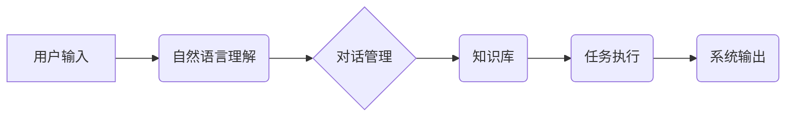

> 虚拟助理，AI代理，自然语言处理，机器学习，对话系统，深度学习，知识图谱，任务执行

## 1. 背景介绍

虚拟助理，也称为AI代理，近年来备受关注，其核心是利用人工智能技术，构建能够理解和响应人类指令的智能系统。从智能手机的语音助手到智能家居的控制中心，虚拟助理已渗透到我们的日常生活，为我们提供便捷、高效的服务。

构建一个功能强大的虚拟助理并非易事，它需要整合多种人工智能技术，包括自然语言处理（NLP）、机器学习（ML）、对话系统、深度学习（DL）等。本文将详细介绍构建AI代理的工作流程，从概念设计到实际应用，帮助读者深入了解虚拟助理的构建过程。

## 2. 核心概念与联系

**2.1 虚拟助理的概念**

虚拟助理是一种能够理解和响应人类指令的智能系统，它可以执行各种任务，例如：

* **信息查询:** 提供天气预报、新闻资讯、股票信息等。
* **日程安排:** 设置提醒、安排会议、管理待办事项。
* **娱乐服务:** 播放音乐、播放视频、讲故事。
* **设备控制:** 控制智能家居设备，例如灯光、空调、电视等。

**2.2 AI代理的架构**

AI代理的架构通常包含以下几个关键模块：

* **自然语言理解 (NLU):** 负责将用户输入的自然语言转换为机器可理解的格式，例如实体识别、意图识别、关系抽取等。
* **对话管理 (DM):** 负责控制对话流程，根据用户意图选择合适的回复，并维护对话上下文。
* **知识库 (KB):** 存储各种知识和信息，例如事实、规则、概念等，用于回答用户问题和执行任务。
* **任务执行 (TE):** 负责执行用户指令，例如查询信息、控制设备等。

**2.3 核心概念关系图**



## 3. 核心算法原理 & 具体操作步骤

**3.1 算法原理概述**

构建虚拟助理的核心算法包括自然语言处理、机器学习和对话系统等。

* **自然语言处理 (NLP):** 利用计算机科学和语言学原理，使计算机能够理解、处理和生成人类语言。常用的NLP算法包括词嵌入、词性标注、依存句法分析、命名实体识别等。
* **机器学习 (ML):** 训练机器模型，使其能够从数据中学习规律，并进行预测或分类。常用的ML算法包括支持向量机 (SVM)、决策树、随机森林、神经网络等。
* **对话系统:** 设计和构建能够与人类进行自然流畅对话的系统。常用的对话系统框架包括基于规则的对话系统、基于统计的对话系统和基于深度学习的对话系统。

**3.2 算法步骤详解**

**3.2.1 自然语言理解 (NLU)**

1. **文本预处理:** 对用户输入的文本进行清洗、分词、词形还原等处理，使其更易于分析。
2. **特征提取:** 从预处理后的文本中提取特征，例如词语、词性、依存关系等。
3. **模型训练:** 利用训练数据，训练NLU模型，使其能够识别实体、意图和关系。

**3.2.2 对话管理 (DM)**

1. **意图识别:** 根据用户输入，识别用户的意图，例如查询天气、设置提醒等。
2. **对话状态跟踪:** 跟踪对话的上下文信息，例如用户已提出的问题、系统已提供的回复等。
3. **回复生成:** 根据用户意图和对话状态，生成合适的回复。

**3.2.3 任务执行 (TE)**

1. **任务解析:** 将用户指令解析成机器可执行的命令。
2. **资源调用:** 调用相应的API或服务，执行任务。
3. **结果反馈:** 将任务执行结果反馈给用户。

**3.3 算法优缺点**

* **优点:** 能够理解和响应人类语言，提供个性化服务，提高用户体验。
* **缺点:** 算法复杂度高，需要大量训练数据，识别准确率和对话流畅度还有待提高。

**3.4 算法应用领域**

* **智能客服:** 自动回答用户常见问题，提高客服效率。
* **智能家居:** 控制智能家居设备，提供便捷的生活体验。
* **教育培训:** 提供个性化学习辅导，提高学习效率。
* **医疗保健:** 提供医疗咨询和健康管理服务。

## 4. 数学模型和公式 & 详细讲解 & 举例说明

**4.1 数学模型构建**

在构建虚拟助理时，可以使用各种数学模型来表示知识、关系和行为。例如：

* **知识图谱:** 使用图结构表示知识，其中节点代表实体，边代表关系。
* **贝叶斯网络:** 使用概率图模型表示知识和推理关系。
* **隐马尔可夫模型 (HMM):** 用于序列标注任务，例如语音识别和文本分类。

**4.2 公式推导过程**

例如，在自然语言理解任务中，可以使用词嵌入模型来表示词语的语义。Word2Vec模型是一种常用的词嵌入模型，其目标是学习一个词向量空间，使得相似的词语在该空间中距离较近。

Word2Vec模型使用神经网络结构，其中包含输入层、隐藏层和输出层。输入层接收词语的one-hot编码，隐藏层学习词语的语义表示，输出层预测词语的上下文词。

Word2Vec模型的训练目标是最大化上下文词的预测概率。可以使用交叉熵损失函数来衡量模型的预测误差，并使用梯度下降算法来更新模型参数。

**4.3 案例分析与讲解**

例如，假设我们有一个词语集合{“猫”，“狗”，“跑”，“吃”}，使用Word2Vec模型训练后，我们可以得到以下词向量表示：

* 猫: [0.2, 0.3, 0.1, 0.4]
* 狗: [0.1, 0.4, 0.3, 0.2]
* 跑: [0.5, 0.1, 0.4, 0.0]
* 吃: [0.3, 0.2, 0.5, 0.1]

我们可以观察到，"猫"和"狗"的词向量比较接近，因为它们都是动物；"跑"和"吃"的词向量也比较接近，因为它们都是动词。

## 5. 项目实践：代码实例和详细解释说明

**5.1 开发环境搭建**

构建虚拟助理需要准备以下开发环境：

* **操作系统:** Linux、macOS或Windows
* **编程语言:** Python
* **深度学习框架:** TensorFlow、PyTorch
* **自然语言处理库:** NLTK、spaCy
* **对话系统框架:** Rasa、Dialogflow

**5.2 源代码详细实现**

以下是一个简单的虚拟助理代码示例，使用Python和Rasa框架实现：

```python
from rasa_sdk import Action, Tracker
from rasa_sdk.executor import CollectingDispatcher

class ActionHelloWorld(Action):

    def name(self) -> str:
        return "action_hello_world"

    def run(self, dispatcher: CollectingDispatcher,
            tracker: Tracker,
            domain: Dict[Text, Any]) -> List[Dict[Text, Any]]:

        dispatcher.utter_message(text="Hello world!")

        return []
```

**5.3 代码解读与分析**

* `ActionHelloWorld`类继承自`Action`类，定义了一个名为`action_hello_world`的动作。
* `name()`方法返回动作的名称。
* `run()`方法执行动作逻辑，接收`dispatcher`、`tracker`和`domain`三个参数。
* `dispatcher.utter_message()`方法发送回复消息。

**5.4 运行结果展示**

当用户输入“你好”时，虚拟助理会回复“Hello world！”。

## 6. 实际应用场景

**6.1 智能客服**

虚拟助理可以作为智能客服，自动回答用户常见问题，例如产品信息、订单查询、退换货政策等。

**6.2 智能家居**

虚拟助理可以控制智能家居设备，例如灯光、空调、电视等，用户可以通过语音指令控制家居环境。

**6.3 教育培训**

虚拟助理可以提供个性化学习辅导，例如答疑解惑、知识讲解、练习测试等。

**6.4 未来应用展望**

随着人工智能技术的不断发展，虚拟助理的应用场景将更加广泛，例如：

* **医疗保健:** 提供远程医疗咨询、健康管理服务。
* **金融服务:** 提供理财建议、投资咨询服务。
* **交通出行:** 提供导航、路线规划、交通信息服务。

## 7. 工具和资源推荐

**7.1 学习资源推荐**

* **书籍:**
    * 《深度学习》
    * 《自然语言处理》
    * 《对话系统》
* **在线课程:**
    * Coursera
    * edX
    * Udacity

**7.2 开发工具推荐**

* **深度学习框架:** TensorFlow、PyTorch
* **自然语言处理库:** NLTK、spaCy
* **对话系统框架:** Rasa、Dialogflow

**7.3 相关论文推荐**

* 《BERT: Pre-training of Deep Bidirectional Transformers for Language Understanding》
* 《GPT-3: Language Models are Few-Shot Learners》
* 《Rasa: An Open-Source Framework for Building Conversational AI》

## 8. 总结：未来发展趋势与挑战

**8.1 研究成果总结**

近年来，虚拟助理领域取得了显著进展，例如：

* **自然语言理解能力提升:** 
深度学习模型的应用使得虚拟助理能够理解更复杂的语言。
* **对话系统更加自然流畅:** 
基于深度学习的对话系统能够生成更自然、更流畅的对话。
* **应用场景更加广泛:** 
虚拟助理已应用于多个领域，例如智能客服、智能家居、教育培训等。

**8.2 未来发展趋势**

* **更强大的自然语言理解能力:** 
研究人员将继续探索更先进的NLP算法，使虚拟助理能够理解更复杂的语言和语义。
* **更个性化的服务:** 
虚拟助理将能够根据用户的个人喜好和需求提供个性化的服务。
* **更跨模态的交互:** 
虚拟助理将能够理解和生成多种模态信息，例如文本、语音、图像等。

**8.3 面临的挑战**

* **数据安全和隐私保护:** 
虚拟助理需要处理大量用户数据，因此数据安全和隐私保护是一个重要的挑战。
* **算法偏见:** 
训练数据可能存在偏见，导致虚拟助理产生不公平或歧视性的回复。
* **解释性问题:** 
深度学习模型的决策过程难以解释，这使得虚拟助理的可靠性和可信度受到质疑。

**8.4 研究展望**

未来，虚拟助理研究将继续朝着更智能、更安全、更可靠的方向发展。


## 9. 附录：常见问题与解答

**9.1 如何训练虚拟助理？**

训练虚拟助理需要准备训练数据，例如对话记录、问题答案等。可以使用深度学习框架和NLP库来训练虚拟助理模型。

**9.2 如何部署虚拟助理？**

虚拟助理可以部署在云端、本地服务器或移动设备上。可以使用容器技术或云平台服务来部署虚拟助理。

**9.3 如何评估虚拟助理的性能？**

可以使用各种指标来评估虚拟助理的性能，例如准确率、召回率、F1-score、用户满意度等。

作者：禅与计算机程序设计艺术 / Zen and the Art of Computer Programming


<end_of_turn>