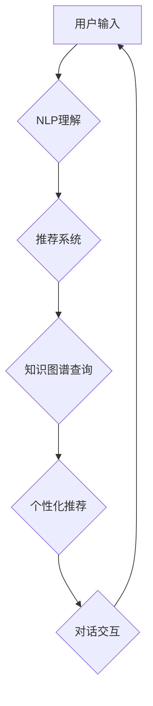

> 虚拟导购助手、人工智能、自然语言处理、推荐系统、机器学习、用户体验

## 1. 背景介绍

在当今数字时代，电子商务的蓬勃发展彻底改变了人们的购物方式。然而，传统的在线购物体验仍然存在一些局限性，例如信息过载、缺乏个性化推荐和难以获得及时有效的客户服务。为了解决这些问题，虚拟导购助手应运而生，它利用人工智能（AI）技术，为消费者提供更加智能、便捷和个性化的购物体验。

虚拟导购助手是一种基于人工智能的软件系统，能够通过自然语言处理（NLP）技术理解用户的需求，并提供个性化的商品推荐、购物指导和客户服务。它可以像真人导购员一样与用户进行对话，回答用户的疑问，提供商品信息，并根据用户的喜好和购买历史进行个性化推荐。

## 2. 核心概念与联系

虚拟导购助手的核心概念包括：

* **自然语言处理（NLP）：** 虚拟导购助手需要能够理解和处理用户的自然语言输入，例如文本和语音。NLP技术可以帮助虚拟导购助手识别用户的意图、提取关键信息和生成自然流畅的回复。
* **推荐系统：** 推荐系统是虚拟导购助手的重要功能之一，它可以根据用户的历史购买记录、浏览记录、兴趣偏好等信息，推荐用户可能感兴趣的商品。
* **机器学习（ML）：** 机器学习算法可以帮助虚拟导购助手不断学习和改进，例如识别用户意图、个性化推荐商品和优化对话体验。
* **知识图谱：** 知识图谱可以存储和组织商品信息、品牌信息、用户信息等，帮助虚拟导购助手提供更准确和全面的信息。

**核心架构流程图：**



## 3. 核心算法原理 & 具体操作步骤

### 3.1  算法原理概述

虚拟导购助手使用的核心算法主要包括：

* **自然语言理解（NLU）算法：** 用于识别用户输入的意图、实体和关系。常见的NLU算法包括词袋模型、隐马尔可夫模型（HMM）、条件随机场（CRF）和深度学习模型（如BERT、GPT）。
* **推荐算法：** 用于根据用户的历史行为和偏好推荐商品。常见的推荐算法包括协同过滤、内容过滤、基于知识的推荐和深度学习推荐。
* **对话管理算法：** 用于控制对话流程，并生成自然流畅的回复。常见的对话管理算法包括状态机、基于规则的系统和基于深度学习的系统。

### 3.2  算法步骤详解

**1. 用户输入：** 用户通过文本或语音输入他们的需求。

**2. NLU理解：** NLU算法分析用户输入，识别用户的意图、实体和关系。例如，如果用户输入“我想买一件红色的T恤”，NLU算法可以识别出用户的意图是“购买商品”，实体是“红色T恤”。

**3. 推荐系统：** 推荐系统根据用户的历史行为、偏好和当前的查询信息，推荐相关的商品。

**4. 知识图谱查询：** 虚拟导购助手可以查询知识图谱，获取商品的详细信息，例如价格、品牌、材质等。

**5. 个性化推荐：** 虚拟导购助手根据用户的需求和推荐结果，生成个性化的商品推荐。

**6. 对话交互：** 虚拟导购助手与用户进行对话，回答用户的疑问，提供商品信息，并引导用户完成购买。

### 3.3  算法优缺点

**优点：**

* **个性化推荐：** 虚拟导购助手可以根据用户的需求和偏好提供个性化的商品推荐，提高用户的购物体验。
* **24/7可用性：** 虚拟导购助手可以全天候为用户提供服务，不受时间和地域限制。
* **降低成本：** 虚拟导购助手可以替代人工导购员，降低企业的运营成本。

**缺点：**

* **理解复杂需求：** 虚拟导购助手在理解用户复杂或模糊的需求时可能存在困难。
* **缺乏情感共鸣：** 虚拟导购助手无法像真人导购员一样提供情感支持和个性化服务。
* **数据安全问题：** 虚拟导购助手需要收集和处理用户的个人信息，因此需要采取措施保障数据安全。

### 3.4  算法应用领域

虚拟导购助手可以应用于各种电商平台、零售企业和在线服务，例如：

* **电商平台：** 为用户提供个性化商品推荐、购物指导和客户服务。
* **零售企业：** 帮助零售企业提高销售额、提升客户满意度和优化库存管理。
* **在线服务：** 为用户提供个性化的产品咨询、技术支持和售后服务。

## 4. 数学模型和公式 & 详细讲解 & 举例说明

### 4.1  数学模型构建

推荐系统的核心是构建一个数学模型，能够预测用户对商品的评分或购买概率。常见的推荐模型包括协同过滤模型和内容过滤模型。

**协同过滤模型：**

协同过滤模型基于用户的历史行为和商品的特征进行预测。假设用户u对商品i的评分为r(u, i)，则协同过滤模型的目标是预测用户u对商品j的评分r(u, j)。

**内容过滤模型：**

内容过滤模型基于商品的特征和用户的偏好进行预测。假设商品i的特征向量为x(i)，用户的偏好向量为y(u)，则内容过滤模型的目标是预测用户u对商品i的评分r(u, i)。

### 4.2  公式推导过程

**协同过滤模型：**

常用的协同过滤算法包括基于用户的协同过滤和基于物品的协同过滤。

* **基于用户的协同过滤：**

预测用户u对商品j的评分r(u, j) = ∑(v∈N(u)) (r(u, v) * sim(u, v)) / ∑(v∈N(u)) sim(u, v)

其中：

* N(u) 是用户u的邻居用户集合。
* sim(u, v) 是用户u和用户v之间的相似度。

* **基于物品的协同过滤：**

预测用户u对商品j的评分r(u, j) = ∑(i∈N(j)) (r(u, i) * sim(i, j)) / ∑(i∈N(j)) sim(i, j)

其中：

* N(j) 是商品j的邻居商品集合。
* sim(i, j) 是商品i和商品j之间的相似度。

**内容过滤模型：**

常用的内容过滤算法包括基于向量空间模型和基于概率模型。

* **基于向量空间模型：**

预测用户u对商品i的评分r(u, i) = cos(x(i), y(u))

其中：

* cos() 是余弦相似度函数。

### 4.3  案例分析与讲解

**案例：**

假设有一个电商平台，用户A喜欢购买运动鞋，用户B喜欢购买服装。平台可以使用协同过滤模型，根据用户的历史购买记录，推荐用户A购买用户B购买过的运动鞋，推荐用户B购买用户A购买过的服装。

**分析：**

协同过滤模型可以利用用户的历史行为，发现用户之间的潜在相似性，并进行商品推荐。

## 5. 项目实践：代码实例和详细解释说明

### 5.1  开发环境搭建

虚拟导购助手可以使用Python语言开发，并结合常用的机器学习库和NLP库，例如TensorFlow、PyTorch、NLTK和SpaCy。

### 5.2  源代码详细实现

以下是一个简单的虚拟导购助手代码示例，演示了如何使用NLTK库进行NLU理解和简单的商品推荐：

```python
import nltk

# 下载NLTK资源
nltk.download('punkt')
nltk.download('averaged_perceptron_tagger')

# 定义商品信息
products = {
    "苹果": {"类别": "水果", "价格": 10},
    "香蕉": {"类别": "水果", "价格": 5},
    "电脑": {"类别": "电子产品", "价格": 1000},
    "手机": {"类别": "电子产品", "价格": 500}
}

# 定义NLU理解函数
def understand_user_input(text):
    tokens = nltk.word_tokenize(text)
    pos_tags = nltk.pos_tag(tokens)
    # 提取意图和实体
    # ...

# 定义商品推荐函数
def recommend_products(user_intent, user_entities):
    # 根据用户意图和实体推荐商品
    # ...

# 用户输入
user_input = "我想买一个苹果"

# NLU理解
user_intent, user_entities = understand_user_input(user_input)

# 商品推荐
recommended_products = recommend_products(user_intent, user_entities)

# 输出推荐结果
print("推荐商品：", recommended_products)
```

### 5.3  代码解读与分析

* **代码示例：** 该代码示例演示了虚拟导购助手的基本功能，包括NLU理解和商品推荐。
* **NLU理解：** 使用NLTK库对用户输入进行分词和词性标注，提取用户意图和实体。
* **商品推荐：** 根据用户意图和实体，从商品信息库中推荐相关的商品。

### 5.4  运行结果展示

运行该代码示例，用户输入“我想买一个苹果”，系统将输出推荐商品：苹果。

## 6. 实际应用场景

虚拟导购助手已经开始在一些电商平台和零售企业中得到应用，例如：

* **阿里巴巴天猫：** 天猫推出了“智能导购”功能，利用AI技术为用户提供个性化商品推荐和购物指导。
* **京东商城：** 京东也推出了“AI导购”功能，可以帮助用户快速找到心仪的商品，并提供商品信息和购买建议。
* **亚马逊：** 亚马逊的“Alexa”智能助手可以帮助用户购物，例如查询商品价格、添加购物车和完成购买。

### 6.4  未来应用展望

未来，虚拟导购助手将更加智能化、个性化和人性化。例如：

* **更精准的推荐：** 利用更先进的机器学习算法和数据分析技术，提供更精准的商品推荐。
* **更自然的对话：** 利用自然语言处理和对话系统技术，实现更自然的对话交互。
* **更丰富的服务：** 提供更丰富的服务，例如个性化穿搭建议、家居装饰建议和旅行规划建议。

## 7. 工具和资源推荐

### 7.1  学习资源推荐

* **斯坦福大学CS224N课程：** 自然语言处理课程，涵盖了NLP的基础知识和最新研究进展。
* **DeepLearning.AI课程：** 深度学习课程，涵盖了深度学习的基础知识和应用。
* **HuggingFace:** 提供了大量的预训练模型和工具，可以用于NLP和机器学习任务。

### 7.2  开发工具推荐

* **TensorFlow:** 开源深度学习框架，可以用于构建和训练各种机器学习模型。
* **PyTorch:** 开源深度学习框架，以其灵活性和易用性而闻名。
* **NLTK:** 自然语言处理库，提供了一系列工具和算法，用于文本分析和处理。

### 7.3  相关论文推荐

* **Attention Is All You Need:** 提出了一种新的Transformer模型，在机器翻译和文本生成任务中取得了突破性进展。
* **BERT: Pre-training of Deep Bidirectional Transformers for Language Understanding:** 提出了一种新的预训练语言模型BERT，在各种NLP任务中取得了优异的性能。

## 8. 总结：未来发展趋势与挑战

### 8.1  研究成果总结

虚拟导购助手是人工智能技术在电商领域的应用之一，它利用NLP、推荐系统和机器学习等技术，为用户