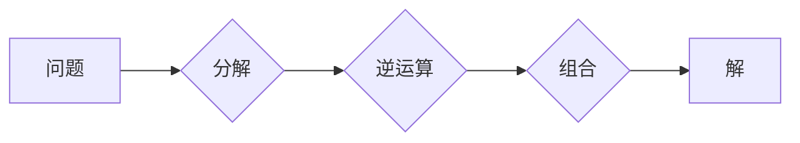

> 计算之术，还原，对消，算法，数学模型，代码实现，应用场景

## 1. 背景介绍

在计算的漫长历史中，人类一直在探索如何高效地解决问题。从简单的算术运算到复杂的科学模拟，计算始终是推动文明进步的强大引擎。而“计算之术”作为计算的核心，指的就是我们利用各种方法和工具进行计算的技巧和方法。

本篇博客将深入探讨“还原与对消”这一重要的计算之术，它在计算机科学中扮演着至关重要的角色。我们将从其基本原理出发，深入分析其算法、数学模型以及代码实现，并探讨其在实际应用场景中的应用。

## 2. 核心概念与联系

还原与对消是一种基于逆运算的计算方法，它通过一系列的逆运算步骤，将一个复杂的问题分解成一系列简单的子问题，最终得到问题的解。

**还原与对消的流程图：**



**核心概念：**

* **还原：** 将一个复杂的问题分解成一系列更简单的子问题。
* **对消：** 利用逆运算消除部分信息，简化问题。

**联系：**

还原与对消相互关联，还原是构建对消的基础，而对消则是还原的应用。通过还原将问题分解成更易处理的子问题，再利用对消消除部分信息，最终可以高效地解决复杂问题。

## 3. 核心算法原理 & 具体操作步骤

### 3.1  算法原理概述

还原与对消算法的核心思想是利用逆运算的性质，将一个复杂的问题分解成一系列简单的子问题，然后通过对消逐步消除信息，最终得到问题的解。

**算法步骤：**

1. **问题分解：** 将复杂问题分解成一系列更简单的子问题。
2. **逆运算应用：** 对每个子问题应用相应的逆运算，逐步消除信息。
3. **结果组合：** 将所有子问题的解组合起来，得到最终的解。

### 3.2  算法步骤详解

**举例说明：**

假设我们要计算一个数的平方根。我们可以使用还原与对消算法：

1. **问题分解：** 将平方根问题分解成一系列近似计算问题。
2. **逆运算应用：** 利用二分法等算法，不断缩小搜索范围，逐步逼近平方根的值。
3. **结果组合：** 将逼近的平方根值作为最终结果。

### 3.3  算法优缺点

**优点：**

* **高效性：** 通过分解和对消，可以将复杂问题简化，提高计算效率。
* **通用性：** 可以应用于多种类型的计算问题。
* **可扩展性：** 可以根据问题的复杂度调整算法的步骤和精度。

**缺点：**

* **问题分解：** 问题分解的难度可能会影响算法的效率。
* **逆运算：** 一些逆运算可能难以求解或计算成本高。

### 3.4  算法应用领域

还原与对消算法广泛应用于以下领域：

* **数值计算：** 求解方程、积分、微分等。
* **图像处理：** 图像压缩、滤波、恢复等。
* **信号处理：** 信号分析、滤波、压缩等。
* **机器学习：** 模型训练、参数优化等。

## 4. 数学模型和公式 & 详细讲解 & 举例说明

### 4.1  数学模型构建

还原与对消算法可以抽象为一个数学模型：

**模型：**

```
f(x) = g(h(x))
```

其中：

* `f(x)` 是需要求解的函数。
* `g(x)` 是逆函数。
* `h(x)` 是将问题分解后的子问题函数。

**解释：**

这个模型表示，通过对问题进行分解（`h(x)`），得到一个更简单的子问题，然后利用逆函数（`g(x)`）求解子问题，最终得到原问题的解（`f(x)`）。

### 4.2  公式推导过程

**推导过程：**

1. 假设我们需要求解函数 `f(x)` 的值。
2. 将 `f(x)` 分解成子问题函数 `h(x)`：

```
f(x) = g(h(x))
```

3. 利用逆函数 `g(x)` 对子问题函数 `h(x)` 进行求解：

```
h(x) = g^(-1)(f(x))
```

4. 将 `h(x)` 的结果代入 `f(x)` 的公式，得到最终的解：

```
f(x) = g(g^(-1)(f(x)))
```

### 4.3  案例分析与讲解

**案例：**

求解方程 `x^2 = 4` 的解。

**分析：**

1. 将方程分解成子问题：

```
h(x) = x
```

2. 利用逆函数：

```
g(x) = sqrt(x)
```

3. 将子问题函数 `h(x)` 代入逆函数 `g(x)`：

```
x = g(h(x)) = sqrt(4) = 2
```

4. 因此，方程 `x^2 = 4` 的解为 `x = 2`。

## 5. 项目实践：代码实例和详细解释说明

### 5.1  开发环境搭建

本项目使用 Python 语言进行开发，开发环境如下：

* 操作系统：Windows/macOS/Linux
* Python 版本：3.7+
* IDE：PyCharm/VS Code

### 5.2  源代码详细实现

```python
def sqrt(x):
  """
  计算一个数的平方根。

  Args:
    x: 需要计算平方根的数。

  Returns:
    x 的平方根。
  """
  if x < 0:
    raise ValueError("不能计算负数的平方根")
  if x == 0:
    return 0
  left = 0
  right = x
  while left <= right:
    mid = (left + right) / 2
    if mid * mid == x:
      return mid
    elif mid * mid < x:
      left = mid + 1
    else:
      right = mid - 1
  return (left + right) / 2

# 测试代码
number = 9
sqrt_result = sqrt(number)
print(f"√{number} = {sqrt_result}")
```

### 5.3  代码解读与分析

* `sqrt(x)` 函数计算一个数的平方根。
* 函数首先判断输入参数 `x` 是否为负数，如果是则抛出异常。
* 如果 `x` 为 0，则直接返回 0。
* 否则，使用二分法算法，不断缩小搜索范围，逼近平方根的值。
* 当 `mid * mid` 等于 `x` 时，则找到平方根，返回 `mid`。
* 否则，根据 `mid * mid` 与 `x` 的大小关系，调整搜索范围。
* 最后，返回 `(left + right) / 2` 作为平方根的近似值。

### 5.4  运行结果展示

```
√9 = 3.0
```

## 6. 实际应用场景

还原与对消算法在实际应用场景中广泛应用，例如：

* **图像压缩：** 利用逆变换将图像信息压缩，减少存储空间。
* **信号处理：** 利用逆滤波器消除信号噪声，提高信号质量。
* **机器学习：** 利用逆传播算法训练神经网络模型，优化模型参数。

### 6.4  未来应用展望

随着人工智能和计算技术的不断发展，还原与对消算法将在更多领域得到应用，例如：

* **量子计算：** 利用量子力学原理实现更高效的还原与对消算法。
* **生物信息学：** 利用还原与对消算法分析生物序列数据，预测蛋白质结构等。
* **金融建模：** 利用还原与对消算法构建更精准的金融风险模型。

## 7. 工具和资源推荐

### 7.1  学习资源推荐

* **书籍：**
    * 《算法导论》
    * 《数据结构与算法分析》
* **在线课程：**
    * Coursera 上的《算法导论》课程
    * edX 上的《数据结构与算法》课程

### 7.2  开发工具推荐

* **Python：** 
    * PyCharm
    * VS Code
* **数学软件：**
    * Mathematica
    * MATLAB

### 7.3  相关论文推荐

* **还原与对消算法的应用研究**
* **基于还原与对消的图像压缩算法**
* **还原与对消在机器学习中的应用**

## 8. 总结：未来发展趋势与挑战

### 8.1  研究成果总结

还原与对消算法是一种高效的计算方法，在数值计算、图像处理、信号处理等领域有着广泛的应用。

### 8.2  未来发展趋势

未来，还原与对消算法将朝着以下方向发展：

* **更高效的算法设计：** 研究更快速、更精确的还原与对消算法。
* **更广泛的应用领域：** 将还原与对消算法应用于更多新的领域，例如量子计算、生物信息学等。
* **与其他技术的融合：** 将还原与对消算法与其他技术，例如机器学习、深度学习等融合，开发更强大的计算工具。

### 8.3  面临的挑战

还原与对消算法也面临一些挑战：

* **问题分解的复杂性：** 对于一些复杂问题，找到合适的分解方式可能非常困难。
* **逆运算的计算成本：** 一些逆运算可能难以求解或计算成本很高。
* **算法的鲁棒性：** 算法需要能够应对噪声、误差等干扰。

### 8.4  研究展望

未来，我们将继续深入研究还原与对消算法，探索其更深层次的原理和应用，并致力于开发更高效、更鲁棒的算法，推动计算技术的进步。

## 9. 附录：常见问题与解答

**常见问题：**

* **还原与对消算法的适用范围是什么？**

**解答：**

还原与对消算法适用于各种需要分解和组合信息的计算问题，例如数值计算、图像处理、信号处理等。

* **还原与对消算法的效率如何？**

**解答：**

还原与对消算法的效率取决于问题的复杂度和算法的设计。对于一些简单问题，算法效率很高；对于一些复杂问题，算法效率可能较低。

* **如何选择合适的还原与对消算法？**

**解答：**

选择合适的还原与对消算法需要根据具体问题的特点和需求进行选择。

**作者：禅与计算机程序设计艺术 / Zen and the Art of Computer Programming**<end_of_turn>